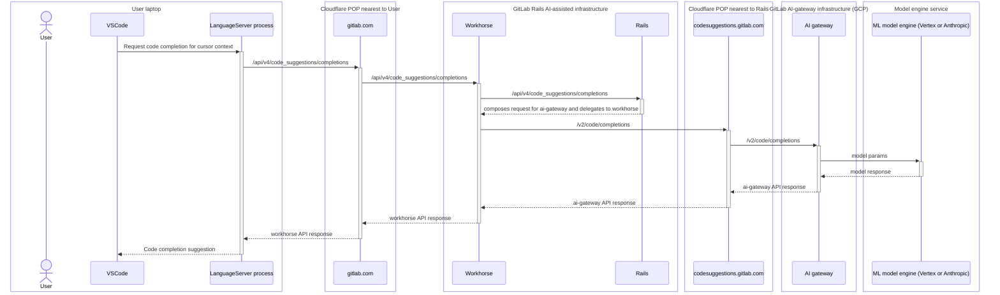

<!-- MARKER: do not edit this section directly. Edit services/service-catalog.yml then run scripts/generate-docs -->

**Table of Contents**

[[_TOC_]]

# Ai-gateway Service

* [Service Overview](https://dashboards.gitlab.net/d/ai-gateway-main/ai-gateway-overview)
* **Alerts**: <https://alerts.gitlab.net/#/alerts?filter=%7Btype%3D%22ai-gateway%22%2C%20tier%3D%22sv%22%7D>
* **Label**: gitlab-com/gl-infra/production~"Service::AIGateway"

## Logging

* [mlops](https://log.gprd.gitlab.net/goto/d21f8880-f0a7-11ed-a017-0d32180b1390)
* [request rate](https://log.gprd.gitlab.net/goto/c4faac00-f612-11ed-a017-0d32180b1390)
* [request latency](https://log.gprd.gitlab.net/goto/b423c240-f612-11ed-8afc-c9851e4645c0)

<!-- END_MARKER -->

## Summary

The AI-gateway is a standalone-service that will give access to AI features to all users of GitLab, no matter which
instance they are using: self-managed, dedicated or GitLab.com.

The AI Gateway was formerly known as Model Gateway and Code Suggestions.

## Architecture

See the AI Gateway architecture blueprint at <https://docs.gitlab.com/ee/architecture/blueprints/ai_gateway/>

For a higher level view of how the AI Gateway fits into our AI Architecture, see
<https://docs.gitlab.com/ee/development/ai_architecture.html>

### Example API call graph

For context, here is a typical call graph for a Code Suggestions API request from an IDE on an end-user's laptop.  This call graph is current as of 2023-12-15 but may change in the future.



Notes:

* Over the last few months, the endpoints and control flow have evolved, sometimes in non-backward-compatible ways.
  * e.g. Prior to GitLab 16.3, clients directly accessed a now deprecated request endpoint `/v2/completions`.  Some self-managed GitLab deployments running older versions while Code Suggestions was still in beta release may still be using those now-broken endpoints.
* Transits Cloudflare twice, once from end-user to Rails [AI Assisted](../ai-assisted/README.md), and later from Rails to `ai-gateway`.
  * Typically at least one of those is fairly low latency: only 10 ms RTT between GCP's `us-east1` region and Cloudflare's `ATL` POP.
  * Cloudflare tools (logs, analytics, rules, etc.) are available for both of those API calls.
* The requests to `ai-gateway` are expected to be slow, so Rails composes the request headers and then delegates it for Workhorse to send that request to `ai-gateway`.  (Workhorse can handle slow requests much more efficiently than Rails; this conserves puma worker threads.)
* Caching and reuse of TCP and TLS sessions allows most requests to avoid extra round-trips for connection setup.
* Currently `ai-gateway` containers run as a GCP Cloud Run service.
  * See the Cloud Run [docs](https://cloud.google.com/run/docs/resource-model) and [console](https://console.cloud.google.com/run/detail/us-east1/ai-gateway/metrics?project=gitlab-runway-production).
  * Those containers are not accessible via the tools we use for GKE-based services (`kubectl`, etc.).
  * The `gcloud` CLI tool exposes specs for the containers and their revisions (deployments).

Starter `gcloud` commands:

```
$ gcloud run services describe --project gitlab-runway-production --region us-east1 --format yaml ai-gateway
$ gcloud run revisions list --project gitlab-runway-production --region us-east1 --service ai-gateway
```

## Deployment

AI Gateway is deployed through Runway:

* [Runway Deployment](https://gitlab.com/gitlab-com/gl-infra/platform/runway/deployments/ai-gateway)
* [Runway Service](https://console.cloud.google.com/run/detail/us-east1/ai-gateway/metrics?project=gitlab-runway-production)

For more details, refer to [Runway runbook](../runway/README.md).

## Environments

* [Production](https://gitlab.com/gitlab-com/gl-infra/platform/runway/deployments/ai-gateway/-/environments/15709878)
* [Staging](https://gitlab.com/gitlab-com/gl-infra/platform/runway/deployments/ai-gateway/-/environments/15709877)

## Performance

AI Gateway includes the following SLIs/SLOs:

* [Apdex](https://dashboards.gitlab.net/d/ai-gateway-main/ai-gateway3a-overview?orgId=1&viewPanel=380731558)
* [Error Rate](https://dashboards.gitlab.net/d/ai-gateway-main/ai-gateway3a-overview?orgId=1&viewPanel=144302059)

Service degradation could be result of the following saturation resources:

* [Memory Utilization](https://dashboards.gitlab.net/d/ai-gateway-main/ai-gateway3a-overview?orgId=1&from=now-1h&to=now&viewPanel=377718254)
* [CPU Utilization](https://dashboards.gitlab.net/d/ai-gateway-main/ai-gateway3a-overview?orgId=1&from=now-1h&to=now&viewPanel=1050857443)
* [Instance Utilization](https://dashboards.gitlab.net/d/ai-gateway-main/ai-gateway3a-overview?orgId=1&from=now-1h&to=now&viewPanel=1738137433)
* [Concurency Utilization](https://dashboards.gitlab.net/d/ai-gateway-main/ai-gateway3a-overview?orgId=1&from=now-1h&to=now&viewPanel=4285373877)
* [Vertex AI API Quota Limit](https://dashboards.gitlab.net/d/ai-gateway-main/ai-gateway3a-overview?orgId=1&from=now-1h&to=now&viewPanel=1515902021)

## Scalability

AI Gateway will autoscale with traffic. To manually scale, update [`runway.yml`](https://gitlab.com/gitlab-org/modelops/applied-ml/code-suggestions/ai-assist/-/blob/main/.runway/runway.yml?ref_type=heads) based on [documentation](../runway/README.md#scalability).

It is also possible to directly edit the tunables for the `ai-gateway` service via the [Cloud Run console's Edit YAML interface](https://console.cloud.google.com/run/detail/us-east1/ai-gateway/yaml/view?project=gitlab-runway-production).  This takes effect faster, but be sure to make the equivalent updates to the `runway.yml` as described above; otherwise the next deploy will revert your manual changes to the service YAML.

### Capacity Planning

AI Gateway uses [capacity planning](https://about.gitlab.com/handbook/engineering/infrastructure/capacity-planning/) provided by Runway for long-term forecasting of saturation resources. To view forecasts, refer to [Tamland page](https://gitlab-com.gitlab.io/gl-infra/tamland/runway.html#ai-gateway-service-runway_container_memory_utilization-resource-saturation).

### GCP quotas usage

Apart from our quota monitoring in our usual GCP projects, the AI Gateway relies on resources that live on the
`unreview-poc-390200e5` project. Refer to
<https://gitlab-com.gitlab.io/gl-infra/tamland/saturation.html?highlight=code_suggestions#other-utilization-and-saturation-forecasting-non-horizontally-scalable-resources>
for quota usage trends and projections.

Many of our AI features use GCP's Vertex AI service. Vertex AI consists of various `base models` that represent logic for different types of AI models (such as code generation, or chat bots).
Each model has its own usage quota, which can be viewed in the [GCP Console](https://console.cloud.google.com/iam-admin/quotas?referrer=search&project=unreview-poc-390200e5&pageState=(%22allQuotasTable%22:(%22f%22:%22%255B%257B_22k_22_3A_22_22_2C_22t_22_3A10_2C_22v_22_3A_22_5C_22base_model_5C_22_22%257D%255D%22))).

To request a quota alteration:

* Visit the following page in the GCP Console: [Quotas by Base Model](https://console.cloud.google.com/iam-admin/quotas?referrer=search&project=unreview-poc-390200e5&pageState=(%22allQuotasTable%22:(%22f%22:%22%255B%257B_22k_22_3A_22_22_2C_22t_22_3A10_2C_22v_22_3A_22_5C_22base_model_5C_22_22%257D%255D%22)))
* Select each base model that requires an quota decrease/increase
* Click 'EDIT QUOTAS'
* Input the desired quota limit for each service and submit the request.
* Existing/previous requests can be viewed [here](https://console.cloud.google.com/iam-admin/quotas/qirs?referrer=search&project=unreview-poc-390200e5&pageState=(%22allQuotasTable%22:(%22f%22:%22%255B%257B_22k_22_3A_22_22_2C_22t_22_3A10_2C_22v_22_3A_22_5C_22base_model_5C_22_22%257D%255D%22)))

<!-- ## Availability -->

<!-- ## Durability -->

<!-- ## Security/Compliance -->

## Monitoring/Alerting

AI Gateway uses both [custom metrics](../../metrics-catalog/services/ai-gateway.jsonnet) scrapped from application and default metrics provided by [Runway](../runway/README.md#monitoringalerting). Right now, alerts are routed to `#g_mlops-alerts` in Slack. To route to different channel, refer to [documentation](../uncategorized/alert-routing.md).

* [AI Gateway Service Overview Dashboard](https://dashboards.gitlab.net/d/ai-gateway-main/ai-gateway3a-overview?orgId=1)
* [AI Gateway Logs](https://log.gprd.gitlab.net/app/r/s/mkS0F)
* [AI Gateway Alerts](https://gitlab.enterprise.slack.com/archives/C0586SBDZU2)
* [AI Gateway Logs Overview Dashboard](https://log.gprd.gitlab.net/app/dashboards#/view/6c947f80-7c07-11ed-9f43-e3784d7fe3ca?_g=h@2294574)
* [AI Gateway Logs Errors Dashboard](https://log.gprd.gitlab.net/app/dashboards#/view/031cd3a0-61c0-11ee-ac5b-8f88ebd04638?_g=h@2294574)
* [Runway Service Metrics](https://dashboards.gitlab.net/d/runway-service/runway3a-runway-service-metrics?orgId=1&var-environment=gprd&var-service=ai-gateway)
* [Runway Service Logs](https://cloudlogging.app.goo.gl/SXc6rpSwfkH4rCD9A)

## Troubleshooting

### How do I rotate `ANTHROPIC_API_KEY`?

AI Gateway uses secrets management for Anthropic API key. To rotate a secret, refer to [documentation](https://gitlab.com/gitlab-com/gl-infra/platform/runway/docs/-/blob/master/secrets-management.md?ref_type=heads#rotating-a-secret).

For troubleshooting deployment pipelines, refer to [Runway runbook](../runway/README.md#troubleshooting).

## Links to further Documentation

* [AI Gateway Blueprint](https://docs.gitlab.com/ee/architecture/blueprints/ai_gateway/)
