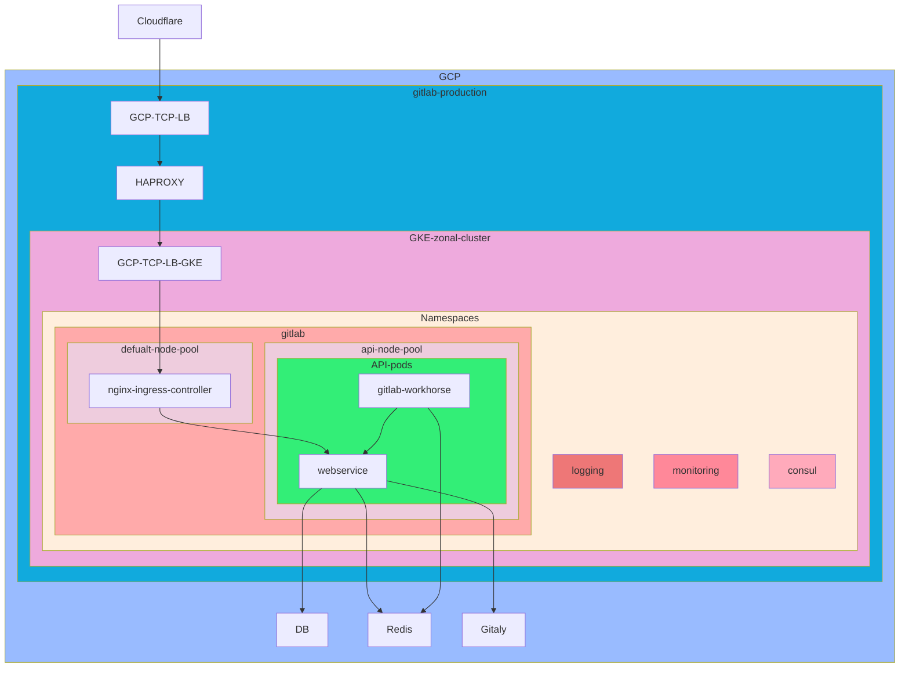
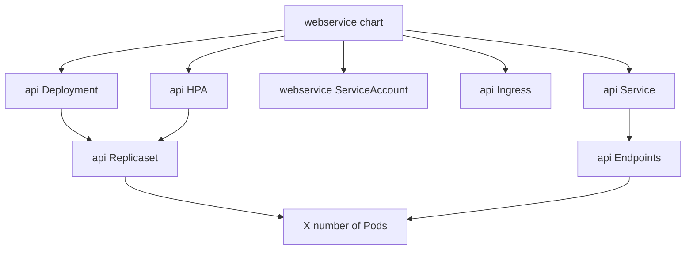
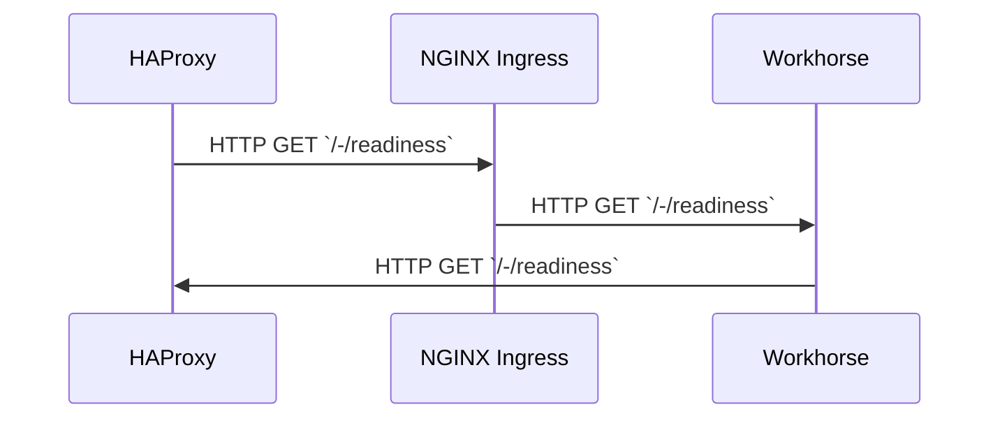
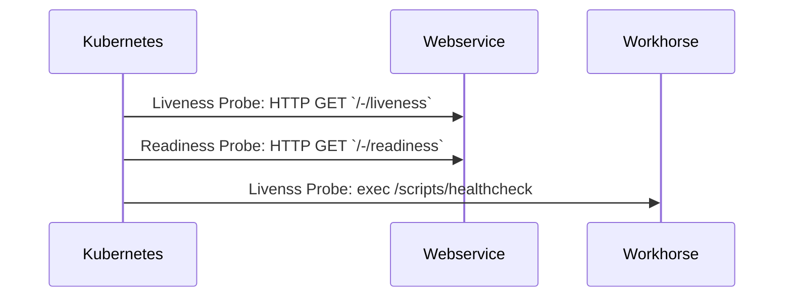

<!-- MARKER: do not edit this section directly. Edit services/service-catalog.yml then run scripts/generate-docs -->

**Table of Contents**

[[_TOC_]]

# Api Service

* [Service Overview](https://dashboards.gitlab.net/d/api-main/api-overview)
* **Alerts**: <https://alerts.gitlab.net/#/alerts?filter=%7Btype%3D%22api%22%2C%20tier%3D%22sv%22%7D>
* **Label**: gitlab-com/gl-infra/production~"Service::API"

## Logging

* [Rails](https://log.gprd.gitlab.net/goto/f61f543b668c26f2dcdb8a0eb06e2edb)
* [Workhorse](https://log.gprd.gitlab.net/goto/66979d90ca195652b7a4d10d22ca2db7)
* [Kubernetes](https://log.gprd.gitlab.net/goto/88eab835042a07b213b8c7f24213d5bf)

## Troubleshooting Pointers

* [../ci-runners/ci-apdex-violating-slo.md](../ci-runners/ci-apdex-violating-slo.md)
* [Shared CI Runner Timeouts](../ci-runners/ci-runner-timeouts.md)
* [../ci-runners/ci_constantnumberoflongrunningrepeatedjobs.md](../ci-runners/ci_constantnumberoflongrunningrepeatedjobs.md)
* [../ci-runners/ci_graphs.md](../ci-runners/ci_graphs.md)
* [../ci-runners/ci_pending_builds.md](../ci-runners/ci_pending_builds.md)
* [CI runner manager report a high number of errors](../ci-runners/ci_runner_manager_errors.md)
* [Cloudflare Logs](../cloudflare/logging.md)
* [Cloudflare: Managing Traffic](../cloudflare/managing-traffic.md)
* [Service Locations](../cloudflare/services-locations.md)
* [Cloudflare: Terraform Configuration](../cloudflare/terraform.md)
* [Chef Tips and Tools](../config_management/chef-workflow.md)
* [customers.gitlab.com](../customersdot/api-key-rotation.md)
* [CustomersDot main troubleshoot documentation](../customersdot/overview.md)
* [Google Cloud Snapshots](../disaster-recovery/gcp-snapshots.md)
* [What is Programmable Search Engine?](../docs.gitlab.com/programmableSearch.md)
* [Elastic Nodes Disk Space Saturation](../elastic/disk_space_saturation.md)
* [../elastic/elastic-cloud.md](../elastic/elastic-cloud.md)
* [../elastic/elasticsearch-integration-in-gitlab.md](../elastic/elasticsearch-integration-in-gitlab.md)
* [ErrorTracking main troubleshooting document](../errortracking/overview.md)
* [Blocking and Disabling Things in HAProxy](../frontend/block-things-in-haproxy.md)
* [HAProxy Management at GitLab](../frontend/haproxy.md)
* [Possible Breach of SSH MaxStartups](../frontend/ssh-maxstartups-breach.md)
* [Purge Git data](../git/purge-git-data.md)
* [../gitaly/git-high-cpu-and-memory-usage.md](../gitaly/git-high-cpu-and-memory-usage.md)
* [Gitaly multi-project migration](../gitaly/multi-project-migration.md)
* [GitLab Storage Re-balancing](../gitaly/storage-rebalancing.md)
* [Web IDE Assets](../gitlab-static/web-ide-assets.md)
* [Kubernetes-Agent Basic Troubleshooting](../kas/kubernetes-agent-basic-troubleshooting.md)
* [Kubernetes-Agent Disable Integrations](../kas/kubernetes-agent-disable-integrations.md)
* [Helm Upgrade is Stuck](../kube/helm-upgrade-stuck.md)
* [Ad hoc observability tools on Kubernetes nodes](../kube/k8s-adhoc-observability.md)
* [../kube/k8s-oncall-setup.md](../kube/k8s-oncall-setup.md)
* [How to resize Persistent Volumes in Kubernetes](../kube/k8s-pvc-resize.md)
* [Kubernetes](../kube/kubernetes.md)
* [Scaling Elastic Cloud Clusters](../logging/scaling.md)
* [Alertmanager Notification Failures](../monitoring/alertmanager-notification-failures.md)
* [../monitoring/apdex-alerts-guide.md](../monitoring/apdex-alerts-guide.md)
* [Thanos Query and Stores](../monitoring/thanos-query.md)
* [Thanos Receive](../monitoring/thanos-receive.md)
* [Session: Application architecture](../onboarding/architecture.md)
* [Gitlab.com on Kubernetes](../onboarding/gitlab.com_on_k8s.md)
* [Diagnosis with Kibana](../onboarding/kibana-diagnosis.md)
* [Packagecloud Infrastructure and Backups](../packagecloud/infrastructure.md)
* [../patroni/database_peak_analysis.md](../patroni/database_peak_analysis.md)
* [Patroni Cluster Management](../patroni/patroni-management.md)
* [../patroni/pg_collect_query_data.md](../patroni/pg_collect_query_data.md)
* [Pg_repack using gitlab-pgrepack](../patroni/pg_repack.md)
* [../patroni/postgres.md](../patroni/postgres.md)
* [../patroni/postgresql-backups-wale-walg.md](../patroni/postgresql-backups-wale-walg.md)
* [../pgbouncer/patroni-consul-postgres-pgbouncer-interactions.md](../pgbouncer/patroni-consul-postgres-pgbouncer-interactions.md)
* [PgBouncer connection management and troubleshooting](../pgbouncer/pgbouncer-connections.md)
* [Sidekiq or Web/API is using most of its PgBouncer connections](../pgbouncer/pgbouncer-saturation.md)
* [Removing cache entries from Redis](../redis-cluster-cache/remove-cache-entries.md)
* [A survival guide for SREs to working with Redis at GitLab](../redis/redis-survival-guide-for-sres.md)
* [Database Connection Pool Saturation](../registry/app-db-conn-pool-saturation.md)
* [Container Registry database post-deployment migrations](../registry/db-post-deployment-migrations.md)
* [High Number of Overdue Online GC Tasks](../registry/online-gc-high-overdue-tasks.md)
* [Managing Sentry in Kubernetes](../sentry/sentry.md)
* [[`SidekiqQueueTooLarge`](../../rules/sidekiq-queues.yml)](../sidekiq/large-sidekiq-queue.md)
* [A survival guide for SREs to working with Sidekiq at GitLab](../sidekiq/sidekiq-survival-guide-for-sres.md)
* [../spamcheck/index.md](../spamcheck/index.md)
* [GET Monitoring Setup](../staging-ref/get-monitoring-setup.md)
* [Thanos Architecture Overview](../thanos/architecture.md)
* [Example Tutorial Template](../tutorials/example_tutorial_template.md)
* [Life of a Web Request](../tutorials/overview_life_of_a_web_request.md)
* [Blocked user login attempts are high](../uncategorized/blocked-user-logins.md)
* [Gemnasium is down](../uncategorized/gemnasium_is_down.md)
* [../uncategorized/namespace-restore.md](../uncategorized/namespace-restore.md)
* [OPS-GITLAB-NET Users and Access Tokens](../uncategorized/ops-gitlab-net-pat.md)
* [Pingdom](../uncategorized/pingdom.md)
* [Rails is down](../uncategorized/rails-is-down.md)
* [Ruby profiling](../uncategorized/ruby-profiling.md)
* [Shared Configurations](../uncategorized/shared-configurations.md)
* [Application Database Queries](../uncategorized/tracing-app-db-queries.md)
* [How to Use Vault for Secrets Management in Infrastructure](../vault/usage.md)
* [Vault Secrets Management](../vault/vault.md)
* [Static repository objects caching](../web/static-repository-objects-caching.md)
<!-- END_MARKER -->

## Summary

:warning: All links to code/configurations are Permalinks that go to a specific
snapshot in time.  Keep that in mind and ensure that one views that of the
master branch for the most up-to-date view of the target configuration :warning:

The API service is enabling internal and external clients to interact with
GitLab.com via http(s) endpoints without using the web UI. The API service is
mainly used to drive automation using GitLab and critical for the function of
GitLab.com.

The API is directly depending on the DB (pgbouncer/patroni), Redis, Redis Cache,
Redis Sidekiq and Gitaly.

## Architecture

* [Handbook architecture overview for GitLab.com](https://about.gitlab.com/handbook/engineering/infrastructure/production/architecture/#gitlab-com-architecture)
* [Handbook K8s Cluster configuration](https://about.gitlab.com/handbook/engineering/infrastructure/production/architecture/#cluster-configuration)
* [Handbook K8s architecture overview](https://gitlab.com/gitlab-com/gl-infra/readiness/-/tree/master/library/kubernetes)

### Logical Architecture

API main stage is deployed into 3 zonal clusters to reduce the failure domain and
traffic costs.  The API canary stage resides on the regional cluster.

### Kubernetes Architecture

Most objects deployed are installed as part of the GitLab Helm Chart's Webservice
Chart:
<https://gitlab.com/gitlab-org/charts/gitlab/-/tree/master/charts/gitlab/charts/webservice>

This chart leverages multiple `webservice` deployments pending the configuration
of the deployments key associated with the ingress path.  Currently we are
creating an `api` deployment which uses an ingress path of `/`.

## Performance

We currently (Feb 2021) serve between 4k to 5k API requests/s to
[workhorse](https://thanos.gitlab.net/graph?g0.range_input=1w&g0.max_source_resolution=0s&g0.expr=avg_over_time(gitlab_component_ops%3Arate_5m%7Bcomponent%3D%22workhorse%22%2Cenv%3D%22gprd%22%2Cenvironment%3D%22gprd%22%2Cmonitor%3D%22global%22%2Cstage%3D%22main%22%2Ctype%3D%22api%22%7D%5B5m%5D)&g0.tab=0)
on a business day and 2.5k to 3.5k requests/s to
[puma](https://thanos.gitlab.net/graph?g0.range_input=1w&g0.max_source_resolution=0s&g0.expr=avg_over_time(gitlab_component_ops%3Arate_5m%7Bcomponent%3D%22puma%22%2Cenv%3D%22gprd%22%2Cenvironment%3D%22gprd%22%2Cmonitor%3D%22global%22%2Cstage%3D%22main%22%2Ctype%3D%22api%22%7D%5B5m%5D)&g0.tab=0).

Performance of the API service mainly depends on these factors:

* Node Pool:
  * <https://ops.gitlab.net/gitlab-com/gl-infra/config-mgmt/-/blob/6ac69bda99a722b0238c28fa348ddb85436c54f6/environments/gprd/gke-zonal.tf>
  * This configuration exists for EACH cluster
* Node type:
  <https://ops.gitlab.net/gitlab-com/gl-infra/config-mgmt/-/blob/6ac69bda99a722b0238c28fa348ddb85436c54f6/environments/gprd/variables.tf#L422>
* Number of puma worker_processes: [`sum(puma_workers{env="gprd",
  type="api"})`](https://thanos.gitlab.net/graph?g0.range_input=1h&g0.max_source_resolution=0s&g0.expr=sum(puma_workers%7Benv%3D%22gprd%22%2C%20type%3D%22api%22%7D)&g0.tab=0)
* Number of puma threads: [`sum(puma_max_threads{env="gprd",
  type="api"})`](https://thanos.gitlab.net/graph?g0.range_input=1h&g0.max_source_resolution=0s&g0.expr=sum(puma_max_threads%7Benv%3D%22gprd%22%2C%20type%3D%22api%22%7D)&g0.tab=0)

See <https://gitlab.com/gitlab-com/gl-infra/delivery/-/issues/1592> for a detailed
analysis.

**It is important to always have enough API capacity so that rolling deployments
or turning off canary is not affecting user experience.**

### K8s

In a K8s deployment we need to tune resource requests, autoscaling and
rollingUpdate settings to ensure API is able to meet it's SLOs and can react to
surges in traffic as well as to prevent frequent POD eviction as starting an API
POD is taking a long time. Have a look at:

* hpa target values
* rollingUpdate strategy maxSurge
* minReplicas and maxReplicas
* resource requests and limits for CPU and memory

### Request Throttling

Requests are limited mainly by HAProxy (2000rps per IP) and RackAttack. See the
[handbook](https://docs.gitlab.com/ee/user/gitlab_com/#gitlabcom-specific-rate-limits)
for published limits and
[../rate-limiting/README.md](../rate-limiting/README.md) for details of our
rate limiting. A few customer IPs are still excluded from rate limiting.

## Scalability

The API service is stateless and mostly CPU bound. Scaling can easily be done
horizontally by adding more pods. But this also means we open more connections
to the database or Redis and could shift scalability issues downward. We have
saturation alerts to cover us but should also have a regular look at the
[capacity planning
forecast](https://gitlab-com.gitlab.io/gl-infra/tamland/saturation.html).

Scaling is currently handled automatically by the Horizontal Pod Autoscaler.
The configuration for such is defined here:
<https://gitlab.com/gitlab-com/gl-infra/k8s-workloads/gitlab-com/-/blob/8b9068833c57a1d986a6461e1f6b5aa61b79b7e4/releases/gitlab/values/gprd.yaml.gotmpl#L32-35>

Scaling vertically by using a more powerful machine type also can be considered.

## Availability

Healthchecks are defined here:
<https://gitlab.com/gitlab-com/gl-infra/chef-repo/-/blob/master/roles/gprd-base-haproxy-main-config.json>

See our cookbook for how this configuration is built:
<https://gitlab.com/gitlab-cookbooks/gitlab-haproxy/>

### Healthcheck Flow

Healthchecks are performed for a variety of reasons from differing systems.

1. HAProxy needs to determine if the API service is healthy
1. Kubernetes needs to determine if a Pod is healthy
1. Pods destined to be turned down, need to respond accordingly such that
   Kubernetes pulls a Pod out of Service while it completes cleaning up

#### HAProxy's Healthcheck

This healthcheck is sent to a single backend, otherwise known as the NGINX
Ingress that sits between the API Pods and the outside world.  It should be
noted that HAProxy has no knowledge of how the backend is all interconnected.  A
single healthcheck will effectively land on one randomly assigned Pod.  These
healthchecks therefore depend on the health of both the NGINX Ingress, and the
one randomly chosen Pod for all traffic that is destined into Kubernetes.  It's
important to keep in mind that during deployments, healthchecks will hit both
the old and new Pods as the deployment cycle completes.

#### Kubernetes

Kubernetes will send healthchecks to each container to determine if the Pod is
healthy.  Our `/-/liveness` probe should always return an HTTP200 so long as
puma is running.  Our `/-/readiness` endpoint should do the same, though kill
signals will modify this behavior.  If we send a `SIGTERM` to the Pod, this
endpoint will begin returning an HTTP503.  This fails the readiness probe and
removes the Pod from servicing any future requests.

Workhorse uses a script embedded into it's container that is executed.  Should a
liveness probe fail for any Pods, Kubernetes will eventually restart the Pod.

## Durability

To minimize interrupted requests between the client and the API service, we have
a special workhorse configuration to prevent unnecessary HTTP502 errors from
occurring during deployments.

1. We extend how long a Pod waits until it is `SIGKILL`'d by Kubernetes -
   <https://gitlab.com/gitlab-com/gl-infra/k8s-workloads/gitlab-com/-/blob/1f0a73923666f8bb50085362d2771653e8001308/releases/gitlab/values/values.yaml.gotmpl#L658>
1. We enable API Long Polling
<https://gitlab.com/gitlab-com/gl-infra/k8s-workloads/gitlab-com/-/blob/1f0a73923666f8bb50085362d2771653e8001308/releases/gitlab/values/values.yaml.gotmpl#L651>

With API Long Polling configured, we for requests that are destined for
`/api/v4/jobs/request` to sit in a lengthy poll such that Runner clients are not
unnecessarily pounding the API for jobs.  Doing so forces us to need to increase
our terminationGracePeriodSeconds to something higher, otherwise, NGINX will
respond with a massive amount of HTTP502's as connections are severed when a Pod
is removed prior to responding to the client.

A plan of action to make this better:
<https://gitlab.com/gitlab-org/gitlab/-/issues/331460>

<!-- ## Security/Compliance -->

## Monitoring/Alerting

For our APDEX score latencies we generally have set `satisfiedThreshold` to 1s
and `toleratedThreshold` to 10s and we aim for an APDEX score threshold of 0.995
and error ratio threshold of 0.999 - see [metrics
catalog](https://gitlab.com/gitlab-com/runbooks/-/blob/master/metrics-catalog/services/api.jsonnet).

## Links to further Documentation

1. [Handbook architecture overview for GitLab.com](https://about.gitlab.com/handbook/engineering/infrastructure/production/architecture/#gitlab-com-architecture)
1. [Handbook K8s Cluster configuration](https://about.gitlab.com/handbook/engineering/infrastructure/production/architecture/#cluster-configuration)
1. [General K8s design docs](https://gitlab.com/gitlab-com/gl-infra/readiness/-/tree/master/library/kubernetes)
1. [API K8s Migration Epic](https://gitlab.com/groups/gitlab-com/gl-infra/-/epics/271)
