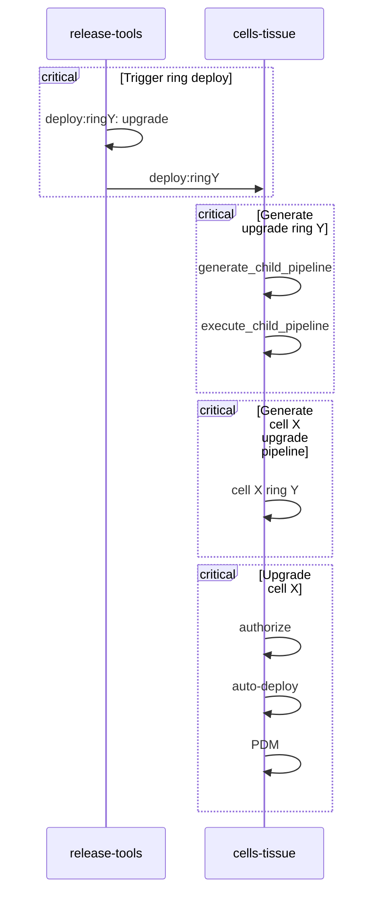

# Cells and Auto-Deploy

This document is to describe how Auto-Deploy works and measures we can take to pause or stop operations if a need arises.
All content in this document is specific to Cells and does not impact the Auto-Deploy process in its entirety.

[[ _TOC_ ]]

## Workflow

The current workflow is not optimal, but there is work in progress to improve it.
Currently there are 4 total child pipelines, each of which have a unique engagement.

1. `Trigger ring deploy` updates the `pre_release` version in the [`cells/tissue`] repo and generates a given ring deployment.
   - Note this does not perform the upgrade, but only commits the desired version. No pipelines are triggered at this point as the commit is performed with a `skip-ci` annotation to prevent any pipeline from starting.
1. `Generate upgrade ring Y` generates and triggers the pipelines required for all Cells of a given Ring.
1. `Generate cell X upgrade pipeline` then generates a child pipeline with the actual work to be had.
1. `Upgrade cell X` contains the actual deployment jobs.
   1. We first check if a deploy shall continue (more on this below).
   1. We then perform the upgrade operation on the Cell itself. The upgrade operation calls a special command [`upgrade-gitlab`].
   1. After this, the Post Deployment Migrations (PDM) are run per Cell. The PDM calls a special command [`post-deploy-db-migration`].

### Post Deployment Migrations

This is currently run automatically on Cells after a Deployment job completes.
The behavior can be modified by setting the Environment Variable `PDM_AUTO_EXECUTE` to a value of `false`.

:warning: This must be done **prior to** the creation of the `Upgrade cell X` pipeline! :warning:

This is configured inside of [`cells/tissue`]: [Cells/Tissue CI Variables](https://ops.gitlab.net/gitlab-com/gl-infra/cells/tissue/-/settings/ci_cd)

There is no automated procedure to set this value back to `true`, so please ensure any followup item resets this value as desired.

## Graduation

Currently, auto-deployments are only triggered for Ring 0 and 1.
Any further ring **does not** receive an auto-deploy package automatically.
Instead, a chunk of packages will begin to collect and an automated procedure creates a merge request to be reviewed that performs two operations:
- it selects the latest package and removes a restriction, enabling it to be promoted to further rings
- it cleans up any other remaining auto-deploy package patch file as they would no longer be needed

This procedure occurs on a nightly basis, thus an MR should exist daily for this.

References:
- [Prepare a MR to graduate the latest auto_deploy package](https://ops.gitlab.net/gitlab-com/gl-infra/cells/tissue/-/pipeline_schedules)
- [auto_deploy_cleanup.yml](https://gitlab.com/gitlab-com/gl-infra/cells/tissue/-/blob/510cb612d1c3d12481755eb9a2f5915bb04a4e2b/templates/auto_deploy_cleanup.yml)

## Pausing Auto-Deploy

This can only be done prior to the `Trigger ring deploy` pipeline having been triggered.
If a pipeline has already begun, it would be unwise to stop it mid-flight as the state of the Cell would need to be heavily investigated to determine what measures are needed to bring the Cell back into a sane state.

### How-To

We leverage an environment variable `SKIP_RING_AUTO_DEPLOYMENT` at the pipeline level to prevent ourselves from committing a change to the [`cells/tissue`] repo.
Preventing this from running is crucial to prevent a Cell from running a version that differs than what we've defined and also preventing any future [`configure`] jobs from coming in and performing an upgrade when not intended.

1. [Release Tools CI Variables](https://ops.gitlab.net/gitlab-org/release/tools/-/settings/ci_cd)
1. Look for `SKIP_RING_AUTO_DEPLOYMENT` and set it to a value of `true`

There is no automated procedure to set this value back to `false`, so please ensure any followup item resets this value as desired.

This prevents the `authorize-ring:X` job from succeeding.
If later it is deemed safe to perform the deploy, simply reset the environment variable and you can either wait for the next Auto-Deploy, or retry the failed `authorize-ring:X` job.

## Rollbacks

Rollbacks are currently a manually initiated by way of the tool [`ringctl`].
It is advised to work with a Release Manager to determine which version to rollback to and if it is safe or not.
After this is established we can initiate a rollback procedure following these steps:

- Change to the directory where your [`cells/tissue`] project resides
- Ensure you are on the latest - `git pull main`
- Ensure `ringctl` is updated - `mise install`
- `ringctl rollback <VERSION> --ring <INT> [--pause-after-ring <INT>]` - Example:
  - `ringctl rollback 17.7.202412021200-1921419d268.2414fa154a7 --ring 0`
  - This rolls the version of GitLab back to `17.7.202412021200-1921419d268.2414fa154a7` starting at Ring `0` asynchronously targeting each ring until all rings (except for quarantine) have completed.
  - Leverage the `--pause-after-ring` to prevent further rings from being patched unnecessarily.
- This will automatically create a Merge Request
- Seek approvals and merge as standard procedure
- Watch the associated pipelines on the Ops instance to watch it proceed to rollback on the desired rings.

:warning: This procedure will currently target an entire ring, this is not capable of being Cell specific at the moment. :warning:

Also, consider that unless Auto-Deploy is paused, we may upgrade to a package which may not have an appropriate fix.
Thus one should consider adding the `SKIP_RING_AUTO_DEPLOYMENT` environment variable described above until a fix has made it into a package.

[`configure`]: https://gitlab.com/gitlab-com/gl-infra/gitlab-dedicated/instrumentor/-/blob/6047b164809733588931b94bd8327ea506d24449/bin/configure
[`cells/tissue`]: https://gitlab.com/gitlab-com/gl-infra/cells/tissue
[`post-deploy-db-migration`]: https://gitlab.com/gitlab-com/gl-infra/gitlab-dedicated/instrumentor/-/blob/6047b164809733588931b94bd8327ea506d24449/bin/post-deploy-db-migration
[`ringctl`]: https://gitlab.com/gitlab-com/gl-infra/ringctl
[`upgrade-gitlab`]: https://gitlab.com/gitlab-com/gl-infra/gitlab-dedicated/instrumentor/-/blob/6047b164809733588931b94bd8327ea506d24449/bin/upgrade-gitlab
