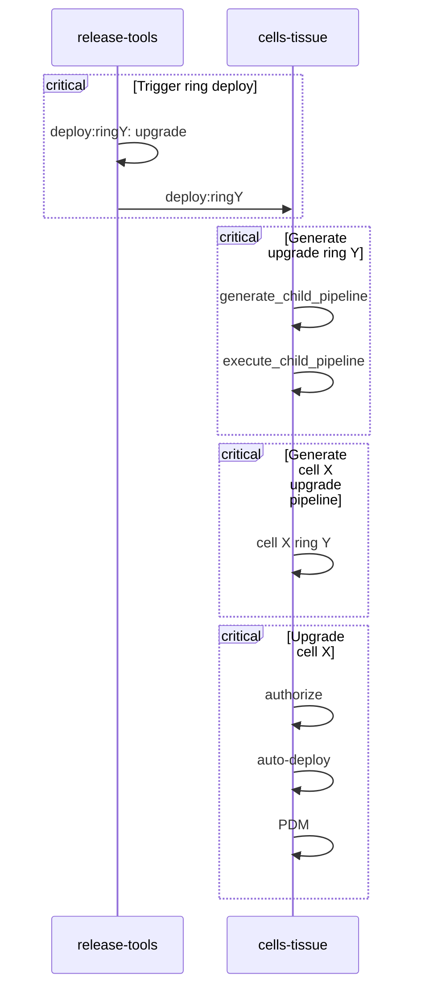

# Cells and Auto-Deploy

This document is to describe how Auto-Deploy works and measures we can take to pause or stop operations if a need arises.
All content in this document is specific to Cells and does not impact the Auto-Deploy process in its entirety.

[[ _TOC_ ]]

## Workflow

The current workflow is not optimal, but there is work in progress to improve it.
Currently there are 4 total child pipelines, each of which have a unique engagement.

1. `Trigger ring deploy` updates the `pre_release` version in the [`cells/tissue`] repo and generates a given ring deployment.
   - Note this does not perform the upgrade, but only commits the desired version. No pipelines are triggered at this point as the commit is performed with a `skip-ci` annotation to prevent any pipeline from starting.
1. `Generate upgrade ring Y` generates and triggers the pipelines required for all Cells of a given Ring.
1. `Generate cell X upgrade pipeline` then generates a child pipeline with the actual work to be had.
1. `Upgrade cell X` contains the actual deployment jobs.
   1. We first check if a deploy shall continue (more on this below).
   1. We then perform the upgrade operation on the Cell itself. The upgrade operation calls a special command [`upgrade-gitlab`].
   1. After this, the Post Deployment Migrations (PDM) are run per Cell. The PDM calls a special command [`post-deploy-db-migration`].
   1. The rollback job on this pipeline is a placeholder job that is manual (more on this below).

### Post Deployment Migrations

This is currently run automatically on Cells after a Deployment job completes.
The behavior can be modified by setting the Environment Variable `PDM_AUTO_EXECUTE` to a value of `false`.

:warning: This must be done **prior to** the creation of the `Upgrade cell X` pipeline! :warning:

This is configured inside of [`cells/tissue`]: [Cells/Tissue CI Variables](https://ops.gitlab.net/gitlab-com/gl-infra/cells/tissue/-/settings/ci_cd)

There is no automated procedure to set this value back to `true`, so please ensure any followup item resets this value as desired.

## Pausing Auto-Deploy

This can only be done prior to the `Trigger ring deploy` pipeline having been triggered.
If a pipeline has already begun, it would be unwise to stop it mid-flight as the state of the Cell would need to be heavily investigated to determine what measures are needed to bring the Cell back into a sane state.

### How-To

We leverage an environment variable `SKIP_RING_AUTO_DEPLOYMENT` at the pipeline level to prevent ourselves from committing a change to the [`cells/tissue`] repo.
Preventing this from running is crucial to prevent a Cell from running a version that differs than what we've defined and also preventing any future [`configure`] jobs from coming in and performing an upgrade when not intended.

1. [Release Tools CI Variables](https://ops.gitlab.net/gitlab-org/release/tools/-/settings/ci_cd)
1. Look for `SKIP_RING_AUTO_DEPLOYMENT` and set it to a value of `true`

There is no automated procedure to set this value back to `false`, so please ensure any followup item resets this value as desired.

This prevents the `authorize-ring:X` job from succeeding.
If later it is deemed safe to perform the deploy, simply reset the environment variable and you can either wait for the next Auto-Deploy, or retry the failed `authorize-ring:X` job.

## Rollbacks

Rollbacks are currently a manual thing to accomplish with Cells.
It is advised to work with a Release Manager to determine which version to rollback to and if it is safe or not.
After this is established, look for the appropriate deployment pipeline associated with that version, and run the manual rollback job at the end of that pipeline.

:warning: The rollback job found in a pipeline does not rollback to the prior version, one _must_ find the specific version we want to rollback too and play that job. :warning:

Example, if you recently deployed version N+1, the rollback job on this pipeline will "rollback" to version N+1.
This is effectively a NOOP and probably not what you had intended.
In order to rollback to version N, one must find the pipeline associated with version N and run the rollback job associated with that pipeline.

There is no automated procedure to set the new desired value of the version running in the [`cells/tissue`] repository.
Ensure any following procedure proceeds to do so, otherwise we run the risk of a [`configure`] job accidentally performing an upgrade.
Also, consider that unless Auto-Deploy is paused, we may upgrade to a package which may not have an appropriate fix.
Thus one should consider adding the `SKIP_RING_AUTO_DEPLOYMENT` environment variable described above until a fix has made it into a package.

[`configure`]: https://gitlab.com/gitlab-com/gl-infra/gitlab-dedicated/instrumentor/-/blob/6047b164809733588931b94bd8327ea506d24449/bin/configure
[`cells/tissue`]: https://gitlab.com/gitlab-com/gl-infra/cells/tissue
[`post-deploy-db-migration`]: https://gitlab.com/gitlab-com/gl-infra/gitlab-dedicated/instrumentor/-/blob/6047b164809733588931b94bd8327ea506d24449/bin/post-deploy-db-migration
[`upgrade-gitlab`]: https://gitlab.com/gitlab-com/gl-infra/gitlab-dedicated/instrumentor/-/blob/6047b164809733588931b94bd8327ea506d24449/bin/upgrade-gitlab
