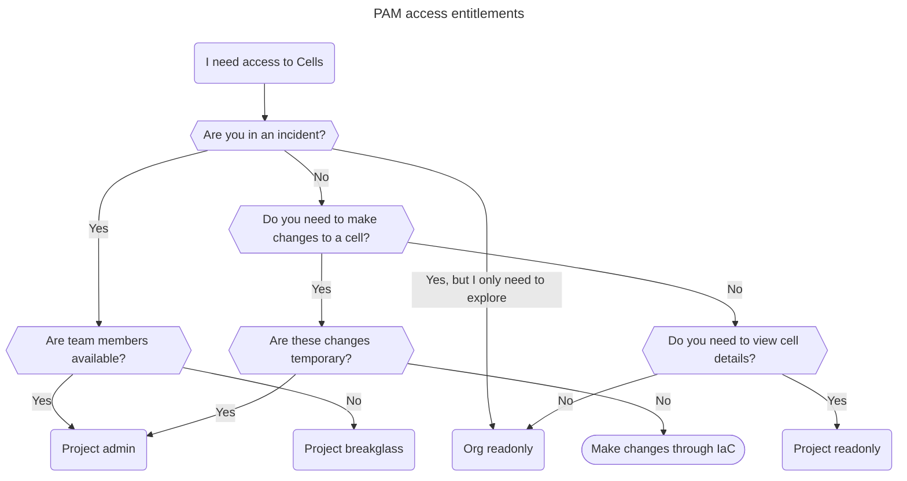

# Breakglass

For Cells we follow the least privileged were SREs don't have read/write access to Cells infraucture in GCP.  This helps limit blast radius in case of security
incidents or misconfigurations of running scripts locally to production.  We use [Privileged Access Manager (PAM)][PAM] to provide short lived access to GCP via
the console or `gcloud`.

## When to escalate

- Using cloud asset viewer: `org-readonly`
- General discovery: `org-readonly`
- Detailed discovery: `project-readonly`
- Planned operational work: `project-admin`
- In an incident:
  - If there are other SREs: `project-admin`
  - Else: `project-breakglass`

## How to escalate

Google provides guides to request access through [the console](https://cloud.google.com/iam/docs/pam-request-temporary-elevated-access#request-grant-console)
and through the [`gcloud` CLI](https://cloud.google.com/iam/docs/pam-request-temporary-elevated-access#request_a_grant_programmatically).

### Quick links

#### `cellsdev`

- [Org-wide](https://console.cloud.google.com/iam-admin/pam/entitlements/my?organizationId=425712905585)
- [Amp](https://console.cloud.google.com/iam-admin/pam/entitlements/my?project=amp-b6f1)
- [Example Cell](https://console.cloud.google.com/iam-admin/pam/entitlements/my?project=cell-c01j2t2v563b55mswz)

#### `cellsprod`

- [Org-wide](https://console.cloud.google.com/iam-admin/pam/entitlements/my?organizationId=1073525295030)
- [Amp](https://console.cloud.google.com/iam-admin/pam/entitlements/my?project=amp-3c0d)
- [Example Cell](https://console.cloud.google.com/iam-admin/pam/entitlements/my?project=cell-c01j2gdw0zfdafxr6)

## Levels of access

### Default Access

By default we give [enough permissions](https://gitlab.com/gitlab-com/gl-infra/cells/tissue/-/blob/702095d2f62f7fc65c3171f87e410432c308987f/terraform/modules/cell-environment/iam.tf) to SREs to view the organization, view projects, and use PAM. For any further action through GCP changes must be made
through IaC or using PAM escalation.

| Cells Dev                                               | Cells Prod                                                      |
|---------------------------------------------------------|-----------------------------------------------------------------|
|  |  |

### Org-wide Access

#### Read-only

This entitlement provides the ability to `list` resources at an org-wide level, but does not provide the ability to `get` details for resources, other than IAM bindings. This is useful for initial
discovery and exploration of the resources available across the org.

### Project Access

#### Read-only

This entitlement provides the ability to view resources within a project scope. This allows you to `list` and `get` resources to discover and describe specific resource configurations, e.g. Viewing
the details for a GKE cluster and it's nodes.

#### Admin

Admin access provides typical operational readwrite abilities for managing cell infrastructure.

The roles this entitlement provides can be found in the [`terraform` module](https://gitlab.com/gitlab-com/gl-infra/gitlab-dedicated/library/terraform/google-privileged-access-manager/-/blob/253a65d8819cfc99746e28bff25e992f1ce51f0a/predefined-entitlements.tf#L67-103).

This level of access requires an approver, and typically will also link to an issue detailing why the access is required.
We should prefer making changes through IaC wherever possible.

<!-- TODO Add recording for elevating access -->

#### Breakglass

Breakglass provides the same level of access as the [`admin`](#admin) entitlement.

This access does not require an approver. The entitlement is intended to be used
during an incident response when there is low team member availability.

We should use `breakglass` as a last resort when we need to make an emergency change to speed up incident response.

[PAM]: https://cloud.google.com/iam/docs/pam-overview
