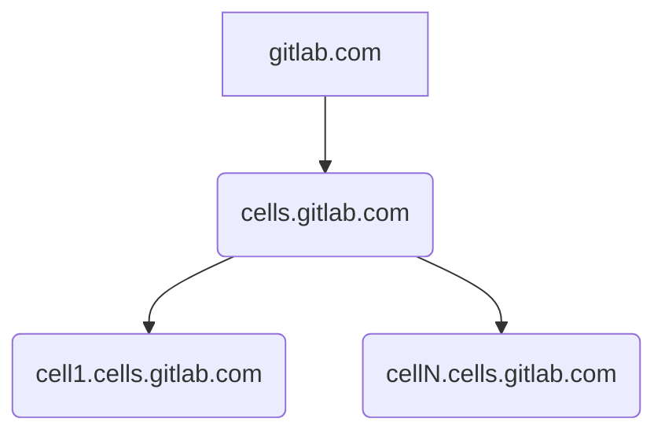

# Cells DNS

[[_TOC_]]

## Summary

Cells uses Cloudflare as DNS Provider. Cells DNS setup is based on the implementation for [Gitlab Dedicated Tenants](https://gitlab.com/gitlab-com/gl-infra/gitlab-dedicated/team/-/blob/main/architecture/blueprints/cloudflare_waf.md#1-gitlab-dedicated-dns-setup). We leverage the [Cloudflare DNS Subdomain Setup](https://developers.cloudflare.com/dns/zone-setups/subdomain-setup/) which allows us manage Cloudflare settings individually for each cell subdomain

Cloudflare Parent Domain zones are created and managed in AMP. Tenant Subdomain zones and their corresponding DNS records are created and managed by Instrumentor. We create a Cloudflare subdomain zone for each tenant. The Parent Domain Zone will contain NS records for each subdomain zone for DNS delegation. All DNS for Gitlab Cells tenants is managed by Cloudflare regardless of the cloud provider where the tenant is hosted at.



## Setup

### Parent Domain Zones Setup

Parent Domains for each Cell Environment:

- celldev: gitlab-cells.dev
- cellprod: cells.gitlab.com

AMP creates and manages the Parent Domain Zones in Cloudflare. To enable Cloudflare support for an AMP environment we need modify it's corresponding Gitlab CI/CD `TF_SECRETS_VAR_FILE` variable and add the following settings to the `env_secret_values` section":

```
env_secret_values = {
  cloudflare_api_token = "REPLACE_VALUE"
  cloudflare_account_id = "REPLACE_VALUE"
}
```

- `cloudflare_account_id`: Gitlab.com Cloudflare Account ID.
- `cloudflare_api_token`: Created by [Terraform](https://ops.gitlab.net/gitlab-com/gl-infra/config-mgmt/-/blob/main/environments/cloudflare/api_tokens.tf#L61) and can be found in Vault [here](https://vault.gitlab.net/ui/vault/secrets/ci/kv/ops-gitlab-net%2Fgitlab-com%2Fgl-infra%2Fconfig-mgmt%2Fcloudflare%2Foutputs%2Fcloudflare_gitlab_cellsdev_amp_token)

#### Steps to follow

For each of the environments in AMP:

1. Ensure that the `cloudflare_api_token` and `cloudflare_account_id` variables are set within each environment's `TF_SECRETS_VAR_FILE` CI/CD variable.

1. Set the `cloudflare_enabled` flag to true in `common.hcl` for each environment. 
   - [`cellsdev`](https://gitlab.com/gitlab-com/gl-infra/gitlab-dedicated/amp/-/blob/main/environments/cellsdev/common.hcl)
   - [`cellsprod`](https://gitlab.com/gitlab-com/gl-infra/gitlab-dedicated/amp/-/blob/main/environments/cellsprod/common.hcl))
1. Once that is merged, check the zone has created successfully in Cloudflare. It will match the `root_domain_name` in the `common.hcl` settings.

### Cell Tenant Domain Zones Setup

Cell Tenant Domain Zones are created by Instrumentor and delegated from the Parent Domain Zone for the corresponding Cell environment.

### Domain Registration

The `gitlab-cells.dev` domain for the `cellsdev` environment is registered in [Gandi](https://admin.gandi.net/domain/4ec14596-4d5a-11e8-9fb1-00163ee24379/gitlab-cells.dev/nameservers).

The `cells.gitlab.com` domain for the `cellsprod` environment is a subdomain of `gitlab.com` and is thus registered in Cloudflare. However it is delegated to the AWS account for the `cellsprod` Amp instance (`058264099888`).
