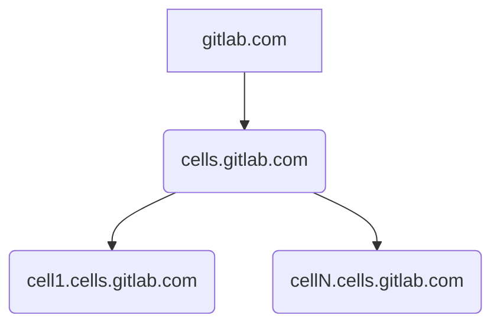

# Cells DNS

[[_TOC_]]

## Summary

Cells uses Cloudflare as DNS Provider by default. Cells DNS setup is based on the implementation for [Gitlab Dedicated Tenants](https://gitlab.com/gitlab-com/gl-infra/gitlab-dedicated/team/-/blob/main/architecture/blueprints/cloudflare_waf.md#1-gitlab-dedicated-dns-setup). We leverage the [Cloudflare DNS Subdomain Setup](https://developers.cloudflare.com/dns/zone-setups/subdomain-setup/) which allows us manage Cloudflare settings individually for each cell subdomain.

Cloudflare Parent Domain zones are created and managed in [Amp](https://gitlab.com/gitlab-com/gl-infra/gitlab-dedicated/amp). Tenant Subdomain zones and their corresponding DNS records are created and managed by [Instrumentor](https://gitlab.com/gitlab-com/gl-infra/gitlab-dedicated/instrumentor). We create a Cloudflare subdomain zone for each tenant. The Parent Domain Zone will contain NS records for each subdomain zone for DNS delegation. All DNS for GitLab Cells tenants is managed by Cloudflare regardless of the cloud provider where the tenant is hosted at.



## Cloudflare DNS Setup

### Step 1: Parent Domain Zones Setup

Parent Domains for each Cell Environment:

- cellsdev: gitlab-cells.dev
- cellsprod: cells.gitlab.com

Amp creates and manages the Parent Domain Zones in Cloudflare. To enable Cloudflare support for an Amp environment we need modify its corresponding Gitlab CI/CD `TF_SECRETS_VAR_FILE` variable [here](https://gitlab.com/gitlab-com/gl-infra/gitlab-dedicated/amp/-/settings/ci_cd#js-cicd-variables-settings) and add the following settings to the `env_secret_values` section":

```
env_secret_values = {
  cloudflare_api_token = "$REPLACE_VALUE$"
  cloudflare_account_id = "$REPLACE_VALUE$"
}
```

- `cloudflare_account_id`: Gitlab.com Cloudflare Account ID.
- `cloudflare_api_token`: Cloudflare API Tokens are created by [Terraform](https://ops.gitlab.net/gitlab-com/gl-infra/config-mgmt/-/blob/main/environments/cloudflare/api_tokens.tf) and can be found in Vault under the following paths:
  - [cellsdev](https://vault.gitlab.net/ui/vault/secrets/ci/kv/ops-gitlab-net%2Fgitlab-com%2Fgl-infra%2Fconfig-mgmt%2Fcloudflare%2Foutputs%2Fcloudflare_gitlab_cellsdev_amp_token/details?version=1)
  - [cellsprod](https://vault.gitlab.net/ui/vault/secrets/ci/kv/ops-gitlab-net%2Fgitlab-com%2Fgl-infra%2Fconfig-mgmt%2Fcloudflare%2Foutputs%2Fcloudflare_gitlab_cellsprod_amp_token/details?version=1)

For each of the environments in Amp:

1. Ensure that the `cloudflare_api_token` and `cloudflare_account_id` variables are set within each environment's `TF_SECRETS_VAR_FILE` CI/CD variable.

1. Set the `cloudflare_enabled` flag to true in `common.hcl` for each environment.
   - [`cellsdev`](https://gitlab.com/gitlab-com/gl-infra/gitlab-dedicated/amp/-/blob/main/environments/cellsdev/common.hcl)
   - [`cellsprod`](https://gitlab.com/gitlab-com/gl-infra/gitlab-dedicated/amp/-/blob/main/environments/cellsprod/common.hcl)
1. Once that is merged, check the zone has created successfully in Cloudflare. It will match the `root_domain_name` in the `common.hcl` settings.

### Step 2: Cells Tenant Domain Zones Setup

Cloudflare DNS is now [the default](https://gitlab.com/gitlab-com/gl-infra/gitlab-dedicated/instrumentor/-/blob/main/gcp/jsonnet/cloudflare-helpers.libsonnet#L8) for all cells. Instrumentor sets the following tenant model defaults for cells:

```json
"cloudflare_waf": {
  "enabled": true,
  "migration_stage": "COMPLETE"
}
```

There is no need to define this on each cell tenant model in tissue, however you can do so in order to make it explicit that the cell is using Cloudflare DNS.

```
➜  tissue git:(main) ✗ ringctl patch create replace /cloudflare_waf/enabled "true" replace /cloudflare_waf/migration_stage "COMPLETE" --priority 3 --related-to "$RELATED_ISSUE"
```

### Cells Environments in Tissue

- cellsdev[https://gitlab.com/gitlab-com/gl-infra/cells/tissue/-/tree/main/rings/cellsdev]
- cellsprod[https://gitlab.com/gitlab-com/gl-infra/cells/tissue/-/tree/main/rings/cellsprod/]

### Domain Registration and Nameserver Setup

The `gitlab-cells.dev` domain for the `cellsdev` environment is registered in [Gandi](https://admin.gandi.net/domain/4ec14596-4d5a-11e8-9fb1-00163ee24379/gitlab-cells.dev/nameservers). Cloudflare is the authoritative DNS provider for `gitlab-cells.dev` as we [have set the corresponding nameservers](https://gitlab.com/gitlab-com/gl-infra/production-engineering/-/issues/26246) in Gandi.

The `cells.gitlab.com` domain for the `cellsprod` environment is a subdomain of `gitlab.com` and is thus registered in Cloudflare. However it is delegated to the AWS account for the `cellsprod` Amp instance (`058264099888`). We will replace the NS delegation records with the corresponding nameservers once the Cloudflare zone for `cells.gitlab.com` is created.

### Migration from Route53 to Cloudflare DNS

In order to migrate a Cells Tenant from Route53 to Cloudflare DNS we need to configure their tenant model in Tissue during each migration stage:

```json
"cloudflare_waf": {
  "enabled": true,
  "migration_stage": "$MIGRATION_STAGE$"
}
```

Migration Stages available on the Tenant Model:

- `ROUTE53`: Records are created in Route53. Cloudflare not used.
- `SETUP_CF_DNS`: Creates the tenant zone and DNS records in Cloudflare, but keeps Route53 as the authoritative provider.
- `DELEGATE_TENANT_DNS`: All of the features from `SETUP_CF_DNS` but it makes Cloudflare DNS the authoritative provider for the tenant subdomain.
- `REMOVE_ROUTE53_RECORDS`: Removes all tenant DNS records from Route53 zone.
- `COMPLETE`: This removes the DNS Delegation records from Route53. Only to be used when the Registrar Nameservers of the Parent Domain Zone are set to Cloudflare's Nameservers.

In Cells we can update the tenant model for each ring using `ringctl` patches. For example to enable Cloudflare and set the `DELEGATE_TENANT_DNS` migration stage the command would look as follows:

```
➜  tissue git:(main) ✗ ringctl patch create replace /cloudflare_waf/enabled "true" replace /cloudflare_waf/migration_stage "COMPLETE" --priority 3 --related-to "$RELATED_ISSUE"
```
