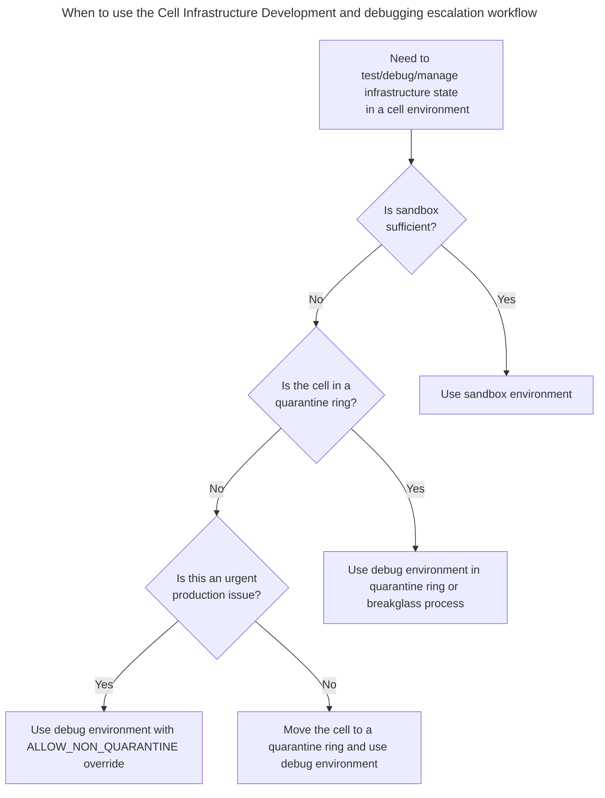
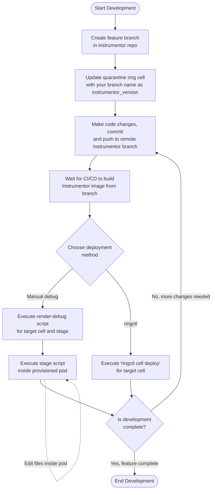

# Cell Infrastucture Debugging and Development

> [!note]
> For incidents you should look at using [the breakglass guide instead](./breakglass.md).

[[_TOC_]]

## Overview

The Cells Infrastructure Debugging and Development process provides a
way to access specific cell environments through [`cells/tissue`] for
testing and debugging without going through the full build and CI
process.  This is particularly useful for iterative development of
[Instrumentor] changes and manual interventions when an upgrade has
failed.



## Development flow

> [!note]
> If using an existing cell in a quarantine ring, follow the below steps.
> Alternatively you can create a new cell, and place it in the quarantine ring before following these steps.
> Follow the steps outlined in the [Provision Cell section](./provisioning.md#how-to-de-provision-a-cell).



> [!note]
> The `instrumentor_version` should be [kebab case](https://developer.mozilla.org/en-US/docs/Glossary/Kebab_case).
> Image tags in [Instrumentor] use this format, and transform the branch name to match this.
> For example `no_hooks_gitaly` would become `no-hooks-gitaly`.

1. Pick a Cell to apply your changes to.
   - The cell should be in the quarantine ring.
     This `-1` folder for the environment and is checked in the script.
   - The cell should not be in use for development by any other team members.
     Check in the [`cells/tissue`] repository for any open MRs targeting the Cell.
2. Create a branch for your change in [Instrumentor].
3. Update your quarantine ring cell to use your branch name as a version.
   1. Create a branch for this change.
   2. Commit and push the change to the [`cells/tissue`] repo.
   3. Open a draft MR to ensure your Cell usage is visible.
   4. (Optional) Trigger a `ringctl cells deploy`.
4. Make changes in your branch, commit and push to a remote branch.
   - Alternatively, you can edit the filesystem contents of the connected pod.
     If taking this approach then ensure you are regularly syncing changes as the pod will be killed when `$SLEEP_TIME` has elapsed, if not before.
5. Wait for your branch to be built into an Instrumentor image.
6. Execute the `render-debug` script for the cell and stage you're targeting.
7. Execute the stage script you are targeting inside the provisioned pod.
8. Repeat steps 4-7 until development is complete.

### (Alternative) Deploy using `ringctl`

You can also iterate during development by using the `ringctl cell deploy` subcommand.

This will trigger a pipeline run in the Ops [`cells/tissue`] project,
using the specified `${BRANCH_NAME}` as to apply against a quarantined cell instance.

```bash
# From the root of the cells/tissue repository
ringctl cell deploy -e ${AMP_ENVIRONMENT} ${TENANT_ID} --only-gitlab-upgrade=false -b ${BRANCH_NAME}
```

This will trigger a full pipeline against the cell, running each
[Instrumentor] stage in order.  Typically changes will be made in
smaller iterations against a single stage, and are faster to iterate
with the `./scripts/render-debug.sh` script, however if changes are
being made across stages then this method may be prepared.

You may also want to trigger a full pipeline execution before
concluding development to ensure that all of the stages continue to
work in order.

## Best Practices

1. **Always prefer quarantine rings** for development and testing
2. **Document all changes** made using the debug environment
3. **Limit the duration** of debug access to the minimum necessary time
4. **Sync any manual changes back to IaC** once the immediate issue is resolved
5. **Check if the cell is in use** before entering using `./scripts/render-debug.sh`
   - Post
6. **Only use the debug script for `cellsdev`** unless in exceptional circumstances
7. **Justify your changes** with a valid issue link and description

## Usage

### Prerequisites

Before using the debug environment script, ensure you have:

1. `kubectl` and `gcloud` CLI tools installed
2. NordLayer VPN connection established to access the private gateway
3. PAM entitlement to access the AMP cluster (See [Breakglass - AMP](#getting-amp-access) section)
4. Appropriate Kubernetes permissions

If any of the above are missing the script will alert you and attempt to provision required permissions.

#### Required Environment Variables

| Variable          | Description                               | Example                   |
|-------------------|-------------------------------------------|---------------------------|
| `AMP_ENVIRONMENT` | The AMP environment to access             | `cellsdev` or `cellsprod` |
| `RING`            | The ring number (-1 for quarantine rings) | `-1`                      |
| `TENANT_ID`       | The ID of the tenant to access (cell ID)  | `12345`                   |

#### Optional Environment Variables

| Variable               | Description                                                                                  | Default          |
|------------------------|----------------------------------------------------------------------------------------------|------------------|
| `ALLOW_NON_QUARANTINE` | Set to 'true' to allow access to non-quarantine rings                                        | `false`          |
| `SLEEP_TIME`           | Duration in seconds for the pod to remain alive                                              | `7200` (2 hours) |
| `ENTITLEMENT_DURATION` | Duration for the PAM entitlement (if requested). Should be at least as long as `$SLEEP_TIME` | `$SLEEP_TIME`    |

### Creating a Development Environment

```sh
# Required environment variables
export AMP_ENVIRONMENT="cellsdev"  # or "cellsprod"
export RING="-1"  # Use quarantine ring
export TENANT_ID="12345"  # Replace with actual tenant ID

# Optional: For shorter session duration (default is 2 hours)
export SLEEP_TIME=1800  # 30 minutes

# Execute the debug script with the desired stage
./scripts/render-debug.sh configure
```

### Accessing Non-Quarantine Rings

> [!warning]
> Using non-quarantine rings should only be done for urgent issues, as this provides direct access to rings that may be serving production traffic.
>
> It it recommended to move a cell to the quarantine ring instead of accessing it directly, if possible.

Non-quarantine rings are protected by default to prevent accidental changes. To access these rings:

```sh
export AMP_ENVIRONMENT="cellsdev"
export RING="2"  # Non-quarantine ring
export TENANT_ID="12345"
export ALLOW_NON_QUARANTINE=true
./scripts/render-debug.sh configure
```

## Getting AMP Access

To access the AMP cluster, you'll need to request PAM entitlement using the specific entitlement created for this purpose.

This will be automatically requested in the script, but is provided here:

```sh
gcloud beta pam grants create \
    --entitlement="gld-amp-stage-entitlement" \
    --requested-duration="1800s" \
    --justification="$ISSUE_LINK" \
    --location=global \
    --project="$AMP_PROJECT_ID"
```

[Instrumentor]: https://gitlab.com/gitlab-com/gl-infra/gitlab-dedicated/instrumentor
[`cells/tissue`]: https://ops.gitlab.net/gitlab-com/gl-infra/cells/tissue
