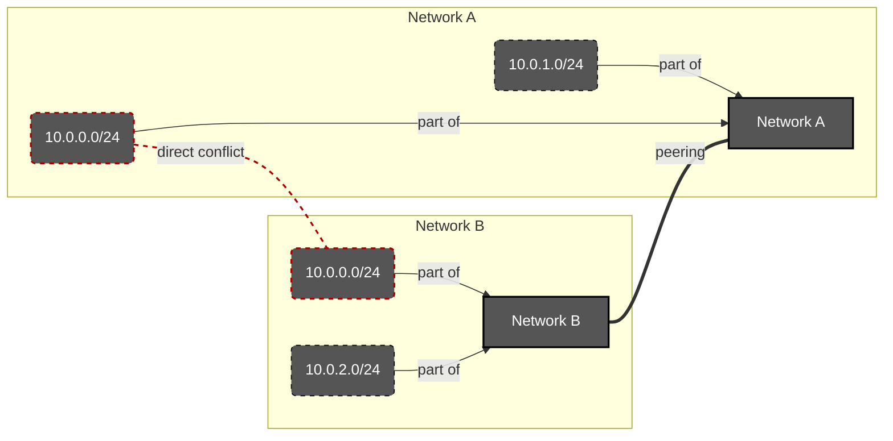
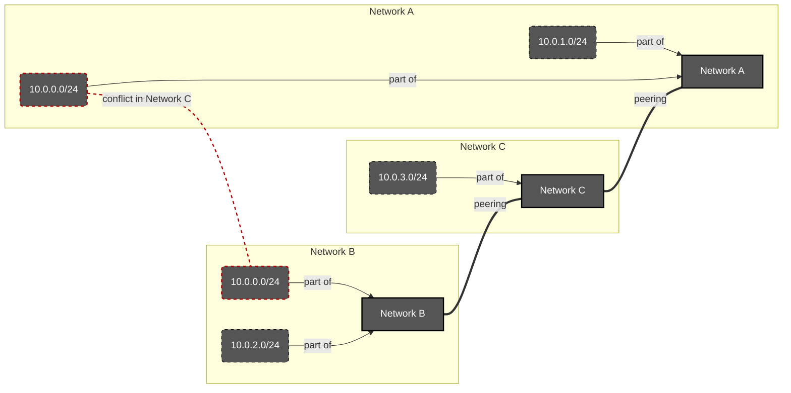
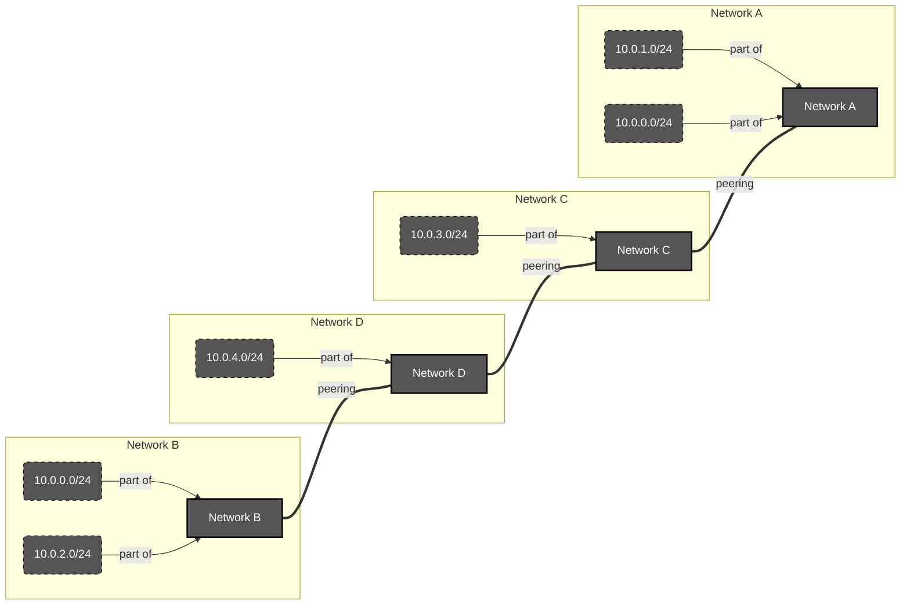
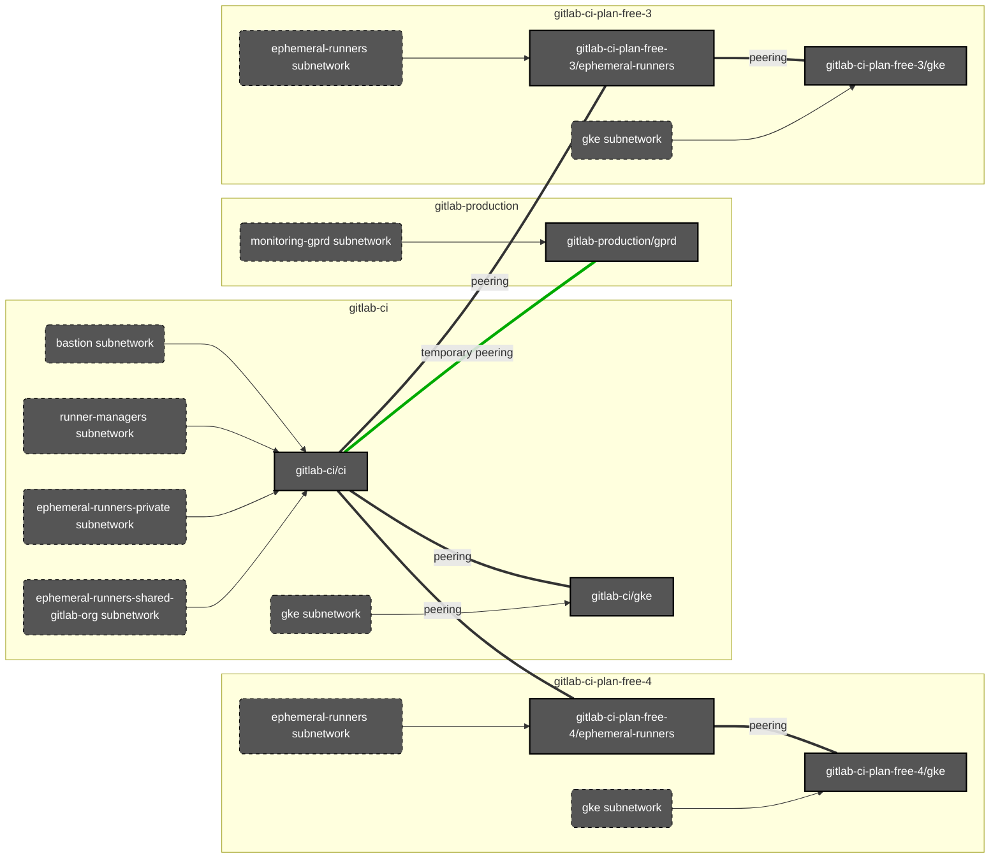

<!-- MARKER: do not edit this section directly. Edit services/service-catalog.yml then run scripts/generate-docs -->

**Table of Contents**

[[_TOC_]]

#  Ci-runners Service
* [Service Overview](https://dashboards.gitlab.net/d/ci-runners-main/ci-runners-overview)
* **Alerts**: https://alerts.gitlab.net/#/alerts?filter=%7Btype%3D%22ci-runners%22%2C%20tier%3D%22sv%22%7D
* **Label**: gitlab-com/gl-infra/production~"Service:CI Runner"

## Logging

* [shared runners](https://log.gprd.gitlab.net/goto/b9aed2474a7ffe194a10d4445a02893a)

## Troubleshooting Pointers

* [ci-apdex-violating-slo.md](ci-apdex-violating-slo.md)
* [service-ci-runners.md](service-ci-runners.md)
* [../patroni/rails-sql-apdex-slow.md](../patroni/rails-sql-apdex-slow.md)
* [../uncategorized/alert-routing.md](../uncategorized/alert-routing.md)
<!-- END_MARKER -->

# CI Runner Overview

We have several different kind of runners. Below is a brief overview of each.
They all have acronyms as well, which are indicated next to each name.

- [Logging](#logging)
- [Troubleshooting Pointers](#troubleshooting-pointers)
- [Configuration management for the Linux based Runners fleet](linux/README.md)
- [Runner Descriptions](#runner-descriptions)
  - [shared-runners-manager (SRM)](#shared-runners-manager-srm)
  - [gitlab-shared-runners-manager (GSRM)](#gitlab-shared-runners-manager-gsrm)
  - [private-runners-manager (PRM)](#private-runners-manager-prm)
  - [gitlab-docker-shared-runners-manager (GDSRM)](#gitlab-docker-shared-runners-manager-gdsrm)
  - [windows-shared-runners-manager (WSRM)](#windows-shared-runners-manager-wsrm)
- [Cost Factors](#cost-factors)
- [Network Info](#network-info)
- [Production Change Lock (PCL)](#production-change-lock-pcl)

## Runner Descriptions

### shared-runners-manager (SRM)

These are the main runners our customers use. They are housed in the `gitlab-ci` project.
Each machine is used for one build and then rebuilt. See [`gitlab-ci` network](#gitlab-ci-project)
for subnet information.

### gitlab-shared-runners-manager (GSRM)

These runners are used for GitLab application tests. They can be used by customer forks of the
GitLab application. These are also housed in the `gitlab-ci` project. See [`gitlab-ci` network](#gitlab-ci-project)
for subnet information.

### private-runners-manager (PRM)

These runners are added to the `gitlab-com` and `gitlab-org` groups for internal GitLab use
only. They are also added to the ops instance as shared runners for the same purpose. They
have privileged mode on. See [`gitlab-ci` network](#gitlab-ci-project) for subnet information.

### gitlab-docker-shared-runners-manager (GDSRM)

These are the newest runners we have. They are used for all of our open source projects under
the `gitlab-org` group. They are also referred to as `org-ci` runners. These are housed in the
`gitlab-org-ci` project. For further info please see the [org-ci README](./cicd/org-ci/README.md).
For network information see [gitlab-org-ci networking](#gitlab-org-ci-project).

### windows-shared-runners-manager (WSRM)

As the name suggests, these are runners that spawn Windows machines. They are currently in
beta. They are housed in the `gitlab-ci-windows` project. For further info please see the
[windows CI README](./cicd/windows/README.md). For network information see [gitlab-ci-windows networking](#gitlab-ci-windows-project).

## Cost Factors

Each runner has an associated `cost factor` that determines how many minutes are deducted from the customers account
per minute used. For example, if a cost factor was 2.0, the customer would use 2 minutes for each minute a CI job
runs. Below is a table that details the cost factor for each runner type.

| Runner Type                                 | Public Project Factor | Private Project Factor |
| ------------------------------------------- | --------------------- | ---------------------- |
| shared-runners-manager (srm)                | 0.0                   | 1.0                    |
| gitlab-shared-runners-manager (gsrm)        | 0.0                   | 1.0                    |
| windows-runners-manager (wsrm)              | 0.0                   | 1.0                    |
| gitlab-docker-shared-runners-manager (gsrm) | 0.0                   | 1.0                    |

## Network Info

Below is the networking information for each project.

### GCP projects

#### gitlab-ci project

| Network Name   | Subnet Name                 | CIDR            | Purpose                                                |
| -------------- | --------------------------- | --------------- | ------------------------------------------------------ |
| `default`      | `default`                   | `10.142.0.0/20` | all non-runner machines (managers, prometheus, etc.). In `us-east1` - we don't use this subnetwork in any other region. |
| `default`      | `shared-runners`            | `10.0.32.0/20`  | shared runner (SRM) machines                           |
| `default`      | `private-runners`           | `10.0.0.0/20`   | private runner (PRM) machines                          |
| `default`      | `gitlab-shared-runners `    | `10.0.16.0/20`  | gitlab shared runner (GSRM) machines                   |
| `ci`           | `bastion-ci`                | `10.1.4.0/24`   | Bastion network                                        |
| `ci`           | `runner-managers`           | `10.1.5.0/24`   | Network for Runner Managers ([new ones](https://gitlab.com/groups/gitlab-com/gl-infra/-/epics/456))                 |
| `ci`           | `ephemeral-runners-private` | `10.10.40.0/21` | Ephemeral runner machines for the new `private` shard. See [Ephemeral runner VMs networking](#ephemera-runner-vms-networking) bellow. |
| `gke`          | `gke`                       | `10.9.0.0/24`   | Primary; GKE nodes range      |
| `gke`          | `gke`                       | `10.8.0.0/16`   | Secondary; GKE pods range     |
| `gke`          | `gke`                       | `10.9.1.0/22`   | secondary; GKE services range |

#### gitlab-org-ci project

| Network Name   | Subnet Name               | CIDR          | Purpose                               |
| -------------- | ------------------------- | ------------- | ------------------------------------- |
| `org-ci`       | `manager`                 | `10.1.0.0/24` | Runner manager machines               |
| `org-ci`       | `bastion-org-ci`          | `10.1.2.0/24` | Bastion network                       |
| `org-ci`       | `gitlab-gke-org-ci`       | `10.1.3.0/24` | GKE network                           |
| `org-ci`       | `gitlab-gke-org-ci`       | `10.3.0.0/16` | GKE network                           |
| `org-ci`       | `gitlab-gke-org-ci`       | `10.1.8.0/23` | GKE network                           |
| `org-ci`       | `shared-runner`           | `10.2.0.0/16` | Ephemeral runner machines             |

#### gitlab-ci-windows project

| Network Name   | Subnet Name          | CIDR          | Purpose                           |
| -------------- | -------------------- | ------------- | --------------------------------- |
| `windows-ci`   | `manager-subnet`     | `10.1.0.0/16` | Runner manager machines           |
| `windows-ci`   | `executor-subnet`    | `10.2.0.0/16` | Ephemeral runner machines         |
| `windows-ci`   | `runner-windows-ci`  | `10.3.0.0/24` | Runner network for ansible/packer |
| `windows-ci`   | `bastion-windows-ci` | `10.3.1.0/24` | bastion network                   |

### Ephemeral runner VMs networking

For high capacity shards (like `shared`) we create dedicated projects for ephemeral VMs.

All these projects have the same networking structure:

| Network Name        | Subnet Name          | CIDR            | Purpose                       |
| ------------------- | -------------------- | --------------- | ----------------------------- |
| `ephemeral-runners` | `ephemeral-runners`  | **UNIQUE CIDR** | Runner manager machines       |
| `gke`               | `gke`                | `10.9.0.0/24`   | Primary; GKE nodes range      |
| `gke`               | `gke`                | `10.8.0.0/16`   | Secondary; GKE pods range     |
| `gke`               | `gke`                | `10.9.1.0/22`   | secondary; GKE services range |

Please read [GCP documentation about `VPC-native
clusters`](https://cloud.google.com/kubernetes-engine/docs/concepts/alias-ips) to understand how the different
ranges of the subnet are being used by GKE.

#### Network peering theory and issues

As peering automatically adds routes, it may introduce a conflict if the network "in the middle" have two different
subnetworks with overlapping CIDR peered. Let's consider few simple examples.

##### Peering conflicting networks directly

In this example we have two networks: `Network A` and `Network B`. Both have two subnetworks defined. One of the
subnetworks in each of the networks is unique (`10.0.1.0/24` in `Network A` and `10.0.2.0/24` in `Network B`).
Both networks contain also a second subnetwork, which have exactly the same CIDR: `10.0.0.0/24`.

When trying to peer these two networks directly, we will get a routing conflict, as it will be impossible to
define where to route traffic to `10.0.0.0/24`. When defining this in GCP (which requires peering definition
to be specified from both sides), first side of peering will be saved. It will be however not activated yet
and GCP will fail and reject to create the second side of the peering.

**Conclusion:** Networks peered directly can't have conflicting CIDRs.

##### Peering conflicting networks with one hop between them

Here we extend the previous example with a new network: `Network C`. It has only one subnetwork with unique CIDR:
`10.0.3.0/24`. Instead of peering `Network A` and `Network B` directly, we try to peer them through `Network C`.

For `Network A` there is no problem - it knows only one `10.0.0.0/24` subnetwork - its own. The same goes for
`Network B`.

However, when we will try to connect them both to `Network C`, it will report a conflict as it gets routing to
`10.0.0.0/24` CIDR from two different peers. When trying to apply this in GCP, one peering will be created
successfully. The second one will fail just like in the case of peering conflicting networks directly.

**Conclusion:** Two networks peered through third common network also can't have conflicting CIDRs.

##### Peering conflicting networks with more than one hop between them

In this example we add fourth network: `Network D`. It has only one subnetwork with unique CIDR: `10.0.4.0/24`.
We also extend the peering chain, injecting `Network D` in the middle.

With this layout, we finally have no conflicts. `Network A` connected with `Network C` doesn't have any directly
overlapping subnetworks. As `Network C` is connected now with `Network D` it doesn't create conflict for `Network C`
as it was in the previous example.

Then we have `Network D`, which is connected with `Network B` and again without any direct overlapping.

The two only subnetworks that have conflicting CIDRs are now separated with two hops between them. As automatic
routing is being added only for directly connected networks, we have no place where two different routes for
`10.0.0.0/24` would show up.

**Conclusion:** If you need to define conflicting CIDRs, ensure that you have at least two hops when peering the VPC
networks. **Or in other words**: If you have more than two hops when peering VPC networks, you don't need to worry
about CIDR conflicts between the edge networks.

#### Networking layout design

Let's consider this example layout:

`gitlab-ci-plan-free-3` project have two networks that are peered: `ephemeral-runners` and `gke`. They are peered as
Prometheus in `gke` network needs to be able to scrape node exporter on ephemeral VMs in `ephemeral-runners` network.

As it's a [direct peering](#peering-conflicting-networks-directly), the networks can't have conflicting CIDRS.

The same goes for `gitlab-ci-plan-free-4` project.

The `ephemeral-runners` networks from `gitlab-ci-plan-free-3` and `gitlab-ci-plan-free-4` are also peered with
`ci` network in `gitlab-ci` project. This is done because runner managers in `runner-managers` subnetwork
need to be able to communicate with ephemeral VMs created in the `gitlab-ci-plan-free-X` projects.

Here we have a mix of direct peering and [peering with one hop](#peering-conflicting-networks-with-one-hop-between-them):

- `gitlab-ci/ci` and `gitlab-ci-plan-free-3/ephemeral-runners` are peered directly, so their subnetworks
  can't have conflicting CIDRs.
- `gitlab-ci/ci` and `gitlab-ci-plan-free-3/gke` are peered through `gitlab-ci-plan-free-3/ephemeral-runners`. Their
  networks also can't have conflicting CIDRs, as this would create conflict in `gitlab-ci-plan-free-3/ephemeral-runners`.

Also `gitlab-ci-plan-free-X/ephemeral-runners` are connected between each other with only one hop (`gitlab-ci/ci`),
which means that all `ephemeral-runners` subnetwork need to have unique CIDRs.

`gitlab-ci-plan-free-X/gke` are connected with more than one hop (sibling `ephemeral-runners` network -> `gitlab-ci/ci`
network -> other `ephemeral-runners` network -> other `gitlab-ci-plan-free-X/gke` network), they may have exactly the
same CIDRs.

Having the peering rules in minds we've designed such networking layout:

1. Each project used for CI runners will have a dedicated `gke` network with `gke` subnetwork. As these are
   never connected directly or with one hop, they all will use exactly the same CIDR, following the philosophy of
   "convention over configuration".

1. The `ephemeral-runners` subnetworks will be conflicting, as they all will have a one-hop common point
   in `gitlab-ci/ci`. This means that we need to make them unique across whole layout. For that we will maintain
   [a list of unique CIDRs for `ephemeral-runners` subnetworks](#ephemeral-runners-unique-cidrs-list). The rule needs
   to be followed no matter if the network is created in a dedicated project (like the `ci-plan-free-X` ones) or
   in the main `gitlab-ci` project.

1. Utility subnetworks like `bastion` or `runner-managers` need to not conflict with any other subnetworks.
   As we will have just these two subnetworks only in `gitlab-ci/ci` network,
   [we've chosen static CIDRs](#gitlab-ci-project) for them and will not change that.

1. Until we will [introduce dedicated Prometheus servers](https://gitlab.com/gitlab-com/gl-infra/infrastructure/-/issues/13886)
   for our CI projects and integrate them with our Thanos cluster, we need to use our main Prometheus server in
   `gitlab-production` project. For that we've created and need to maintain a temporary peering between `gitlab-ci/ci`
   and `gitlab-production/gprd` networks. When creating this peering we've resolved all CIDR conflicts, so all is good
   for now and our `ephemeral-runners` CIDR creation rule should ensure we will not introduce new conflicts. We will
   however need to carefully chose the CIDR for the `gke` subnetworks, as there is one-hop peering between
   `gitlab-production/gprd` and `gitlab-ci/gke`.

#### `ephemeral-runners` unique CIDRs list

For `ephemeral-runners` subnetworks we've decided to use subsequent CIDRs, starting from `10.10.0.0/21`.

The `/21` network gives use place for 2046 nodes per network. In case we need more, we should consider
creating specific GCP projects for part of the ephemeral runners for such shard. This is what we did for `shared`
(which uses the `gitlab-ci-plan-free-X` projects).

Every new CIDR should start at directly after the previously reserved one ends.

**The list bellow is the SSOT of the CIDRs we should use!**

**Please consult every new range with it and keep this list up-to-date!**

| GCP project             | Network "$VPC/$SUBNETWORK"            | CIDR            |
| ----------------------- | ------------------------------------- | --------------- |
| `gitlab-ci-plan-free-7` | `ephemeral-runners/ephemeral-runners` | `10.10.0.0/21`  |
| `gitlab-ci-plan-free-6` | `ephemeral-runners/ephemeral-runners` | `10.10.8.0/21`  |
| `gitlab-ci-plan-free-5` | `ephemeral-runners/ephemeral-runners` | `10.10.16.0/21` |
| `gitlab-ci-plan-free-4` | `ephemeral-runners/ephemeral-runners` | `10.10.24.0/21` |
| `gitlab-ci-plan-free-3` | `ephemeral-runners/ephemeral-runners` | `10.10.32.0/21` |
| `gitlab-ci`             | `ci/ephemeral-runners-private`        | `10.10.40.0/21` |

## Production Change Lock (PCL)

It is a good practice to temporarily halt production changes during
certain events such as GitLab Summit, major global holidays, and
Weekends. Apart from the list already documented in
<https://about.gitlab.com/handbook/engineering/infrastructure/change-management/#production-change-lock-pcl>,
GitLab Runner extends this with the following:

| Dates                          | Type | Reason  |
| ------------------------------ | ---- | ------- |
| Recurring: Friday              | Soft | Friday  |
| Recurring: Weekend (Sat - Sun) | Soft | Weekend |

<!-- ## Summary -->

<!-- ## Architecture -->

<!-- ## Performance -->

<!-- ## Scalability -->

<!-- ## Availability -->

<!-- ## Durability -->

<!-- ## Security/Compliance -->

<!-- ## Monitoring/Alerting -->

<!-- ## Links to further Documentation -->
