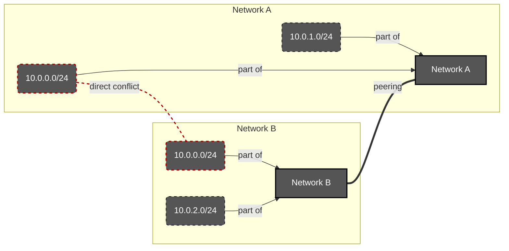
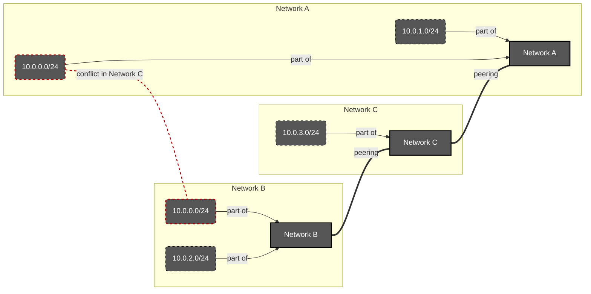
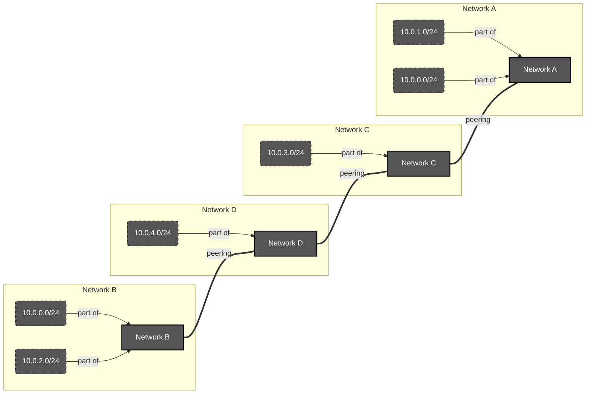
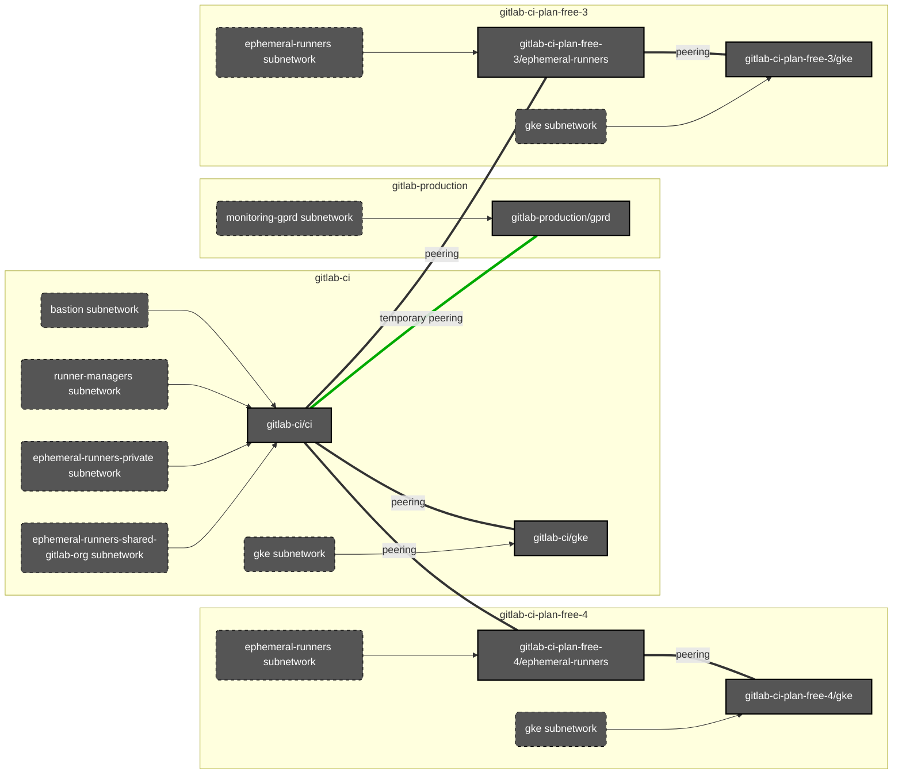
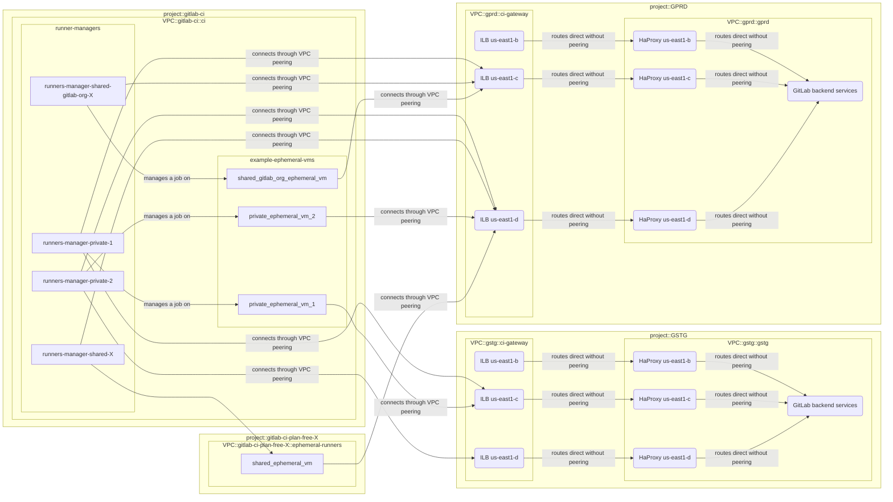

<!-- MARKER: do not edit this section directly. Edit services/service-catalog.yml then run scripts/generate-docs -->

**Table of Contents**

[[_TOC_]]

# Ci-runners Service

* [Service Overview](https://dashboards.gitlab.net/d/ci-runners-main/ci-runners-overview)
* **Alerts**: <https://alerts.gitlab.net/#/alerts?filter=%7Btype%3D%22ci-runners%22%2C%20tier%3D%22sv%22%7D>
* **Label**: gitlab-com/gl-infra/production~"Service:CI Runner"

## Logging

* [shared runners](https://log.gprd.gitlab.net/goto/b9aed2474a7ffe194a10d4445a02893a)

## Troubleshooting Pointers

* [ci-apdex-violating-slo.md](ci-apdex-violating-slo.md)
* [service-ci-runners.md](service-ci-runners.md)
* [Rails SQL Apdex alerts](../patroni/rails-sql-apdex-slow.md)
* [Alert Routing Howto](../uncategorized/alert-routing.md)
<!-- END_MARKER -->

# CI Runner Overview

We have several different kind of runners. Below is a brief overview of each.
They all have acronyms as well, which are indicated next to each name.

* [Logging](#logging)
* [Troubleshooting Pointers](#troubleshooting-pointers)
* [Configuration management for the Linux based Runners fleet](linux/README.md)
* [Runner Descriptions](#runner-descriptions)
  * [shared-runners-manager (SRM)](#shared-runners-manager-srm)
  * [gitlab-shared-runners-manager (GSRM)](#gitlab-shared-runners-manager-gsrm)
  * [private-runners-manager (PRM)](#private-runners-manager-prm)
  * [gitlab-docker-shared-runners-manager (GDSRM)](#gitlab-docker-shared-runners-manager-gdsrm)
  * [windows-shared-runners-manager (WSRM)](#windows-shared-runners-manager-wsrm)
* [Cost Factors](#cost-factors)
* [Network Info](#network-info)
* [Monitoring](#monitoring)
* [Production Change Lock (PCL)](#production-change-lock-pcl)

## Runner Descriptions

### shared-runners-manager (SRM)

These are the main runners our customers use. They are housed in the `gitlab-ci` project.
Each machine is used for one build and then rebuilt. See [`gitlab-ci` network](#gitlab-ci-project)
for subnet information.

### gitlab-shared-runners-manager (GSRM)

These runners are used for GitLab application tests. They can be used by customer forks of the
GitLab application. These are also housed in the `gitlab-ci` project. See [`gitlab-ci` network](#gitlab-ci-project)
for subnet information.

### private-runners-manager (PRM)

These runners are added to the `gitlab-com` and `gitlab-org` groups for internal GitLab use
only. They are also added to the ops instance as shared runners for the same purpose. They
have privileged mode on. See [`gitlab-ci` network](#gitlab-ci-project) for subnet information.

### gitlab-docker-shared-runners-manager (GDSRM)

These are the newest runners we have. They are used for all of our open source projects under
the `gitlab-org` group. They are also referred to as `org-ci` runners. These are housed in the
`gitlab-org-ci` project. For further info please see the [org-ci README](./cicd/org-ci/README.md).
For network information see [gitlab-org-ci networking](#gitlab-org-ci-project).

### windows-shared-runners-manager (WSRM)

As the name suggests, these are runners that spawn Windows machines. They are currently in
beta. They are housed in the `gitlab-ci-windows` project. For further info please see the
[windows CI README](./cicd/windows/README.md). For network information see [gitlab-ci-windows networking](#gitlab-ci-windows-project).

## Cost Factors

Each runner has an associated `cost factor` that determines how many minutes are deducted from the customers account
per minute used. For example, if a cost factor was 2.0, the customer would use 2 minutes for each minute a CI job
runs. Below is a table that details the cost factor for each runner type.

| Runner Type                                 | Public Project Factor | Private Project Factor |
| ------------------------------------------- | --------------------- | ---------------------- |
| shared-runners-manager (srm)                | 0.0                   | 1.0                    |
| gitlab-shared-runners-manager (gsrm)        | 0.0                   | 1.0                    |
| windows-runners-manager (wsrm)              | 0.0                   | 1.0                    |
| gitlab-docker-shared-runners-manager (gsrm) | 0.0                   | 1.0                    |

## Network Info

### Ephemeral runner VMs networking

For high capacity shards (like `shared`) we create dedicated projects for ephemeral VMs.

All these projects have the same networking structure:

| Network Name        | Subnet Name          | CIDR            | Purpose                       |
| ------------------- | -------------------- | --------------- | ----------------------------- |
| `ephemeral-runners` | `ephemeral-runners`  | **UNIQUE CIDR** | Runner manager machines       |
| `runners-gke`       | `runners-gke`        | `10.9.4.0/24`   | Primary; GKE nodes range      |
| `runners-gke`       | `runners-gke`        | `10.8.0.0/16`   | Secondary; GKE pods range     |
| `runners-gke`       | `runners-gke`        | `10.9.0.0/22`   | secondary; GKE services range |

Please read [GCP documentation about `VPC-native
clusters`](https://cloud.google.com/kubernetes-engine/docs/concepts/alias-ips) to understand how the different
ranges of the subnet are being used by GKE.

#### Network peering theory and issues

As peering automatically adds routes, it may introduce a conflict if the network "in the middle" have two different
subnetworks with overlapping CIDR peered. Let's consider few simple examples.

##### Peering conflicting networks directly

In this example we have two networks: `Network A` and `Network B`. Both have two subnetworks defined. One of the
subnetworks in each of the networks is unique (`10.0.1.0/24` in `Network A` and `10.0.2.0/24` in `Network B`).
Both networks contain also a second subnetwork, which have exactly the same CIDR: `10.0.0.0/24`.

When trying to peer these two networks directly, we will get a routing conflict, as it will be impossible to
define where to route traffic to `10.0.0.0/24`. When defining this in GCP (which requires peering definition
to be specified from both sides), first side of peering will be saved. It will be however not activated yet
and GCP will fail and reject to create the second side of the peering.

**Conclusion:** Networks peered directly can't have conflicting CIDRs.

##### Peering conflicting networks with one hop between them

Here we extend the previous example with a new network: `Network C`. It has only one subnetwork with unique CIDR:
`10.0.3.0/24`. Instead of peering `Network A` and `Network B` directly, we try to peer them through `Network C`.

For `Network A` there is no problem - it knows only one `10.0.0.0/24` subnetwork - its own. The same goes for
`Network B`.

However, when we will try to connect them both to `Network C`, it will report a conflict as it gets routing to
`10.0.0.0/24` CIDR from two different peers. When trying to apply this in GCP, one peering will be created
successfully. The second one will fail just like in the case of peering conflicting networks directly.

**Conclusion:** Two networks peered through third common network also can't have conflicting CIDRs.

##### Peering conflicting networks with more than one hop between them

In this example we add fourth network: `Network D`. It has only one subnetwork with unique CIDR: `10.0.4.0/24`.
We also extend the peering chain, injecting `Network D` in the middle.

With this layout, we finally have no conflicts. `Network A` connected with `Network C` doesn't have any directly
overlapping subnetworks. As `Network C` is connected now with `Network D` it doesn't create conflict for `Network C`
as it was in the previous example.

Then we have `Network D`, which is connected with `Network B` and again without any direct overlapping.

The two only subnetworks that have conflicting CIDRs are now separated with two hops between them. As automatic
routing is being added only for directly connected networks, we have no place where two different routes for
`10.0.0.0/24` would show up.

**Conclusion:** If you need to define conflicting CIDRs, ensure that you have at least two hops when peering the VPC
networks. **Or in other words**: If you have more than two hops when peering VPC networks, you don't need to worry
about CIDR conflicts between the edge networks.

#### Networking layout design

Let's consider this example layout:

`gitlab-ci-plan-free-3` project have two networks that are peered: `ephemeral-runners` and `gke`. They are peered as
Prometheus in `gke` network needs to be able to scrape node exporter on ephemeral VMs in `ephemeral-runners` network.

As it's a [direct peering](#peering-conflicting-networks-directly), the networks can't have conflicting CIDRS.

The same goes for `gitlab-ci-plan-free-4` project.

The `ephemeral-runners` networks from `gitlab-ci-plan-free-3` and `gitlab-ci-plan-free-4` are also peered with
`ci` network in `gitlab-ci` project. This is done because runner managers in `runner-managers` subnetwork
need to be able to communicate with ephemeral VMs created in the `gitlab-ci-plan-free-X` projects.

Here we have a mix of direct peering and [peering with one hop](#peering-conflicting-networks-with-one-hop-between-them):

* `gitlab-ci/ci` and `gitlab-ci-plan-free-3/ephemeral-runners` are peered directly, so their subnetworks
  can't have conflicting CIDRs.
* `gitlab-ci/ci` and `gitlab-ci-plan-free-3/gke` are peered through `gitlab-ci-plan-free-3/ephemeral-runners`. Their
  networks also can't have conflicting CIDRs, as this would create conflict in `gitlab-ci-plan-free-3/ephemeral-runners`.

Also `gitlab-ci-plan-free-X/ephemeral-runners` are connected between each other with only one hop (`gitlab-ci/ci`),
which means that all `ephemeral-runners` subnetwork need to have unique CIDRs.

`gitlab-ci-plan-free-X/gke` are connected with more than one hop (sibling `ephemeral-runners` network -> `gitlab-ci/ci`
network -> other `ephemeral-runners` network -> other `gitlab-ci-plan-free-X/gke` network), they may have exactly the
same CIDRs.

Having the peering rules in minds we've designed such networking layout:

1. Each project used for CI runners will have a dedicated `gke` network with `gke` subnetwork. As these are
   never connected directly or with one hop, they all will use exactly the same CIDR, following the philosophy of
   "convention over configuration".

1. The `ephemeral-runners` subnetworks will be conflicting, as they all will have a one-hop common point
   in `gitlab-ci/ci`. This means that we need to make them unique across whole layout. For that we will maintain
   [a list of unique CIDRs for `ephemeral-runners` subnetworks](#ephemeral-runners-unique-cidrs-list). The rule needs
   to be followed no matter if the network is created in a dedicated project (like the `ci-plan-free-X` ones) or
   in the main `gitlab-ci` project.

1. Utility subnetworks like `bastion` or `runner-managers` need to not conflict with any other subnetworks.
   As we will have just these two subnetworks only in `gitlab-ci/ci` network,
   [we've chosen static CIDRs](#gitlab-ci-project) for them and will not change that.

1. Until we will [introduce dedicated Prometheus servers](https://gitlab.com/gitlab-com/gl-infra/reliability/-/issues/13886)
   for our CI projects and integrate them with our Thanos cluster, we need to use our main Prometheus server in
   `gitlab-production` project. For that we've created and need to maintain a temporary peering between `gitlab-ci/ci`
   and `gitlab-production/gprd` networks. When creating this peering we've resolved all CIDR conflicts, so all is good
   for now and our `ephemeral-runners` CIDR creation rule should ensure we will not introduce new conflicts. We will
   however need to carefully chose the CIDR for the `gke` subnetworks, as there is one-hop peering between
   `gitlab-production/gprd` and `gitlab-ci/gke`.

#### `ephemeral-runners` unique CIDRs list

For `ephemeral-runners` subnetworks we've decided to use subsequent CIDRs, starting from `10.10.0.0/21`.

The `/21` network gives use place for 2046 nodes per network. In case we need more, we should consider
creating specific GCP projects for part of the ephemeral runners for such shard. This is what we did for `shared`
(which uses the `gitlab-ci-plan-free-X` projects).

Every new CIDR should start at directly after the previously reserved one ends.

**The list bellow is the SSOT of the CIDRs we should use!**

**Please consult every new range with it and keep this list up-to-date!**

**When adding any new ephemeral-runners subnetwork don't forget to update the
[`ci-gateway` firewall](#ci-gateway-ilb-firewall)!**

| GCP project             | Network "$VPC/$SUBNETWORK"                 | CIDR             |
| ----------------------- | ------------------------------------------ | ---------------- |
| `gitlab-ci-plan-free-7` | `ephemeral-runners/ephemeral-runners`      | `10.10.0.0/21`   |
| `gitlab-ci-plan-free-6` | `ephemeral-runners/ephemeral-runners`      | `10.10.8.0/21`   |
| `gitlab-ci-plan-free-5` | `ephemeral-runners/ephemeral-runners`      | `10.10.16.0/21`  |
| `gitlab-ci-plan-free-4` | `ephemeral-runners/ephemeral-runners`      | `10.10.24.0/21`  |
| `gitlab-ci-plan-free-3` | `ephemeral-runners/ephemeral-runners`      | `10.10.32.0/21`  |
| `gitlab-ci`             | `ci/ephemeral-runners-private`             | `10.10.40.0/21`  |
| `gitlab-ci`             | `ci/ephemeral-runners-shared-gitlab-org`   | `10.10.48.0/21`  |
| `gitlab-ci`             | `ci/ephemeral-runners-private-2`           | `10.10.56.0/21`  |
| `gitlab-ci-private-1`   | `ephemeral-runners/ephemeral-runners`      | `10.10.64.0/21`  |
| `gitlab-ci-private-2`   | `ephemeral-runners/ephemeral-runners`      | `10.10.72.0/21`  |
| `gitlab-ci-private-3`   | `ephemeral-runners/ephemeral-runners`      | `10.10.80.0/21`  |
| `gitlab-ci-private-4`   | `ephemeral-runners/ephemeral-runners`      | `10.10.88.0/21`  |
| `gitlab-ci`             | `ci/ephemeral-runners-shared-gitlab-org-2` | `10.10.96.0/21`  |
| `gitlab-ci`             | `ci/ephemeral-runners-shared-gitlab-org-3` | `10.10.104.0/21` |
| `gitlab-ci`             | `ci/ephemeral-runners-shared-gitlab-org-4` | `10.10.112.0/21` |

##### `ci-gateway` ILB firewall

When updating the `ephemeral-runners` CIDRs please remember to update the firewall rules for
the `ci-gateway` ILBs.

The rules are managed with Terraform in GPRD and GSTG environments within the `google_compute_firewall` resource
named `ci-gateway-allow-runners`.

The GPRD (GitLab.com) definition can be found [here](https://ops.gitlab.net/gitlab-com/gl-infra/config-mgmt/-/blob/743cf13a31633a62f9e6e8b67abeee3d151792ed/environments/gprd/main.tf#L2960).

The GSTG (staging.gitlab.com) definition can be found [here](https://ops.gitlab.net/gitlab-com/gl-infra/config-mgmt/-/blob/743cf13a31633a62f9e6e8b67abeee3d151792ed/environments/gstg/main.tf#L2957)

When doing any changes related to ephemeral runners make sure to check which GitLab environments that runner
supports (for example our `private` runners support both GPRD and GSTG while `shared` only GPRD) and update
the firewall rules respectively.

### GCP projects

Here you can find details about networking in different projects used by CI Runners service.

#### gitlab-ci project

| Network Name   | Subnet Name                 | CIDR            | Purpose                                                |
| -------------- | --------------------------- | --------------- | ------------------------------------------------------ |
| `default`      | `default`                   | `10.142.0.0/20` | all non-runner machines (managers, prometheus, etc.). In `us-east1` - we don't use this subnetwork in any other region. |
| `default`      | `shared-runners`            | `10.0.32.0/20`  | shared runner (SRM) machines                           |
| `default`      | `private-runners`           | `10.0.0.0/20`   | private runner (PRM) machines                          |
| `default`      | `gitlab-shared-runners`    | `10.0.16.0/20`  | gitlab shared runner (GSRM) machines                   |
| `ci`           | `bastion-ci`                | `10.1.4.0/24`   | Bastion network                                        |
| `ci`           | `runner-managers`           | `10.1.5.0/24`   | Network for Runner Managers ([new ones](https://gitlab.com/groups/gitlab-com/gl-infra/-/epics/456))                 |
| `ci`           | `ephemeral-runners-private` | `10.10.40.0/21` | Ephemeral runner machines for the new `private` shard. See [`ephemeral-runnes` unique CIDRs list](#ephemeral-runners-unique-cidrs-list) above |
| `ci`           | `ephemeral-runners-private-2` | `10.10.56.0/21` | Second range used by ephemeral runner machines for the new `private` shard. See [`ephemeral-runnes` unique CIDRs list](#ephemeral-runners-unique-cidrs-list) above |
| `ci`           | `ephemeral-runners-shared-gitlab-org` | `10.10.48.0/21` | Ephemeral runner machines for the new `shared-gitlab-org` shard. See [`ephemeral-runners` unique CIDRs list](#ephemeral-runners-unique-cidrs-list) above |
| `ci`           | `ephemeral-runners-shared-gitlab-org-2` | `10.10.96.0/21` | Second range for ephemeral runner machines for the new `shared-gitlab-org` shard. See [`ephemeral-runners` unique CIDRs list](#ephemeral-runners-unique-cidrs-list) above |
| `ci`           | `ephemeral-runners-shared-gitlab-org-3` | `10.10.104.0/21` | Third range for ephemeral runner machines for the new `shared-gitlab-org` shard. See [`ephemeral-runners` unique CIDRs list](#ephemeral-runners-unique-cidrs-list) above |
| `ci`           | `ephemeral-runners-shared-gitlab-org-4` | `10.10.112.0/21` | Fourth range for ephemeral runner machines for the new `shared-gitlab-org` shard. See [`ephemeral-runners` unique CIDRs list](#ephemeral-runners-unique-cidrs-list) above |
| `runners-gke`  | `runners-gke`               | `10.9.4.0/24`   | Primary; GKE nodes range      |
| `runners-gke`  | `runners-gke`               | `10.8.0.0/16`   | Secondary; GKE pods range     |
| `runners-gke`  | `runners-gke`               | `10.9.0.0/22`   | secondary; GKE services range |

The `default` network will be removed once we will move all of the runner managers to a new
infrastructure, which is being tracked [by this epic](https://gitlab.com/groups/gitlab-com/gl-infra/-/epics/456).

The `ci` network will be getting new subnetworks for `ephemeral-runners-X` while working on
[this epic]((https://gitlab.com/groups/gitlab-com/gl-infra/-/epics/456)).

The `runners-gke` network, at least for now, is in the expected state.

#### gitlab-org-ci project

| Network Name   | Subnet Name               | CIDR          | Purpose                               |
| -------------- | ------------------------- | ------------- | ------------------------------------- |
| `org-ci`       | `manager`                 | `10.1.0.0/24` | Runner manager machines               |
| `org-ci`       | `bastion-org-ci`          | `10.1.2.0/24` | Bastion network                       |
| `org-ci`       | `gitlab-gke-org-ci`       | `10.1.3.0/24` | GKE network                           |
| `org-ci`       | `gitlab-gke-org-ci`       | `10.3.0.0/16` | GKE network                           |
| `org-ci`       | `gitlab-gke-org-ci`       | `10.1.8.0/23` | GKE network                           |
| `org-ci`       | `shared-runner`           | `10.2.0.0/16` | Ephemeral runner machines             |

We are considering removing this environment at all when the
[Linux CI Runners Continuous Delivery](https://gitlab.com/groups/gitlab-com/gl-infra/-/epics/456) will be done.
Our current plan is to add the `gitlab-docker-shared-runners-manager` as another entry in the `shared-gitlab-org`
runner managers. Since we've moved a lot of load from the `ci` project to the `ci-plan-free-X` projects, it should
have a lot of space for load currently handled by `gitlab-org-ci` project. Removing it will make our configuration
a little more simple.

#### gitlab-ci-windows project

| Network Name   | Subnet Name          | CIDR          | Purpose                           |
| -------------- | -------------------- | ------------- | --------------------------------- |
| `windows-ci`   | `manager-subnet`     | `10.1.0.0/16` | Runner manager machines           |
| `windows-ci`   | `executor-subnet`    | `10.2.0.0/16` | Ephemeral runner machines         |
| `windows-ci`   | `runner-windows-ci`  | `10.3.0.0/24` | Runner network for ansible/packer |
| `windows-ci`   | `bastion-windows-ci` | `10.3.1.0/24` | bastion network                   |

Windows project will most probably get the `runners-gke` network and GKE based monitoring in the future. This
is however not yet scheduled.

### `ci-gateway` Internal Load Balancers

To reduce the amount of traffic that goes through the public Internet (which causes additional costs)
and to add a little performance improvements, Runner managers and Git are set to use internal
load balancers which routes the traffic through GCP internal networking.

For that we've created a special VPC named `ci-gateway`. Dedicated VPC was added to avoid
peering with the main VPC of GitLab backend - for security reasons and to reduce the number
of possible CIDRs collisions.

This configuration was first tested with `private` runners shard and `staging.gitlab.com`. And
next was replicated in GPRD - for `gitlab.com` and with the three Linux runners shards we have.

#### How it's configured

The above diagram shows a general view of how this configuration is set up.

In both GSTG and GPRD projects we've created a dedicated VPC named `ci-gateway`. This VPC
contains Internal Load Balancers (ILBs) available on defined FQDNs. The VPCs are peered with
CI VPCs that contain runner managers and ephemeral VMs on which the jobs are executed.

As an ILB can route traffic only to nodes in the same VPC, we had to add a small change
to our HaProxy configuration. We've created a dedicated cluster of new HaProxy nodes
provisioned with two network interfaces: in `gprd` and in `ci-gateway` VPCs. The same
configuration is created in GSTG.

HaProxy got a new frontend named `https_git_ci_gateway` and listening on port `8989`. This
fronted passes the detected `git+https` traffic and a limited amount of API endpoints (purely
for Runner communication, which includes requesting for a job, sending trace update and sending
job update) to GitLab backends. Other requests are redirected with `307` HTTP response code
to `staging.gitlab.com` or `gitlab.com` - depending on the requested resource.

To reduce the cost that is created by traffic made across availability zones, in each project
we have two ILBs - one for each availability zone (`us-east1-c` and `us-east1-d`) used by the CI
fleet in the `us-east1` region. Each ILB is configured to target HaProxy nodes only in its
availability zone.

For that, the following FQDNs were created:

* `git-us-east1-c.ci-gateway.int.gstg.gitlab.net`
* `git-us-east1-d.ci-gateway.int.gstg.gitlab.net`
* `git-us-east1-c.ci-gateway.int.gprd.gitlab.net`
* `git-us-east1-d.ci-gateway.int.gprd.gitlab.net`

Runner nodes are configured to point the ILBs with the `url` and `clone_url` settings.
As we set our runners to operate in a specific availability zone, each of them
points the relevant ILB FQDN.

#### How it works

GitLab Runner is configured to talk with the dedicated ILB. Communication goes through
the VPC peering and reaches one of the HaProxy nodes backing the ILB. TLS certificate
is verified and Runner saves this information to configure Git in the job environment.

When job is received, Runner starts executing it on the ephemeral VM. It configures
Git to use the CAChain resolved from initial API request. Repo URL is configured to
use the ILB as GitLab's endpoint.

When job reaches the step in which sources are updated, `git clone` operation is
executed against the ILB. Communication again goes through the VPC peering and reaches
one of the HaProxy nodes. TLS certificate is verified using the CAChain resolved
earlier.

When job reaches the step when artifact needs to be downloaded or uploaded, it
also tries to talk with the ILB. However, HaProxy frontend detects that this
communication is unsupported and redirects it to the public Internet gateway
of GitLab instance that the job belongs to.

In the meantime, Runner receives job logs and transfers them back - together
with updating the status of the job - to GitLab's API. For that the communication
through VPC peering and the dedicaed ILB is used as well.

## Monitoring

Monitoring is be defined in almost the same configuration in all CI related projects. It is deployed using GKE and
a cluster created by terraform. For that
[a dedicated terraform module](https://ops.gitlab.net/gitlab-com/gitlab-com-infrastructure/-/tree/master/modules/ci-runners/gke)
was created. For it's purpose the GKE cluster is using the `runners-gke` network defined above.

Prometheus is deployed in at least two replicas. Both have a Thanos Sidecar running alongside. Sidecar's gRPC
endpoint is exposed as publicly accessible (we don't want to peer the `ops` or `gprd` network here) and the GCP Firewall
limits access to it to only Thanos Query public IPs. This service uses TCP port `10901`.

Long-term metrics storage is handled by using a dedicated GCS bucket created by the terraform module alongside
the cluster. Thanos Sidecar is configured with write access to this bucket.

Apart from the Sidecar we also have Thanos Store Gateway and Thanos Compact deployed and configured to use the same
GCS bucket. Store Gateway's gRPC endpoint is exposed similarly to the Sidecar's one. This service uses TCP port `10903`.

[Traefik](https://traefik.io/) is used as the ingress and load-balancing mechanism. It exposes gRPC services on given
ports (using TCP routing), Prometheus UI and own dashboard. HTTP endpoints are automatically redirected to HTTPS,
and Let's Encrypt certificates are used for TLS.

For external access each project where monitoring is deployed is using a reserved public IP address. This address
is bound to two DNS A records:

* `monitoring-lb.[ENVIRONMENT].ci-runners.gitlab.net` - which is used for Thanos Query store DNS discovery and
  to access Traefik dashboard in the browser. Access to the Dashboard is limited by oAuth, using Google as the Identity
  Provider allowing `@gitlab.com` accounts. Consent screen and oAuth2 secrets are defined in the `gitlab-ci-155816`
  project and should be used for all deployments of this monitoring stack (**remember:** new deploys will use new
  domains for the redirection URLs, which should be added to the oAuth2 credentials configuration; unfortunately this
  can't be managed by terraform).
* `prometheus.[ENVIRONMENT].ci-runners.gitlab.net` - which is used to access directly the Prometheus deployment. As with
  the Traefik dashboard, access is limited by oAuth2 with the same configuration.

K8S deployment configuration is managed fully from CI. [A dedicated
project](https://gitlab.com/gitlab-com/gl-infra/ci-runners/k8s-workloads) covers all monitoring clusters in different
CI projects that we maintain.

## Production Change Lock (PCL)

It is a good practice to temporarily halt production changes during
certain events such as GitLab Summit, major global holidays, and
Weekends. Apart from the list already documented in
<https://about.gitlab.com/handbook/engineering/infrastructure/change-management/#production-change-lock-pcl>,
GitLab Runner extends this with the following:

| Dates                          | Type | Reason  |
| ------------------------------ | ---- | ------- |
| Recurring: Friday              | Soft | Friday  |
| Recurring: Weekend (Sat - Sun) | Soft | Weekend |

<!-- ## Summary -->

<!-- ## Architecture -->

<!-- ## Performance -->

<!-- ## Scalability -->

<!-- ## Availability -->

<!-- ## Durability -->

<!-- ## Security/Compliance -->

<!-- ## Monitoring/Alerting -->

<!-- ## Links to further Documentation -->
