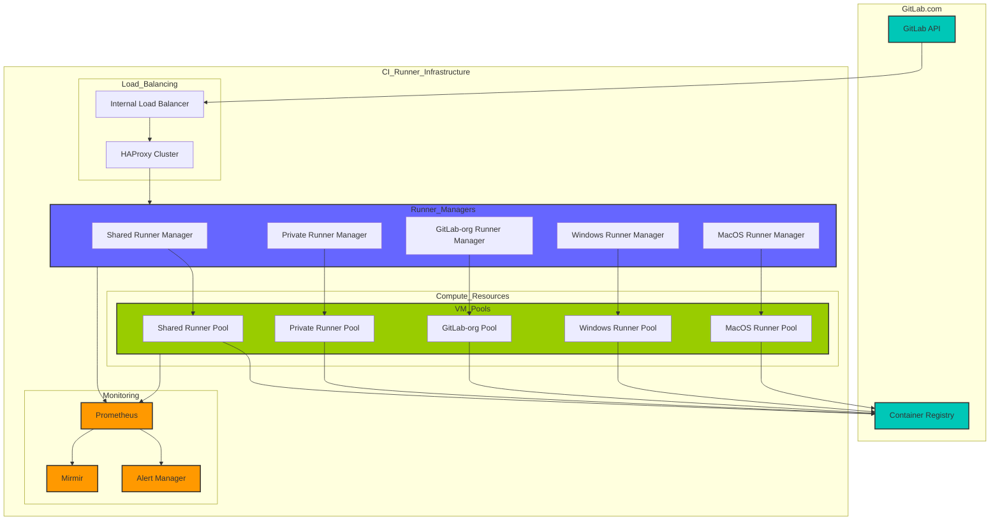

<!-- MARKER: do not edit this section directly. Edit services/service-catalog.yml then run scripts/generate-docs -->

**Table of Contents**

[[_TOC_]]

# CI Runners Service

* [Service Overview](https://dashboards.gitlab.net/d/ci-runners-main/ci-runners-overview)
* **Alerts**: <https://alerts.gitlab.net/#/alerts?filter=%7Btype%3D%22ci-runners%22%2C%20tier%3D%22sv%22%7D>
* **Label**: gitlab-com/gl-infra/production~"Service::CI Runners"

## Logging

* [shared runners](https://log.gprd.gitlab.net/goto/b9aed2474a7ffe194a10d4445a02893a)

## Troubleshooting Pointers

* [ApdexSLOViolation](../alerts/ApdexSLOViolation.md)
* [ci-apdex-violating-slo.md](ci-apdex-violating-slo.md)
* [service-ci-runners.md](service-ci-runners.md)
* [Zonal and Regional Recovery Guide](../disaster-recovery/recovery.md)
* [Rails SQL Apdex alerts](../patroni/rails-sql-apdex-slow.md)
<!-- END_MARKER -->

---

## CI Runner Overview

### What are CI Runners?

CI Runners are the backbone of GitLab's CI/CD workflows. They are specialized components responsible for executing the tasks and jobs defined in a given project's `.gitlab-ci.yml` configuration file. Runners interact with GitLab’s API to receive jobs and run them in isolated environments, ensuring clean states for every pipeline execution.

#### Key Responsibilities

1. **Job Execution**: Execute scripts, commands, and test suites provided in the CI/CD configuration.
2. **Resource Isolation**: Maintain isolated environments to ensure jobs do not interfere with each other.
3. **Environment Management**: Set up required dependencies, containers, or virtual machines dynamically.
4. **Scalability**: Scale infrastructure dynamically based on job load.
5. **Artifact Management**: Handle the storage and transfer of job artifacts between pipeline stages.
6. **Cache Management**: Manage caching mechanisms to speed up subsequent pipeline runs.
7. **Security Scanning**: Execute security scans and vulnerability checks as part of the pipeline.

#### Why CI Runners Matter

* **Reliability**: Each job runs in a clean, reproducible environment, reducing flakiness.
* **Automation**: Automates testing, deployment, and integration processes.
* **Scalability**: Accommodates thousands of jobs simultaneously through autoscaling.
* **Flexibility**: Supports different environments, platforms, and architectures (Linux, Windows, macOS).
* **Cost Efficiency**: Optimizes resource usage by spinning up environments only when needed.
* **Compliance**: Helps maintain compliance requirements through consistent, tracked execution environments.
* **Debug Capability**: Provides detailed logs and execution traces for troubleshooting.

---

### Runner Types

GitLab supports two main categories of CI Runners:

#### **Internal Runners**

These runners are used exclusively for GitLab-managed projects. They operate within dedicated infrastructure, ensuring higher performance, reliability, and security. Examples include:

* **Private shard (PRM - Private Runners Manager)**: Dedicated to internal teams and private instances.
* **gitlab-org shard (GSRM - GitLab Shared Runners Manager)**: Dedicated for projects managed under `gitlab-org` namespace.
* **macos shard**: Specialized runners for macOS jobs on staging and production environments.

#### **External Runners**

These runners are shared or self-managed by external users of GitLab.com. External runners are typically:

* **Shared runners (SRM - Shared Runners Manager)**: Provided by GitLab as a service for all public and private repositories.
* **gitlab-docker-shared-runners (GDSRM - GitLab Docker Shared Runners Manager)**: Manages the docker runners
* **windows-runners (WSRM - Windows Shared Runners Manager)**: Handles the windows runners

**Comparison of Internal vs. External Runners:**

| Feature               | Internal Runners                         | External Runners                 |
| ----------------------| ---------------------------------------- | -------------------------------- |
| **Infrastructure**    | Managed by GitLab                       | Self-hosted or GitLab-managed    |
| **Access**            | Restricted to GitLab projects           | Available to all users           |
| **Performance**       | Optimized for GitLab workflows          | Dependent on host environment    |
| **Security**          | Enhanced isolation & dedicated resources| Varies based on implementation   |

---

#### Runner Workflow

The workflow of a CI Runner involves multiple steps:

1. **Pre-job Checks**:
   * Verify runner capabilities match job requirements
   * Ensure required resources are available

2. **Job Retrieval**: Runners fetch job details from the GitLab API.

3. **Cache Restoration**:
   * Restore cached dependencies
   * Download artifacts from previous stages

4. **Environment Setup**: Prepare the required execution environment (e.g., Docker containers or VMs).

5. **Job Execution**: Run the scripts, commands, or pipelines as specified.

6. **Health Checking**:
   * Regular status reporting to GitLab
   * Monitor resource usage and job progress

7. **Job Reporting**: Send job status, logs, and artifacts back to GitLab.

8. **Cleanup**: Terminate or clean up the environment to ensure isolation.

---

### High-Level Runner Architecture



Below is a description of the runner components and their relationships:

#### Components of the Runner System

1. **Runner Managers**:
   * Purpose: Coordinate the retrieval and execution of jobs.
   * Functionality: Manage scaling, orchestration, and job lifecycle.
   * GitLab.com specifically has several types:
     * shared-runners-manager (srm)
     * gitlab-shared-runners-manager (gsrm)
     * gitlab-docker-shared-runners-manager (gdsrm)
     * private-runners-manager (prm)

2. **Load Balancers**:
   * Purpose: Distribute job load across multiple runner managers.
   * Implementation: CI runners use Internal Load Balancers (ILBs) called "ci-gateway" to reduce traffic costs and improve performance. There are ILBs in both GSTG (staging) and GPRD (production) environments and each environment has ILBs across different availability zones (us-east1-b, us-east1-c, us-east1-d). The ILBs connect to HaProxy nodes that have interfaces in both the main VPC and ci-gateway VPC and the load balancers are accessible through specific internal FQDNs like:
      * git-us-east1-c.ci-gateway.int.gprd.gitlab.net
      * git-us-east1-d.ci-gateway.int.gprd.gitlab.net
      * git-us-east1-c.ci-gateway.int.gstg.gitlab.net
      * git-us-east1-d.ci-gateway.int.gstg.gitlab.net

   The setup helps optimize costs by keeping traffic within GCP's internal network when possible, only routing to the public internet when necessary (like for artifact uploads/downloads).

3. **Compute Resources**:
   * Virtual Machines or containers provisioned dynamically for job execution.
   * Categories: Shared VM pools, private pools, macOS pools, and Windows pools.
   * Specific resource tiers (S, M, L, XL, 2XL)

4. **Monitoring Stack**:
   * Components: Prometheus, Grafana, and Mirmir.
   * Functionality: Monitor job performance, health, and resource usage.

5. **Network Components**:
   * Purpose: Handle secure communication between runners and GitLab
   * Implementation: Shared VPC architecture, Strict firewall rules and network policies
   * Security: Manage access controls and network isolation

---

### Key Takeaways for CI Runners

* **Consistency**: Jobs always run in clean, isolated environments.
* **Scalability**: Autoscaling ensures that infrastructure adapts to workload.
* **Flexibility**: Supports multiple platforms, programming languages, and containerized workflows.
* **Control**: Internal runners offer optimized performance for GitLab projects, while external runners provide user flexibility.

---

## SSH Access

Accessing the runner-manager virtual machines (VMs) is a critical step for debugging, configuration, and administrative tasks. The following instructions outline how to set up secure SSH access to these VMs hosted in the `gitlab-ci-155816` GCP project.

### Steps to Configure SSH

To SSH into any VM under the `gitlab-ci-155816` GCP project:

1. Open or create the file `~/.config/ssh/config`.
2. Add the following configuration block:

```ssh
# CI Runner Manager VMs
Host *.gitlab-ci-155816.internal
    ProxyJump lb-bastion.ci.gitlab.com
```

### External Runners

See [Hosted runners for -com](https://docs.gitlab.com/ee/ci/runners/index.html#hosted-runners-for-gitlabcom).

---

## Runner Deployments

### Blue-Green Deployment

A blue-green deployment strategy is used to enhance the reliability and speed of GitLab Runner releases. This method involves running two clusters in parallel:

* **Blue Cluster**: Handles active traffic and production jobs.
* **Green Cluster**: Hosts the next release candidate for testing and gradual rollout.

### Benefits

1. **Zero Downtime**: Ensures continuous operation during upgrades.
2. **Rollbacks**: Allows seamless traffic shift to a stable cluster in case of issues.
3. **Faster Releases**: Traffic can be moved between clusters instantly.

### Architectures Supported

1. **Linux Architecture**: Comprehensive guide for Linux-based runner environments.
2. **Mac Architecture**: Tailored for macOS-specific workloads.
3. **Windows Architecture**: Focused on Windows VM environments and job execution.

For additional details, refer to the [Blue-Green Deployment README](./release-cycle/blue_green_deployment.md).

---

## Cost Factors

### Overview

Cost factors determine the number of minutes deducted from a user's account based on the type of runner and the nature of the project (public vs. private). This helps balance resource allocation and encourages efficient usage.

### Cost Factor Table

| Runner Type                                 | Public Project Factor | Private Project Factor |
| ------------------------------------------- | --------------------- | ---------------------- |
| shared-runners-manager (srm)                | 0.0                   | 1.0                    |
| gitlab-shared-runners-manager (gsrm)        | 0.0                   | 1.0                    |
| windows-runners-manager (wsrm)              | 0.0                   | 1.0                    |
| gitlab-docker-shared-runners-manager (gsrm) | 0.0                   | 1.0                    |

### Key Insights

1. **Public Projects**: Benefit from free execution minutes with a cost factor of `0.0`.
2. **Private Projects**: Deduct minutes at a `1.0` cost factor per minute of execution.
3. **Specialized Runners**: All specialized runners have the same cost factor, simplifying billing.

---

## Monitoring

### Purpose

Monitoring ensures the health, performance, and reliability of CI Runner infrastructure. A robust monitoring stack is in place, leveraging tools like Prometheus, Thanos, and Traefik.

### Architecture

1. **Prometheus Instances**: Deployed with high availability (minimum two replicas).
2. **Thanos Sidecar**:
   * Facilitates long-term metrics storage in Google Cloud Storage (GCS).
   * Exposes gRPC endpoints for querying data.
3. **Traefik Ingress**:
   * Acts as the load balancer for gRPC services.
   * Enforces HTTPS with Let's Encrypt certificates.

### External Access

Each monitoring project uses reserved public IP addresses. These addresses are mapped to DNS records:

* **`monitoring-lb.[ENVIRONMENT].ci-runners.gitlab.net`**: Used for accessing the Traefik dashboard and Thanos Query store.
* **`prometheus.[ENVIRONMENT].ci-runners.gitlab.net`**: Directly connects to Prometheus deployments.

### Authentication

* Access is restricted via OAuth using Google as the identity provider.

* Only `@gitlab.com` accounts are allowed access.

### Example Diagram showing monitoring stack


### Terraform Integration

The monitoring stack is managed entirely via Terraform, ensuring consistency across deployments. For details, see the [CI Runners Monitoring Terraform Module](https://ops.gitlab.net/gitlab-com/gitlab-com-infrastructure/-/tree/master/modules/ci-runners/gke).

---

## Production Change Lock (PCL)

### Purpose

To minimize disruptions, GitLab enforces a **Production Change Lock** during critical periods such as holidays and summits.

### Standard PCL Events

| Dates                          | Type | Reason  |
| ------------------------------ | ---- | ------- |
| Recurring: Friday              | Soft | Friday  |
| Recurring: Weekend (Sat - Sun) | Soft | Weekend |
