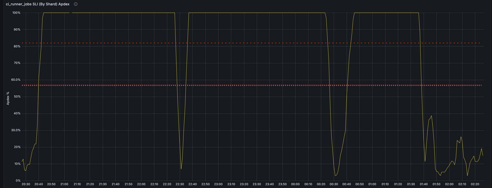
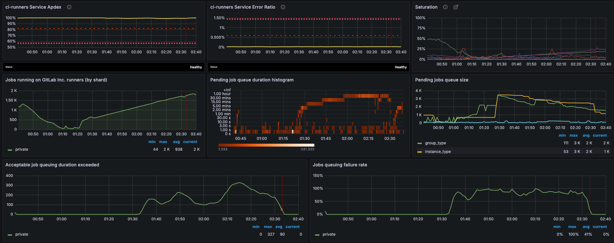
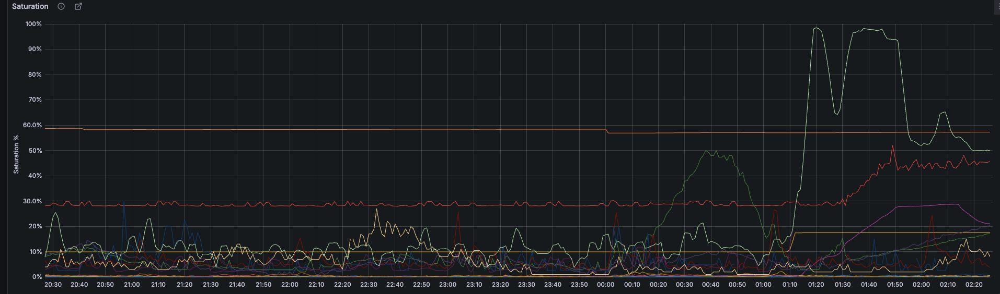
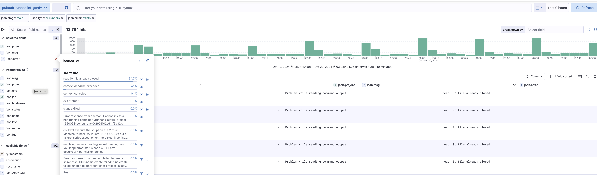
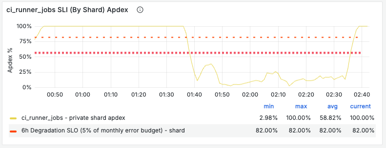

# CiRunnersServiceCiRunnerJobsApdexSLOViolationSingleShard

**Table of Contents**

[TOC]

## Overview

## CI Runner Shard Performance Degradation (Apdex Score)

This alert indicates that a specific **CI runner shard** is not meeting its **performance targets**, as measured by its **Apdex score** for job execution. The **Apdex score** evaluates the ratio of jobs that complete within a satisfactory response time versus the total job execution attempts for the given shard. A drop in this score suggests that **CI job execution performance is degrading**, impacting developer workflows and overall pipeline efficiency.

### Impact

- Delayed job execution on the affected shard
- Increased pipeline duration, leading to slower feedback loops
- Jobs stuck in a **pending** state, waiting for available runners
- Potential **timeout failures** if jobs exceed execution thresholds
- Queue buildup, increasing job wait times and impacting CI/CD throughput

### Contributing Factors

Several factors can lead to degraded CI runner performance and a lower Apdex score, including:

- **Resource saturation** on runner managers, causing job execution slowdowns
- **TLS certificate issues**, leading to authentication failures for API requests
- **Network connectivity problems**, impacting job retrieval and execution
- **Docker image pull delays**, slowing down job startup times
- **GCP quota limitations**, restricting the availability of compute resources
- **Configuration changes** affecting runner behavior or performance settings
- **Auto-scaling limitations**, preventing the timely provisioning of additional runners

This alert helps detect and diagnose such issues early, enabling corrective actions to restore normal CI job execution performance.

## Services

- [CI Runners Service Overview](https://dashboards.gitlab.net/d/ci-runners-main/ci-runners-overview)
- **Team**: [Verify:Runner](https://about.gitlab.com/handbook/engineering/development/ops/verify/runner/)

### Key Dashboards

- [CI-Runners Apdex SLI dashboard](https://dashboards.gitlab.net/goto/IelvWT5Hg?orgId=1)

 

- [CI Jobs Queueing Overview](https://dashboards.gitlab.net/goto/Z7LBWTcHg?orgId=1)



- [CI Runners Saturation Detail](https://dashboards.gitlab.net/goto/l_KSWo5Ng?orgId=1)

 

- [CI Runner Logs](https://log.gprd.gitlab.net/app/r/s/3J8Fw)



## Metrics

### Primary Alert Metrics

- [gitlab_runner_acceptable_job_queuing_duration_exceeded_total](https://gitlab.com/gitlab-com/runbooks/-/blob/master/metrics-catalog/services/ci-runners.jsonnet#L198-230)

```promql

# Job Queuing Duration

gitlab_runner_acceptable_job_queuing_duration_exceeded_total

# Shard Apdex Score

gitlab_component_shard_apdex:ratio_1h{component="ci_runner_jobs"}

# Job Queue Duration
gitlab_runner_job_queue_duration_seconds_bucket

# Machine Creation Rate
gitlab_runner_autoscaling_machine_creation_duration_seconds_count
```

### Other Metrics to check

- Machine states (creating/running/removing)
- CPU utilization per runner manager
- Network egress rates
- Docker image pull times
- Job execution states

### Normal vs Alert State Patterns

Normal state:

- Queue duration p95 < 2 minutes
- Pending jobs < 1000
- Machine creation success > 95%
- Apdex score > 0.82

Alert state:

- Queue duration p95 > 10 minutes
- Pending jobs > 3000
- Machine creation success < 80%
- Apdex score < 0.82

## Alert Behavior

This alert:

- Triggers when both 6h and 30m windows breach thresholds
- Requires minimum operation rate
- Often correlates with resource saturation
- May indicate configuration issues

Common patterns from incidents:

- Peak traffic periods
- Post-deployment issues
- Certificate rotation events
- Infrastructure scaling events
- Weekend capacity adjustments

## Severities

Default severity is `~severity::3` but should be upgraded to `~severity::2` if:

- Multiple shards affected
- Customer-facing shared runners impacted
- Queue times > 15 minutes for > 30 minutes
- Affects > 10% of total jobs

Severity 4 when:

- Single internal shard affected
- No customer impact
- Recovers within 15 minutes

## Recent Incidents

- [Private runners failing to meet apdex SLO](https://gitlab.com/gitlab-com/gl-infra/production/-/issues/18892)
- [Shared runners saturation causing apdex violation](https://gitlab.com/gitlab-com/gl-infra/production/-/issues/18738)
- [TLS certificate expiration affecting runners](https://gitlab.com/gitlab-com/gl-infra/production/-/issues/18697)

## Recent changes

- [Production Changes](https://gitlab.com/gitlab-com/gl-infra/production/-/issues/?label_name[]=Service%3A%3ACI%20Runners)
- [Runner Configuration Changes](https://ops.gitlab.net/gitlab-cookbooks/chef-repo/-/merge_requests)
- [Infrastructure Changes](https://ops.gitlab.net/gitlab-com/gl-infra/config-mgmt/-/merge_requests)

## Troubleshooting

Based on incident [#18667](https://gitlab.com/gitlab-com/gl-infra/production/-/issues/18697):

### 1. Verify Shard Status

- Check if the specific shard is affected
- Common shards that have shown issues: `private`, `shared-gitlab-org`, `tamland`
- Most issues appear in these shards due to resource constraints

### 2. Check Runner Manager Logs

```bash
# Verify runner and machine status
sudo docker-machine ls

# Check runners cert expiry
sudo cat /root/.docker/machine/certs/ca.pem | openssl x509 -noout -enddate
sudo cat /root/.docker/machine/certs/cert.pem | openssl x509 -noout -enddate
```

### 3. Machine Creation Investigation

```bash
knife ssh -C 10 'roles:gitlab-runner-base-gce' 'sudo cat /root/.docker/machine/certs/ca.pem | openssl x509 -noout -enddate' | sort -k5
```

### 4. Performance Analysis

- Check [CI runners overview dashboard](https://dashboards.gitlab.net/d/ci-runners-main/ci-runners3a-overview)
- Monitor Runner saturation metrics
- Review job queue duration trends

### 5. Recovery Verification

After changes:

- Check if the Apdex score is improving



- Monitor pending jobs queue length
- Verify jobs are being processed normally

## Dependencies

External:

- GCP Compute API
- Docker Hub Registry
- Cloud provider network

Internal:

- Gitaly service
- PostgreSQL database
- Redis
- Object storage
- Runner manager nodes

## Escalation

### When to Escalate

- Alert persists > 30 minutes
- Multiple shards affected
- Customer impact reported
- Infrastructure quotas reached

### Support Channels

- `#production` Slack channel
- `#g_hosted_runners` Slack channel
- `#g_runner` Slack channel
- `#f_hosted_runners_on_linux` Slack channel

## Definitions

- [Alert Definition](https://gitlab.com/gitlab-com/runbooks/-/blob/master/metrics-catalog/services/ci-runners.jsonnet)
- **Tuning Considerations**: Thresholds based on historical performance data and SLO requirements

## Related Links

- [CI Runner Architecture](https://handbook.gitlab.com/handbook/engineering/infrastructure/production/architecture/ci-architecture)
- [Runner Scaling Documentation](../service-ci-runners.md)
- [Apdex SLO Documentation](../../alerts/ApdexSLOViolation.md)
- [CiRunnersServicePollingErrorSLOViolation](../alerts/CiRunnersServicePollingErrorSLOViolation.md)
- [CiRunnersServiceQueuingQueriesDurationApdexSLOViolatio](../alerts/CiRunnersServiceQueuingQueriesDurationApdexSLOViolation.md)
