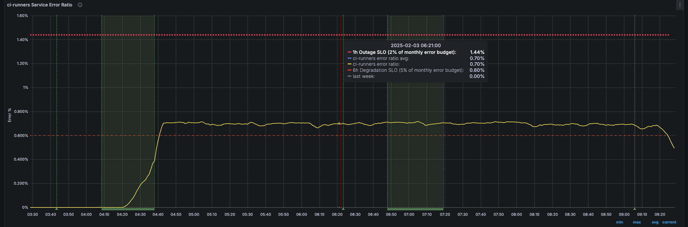
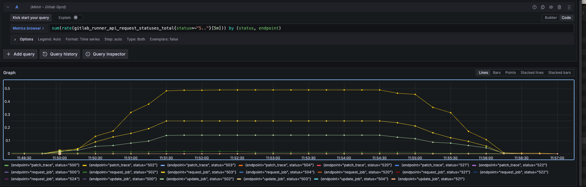
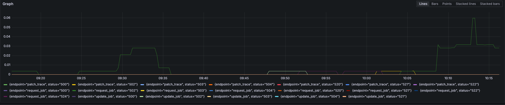
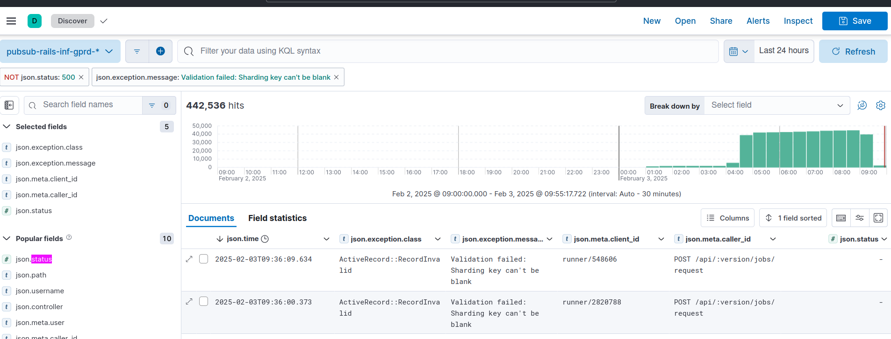
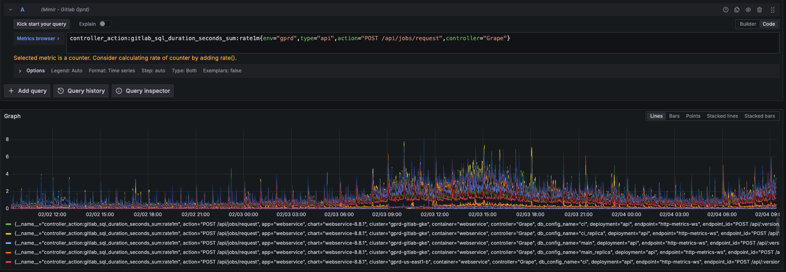
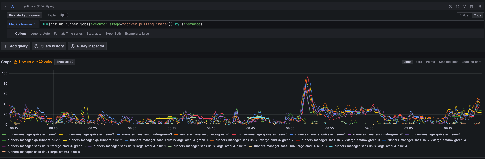

# CiRunnersServicePollingErrorSLOViolation

**Table of Contents**

[TOC]

## Overview

This alert indicates that CI Runners are experiencing elevated error rates when requesting jobs from GitLab. The runners make API requests to check for available work, and this alert fires when these requests fail at a rate exceeding our SLO.

Impact:

- Delayed job execution
- Increased pipeline duration
- Potential runner scaling issues
- Service degradation for CI/CD

Contributing factors:

- Network connectivity issues
- Database performance problems
- Runner manager resource saturation
- API endpoint availability issues
- GCP quota limitations
- Bugs introduced by recent deployment

## Services

- [CI Runners Service Overview](https://dashboards.gitlab.net/d/ci-runners-main/ci-runners-overview)
- **Team**: [Verify:Runner](https://handbook.gitlab.com/handbook/engineering/development/ops/verify/runner/)

### Key Dashboards

- [CI-Runners standard SLI dashboard](https://dashboards.gitlab.net/d/ci-runners-main/ci-runners-overview)
- [CI runners Error Ratio Dashboard](https://dashboards.gitlab.net/goto/vZZocHFNg?orgId=1)

## Metrics

### Primary Alert Metrics



```promql
# Runner request failures
sum(rate(gitlab_runner_request_failures_total{environment="gprd"}[5m])) /
sum(rate(gitlab_runner_requests_total{environment="gprd"}[5m])) * 100
```

- [Error ratio for CI Runner polling](https://dashboards.gitlab.net/goto/ZOrZCdKHR?orgId=1)

```promql
# Error ratio for CI Runner polling
sum(rate(gitlab_runner_api_request_statuses_total{status=~"5.."}[5m])) by (status, endpoint)

```

- [ci-runners Service Error Ratio](https://dashboards.gitlab.net/goto/Qb-FCdKNR?orgId=1)

```promql
# Error ratio for CI Runner polling
sum(rate(gitlab_runner_api_request_statuses_total{status=~"5.."}[5m])) by (status, endpoint)
```



- [CI runner error totals](https://dashboards.gitlab.net/goto/PuhvtNKNR?orgId=1)



### [Kibana Logs](https://log.gprd.gitlab.net/app/discover#/?_g=h@608140f&_a=h@592b988)



- [Request duration monitoring](https://dashboards.gitlab.net/goto/hnxu9dKHg?orgId=1)

```promql
# Request duration monitoring
controller_action:gitlab_sql_duration_seconds_sum:rate1m{env="gprd",type="api",action="POST /api/jobs/request",controller="Grape"}
```



### Job Processing Status

- An increase in the number of jobs in the `Pending` state, would lead to a build up of the [Pending jobs queue](https://dashboards.gitlab.net/goto/rEDAHCFHR?orgId=1).

- [Jobs in pulling stage](https://dashboards.gitlab.net/goto/UArrMkFHg?orgId=1): Check for accumalation of docker pull requests

```promql
# Jobs in pulling stage
sum(gitlab_runner_jobs{executor_stage="docker_pulling_image"}) by (instance)
```



- [Jobs in running stage](https://dashboards.gitlab.net/goto/UArrMkFHg?orgId=1)

```promql

# Jobs in running stage
sum(gitlab_runner_jobs{executor_stage="docker_run"}) by (instance)
```

- [Total jobs by stage](https://dashboards.gitlab.net/goto/W5PW7kKNR?orgId=1)

```promql

# Total jobs by stage
sum(gitlab_runner_jobs) by (executor_stage)

```

## Alert Behavior

This alert:

- Triggers on sustained polling errors
- May auto-resolve if temporary
- Often correlates with application issues
- Can indicate broader network problems

Common patterns from incidents:

- Network routing changes
- Database performance issues
- Runner manager scaling events
- API endpoint availability
- GCP quota limitations
- Recent Deployments

## Severities

Default servity is `~severity::3` if there is limited pipeline impact but should be updaraged to `~severity::2` if multiple runners managers are affected

## Recent Incidents

- [CI Runners increase in error ratios](https://gitlab.com/gitlab-com/gl-infra/production/-/issues/19222)
- [Polling SLI of the ci-runners service has an error rate violating SLO (ops)](https://gitlab.com/gitlab-com/gl-infra/production/-/issues/19231)
- [The polling SLI of the ci-runners service (main stage) has an error rate violating SLO](https://gitlab.com/gitlab-com/gl-infra/production/-/issues/19183)

## Recent changes

- [Recent CI runners Production Change/Incident Issues](https://gitlab.com/gitlab-com/gl-infra/production/-/issues/?sort=created_date&state=all&label_name%5B%5D=Service%3A%3ACI%20Runners&first_page_size=20)
- [Recent chef-repo Changes](https://gitlab.com/gitlab-com/gl-infra/chef-repo/-/merge_requests?scope=all&state=merged)
- [Recent k8s-workloads Changes](https://gitlab.com/gitlab-com/gl-infra/k8s-workloads/gitlab-com/-/merge_requests?scope=all&state=merged)

## Dependencies

- PostgreSQL database
- Runner manager VMs
- Internal load balancers
- GCP infrastructure

---

## Escalation

### When to Escalate

- Alert persists for >30 minutes.
- Multiple runner shards affected.
- Significant impact on pipeline completion times.

### Support Channels

- `#production` Slack channel
- `#g_hosted_runners` Slack channel
- `#g_runner` Slack channel
- `#f_hosted_runners_on_linux` Slack channel

---

## Definitions

- [Alert Definition](https://alerts.gitlab.net/#/alerts?filter=%7Btype%3D%22ci-runners%22%2C%20tier%3D%22sv%22%7D)
- **Tuning Considerations**: Adjust thresholds based on peak usage patterns and user feedback.

---

## Related Links

- [CI Runner Architecture Documentation](https://handbook.gitlab.com/handbook/engineering/infrastructure/production/architecture/ci-architecture)
- [Runner Abuse Prevention](../service-ci-runners.md)
- [ApdexSLOViolation Documentation](../../alerts/ApdexSLOViolation.md)
