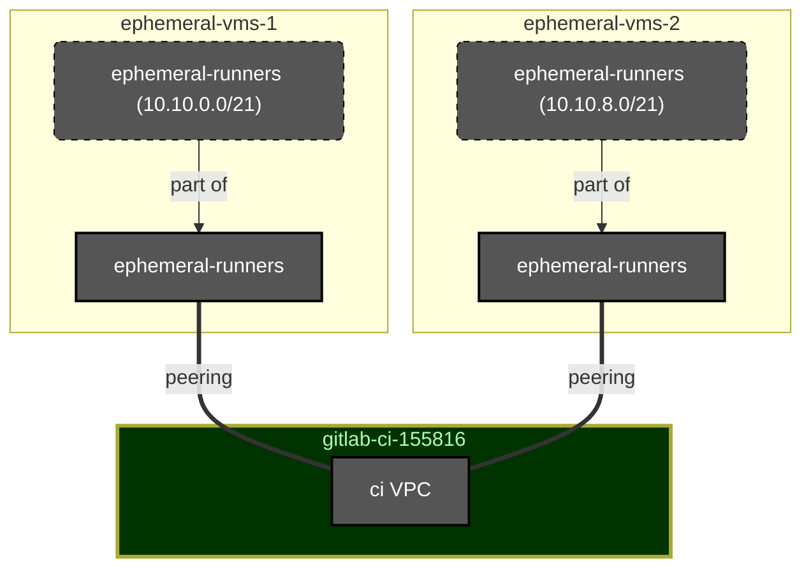
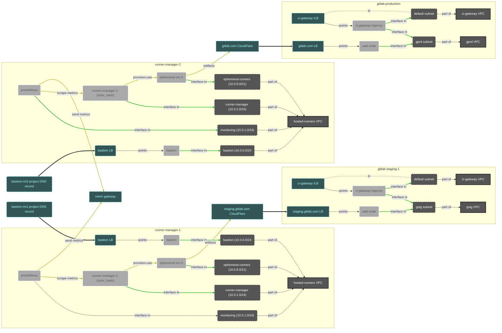

# Hosted Runners for GitLab.com - networking architecture V3

[[_TOC_]]

## Summary

The Hosted Runners for GitLab.com service (called  `ci-runners` in many
parts of this repo and metrics) is one of the key components of our
Hosted GitLab offering.

The runners service itself is a complex mechanism, utilising several
cloud (Google Cloud and AWS for now) features. This document will
focus on the networking part of that design.

Current networking architecture was designed a few years ago when we've
migrated to the currently blue/green managed runner deployments. And at
that time it was a huge improvement over what we had previously.

But since 2021, the requirements and - especially - the growth of the
service have stretched this design to its extremes, which in 2024 started
causing issues we need to address.

This document provides a new design of networking architecture for the
Hosted Runners for GitLab.com service.

But to get there, we will first review what's the current design and
use it to define the key requirements for the new one.

## Current architecture

The networking graph doesn't reflect all components. It shows only those
that are related to `ci-runners` service operations.

```mermaid
graph LR
    classDef subnetwork color:#fff,fill:#555,stroke:#000,stroke-dasharray: 5 5;
    classDef vpc        color:#fff,fill:#555,stroke:#000,stroke-width:2px;
    classDef instance   color:#555,fill:#aaa,stroke:#fff,stroke-width:2px;
    classDef lb         color:#aff,fill:#355,stroke:#aff,stroke-width:2px,stroke-dasharray: 6 3 3 3;

    classDef gitlab_ci_project color:#afa,fill:#030,stroke-width:3px;

    subgraph gitlab-production
        gprd_gprd_subnet("gprd subnet"):::subnetwork -->|part of| gprd_vpc["gprd VPC"]:::vpc
        gprd_monitoring_subnet("monitoring-gprd subnet"):::subnetwork -->|part of| gprd_vpc

        gprd_ci_gateway_subnet("default subnet"):::subnetwork -->|part of| gprd_ci_gateway_vpc["ci-gateway VPC"]:::vpc

        prometheus("prometheus server"):::instance -->|interface in| gprd_monitoring_subnet

        gprd_ci_gateway("ci-gateway haproxy"):::instance -->|interface in| gprd_gprd_subnet
        gprd_ci_gateway -->|interface in| gprd_ci_gateway_subnet

        gprd_ci_gateway_lb["ci-gateway ILB"]:::lb -->|points| gprd_ci_gateway
        gprd_ci_gateway_lb -.-|in| gprd_ci_gateway_subnet

        gprd_gitlab_lb["gitlab.com LB"]:::lb -->|points| gprd_gitlab_web("web node"):::instance
        gprd_gitlab_web -->|interface in| gprd_gprd_subnet
    end

    subgraph gitlab-staging-1
        gstg_gstg_subnet("gstg subnet"):::subnetwork -->|part of| gstg_vpc["gstg VPC"]:::vpc

        gstg_ci_gateway_subnet("default subnet"):::subnetwork -->|part of| gstg_ci_gateway_vpc["ci-gateway VPC"]:::vpc

        gstg_ci_gateway("ci-gateway haproxy"):::instance -->|interface in| gstg_gstg_subnet
        gstg_ci_gateway -->|interface in| gstg_ci_gateway_subnet

        gstg_ci_gateway_lb["ci-gateway ILB"]:::lb -->|points| gstg_ci_gateway
        gstg_ci_gateway_lb -.-|in| gstg_ci_gateway_subnet

        gstg_gitlab_lb["staging.gitlab.com LB"]:::lb -->|points| gstg_gitlab_web("web node"):::instance
        gstg_gitlab_web -->|interface in| gstg_gstg_subnet
    end

    gitlab_com["gitlab.com CloudFlare"]:::lb --> gprd_gitlab_lb
    staging_gitlab_com["staging.gitlab.com CloudFlare"]:::lb --> gstg_gitlab_lb

    subgraph gitlab-ci-155816
        gitlab_ci_runner_managers_subnet("runner-managers subnet"):::subnetwork -->|part of| ci_vpc

        runner_manager_a("runner-manager-A"):::instance -->|interface in| gitlab_ci_runner_managers_subnet
        runner_manager_b("runner-manager-B"):::instance -->|interface in| gitlab_ci_runner_managers_subnet
    end

    gitlab-ci-155816:::gitlab_ci_project

    gprd_vpc ===|peering for prometheus| ci_vpc
    ci_vpc ===|peering| gprd_ci_gateway_vpc
    ci_vpc ===|peering| gstg_ci_gateway_vpc

    prometheus -.->|metrics scraping| runner_manager_a
    prometheus -.->|metrics scraping| runner_manager_b

    runner_manager_a ==>|API calls| gprd_ci_gateway_lb
    runner_manager_b ==>|API calls| gstg_ci_gateway_lb

    subgraph runner-a-ephemeral-vms-project
        a_ephemeral_runners_subnet("ephemeral-runners subnet"):::subnetwork -->|part of| a_ephemeral_runners_vpc["ephemeral-runners VPC"]:::vpc

        a_ephemeral_vm("ephemeral-vm-X"):::instance -->|interface in| a_ephemeral_runners_subnet
    end

    subgraph runner-b-ephemeral-vms-project
        b_ephemeral_runners_subnet("ephemeral-runners subnet"):::subnetwork -->|part of| b_ephemeral_runners_vpc["ephemeral-runners VPC"]:::vpc

        b_ephemeral_vm("ephemeral-vm-X"):::instance -->|interface in| b_ephemeral_runners_subnet
    end

    a_ephemeral_runners_vpc ===|peering| ci_vpc
    a_ephemeral_runners_vpc ===|peering| gprd_ci_gateway_vpc
    b_ephemeral_runners_vpc ===|peering| ci_vpc
    b_ephemeral_runners_vpc ===|peering| gstg_ci_gateway_vpc

    runner_manager_a -.->|provision,uses| a_ephemeral_vm
    runner_manager_b -.->|provision,uses| b_ephemeral_vm

    a_ephemeral_vm -.->|git| gprd_ci_gateway_lb
    a_ephemeral_vm -.->|artifacts| gitlab_com
    b_ephemeral_vm -.->|git| gstg_ci_gateway_lb
    b_ephemeral_vm -.->|artifacts| staging_gitlab_com

    %% network interfaces
    linkStyle 3 stroke:#0a0,stroke-width:2px;
    linkStyle 4 stroke:#0a0,stroke-width:2px;
    linkStyle 5 stroke:#0a0,stroke-width:2px;
    linkStyle 9 stroke:#0a0,stroke-width:2px;
    linkStyle 12 stroke:#0a0,stroke-width:2px;
    linkStyle 13 stroke:#0a0,stroke-width:2px;
    linkStyle 17 stroke:#0a0,stroke-width:2px;
    linkStyle 21 stroke:#0a0,stroke-width:2px;
    linkStyle 22 stroke:#0a0,stroke-width:2px;
    linkStyle 31 stroke:#0a0,stroke-width:2px;
    linkStyle 33 stroke:#0a0,stroke-width:2px;

    %% VPC peerings
    linkStyle 23 stroke:#a00,stroke-width:5px;
    linkStyle 24 stroke:#a00,stroke-width:5px;
    linkStyle 25 stroke:#a00,stroke-width:5px;
    linkStyle 33 stroke:#a00,stroke-width:5px;
    linkStyle 35 stroke:#a00,stroke-width:5px;
    linkStyle 36 stroke:#a00,stroke-width:5px;
    linkStyle 37 stroke:#a00,stroke-width:5px;

    %% usage
    linkStyle 26 stroke:#aa0,stroke-width:2px,stroke-dasharray:6 1;
    linkStyle 27 stroke:#aa0,stroke-width:2px,stroke-dasharray:6 1;
    linkStyle 28 stroke:#aa0,stroke-width:2px,stroke-dasharray:6 1;
    linkStyle 29 stroke:#aa0,stroke-width:2px,stroke-dasharray:6 1;
    linkStyle 38 stroke:#aa0,stroke-width:2px,stroke-dasharray:6 1;
    linkStyle 39 stroke:#aa0,stroke-width:2px,stroke-dasharray:6 1;
    linkStyle 40 stroke:#aa0,stroke-width:2px,stroke-dasharray:6 1;
    linkStyle 41 stroke:#aa0,stroke-width:2px,stroke-dasharray:6 1;
    linkStyle 42 stroke:#aa0,stroke-width:2px,stroke-dasharray:6 1;
    linkStyle 43 stroke:#aa0,stroke-width:2px,stroke-dasharray:6 1;
```

### gitlab-ci project

`gitlab-ci-155816` Google Cloud project is the core part of the runner's
service. Historically it was the only place where we hosted both
the few runner managers we had at that time and the ephemeral VMs
autoscaled by them.

Since then, we've moved the ephemeral VMs to dedicated projects.
Currently `gitlab-ci-155816` hosts only runner managers and the small
supporting infra in form of the bastion server.

For the purpose of `ci-runners` service, we have the `ci` VPC managed
in this project. That's a networking center point for all resources
spread across different projects.

The important subnetwork here is the `runner-managers` subnet. Within
this network we create all runner managers.

On the graph we can see two example runner managers, each having an
interface in this subnet. In the reality we currently manage something
about 100 different runner manager instances.

### Ephemeral VMs projects

As noted above, we've moved ephemeral VMs managed by each runner manager
to its dedicated Google Cloud project.

This was done due to scale that we're working with. The number of jobs
we execute and the number of ephemeral VMs we need to autoscale to
goes way beyond the limits available for a single Google Cloud project.

Each ephemeral VMs project has one VPC called `ephemeral-runners`.
Within this VPC we have the `ephemeral-runners` subnet. This is the
subnet where ephemeral VMs are connected.

**Each `ephemeral-runners` VPC from each of the projects is peered
with the `ci` VPC in `gitlab-ci-155816` project!**

We create an ephemeral VMs project per the runner manager. Well, sort of.
As noted, we use blue/green strategy to manage runner deployments. We
organise our runner offerings in "shards" and within each shard we have one
or more managers. Each of the managers is created in two instances - blue
and green.

So, for example, we have a shard named `private` and within it, we have
6 runner managers. Each in two colors, where only one color runs at
a moment (excluding deployment switch times). This means we have 12 runner
manager instances for the `private` shard. But only 6 ephemeral VM projects,
where `private-blue-1` and `private-green-1` share the same ephemeral VMs
project.

As we have now about 50-60 different runner managers with ephemeral VMs
hosted in Google Cloud, it means that we have a peering group of 50-60
different VPCs peered with the `gitlab-ci-155816/ci` VPC.

### GPRD and GSTG projects

`gitlab-production` and `gitlab-staging-1` Google Cloud projects host the
GitLab stack of GitLab.com and staging.gitlab.com instances. We provide
Hosted Runners offering for both (staging.gitlab.com of course for our
internal usage only).

From GitLab Runner perspective GitLab is the core component, managing
all GitLab CI/CD workloads. Runners work as agents, connecting to
GitLab and asking for jobs as well as reporting job progress and final
status.

Jobs also need to connect to GitLab to access Git repository, download
and/or upload artifacts, work with GitLab package registries and container
image registry or call any other GitLab API from the CI/CD jobs.

Connectivity between runner managers and ephemeral VM networks to GitLab
instance they are registered for is crucial!

In both projects we can see the same pattern:

We have the `gprd` or `gstg` VPC which is where all GitLab backend
services are deployed to. From runner perspective the most important
backend service are the `web` nodes which handle API calls.

Each `web` node has an interface in the `gprd`/`gstg` subnet in the
`gprd`/`gstg` VPC. The nodes themselves are pointed by Google Load Balancers
and these are externally pointed by GitLab.com/staging.gitlab.com gateways
in CloudFlare.

In `gitlab-production` we can also notice the `monitoring-gprd` subnet
in the `gprd` VPC. This is the place where our main Prometheus server
lives. Details about this will be covered a little later in this
document.

### ci-gateway

`ci-gateway` Internal Load Balancer was introduced two years ago
as a solution to reduce cost generated by GitLab CI/CD workloads.

We can see that both `gitlab-production` and `gitlab-staging-1` projects
have a `ci-gateway` VPC with a `default` subnetwork. This was
created to add separation between GitLab backends and the rest of the
`ci-runners` stack.

For `ci-gateway` in both GitLab.com and staging.gitlab.com we have
a set of dedicated HaProxy nodes. These nodes are created **with two
interfaces - one in the `ci-gateway` VPC and one in the `gprd`/`gstg`
VPC.

This allows HaProxy to pass requests between runners and GitLab
backend services in a controlled manner.

**The `ci-gateway` VPC is peered with `gitlab-ci-155816/ci` VPC**.
With two `ci-gateway` VPCs this creates two additional VPC peerings.

This networking path is used for handling GitLab Runner -> GitLab API
requests. Some of our runner managers that use `ci-gateway` are configured
to point to a special domain name, which resolves into the Google Cloud
Internal Load Balancer. That ILB points the HaProxy nodes, their IP
addresses from the `ci-gateway` VPCs.

As runner manager network is peered with the `ci-gateway` network,
with aligning the regions and zones of runner manager instances
and the `ci-gateway` HaProxy instances we create a private
networking connection, which is entirely free of charge for the
throughput it passes.

We also peer `ci-gateway` VPCs which each `ephemeral-runenrs` VPC
from each of the ephemeral runner projects. `gitlab-production` peers
to all of our projects, while `gitlab-staging-1` peers only to those
that host runners for staging.gitlab.com.

And again, thanks to having a direct VPC peering and to aligning
regions and zones, we generate a private networking connection through
which Git and Git LFS data is being transferred. Which is also free
of charge.

As we can see on the diagram only artifacts operations are passed
directly to the CloudFlare gateways, which was a business design choice.

With 50-60 ephemeral VMs projects, at least the
`gitlab-production/ci-gateway` VPC hosts a huge peering group. Similarly
to the `gitlab-ci-155816/ci` one.

### Prometheus

As mentioned, we host our main Prometheus server in `gitlab-production`
Google Cloud project. It's deployed on a dedicated `monitoring-gprd`
subnet within the `gprd` VPC.

This Prometheus server is configured by Chef, and by using some
Chef tricks and magic, we're automatically adding scraping configuration
for all our runner managers.

But to make sure that Prometheus can access our runner managers and
that we don't expose runner manager metrics to the Public Internet,
we had to create a VPC peering from the `gitlab-production/gprd` VPC
to the `gitlab-ci-155816/ci` VPC. That's the only need for this peering!

But it brings two negative consequences:

1. We have yet another VPC peering, which counts towards quota limits
   and extends already huge peering group with a lot of instances.

1. May be considered a security problem, as we create a direct networking
   path between GPRD backends and another service, which doesn't need
   it explicitly. Of course, we have firewall rules that block all
   unauthenticated access! But existence of this peering is a big
   concern.

Our infrastructure since few years is using [Thanos](https://thanos.io/)
as a solution for long-term metrics storage and clustering mechanism.
But recently we're migrating to [Mimir](https://grafana.com/oss/mimir/),
from Grafana Labs, which serves the same purpose and has an architecture
more aligned with a highly dynamic infrastructure.

### Exceptions and special cases

The majority of `ci-runners` configuration handles our Linux runners.
Provided both for customers (like the `saas-linux-small-amd64` shard)
as well as for our internal usage purpose (like `private` which handles
jobs from few GitLab.com groups, whole staging.gitlab.com, whole
dev.gitlab.org and whole ops.gitlab.net).

But there are some exceptions.

The most noticeable one is our Hosted Runners on macOS setup. In this
case we host runner managers in exactly same way as the Linux ones.
But the ephemeral VMs projects are extracted to AWS. To make sure
that connection is secure, we have a dedicated VPN connection between
the clouds.

While this doesn't require VPC peering, we are exposing external routes
on the both sides of the VPN tunnel. Which, to some extent, causes
similar issues and limitations as VPC peering within Google Cloud.

## Known problems and limitations

### Subnet conflicts and unique CIDRs

VPC peering creates a connection between two, normally separated, networks.
That is transparent for the user, but somewhere in the networking stack
there must be a router that passes traffic from one VPC to another.

But that includes exposing known routes from one VPC to another. And this
is a source of conflicts. The theory and issues related to network peering
is described in details
[in a separated document in this repo](../../README.md#network-peering-theory-and-issues).

Summarizing the most important part here: if we have three VPCs, where two
are separated from each other but are peered to a third, "central" one, we
may end with a conflicting state, if two subnetworks will approach to use
the same addressing space.

Let's look at the graph above and the `ephemeral-runners` networks.

We have a following networking layout:

`ephemeral-runners` subnetworks have here different CIDRs. Thanks to this
the peering to `ci` VPC can be made.

But if, for any reason, we would have the same CIDRs in them? First
VPC - let's say the one from `ephemeral-vms-1` project would be peered
without problems. But when trying to peer the second one, Google Cloud
would report an error, that subnet's CIDR conflicts with a one
existing in the peering group.

And that is true for every two subnets from two VPCs peered to a
third, common VPC.

And we need to consider:

- 50-60 VPCs from the ephemeral VMs projects
- tens of different subnets within the `gitlab-production/gprd` and
  `gitlab-staging-1/gstg` networks

**And all these must have unique CIDRs!**

That is a problem even with our Google Cloud <-> AWS setup for macOS.
We don't have cloud peering there, but - as it was said - our tunneling
mechanism is exposing external routes on both sides. Which means that
if we would use an overlapping addressing in the AWS network, we would
get a routing conflict on the Google CLoud side.

This is why we have to create and need to manage a [central registry
of unique CIDRs](../../README.md#ephemeral-runners-unique-cidrs-list)
used by ephemeral VMs projects.

While this works, it's a huge maintenance burden. And that's definitely
not suitable for highly dynamic setup that we already know we will need
to manage in the near future. Creating new runner environments and removing
old ones should not require consulting with any central registry of
CIDRs.

### VPC peering quota

Google Cloud has a quota limit for how many VPCs can be added to a peering
group. And it's not big. We have requested that limit increase twice in the
past, but that was accepted only as a temporary solution until we will
redesign our networking.

Our recent limit increase request was accepted only partially, especially
because of that.

This means that we no more can't add new shards or new ephemeral VMs
projects to the existing shards. If we would like to follow the
existing design, we would need to - at least - create a new
VPC like the `gitlab-ci-155816/ci` one and start managing runner
managers there.

### Instances per peering group quota

Same as the VPC peering group size, there is a limit for how many
instances can exist within such peering group.

Our setup assumes up to 1300 autoscaled ephemeral VMs to be managed
at maximum by a single runner manager at a time. With 50-60
peered VPCs, that means tens of thousands of instances existing
in the peering group, if all shards would be fully loaded.

## Architecture design requirements

Given all problems we've encountered in the past and all experience
we've gained while managing `ci-runners` service, as well as known
plans and ideas for the future evolution of the service, the designed
networking architecture should meet following requirements.

1. Easy and unlimited horizontal scaling of existing shards.

   Adding a new runner manager to a given shard should be
   easy and - possibly - not require a chain of tasks that need
   to be executed in a specific order.

   Especially, we should not need to relay on a central registry
   of CIDRs that need to be consulted when making changes in shards.
   Using a "default" and same addressing in each ephemeral VMs
   project should work out of the box.

1. Creating new shards should be also easy and limited to just
   defining few new runner managers and their ephemeral VMs
   environments, only grouped under new shard name.

1. Given all problems that VPC peering is causing, we should not
   use it at all!

1. While VPC peering should not be used, we should find a way
   to still manage `ci-gateway` ILB as a way to reduce the
   API and Git traffic generated cost.

1. Runners should be monitored with Prometheus, despite the
   dynamic nature of the shards. This can't rely on the peering
   to the `gprd` VPC, which will simply not exist. Monitoring data,
   must be persisted even after a single runner manager or a whole
   shard is removed.

1. We should utilize GRIT for configuration of the infrastructure.
   Even if not initially, we should design it in a way that we can
   put it into GRIT. This will allow us to share the best practices
   we've learned with the rest of our users.

   That will also benefit the Hosted Runners for Dedicated and
   Cells initiatives.

1. Design should support multi-color rolling deployments as a replacement
   for the existing blue/green deployment strategy.

## Proposed architecture

_...to be continued..._

**Questions to answer before finishing draft**:

- Where is Mimir? Can/should we access it through a private network? How?
- How to access `ci-gateway`? Maybe Private Service Connect endpoints?
  - What is the pricing model for Private Service Connect traffic?
  - Must be in the same region (which is not a problem for most of our
    runners; except of ARM and GPU ones which use features not supported
    in us-east1 yet).
  - What are the limitations?
  - A dedicated subnet on the `ci-gateway` side for service attachment's NAT
  - A dedicated subnet on the runners project side for the PSC endpoint
    to use.
- ...
