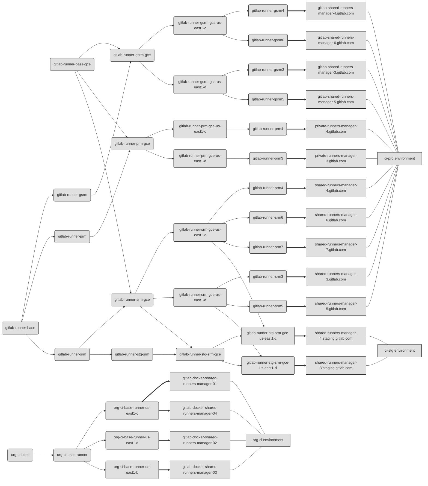

# Linux CI/CD Runners fleet configuration management

All of the Linux CI Runners fleet is currently managed through our main
[`chef-repo`](https://ops.gitlab.net/gitlab-cookbooks/chef-repo/).
All nodes are managed by a set of structured roles.

In the context of configuration management we distinguish three topics that are intersecting and need to be understood
before starting the work on any changes:

1. `graceful shutdown` - which is the procedure that allows Runner to be terminated in a way that all users jobs are
   properly finished and not interrupted in the middle.

    As this strictly projects on how our users perceives GitLab.com's Shared Runners stability **it's important to
    understand why graceful shutdown is needed, how to handle it and in which cases it's a hard requirement**.

    To read more about the graceful shutdown procedure please check [graceful-shutdown.md](graceful-shutdown.md).

1. `deployments` - which means an upgrade or downgrade of the GitLab Runner version. **Deployment always needs to be
   done with the usage of the graceful shutdown procedure!**

    To read more about the deployments management please check [deployment.md](deployment.md).

1. `configuration change` - which means any other changes in the Runner Managers configuration. Depending on the type
   of the change it may or may not require the usage of graceful shutdown procedure.

    To read more about the configuration changes management please check [configuration.md](configuration.md).

## Chef roles structure

To find out what `srm`, `gsrm`, `gdsrm` and `prm` means please check the [description](../README.md#runner-descriptions).

The roles are designed with the concept that most configuration is specified in the roles
higher in the structure. More detailed roles overwrite or add only necessary information. As can be seen
on the diagram bellow, most of the runner roles are based at the `gitlab-runner-base` role.

The only exception are GDSRM runners which are rooted in `org-ci-base` role
**and [are managed by terraform](https://ops.gitlab.net/gitlab-com/gitlab-com-infrastructure/-/tree/master/environments/org-ci)**.
Role names follow the SRM/GSRM/GDSRM/PRM naming convention of the runner managers itself.

All runner manager nodes are also added to dedicated chef environments: `ci-prd`, `ci-stg` and `org-ci`.

### Roles dependency



## Specific cookbooks

Most of the configuration is handled by two Chef cookbooks specific for GitLab Runner:

- [`cookbook-gitlab-runner`](https://gitlab.com/gitlab-cookbooks/cookbook-gitlab-runner) - this one handles most of the
  GitLab Runner configuration. It was intended to be enough generic that other people will be able to use it in their
  chef configuration to manage GitLab Runner.

    Allows to define GitLab Runner version, GitLab Runner configuration, Docker Machine version and installation source.

- [`cookbook-wrapper-gitlab-runner`](https://gitlab.com/gitlab-cookbooks/cookbook-wrapper-gitlab-runner/) - it's
  a wrapper made around the first one. Contains some stuff specific for GitLab.com infrastructure configuration, like
  support for our chef vault, specific administration management script, Runner's systemd configuration adjustment etc.

## Administrator prerequisites

To manage CI Runners fleet configuration you need to:

- have write access to <https://ops.gitlab.net/gitlab-cookbooks/chef-repo>,
- have write access to <https://ops.gitlab.net/gitlab-com/gitlab-com-infrastructure> (`gdsrmX` managers are managed by terraform)
- have write access to `chef.gitlab.com`,
- have configured `knife` environment,
- have admin access to nodes (sudo access).
- have bastion for `org-ci` runners set up:

    <details>
    <summary> Inside of your `~/.ssh/config`</summary>

    ```ini
    # gitlab-org-ci boxes
    Host *.gitlab-org-ci-0d24e2.internal
    ProxyJump     lb-bastion.org-ci.gitlab.com
    ```

    </details>
