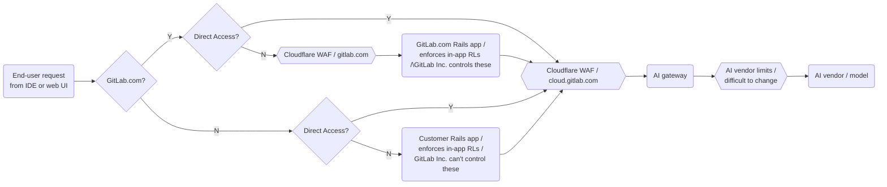

<!-- Permit linking to GitLab docs and issues -->
<!-- markdownlint-disable MD034 -->
# Cloud Connector

Cloud Connector is a way to access services common to multiple GitLab deployments, instances, and cells.
Cloud Connector is not a dedicated service itself, but rather a collection of APIs, code and configuration
that standardize the approach to authentication and authorization when integrating Cloud services with a GitLab instance.

This document contains general information on how Cloud Connector components are configured and operated by GitLab Inc.
The intended audience is GitLab engineers and SREs who have to change configuration for or triage issues with these
components.

See [Cloud Connector architecture](https://docs.gitlab.com/ee/development/cloud_connector/architecture.html) for more information.

**Table of Contents**

[TOC]

---

## Cloudflare

Any client consuming a Cloud Connector service must do so through `cloud.gitlab.com`, a public endpoint
managed by Cloudflare. A "client" here is either a GitLab instance or an end-user application such as an IDE.

Cloudflare performs the following primary tasks for us:

- Global load balancing using Cloudflare's Anycast network
- Enforcing WAF and other security rules such as rate limiting
- Routing requests into GitLab feature backends

The `cloud.gitlab.com` DNS record is fully managed by Cloudflare, i.e. Cloudflare acts as a [reverse proxy](https://www.cloudflare.com/learning/cdn/glossary/reverse-proxy).
This means any client dialing this endpoint will reach a Cloudflare server, not a GitLab backend.
See [routing](#routing) for more information on how how requests are forwarded.

Routing and rate limits are configured here:

- [staging](https://ops.gitlab.net/gitlab-com/gl-infra/config-mgmt/-/tree/main/environments/cloud-connect-stg)
- [production](https://ops.gitlab.net/gitlab-com/gl-infra/config-mgmt/-/tree/main/environments/cloud-connect-prd)

The default URL for the Cloudflare proxy is `cloud.gitlab.com`, which is used in production environments.
It can be overridden by setting the `CLOUD_CONNECTOR_BASE_URL` environment variable.
For example, we set this to [cloud.staging.gitlab.com](https://gitlab.com/gitlab-com/gl-infra/k8s-workloads/gitlab-com/-/blob/e1354607d4214b1e8b74b9a13126f42136fd712c/releases/gitlab/values/gstg.yaml.gotmpl#L472) for our multi-tenant GitLab
SaaS deployment.
This will direct any Cloud Connector traffic originating from `staging.gitlab.com` to `cloud.staging.gitlab.com`.
Self-managed customers are _not_ expected to set this variable.

### Monitoring

#### Dashboards

- [Cloudflare service dashboard (`cloud_gitlab_zone`)](https://dashboards.gitlab.net/d/cloudflare-main/cloudflare3a-overview)

#### Alerts

- [CloudflareCloudConnectorRateLimitEvents](./alerts/CloudflareCloudConnectorRateLimitEvents.md)

#### Edge logs

We don't currently store persistent logs. See https://gitlab.com/groups/gitlab-org/-/epics/14573.
Until then, you can use Cloudflare [Instant Logs](https://dash.cloudflare.com/852e9d53d0f8adbd9205389356f2303d/cloud.gitlab.com/analytics/instant-logs) to monitor traffic.

### Routing

While this is not systematically enforced, we require all clients that want to reach Cloud Connector backends
to dial `cloud.gitlab.com` instead of the backends directly. Backends that use a public load balancer such as
GCP Global App LB should use Cloud Armor security policies to reject requests not coming from Cloudflare.

Routing is based on path prefix matching. Every Cloud Connector backend (e.g. the AI gateway) must be connected as
a Cloudflare origin server with such a path prefix. For example, the AI gateway is routed via the `/ai` prefix,
so requests to `cloud.gitlab.com/ai/*` are routed to the AI gateway, with the prefix stripped off (only `*` is forwarded.)

You can see an example of this [here](https://ops.gitlab.net/gitlab-com/gl-infra/config-mgmt/-/blob/30e42e4f36bedb6d65922a4dc68125023f6c2adc/environments/cloud-connect-prd/rules.tf).

### Rate limiting

Cloudflare enforces rate limits for `cloud.gitlab.com` to guard against malicious or misbehaving customer instances and clients.
These rate limits are not to be confused with [gitlab.com Cloudflare rate limits](https://ops.gitlab.net/gitlab-com/gl-infra/config-mgmt/-/blob/7c37d9cd6340840b795bf1e44912ba4ef2cc0f2f/environments/gprd/cloudflare-rate-limits-waf-and-rules.tf)
(which guard the gitlab.com application deployment) or [application rate limits](https://docs.gitlab.com/ee/security/rate_limits.html) enforced in the Rails monolith itself.

Cloud Connector rate limits are instead enforced between either customer Rails instance (or end-user) and GitLab backend services.
The following diagram illustrates where Cloud Connector rate limits fit into the overall rate limit setup, for
the example of the AI gateway:

The rate limits enforced in Cloudflare are specified per backend and can be classified as follows.

#### Kinds of rate limits

For all deployments of GitLab (gitlab.com or SM/Dedicated):

- **Per user.** Limits applied to a given user identified by a unique global UID string.
- **Per authentication attempt.** Rate limits applied to clients that produce repeated `401 Unauthorized` server responses.
  This is to prevent credential stuffing and similar attacks that brute force authentication.

For SM/Dedicated only:

- **Per instance.** Rate limits applied to a given SM/Dedicated GitLab instance, regardless
  of which user associated with this instance sent the request. This is to put an overall cap on the amount of traffic
  any customer may send into GitLab infrastructure. The "instance = customer" definition is inaccurate,
  but a decent approximation until there is a better way to map requests to customers (e.g. via `Organization` IDs).

#### Rate limit buckets

Per-user and per-instance rate limits can be further segmented into buckets or tiers.

These buckets are:

- `Any`: Any client that cannot be clearly attributed to a paying GitLab Duo customer.
- `Small/Medium/Large`: Size buckets based on the number of GitLab Duo seats a customer
   purchased, as transmitted through the `X-Gitlab-Duo-Seat-Count` header. These rules
   will therefore only be enacted for paying Duo customers.

This allows us to broadly classify customers into tiers and grant more
lenient limits the more seats they own. For example, a small customer (identified by a small number of add-on seats),
observes stricter rate limits than a large customer.

Any other clients will be lumped together and observe a generic rate limit.

<!-- markdownlint-enable MD034 -->
