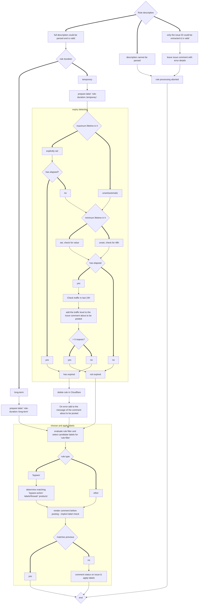

# Cloudflare Audit Log Rule Processing

The following flow chart describes the processing performed on every rule
when [Cloudflare Audit Log](https://ops.gitlab.net/gitlab-com/gl-infra/cloudflare-audit-log) runs.

