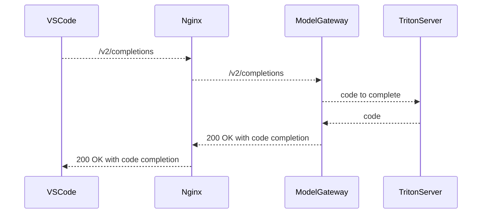

<!-- MARKER: do not edit this section directly. Edit services/service-catalog.yml then run scripts/generate-docs -->

**Table of Contents**

[[_TOC_]]

# Code_suggestions Service

* **Alerts**: <https://alerts.gitlab.net/#/alerts?filter=%7Btype%3D%22code_suggestions%22%2C%20tier%3D%22inf%22%7D>
* **Label**: gitlab-com/gl-infra/production~"Service::CodeSuggestions"

## Logging

* [mlops](https://log.gprd.gitlab.net/goto/d21f8880-f0a7-11ed-a017-0d32180b1390)
* [request rate](https://log.gprd.gitlab.net/goto/c4faac00-f612-11ed-a017-0d32180b1390)
* [request latency](https://log.gprd.gitlab.net/goto/b423c240-f612-11ed-8afc-c9851e4645c0)

<!-- END_MARKER -->

## Summary

Service responsible for providing [code completion for the user in their editor](https://youtu.be/WnxBYxN2-p4) using AI.

## Architecture

* VSCode: This the the client where the user is writing the and getting autocompletion.
* Nginx: Kubernetes Ingress to expose service to the internet.
* ModelGateway: Entry point for code suggestions and will route requests accordingly.
* ModleTriton: [Inference Server](https://github.com/triton-inference-server/server) that loads our model data from the NFS server into memory.

Mode detailed architecture description avialable in:
<https://docs.gitlab.com/ee/development/ai_architecture.html> and in
the [Architecture
overview](https://gitlab.com/gitlab-org/modelops/applied-ml/code-suggestions/ai-assist/-/blob/main/docs/architecture.md)
in the source repository.

<!-- ## Performance -->

## Scalability

We have the ability to scale horizontally both the ModelGateay and the Triton server by increasing the replica count:

1. [Model Gateway](https://gitlab.com/gitlab-org/modelops/applied-ml/code-suggestions/ai-assist/-/blob/dd0521daf221c24781d2cad02d1352d6a1ce02b2/manifests/fauxpilot/model-gateway.yaml)
1. [Triton Server](https://gitlab.com/gitlab-org/modelops/applied-ml/code-suggestions/ai-assist/-/blob/dd0521daf221c24781d2cad02d1352d6a1ce02b2/manifests/fauxpilot/model-triton.yaml)

To apply these changes:

1. Add your IP to the `Control plane authorized networks` in [ai-assist cluster](https://console.cloud.google.com/kubernetes/clusters/details/us-central1-c/ai-assist/details?project=unreview-poc-390200e5)
1. Set up gcloud auth: `gcloud container clusters get-credentials ai-assist --zone us-central1-c --project unreview-poc-390200e5`
1. kubectl apply -f $FILENAME

<!-- ## Availability -->

<!-- ## Durability -->

<!-- ## Security/Compliance -->

<!-- ## Monitoring/Alerting -->

## Links to further Documentation

* [Deploying to the kubernetes cluster](https://gitlab.com/gitlab-org/modelops/applied-ml/code-suggestions/ai-assist#deploying-to-the-kubernetes-cluster)
