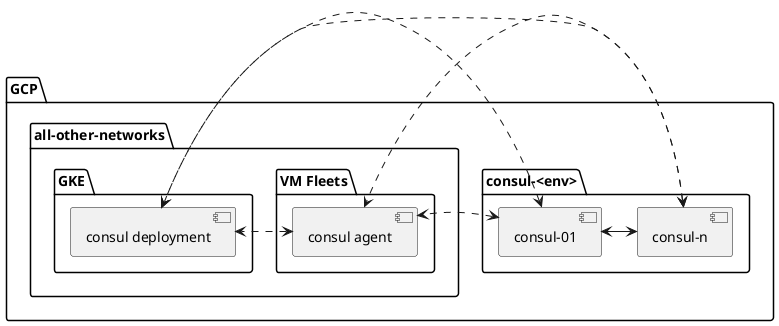

<!-- MARKER: do not edit this section directly. Edit services/service-catalog.yml then run scripts/generate-docs -->

**Table of Contents**

[[_TOC_]]

# Consul Service

* [Service Overview](https://dashboards.gitlab.net/d/a988f2tmz/consul)
* **Alerts**: <https://alerts.gitlab.net/#/alerts?filter=%7Btype%3D%22consul%22%2C%20tier%3D%22inf%22%7D>
* **Label**: gitlab-com/gl-infra/production~"Service:Consul"

## Logging

* [Consul](https://log.gprd.gitlab.net/goto/7f15b1f04a0f09fbb18fc62adefe3ed1)
* [system](https://log.gprd.gitlab.net/goto/a22fbb60e45a3f6d7860908a5427301c)

## Troubleshooting Pointers

* [Interacting with Consul](interaction.md)
* [Diagnosis with Kibana](../onboarding/kibana-diagnosis.md)
* [Recovering from CI Patroni cluster lagging too much or becoming completely broken](../patroni-ci/recovering_patroni_ci_intense_lagging_or_replication_stopped.md)
* [Geo Patroni Cluster Management](../patroni/geo-patroni-cluster.md)
* [Log analysis on PostgreSQL, Pgbouncer, Patroni and consul Runbook](../patroni/log_analysis.md)
* [Patroni Cluster Management](../patroni/patroni-management.md)
* [PostgreSQL HA](../patroni/pg-ha.md)
* [../patroni/postgresql-backups-wale-walg.md](../patroni/postgresql-backups-wale-walg.md)
* [How to provision the benchmark environment](../patroni/provisioning_bench_env.md)
* [Scale Down Patroni](../patroni/scale-down-patroni.md)
* [Scale Up Patroni](../patroni/scale-up-patroni.md)
* [Handling Unhealthy Patroni Replica](../patroni/unhealthy_patroni_node_handling.md)
* [../pgbouncer/patroni-consul-postgres-pgbouncer-interactions.md](../pgbouncer/patroni-consul-postgres-pgbouncer-interactions.md)
* [PgBouncer connection management and troubleshooting](../pgbouncer/pgbouncer-connections.md)
* [Removing a PgBouncer instance](../pgbouncer/pgbouncer-remove-instance.md)
* [../pgbouncer/service-pgbouncer.md](../pgbouncer/service-pgbouncer.md)
<!-- END_MARKER -->

## Summary

[Consul](https://www.consul.io/)

## Architecture

Consul runs as a cluster of at least 5 Virtual Machines that serve as the
stateful machines that contain the state necessary for consul.  The servers will
have one "leader" which serves as the primary server, and all others will be
noted as "followers".  Any server which is a follower can be queried for the
same data and can also be servers for which we can failover to in the case the
leader suffers some form of failure.  We utilize 5 nodes as consul uses a quorum
to ensure the data to be returned to clients is a state the consul cluster all
agree too.  This also allows for at most 2 followers to be down before our
consul cluster would be considered faulty.

Reference: [Consul Architecture Overview](https://www.consul.io/docs/architecture)

Consul clients run on nearly all servers.  These assist in helping the consul
servers with service/client discovery.  The clients also all talk to each other,
this helps distribute information about new clients, the consul servers, and
changes to infrastructure topology.

### Logical Architecture

### Physical Architecture

Consul is placed into its own network.  All firewall ports are open as necessary
such that all components that will have consul deployed will be able to
successfully talk to each other.

## Configurations

### Chef

* We use a single cookbook to control both our agents and our cluster servers:
  [gitlab_consul](https://gitlab.com/gitlab-cookbooks/gitlab_consul)
* Chef role `<env>-infra-consul` is the primary role that configures the cluster
  servers.
* All agents will have the `recipe[gitlab_consul::service]` in their `run_list`
* All agents will have a list of `services` that they participate in the role's
  `gitlab_consul.services` list
  * This provides some form of service discovery
  * Note that this is not yet well formed and not all servers properly configure
    this item.  Example, all of our `fe` servers are noted as `haproxy`, but we do
    not distinguish between which type of `fe` node a server may be.  Servers
    that partake in diffing stages, example `main` and `canary` are not
    distinguished inside of consul.
  * Only rely on consul for service discovery if it as an item for which is
    already well utilized, such as our database servers.  Expect inconsistencies
    when comparing data with chef for all other keys.
* All agents need to know how to reach the DNS endpoint.  This is done via the
  running agent and using `dnsmsq` to populate a configuration enabling the host to
  perform DNS lookups to the running agent on that node on port `8600`.  This is
  configured via the recipe [gitlab-server::dnsmasq_consul](https://gitlab.com/gitlab-cookbooks/gitlab-server/-/blob/master/recipes/dnsmasq_consul.rb)
  * All agents that need to perform a DNS lookup for services will have this
    enabled.  This consists mostly of anything running requiring access to
    postgres.

### Kubernetes

* Kubernetes deploys only the agent as a Daemon set such that it gets deployed
  onto all nodes
  * This provides any service which requires access to the service to be able to
    speak to the local node on port `8600` for any inquiry.
  * This is configured via [`k8s-workloads/gitlab-helmfiles`](https://gitlab.com/gitlab-com/gl-infra/k8s-workloads/gitlab-helmfiles/-/tree/master/releases/consul)

### Consul Servers/Agents

All VM's that have consul installed contain all configuration files in
`/etc/consul`. A general config file `consul.json` provides the necessary
configuration for the service to operate.  Anything in `conf.d` are the services
for which consul partakes in.  This includes the healthchecks which consul will
execute to tell the consul cluster if that service is healthy on that particular
node. The `ssl` directory contains secret items that are discussed later in this
document.

### Environment Specific

In general, the configurations look nearly identical between production and
staging.  Items that differ include the certificates, they keys, hostnames, and
the environment metadata.

## Performance

No testing of performance for this service has ever been performed.  This
service was pushed into place prior to recognition for the need to test this.

## Scalability

The consul cluster is currently managed manually using terraform.  Any additional
nodes need to be planned ahead of time.  Our consul clusters currently expect
there to be 5 nodes when bootstrapping begins.

Agents can come and go as they please.  On Kubernetes, this is very important as
our nodes auto-scale based on cluster demand.

## Availability

### Cluster Servers

With 5 consul servers participating as servers, we can lose upwards of 2 before
we lose the ability to have quorum.

Diagnosing service failures on the cluster servers requires observing logs and
taking action based on the failure scenario.  Regional outages may impact consul
pending how many servers have been impacted.  Example, if a single zone goes
+completely offline, between 1 and 2 servers may be negatively impacted resulting
in no harm as quorum will still be met with the remaining participants of the
cluster.  Load will become mildly higher during this period as less nodes can
respond to queries, and the servers will continue to try and reach the failed
nodes of the cluster.

#### Failure Recovery

Consul operates very quickly in the face of failure.  When a cluster is
restored, it takes just a few seconds for the quorum to be reached.

Consul has [documented a set of common error
messages](https://www.consul.io/docs/troubleshoot/common-errors).

##### Split Brain

Consul has the ability to be placed into a split brain state.  This may happen in
cases where network connectivity between two availability zones is lost and
later recovers and the election terms differ between the cluster servers.  We
currently do not have the appropriate monitoring as the version of Consul
utilized does not provide us the necessary metrics required to detect this
situation.  Suffering a split brain may provide some servers improper data which
may lead to application speaking to the wrong database servers.

This can be found by logging into each of the consul servers and listing out the
members as describe in [our Useful Commands](interaction#useful-commands).
Recovery for this situation is documented by Hashicorp: [Recovery from a split
brain](https://support.hashicorp.com/hc/en-us/articles/360058026733-Identifying-and-Recovering-from-a-Consul-Split-Brain)

A summary of the document would be to perform the following:

1. Identify which cluster is safe to utilize
   * This is subjective and therefore unable to describe in this document
1. Stop the consul service on nodes where we need to demote
1. Move/Delete the data directory (defined into the `consul.json` config file)
1. Start the consul service 1 at a time, validating each one joins the cluster
   successfully

#### Dependencies

Consul has minimal dependencies to operate:

* A healthy networking connection
* Operating DNS
* A healthy server

Memory and Disk usage of consul is very minimal.  Disk usage primarily consists
of state files that are stored in `/var/lib/consul` and for our environments,
The largest file is going to be that of the `raft.db` which will vary in size,
usually growing as we use this service more.  As of today we primarily use this
to store which servers and services are healthy.  Production appears to utilize
approximately 150MB of space.  This database uses BoltDB underneath Consul and
is subject to growth until the next compaction is run.  All of this happens in
the background of consul itself and shouldn't be a concern of our Engineers.
These are configurable via two options:

* [raft_snapshot_threshold](https://www.consul.io/docs/agent/options#_raft_snapshot_threshold)
* [raft_snapshot_interval](https://www.consul.io/docs/agent/options#_raft_snapshot_interval)

If we see excessive growth in Disk usage, we should first validate whether or not
it is in use by Consul.  If yes, we then need to observe any behavioral changes
to how we utilize Consul.  Example may be adding a new service or a set of
servers that make a lot of changes to consul.  This could signify that we may
need to expand consul if the usage is determined to be normal, or that a service
is not properly behaving and we may be putting undue load on the consul cluster.

If DNS is failing, consul may fail to properly resolve the addresses of clients
and other consul servers.  This will effectively bring down a given node and
potentially the cluster.  We currently do not provide any special DNS
configurations on the consul servers and are subject to the resolves provided by
our infrastructure.

### Consul Agents

A loss of a consul agent will prevent any service running on that node from
properly running DNS and/or participation of the consul cluster.  How this is
impacted depends on the service.

* Postgres consul agent failure == replicas will not be registered in the
  service, providing less replicas for GitLab services to talk to.  This will
  lead to higher pressure on the remaining replicas.  If the primary database
* Agent failure on nodes running GitLab Services == GitLab services will be
  unable to properly query which database server to talk to.  Due to this, the
  application will default to always opening connections to the primary.

Diagnosing agent failures requires observing logs and taking action based on the
failure scenario.

Consul agents only depend on the ability to communicate to the consul servers.
If this is disrupted for any reason, we must determine what causes said
interruption.  The agents store very little data on disk, and their memory and
CPU requirements are very low.

### Recovery Time Objective

We do not have a defined RTO for this service.  This is currently unobtainable
due to the lack of frequent testing, lack of monitoring, and use of outdated
versions of this service.

## Durability

The data held within consul is dynamic but strongly agreed too as is the design
of consul to have a [consensus](https://www.consul.io/docs/architecture/consensus) on the data it has knowledge of.

We do not perform any backup of the data stored in consul.

Should a single node have failed, we can safely bring it back into the cluster
without needing to worry about data on disk.  As soon as a consul server is
brought back into participation of the cluster, the raft database will sync
enabling that server to begin participating in the cluster in a matter of a few
seconds.

## Security/Compliance

### Secrets

Consul utilizes a secret key pair to prevent intrusion of rogue clients.  This key is
stored in GKMS: `gitlab-<env>-secrets/gitlab-consul`.  The values of these are
dropped on the servers in `/etc/consul/ssl/certs` and are populated in consul
configuration file to enable TLS verification of clients.

All Gossip Protocol traffic is encrypted.  This key is stored in our
`chef-repo`.

## Monitoring/Alerting

* [Overview Dashboard](https://dashboards.gitlab.net/d/consul-main/consul-overview?orgId=1)
* Logs can be found on [Kibana](https://log.gprd.gitlab.net) under the
  `pubsub-consul-inf-gprd*` index.
* We only appear to alert on specific services and saturation of our nodes.  We
  do not appear to have any health metrics that are specific to the consul
  service

<!-- ## Links to further Documentation -->
