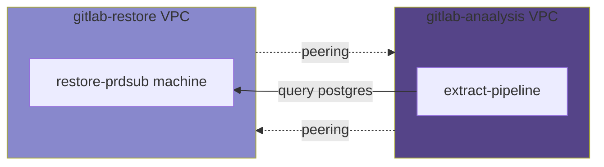

# Backups

## Verification

Backups, and verification process use
[gitlab-restore](https://ops.gitlab.net/gitlab-com/gl-infra/gitlab-restore/postgres-prdsub)
to automate everything. To read more check [walg
backups](../patroni/postgresql-backups-wale-walg.md)

## GitLab Analysis

The data team uses the backups as a [data
source](https://about.gitlab.com/handbook/business-technology/data-team/platform/#data-sources)
to extract information without affecting the production database.

1. The restore machine always needs to be available,
   and [`gitlab-restore`](https://ops.gitlab.net/gitlab-com/gl-infra/gitlab-restore/postgres-prdsub)
   recreates the machine.
1. The `restore-prdsub` should always have the same [known IP address](https://ops.gitlab.net/gitlab-com/gl-infra/gitlab-restore/postgres-prdsub/-/blob/47a53ffc176645e5c8aab432faaf51acd90e456f/restore.sh#L20).
1. The `restore-prdsub` should allow traffic for a [specific set of IP address](https://ops.gitlab.net/gitlab-com/gl-infra/gitlab-restore/postgres-prdsub/-/blob/47a53ffc176645e5c8aab432faaf51acd90e456f/bootstrap.sh#L87-92).
1. The name of the database is `CustomersDot_production`.
