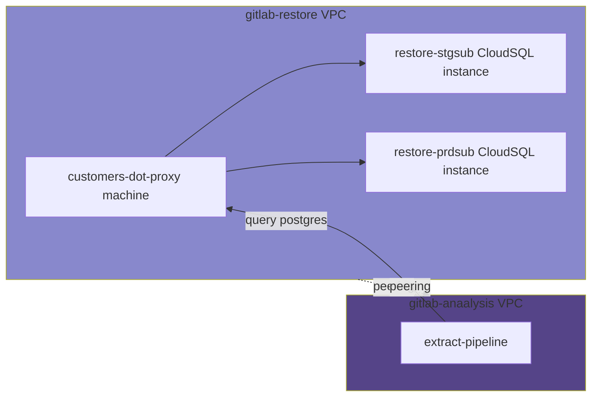

# Backups

## Verification

Backups, and verification process use
[gitlab-restore](https://ops.gitlab.net/gitlab-com/gl-infra/gitlab-restore/postgres-prdsub)
pipeline to automate everything.

The pipeline fetches the ID of the latest CloudSQL backup for the GCP project it
runs against (e.g. `gitlab-subscriptions-prod`).  A pre-provisioned CloudSQL on
`gitlab-restore` is used to restore the backup. Finally a verify job runs a set
of queries to make sure that a recent database has been restored.

## GitLab Analysis

The data team uses the backups as a [data
source](https://about.gitlab.com/handbook/business-technology/data-team/platform/#data-sources)
to extract information without affecting the production database.

Connections from peered projects into CloudSQL instances cannot be established
directly, so a proxy of sorts is needed for the `gitlab-analysis` to access the
databases. A proxy VM (named `customers-dot-proxy`) is created by the
`gitlab-restore` pipeline, on which a CloudSQL Auth Proxy process is running.
Processes from `gitlab-analysis` connect to CloudSQL Auth Proxy as if they are
connecting to a normal PostgreSQL database.

The proxy VM has a [static private
IP](https://ops.gitlab.net/gitlab-com/gl-infra/gitlab-restore/postgres-prdsub/-/blob/1253b4c541cc72c0214f8bf12358ed5b29c44203/verify.sh#L37),
and GCP firewall rules exists to allow connections from [known
subnets](https://ops.gitlab.net/gitlab-com/gl-infra/gitlab-restore/postgres-prdsub/-/blob/1253b4c541cc72c0214f8bf12358ed5b29c44203/verify.sh#L37)
on `gitlab-analysis` to the `gitlab-restore` project.

The name of the PostgreSQL databases are `CustomersDot_production` and
`CustomersDot_stg`, for production and staging, respectively.
