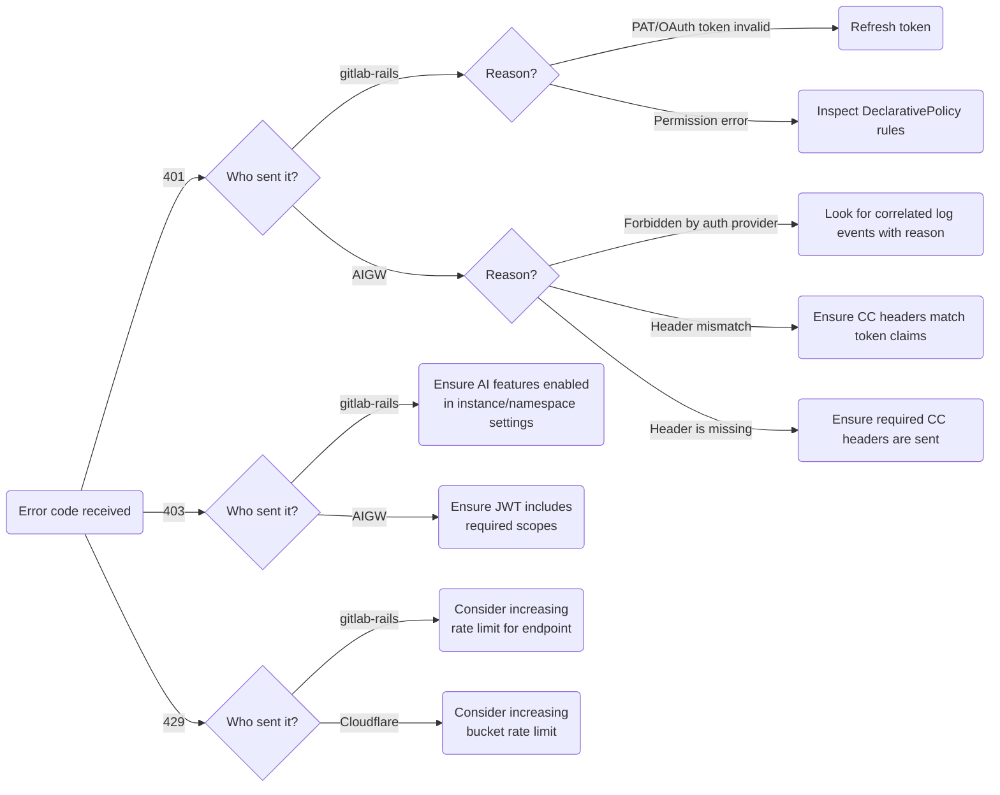

<!-- Permit linking to GitLab docs and issues -->
<!-- markdownlint-disable MD034 -->
# GitLab Duo Triage

This page contains instructions for how to resolve problems with GitLab Duo features.
The intended audience are product engineers and support engineers looking to resolve issues
with degraded AI features on both gitlab.com and customer instances.

Related runbooks:

- [Duo Chat](../duo-chat/README.md)
- [AI gateway](../ai-gateway/README.md)
- [Cloud Connector](../cloud_connector/README.md)

Related issues:

- [AI-related incidents](https://gitlab.com/gitlab-com/gl-infra/production/-/issues/18329)

---

**Table of Contents**

[TOC]

---

## Triage decision chart

Use this flow diagram to guide you through the triage process. It should help you understand where a given
problem originates from. For self-managed deployments, you can also use the [health check UI](https://docs.gitlab.com/ee/user/gitlab_duo/setup.html#run-a-health-check-for-gitlab-duo) to get a high-level sense for the general cause of the problem.

## GitLab Rails - HTTP status codes

Ownership with issues in the GitLab Rails application lies primarily with stage groups, for example:

- [#g_duo_chat](https://gitlab.enterprise.slack.com/archives/C06D5C70MD2) for chat features and slash commands
- [#g_code_creation](https://gitlab.enterprise.slack.com/archives/C048Z2DHWGP) for code suggestions

Look for a `feature_category` label in log events to attribute errors to features and stage groups.

### Symptom: 401 Unauthorized

#### Cause: PAT or OAuth token invalid

The REST or GraphQL API call failed because the caller's access token (PAT or OAuth token) was invalid.

- **Identified by:** [Log events](https://log.gprd.gitlab.net/app/r/s/Xt07D) exist for the Rails application with `status: 401`.
- **Solution:** Refresh the token. In IDEs, this can be done by reconnecting the GitLab Workflow Extension with the caller's GitLab account via OAuth or manually configuring a new PAT.

#### Cause: Permission error

The request was rejected due to lack of permissions as defined by an application policy.

- **Identified by:** [Log events](https://log.gprd.gitlab.net/app/r/s/Xt07D) exist for the Rails application with `status: 401`.
- **Solution:** Permissions are verified via [DeclarativePolicy](https://docs.gitlab.com/ee/development/policies.html) and the `Ability` type. Find where these checks are applied for the given feature and make sure all its `conditions` are met.
Reasons why this can fail include:
  - An add-on purchase for the respective feature is missing.
  - The user had no seat assigned for the respective add-on.

### Symptom: 403 Forbidden

#### Cause: Access restricted by admin

The request was rejected due to instance or namespace-level restrictions. Examples are
disabling AI features or `Direct Access` in instance or namespace settings.

- **Identified by:** [Log events](https://log.gprd.gitlab.net/app/r/s/IE6f4) exist for the Rails application with `status: 403`.
- **Solution:** [Enable AI features](https://docs.gitlab.com/ee/user/gitlab_duo/turn_on_off.html) in instance or namespace settings.

### Symptom: 429 Too Many Requests (GitLab Rails)

#### Cause: Rate limit exceeded

A [rate limit](https://docs.gitlab.com/ee/security/rate_limits.html) was enforced by the application.

- **Identified by:** [Log events](https://log.gprd.gitlab.net/app/r/s/qI2yt) exist for the Rails application with `status: 429`
  but no such events exist in [Cloudflare logs](../cloud_connector/README.md#logs).
  This implies the request was rejected before it was forwarded to Cloudflare.
  If instead it passed successfully through the GitLab application, but Cloudflare logs show it
  was rejected with 429, then it originates [from Cloudflare](#symptom-429-too-many-requests-cloudflare).
- **Solution:** Consider increasing endpoint RLs if you think requests are throttled too aggressively.
  Reach out to the respective codeowner of the endpoint that is enforcing the rate limit.

## GitLab Rails - Duo Chat error codes

See [Types of Duo Chat errors](../duo-chat/README.md#types-of-duo-chat-errors).

## Cloudflare - HTTP status codes

Ownership of Cloudflare in the context of serving AI features is with `group::cloud connector`.
Consider escalating issues to [#g_cloud_connector](https://gitlab.enterprise.slack.com/archives/CGN8BUCKC).

### Symptom: 429 Too Many Requests (Cloudflare)

#### Cause: Rate limit exceeded

A [rate limit](README.md#rate-limiting) was enforced by Cloudflare WAF rules.
This may be intentional to thwart DDoS attacks or misbehaving clients, but could be unintentionally
cutting off paying customers too.

- **Identified by:** The client receives 429s but they weren't issued by the application itself.
  This situation can be identified by the presence of correlated 429s in both [application logs](#symptom-429-too-many-requests-gitlab-rails) and [Cloudflare logs](../cloud_connector/README.md#logs).
- **Solution:** Consider increasing instance or user bucket RLs if you think requests are throttled too aggressively.
  Only do this in tandem with reviewing potential upstream limits such as AI vendor quotas and which are difficult
  to scale horizontally. Reach out to `#g_cloud_connector` for help.

## AI Gateway - HTTP status codes

Refer to the [AI gateway runbook](../ai-gateway/README.md) for general information on the service.
The owner of the AI gateway is `group::ai framework`, however, individual features may be owned
by AI stage groups instead. Consider asking for help in the following Slack channels:

- [#g_ai_framework](https://gitlab.enterprise.slack.com/archives/C051K31F30R) for AIGW specifics
- [#g_duo_chat](https://gitlab.enterprise.slack.com/archives/C06D5C70MD2) for chat features and slash commands
- [#g_code_creation](https://gitlab.enterprise.slack.com/archives/C048Z2DHWGP) for code suggestions

With AI gateway issues it can be useful to look for additional error logs for a failed request.
This can be done by filtering by the request's `correlation_id` to reveal specific errors that occurred.

### Symptom: 401 Unauthorized

This can have several reasons, summarized below.

#### Cause: JWT access token empty or malformed

The `Authorization` header did not include a JWT at all or it was not well-formed.

- **Identified by:** Response payload is `Forbidden by auth provider` and [log events](https://log.gprd.gitlab.net/app/r/s/pUA2A) exist
  with `exception_class: JWTError` and `message: Not enough segments`.
- **Solution:** Ensure a valid access token is sent in the `Authorization` header.

#### Cause: JWT access token expired

The `Authorization` header included a well-formed JWT, but its expiration date is in the past.

- **Identified by:** Response payload is `Forbidden by auth provider` and [log events](https://log.gprd.gitlab.net/app/r/s/jfMlg) exist
  with `exception_class: ExpiredSignatureError` and `message: Signature has expired`. If the request is from a self-managed/Dedicated instance, inspect token expiration dates of the [instance's CDot sync logs](https://log.gprd.gitlab.net/app/r/s/7RCOF).
- **Solution:** Self-managed instances should refresh their token by [manually synchronizing their subscription](https://docs.gitlab.com/ee/subscriptions/self_managed/index.html#synchronize-your-subscription). Should never happen on gitlab.com since we self-issue tokens for every request here.

#### Cause: JWT access token signature invalid

Either be because it was tampered with, or more likely it was signed with a key that is not known to the AI Gateway.

- **Identified by:** Response payload is `Forbidden by auth provider` and [log events](https://log.gprd.gitlab.net/app/r/s/Qt9bf) exist
  with `exception_class: JWTError` and `message: Signature verification failed.`.
- **Solution:** Send tokens signed with keys in the AI Gateway's known JSON Web Key Set. For example, a token minted by `customers.staging.gitlab.com` cannot be validated by the production AI gateway. If token issuer and token validator environments match, it is possible that the AIGW's JWKS cache is stale. Restart the AI gateway, which will invalidate the cache and force OIDC discovery.

#### Cause: Header mismatch

A Cloud Connector header field sent by the client did not match the corresponding value in the JWT access token. We often duplicate information from JWT access token claims into HTTP header fields to make them accessible to backends and intermediaries more directly i.e. without having to parse the JSON token first. However, Cloud Connector backends should always validate these header fields against token claims before trusting them. If these values do not match, the request fails to authorize.

- **Identified by:** Response payload is `Header mismatch 'X-Gitlab-*'`.
- **Solution:** Find the reason that caused these values to differ. In case of self-managed instances one reason can be state drift between the GitLab Rails
  database and CustomersDot. For example, if the `X-GitLab-Duo-Seat-Count` header does not match the `duo_seat_count` claim in the access token, it could be
  that an add-on purchase record in the GitLab application database has a different seat count than what CustomersDot determined.
  In this particular case, delete all `AddOnPurchase` records and [resynchronize your subscription](https://docs.gitlab.com/ee/subscriptions/self_managed/#manually-synchronize-subscription-data).

#### Cause: Header is missing

A mandatory Cloud Connector header field was not sent by the client.

- **Identified by:** Response payload is `Header is missing: 'X-Gitlab-*'`.
- **Solution:** Add the missing header field to the request. Refer to the [Cloud Connector development documention](https://docs.gitlab.com/ee/development/cloud_connector/) for a list of required headers.

### Symptom: 403 Forbidden

#### Cause: Insufficient permissions

The caller is accessing an endpoint with a token that lacks the permission to do so.

- **Identified by:** [Log events](https://log.gprd.gitlab.net/app/r/s/rF5as) exist with `http_exception_details: 403: Unauthorized to access <feature>`. If the request is from a self-managed/Dedicated instance, inspect token scopes of the [instance's CDot sync logs](https://log.gprd.gitlab.net/app/r/s/o1e3K).
- **Solution:** Endpoint permissions map to JWT token `scopes`, which are in turn mapped to Unit Primitives ("features"). There are several reasons why this might fail:
  - The token is outdated and its `scopes` claim is missing features that were recently acquired. This can only happen on self-managed instances that sync with CDot. Refresh the token by [resynchronizing your subscription](https://docs.gitlab.com/ee/subscriptions/self_managed/#manually-synchronize-subscription-data).
  - The token is current, but it isn't being granted the necessary `scopes` to begin with. Consult the [Cloud Connector developer docs](https://docs.gitlab.com/ee/development/cloud_connector/) to make sure the feature is mapping Unit Primitives correctly to add-ons and/or license tiers since otherwise, they won't be included in access tokens.
  For gitlab.com and self-issued tokens, make sure the right scopes are included when creating the token.
  - The endpoint uses `Direct Access`, but the token was not a UJWT i.e. not issued by the AI gateway itself.
    Ensure only UJWTs are used to access the endpoint. Refer to the [Cloud Connector developer docs](https://docs.gitlab.com/ee/development/cloud_connector/) for more information.

### Cause: AI vendor quotas exausted

All clients around the world, be it self-managed, Dedicated or gitlab.com instances and users, share a fixed
pool of AI vendor quota that replenishes after a minute. This can lead to a single user rendering AI features
unavailable to every other user.

TODO: Not clear yet how this surfaces: https://gitlab.com/gitlab-com/runbooks/-/issues/166

<!-- markdownlint-enable MD034 -->

## Self-managed customers: issue log

This section acts as a knowledge base for issues we have seen with self-managed customers that
were difficult to triage, often due to bespoke networking setups. Use this log as a reference
so that we do not repeat time intensive diagnosis on customer instances. Extend this log as you
find new classes of issues.

| Symptom | What happened | Issue links | Workaround | Solution |
| ------- | ------------- | ----------- | ---------- | -------- |
| Chat responses take a long time to complete | The customer was using a proxy server between the IDE and GitLab that stripped out the `X-Accel-Buffer: no` HTTP header, breaking streaming support. | [triage issue](https://gitlab.com/gitlab-org/gitlab/-/issues/459054), [discussion issue](https://gitlab.com/gitlab-org/gitlab/-/issues/480872) | N/A | Configure proxies to not strip out this header, provide health check that detects missing headers |
| Chat responses take a long time to complete | The customer was using a proxy server between GitLab and cloud.gitlab.com and a custom DNS setup that prevented GitLab from resolving cloud.gitlab.com, resulting in DNS timeouts | [triage issue](https://gitlab.com/gitlab-com/core-sub-department/section-core-request-for-help/-/issues/115) | Disable `DNS rebinding` in admin settings | Auto-disable `DNS rebinding` when we detect customers use proxies |
| Requests fail with "Header mismatch 'X-Gitlab-Duo-Seat-Count'" | Sidekiq was syncing with CDot using a stale License, so CDot minted a JWT with incorrect seat count | [triage issue](https://gitlab.com/gitlab-com/core-sub-department/section-core-request-for-help/-/issues/113) | Resync license | [Fix stale License.current cache in Sidekiq](https://gitlab.com/gitlab-org/gitlab/-/issues/498456) |
| Requests fail with "Header mismatch 'X-Gitlab-Instance-Id'" | We never fully understood but customer was running 2 GL instances that CDot got confused about | [triage issue](https://gitlab.com/gitlab-com/core-sub-department/section-core-request-for-help/-/issues/113) | Reactivate instance with new activation code | - |
