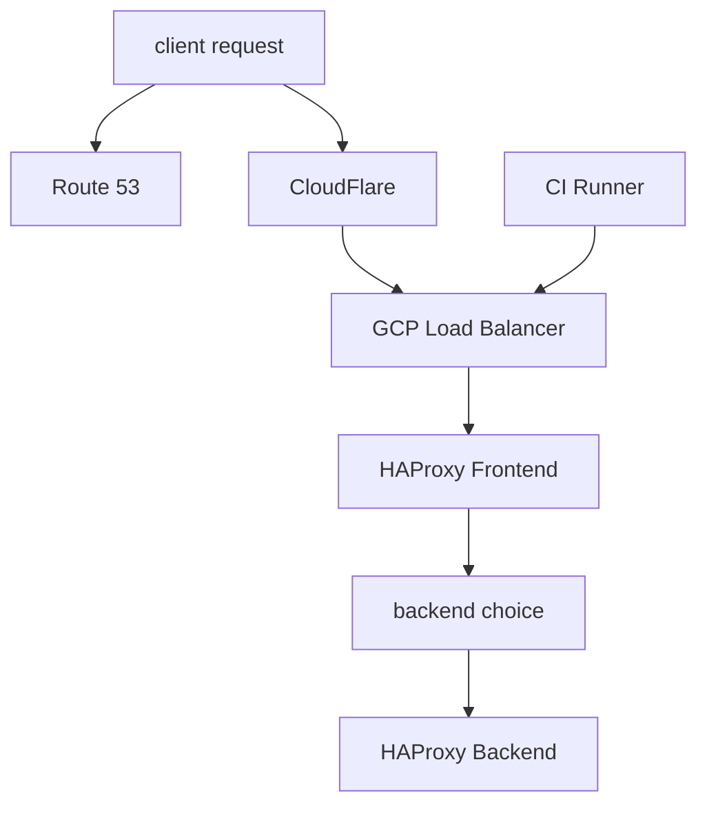
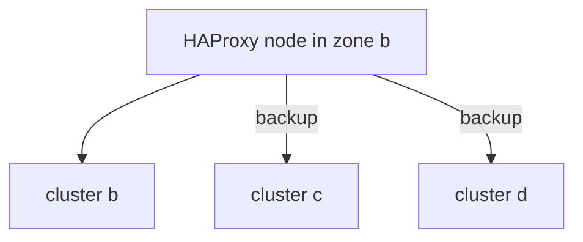

# HAProxy management at GitLab

## Overview

GitLab uses HAProxy for directing traffic to various fleets in our
infrastructure. HTTP(S) and git traffic. There are clusters of HAProxy nodes
that are attached to GCP load balancers. These are split into the following
groups:

* `<env>-base-lb-pages`: HTTP/HTTPS traffic for `*.gitlab.io`. It is also where customers point custom DNS for pages.
    * frontends: `pages_http`, `pages_https`
    * backends: `pages_http`, `pages_https`
* `<env>-base-lb-fe`: HTTP/HTTPS, SSH for gitlab.com
    * frontends: `http`, `https`, `ssh`, `api_rate_limit`, `https_git_ci_gateway`
    * backends: `429_slow_down`, `asset_proxy`, `api`, `api_rate_limit`,
      `canary_api`, `canary_https_git`, `canary_web`, `ci_gateway_catch_all`,
      `https_git`, `main_api`, `main_web`, `ssh`, `web`,`websocket`
* `<env>-base-lb-fe-ci`: HTTP/HTTPS, SSH for gitlab.com, dedicated gateway for internal CI runners
    * frontends: see above
    * backends: see above
* `<env>-base-lb-registry`: HTTP/HTTPS for registry.gitlab.com
    * frontends: `http`, `https`
    * backends: `registry`, `canary_registry`

Explanation:
* Each `<env>-base-lb-*` above represents a Chef role since we use Chef to
configure our nodes. Browse to `chef-repo/roles` directory and you will see them.
* The references after the _frontends_ and _backends_ refer to _node_ concept in
HAProxy configuration.



## Frontend and Backend configuration

* HAProxy frontends define how requests are forwarded to backends
* Backends configure a list of servers for load balancing
* The HAProxy configuration is defined in [`gitlab-haproxy` cookbook](https://gitlab.com/gitlab-cookbooks/gitlab-haproxy) and you can also find it in `/etc/haproxy/haproxy.cfg` on any of the HAProxy nodes.

### Frontends

* `http`: port 80
    *  delivers a 301 to https
* `https`: port 443
    * sends to the `429_slow_down` backend if the client is rate-limited
    * sends to the `assets_proxy` backend if the request matches `/assets/`
    * sends to the `api` rate limited backend if the request matches `/api` (skips the rate limit if your ip is on a statically configured whitelist)
    * sends to the `https_git` backend if the request matches a regex that tries to determine if it looks like a git path
    * sends to the `registry` backend if the request is registry.gitlab.com
    * sends to the `websocket` backend if it looks like a websocket request
    * sends to the `canary_api`, `canary_https_git` or `canary_web` backend if it looks like a canary request (cookie and `canary.\*`)
    * if nothing else matches requests are sent to the `web` backend.
* `ssh`: port 22
    * sends to the `ssh` backend
* `api_rate_limit`: port 4444
    * used by the `https` front-end (see above)
* `https_git_ci_gateway`: port 8989
    * receives requests from CI runners through a private network
    * sends to the `api` rate if the request matches `/api/v[0-9]/jobs/(jobs|request|trace),`
    * all other requests are sent to `ci_gateway_catch_all` backend
* `pages_http`: port 80
    * sends to the `pages_http` backend
* `pages_https`: port 443
    * sends to the `pages_https` backend

### Backends

* `asset_proxy`: proxy for `gitlab-<env>-assets.storage.googleapis.com`
* `api`, `main_api`: NGINX ingress for the `gitlab-webservice-api` Kubernetes Deployment
* `api_rate_limit`: proxy for the `api_rate_limit` frontend
* `https_git`: Service IP of the `gitlab-gitlab-git` Kubernetes Deployment
* `registry`: Service IP of the `gitlab-registry` Kubernetes Deployment
* `ssh`: Service IP of the `gitlab-gitlab-shell` Kubernetes Deployment
* `web`, `main_web`: Service IP of the `gitlab-webservice-web` Kubernetes Deployment
* `websockets`: Service IP of the `gitlab-webservice-websockets` Kubernetes Deployment
* `pages_http`: all of the `pages` Kubernetes deployments
* `pages_https`: all of the `pages` Kubernetes deployments
* `canary_api`: NGINX ingress for the `gitlab-cny-webservice-api` Kubernetes Deployment
* `canary_https_git`: Service IP of the `gitlab-cny-webservice-git` Kubernetes Deployment
* `canary_registry`: Service IP of the `gitlab-cny-registry` Kubernetes Deployment
* `canary_web`: Service IP of the `gitlab-cny-webservice-web` Kubernetes Deployment
* `ci_gateway_catch_all`: redirect all requests to `https://gitlab.com`
* `429_slow_down`: deny rate-limited requests with HTTP 429

### Kubernetes Backends

For services which reside in Kubernetes, we have one backend that sends all
traffic going to each cluster.  For the purposes of cost savings, backends that
reside in the same zone are active, while backends that are in differing zones
are marked as `backup` in the `server` configuration line.  Doing so enables us
to still send traffic to a differing zone should we suffer a zonal failure.  We
obtain some cost savings with this as traffic is mostly kept inside of a single
zone. Example:



Some services send traffic to an NGINX Ingress endpoint, while others use the
Service IP provided by the Kubernetes Deployment for that service. Go to the
associated documentation for a given service to determine how this is
configured.

## Load balancing

Currently the HAProxy backend configuration is such that every pool of servers is round-robin with the exception of `asset_proxy`, `ssh` and `pages`.
There is an open issue to discuss using sticky sessions for the web backend, see https://gitlab.com/gitlab-com/gl-infra/reliability/-/issues/5253.

## Server Weights

By default all servers attached to the backends have the same weight of `100`
with the exception of the canary servers which are also in the non-canary
backends with a weight of zero. It is possible to direct all traffic to canary
but the normal way we send traffic is through a static list of request paths for
internal projects. For more information see the
[canary release documentation](https://gitlab.com/gitlab-org/release/docs/blob/master/general/deploy/canary.md)

## Draining

The HAProxy nodes need to be drained of traffic before restarts of the node or HAProxy binary can be applied.

In order to simplify this, the HAProxy deployment includes a drain and wait script. By default, it waits 10 minutes. It works by blocking the health checks from the upstream GCP load balancer. Note, that not all HTTP connections will be drained in 10 minutes. The HTTP clients can, and do, keep long-lived sessions open. So a small number of users will get disconnected when doing a drain. But it will cleanly clear out the majority of traffic.

This script is automatically called as part of the systemd unit start and stop process. This allows for easy draining and restarting of HAProxy.

For example:

```console
$ sudo systemctl stop haproxy
```

NOTE: This stop command will wait 10 minutes before it completes.

To drain the node with a custom time, or drain without stopping haproxy:

```console # Drain, but wait 1 minute
$ sudo /usr/local/sbin/drain_haproxy.sh -w 60
```

Un-draining is executed as part of the HAProxy systemd unit start process. It can also be done manually by calling the drain script again in un-drain mode.

```console
$ sudo /usr/local/sbin/drain_haproxy.sh -u
```

## Tooling

* There are helper scripts in [chef-repo](https://ops.gitlab.net/gitlab-com/gl-infra/chef-repo) to assist setting server statuses. In general, it is advised to always drain active connections from a server before rebooting.
* For controlling traffic to canary there are ChatOps commands, for more information see the [Canary ChatOps documentation](https://gitlab.com/gitlab-org/release/docs/blob/master/general/deploy/canary.md#canary-chatops)

The following helper script can be used for setting the state of any server in
the backend:

### get-server-state

```
chef-repo % ./bin/get-server-state gstg
Fetching server state...
      3 fe #:
      3 fe 429_slow_down/BACKEND: UP
      3 fe api/api-gke-us-east1-b-8181: UP
      3 fe api/api-gke-us-east1-c-8181: UP
      3 fe api/api-gke-us-east1-d-8181: UP
      3 fe api/BACKEND: UP
      3 fe api/gke-cny-api-8181: UP
      3 fe api_rate_limit/BACKEND: UP
      3 fe api_rate_limit/FRONTEND:
      3 fe api_rate_limit/localhost:
      3 fe asset_proxy/asset-bucket: UP
      3 fe asset_proxy/BACKEND: UP
      3 fe canary_api/BACKEND: UP
      3 fe canary_api/gke-cny-api-8181: UP
      3 fe canary_https_git/BACKEND: UP
      3 fe canary_https_git/gke-cny-git-https: UP
      3 fe canary_web/BACKEND: UP
      3 fe canary_web/gke-cny-web: UP
      3 fe check_http/FRONTEND:
      3 fe check_https/FRONTEND:
      3 fe check_ssh/FRONTEND:
      3 fe http/FRONTEND:
      3 fe https/FRONTEND:
      3 fe https_git/BACKEND: UP
      3 fe https_git/git-https-gke-us-east1-b: UP
      3 fe https_git/git-https-gke-us-east1-c: UP
      3 fe https_git/git-https-gke-us-east1-d: UP
      3 fe https_git/gke-cny-git-https: UP
      2 fe-pages #:
      2 fe-pages check_http/FRONTEND:
      2 fe-pages check_https/FRONTEND:
      2 fe-pages pages_http/BACKEND: UP
      2 fe-pages pages_http/FRONTEND:
      2 fe-pages pages_http/gke-cny-pages: UP
      2 fe-pages pages_http/pages-us-east1-b: UP
      2 fe-pages pages_http/pages-us-east1-c: UP
      2 fe-pages pages_http/pages-us-east1-d: UP
      2 fe-pages pages_https/BACKEND: UP
      2 fe-pages pages_https/FRONTEND:
      2 fe-pages pages_https/gke-cny-pages-proxyv2: UP
      2 fe-pages pages_https/pages-us-east1-b-proxyv2: UP
      2 fe-pages pages_https/pages-us-east1-c-proxyv2: UP
      2 fe-pages pages_https/pages-us-east1-d-proxyv2: UP
      2 fe-pages pxname/svname:
      2 fe-pages stats/BACKEND: UP
      2 fe-pages stats/FRONTEND:
      3 fe pxname/svname:
      2 fe-registry #:
      2 fe-registry canary_registry/BACKEND: UP
      2 fe-registry check_http/FRONTEND:
      2 fe-registry check_https/FRONTEND:
      2 fe-registry http/FRONTEND:
      2 fe-registry https/FRONTEND:
      2 fe-registry pxname/svname:
      2 fe-registry registry/BACKEND: UP
      2 fe-registry registry/registry-us-east1-b: UP
      2 fe-registry registry/registry-us-east1-c: UP
      2 fe-registry registry/registry-us-east1-d: UP
      2 fe-registry stats/BACKEND: UP
      2 fe-registry stats/FRONTEND:
      3 fe ssh/BACKEND: UP
      3 fe ssh/FRONTEND:
      3 fe ssh/gke-cny-ssh: UP
      3 fe ssh/shell-gke-us-east1-b: UP
      3 fe ssh/shell-gke-us-east1-c: UP
      3 fe ssh/shell-gke-us-east1-d: UP
      3 fe ssh/sock-1:
      3 fe stats/BACKEND: UP
      3 fe stats/FRONTEND:
      3 fe web/BACKEND: UP
      3 fe web/gke-cny-web: UP
      3 fe websockets/BACKEND: UP
      3 fe websockets/gke-cny-ws: UP
      3 fe websockets/ws-gke-us-east1-b: UP
      3 fe websockets/ws-gke-us-east1-c: UP
      3 fe websockets/ws-gke-us-east1-d: UP
      3 fe web/web-gke-us-east1-b-8181: UP
      3 fe web/web-gke-us-east1-c-8181: UP
      3 fe web/web-gke-us-east1-d-8181: UP
```

* The first number refers to the number of load balancers reporting the server status
* The second field is the backend/server-name
* The last field is the current status which may be {UP,MAINT,DRAIN}
  * This field may be blank if the backend is down or has no status as seen in
    the above example.

## set-server-state

The `set-server-state` script allows you change the server state so that it can
start draining connections or not take any if there is a situation where you do
not want _any_ traffic going to a server.

Note, this will trigger the [`HAProxyServerDown`](#server-down) alert. Before you drain a node, add [a new silence](https://alerts.gitlab.net/#/silences/new).

**Important**: Be sure to alert release managers on Slack when changing the state of VMs or Clusters in HAProxy by mentioning `@release-managers`.

Example Matchers:

* Name: `alertname`, Value: `HAProxyServerDown`
* Name: `server`, Value: `git-01-sv-gstg`

Be sure to put a link to an issue in the alert silence comment.

```
Sets server state on frontend lbs
./bin/set-server-state {gprd,gstg} <ready|drain|maint> [filter]

Examples:
   ./bin/set-server-state gstg drain git-10  # set git-10 to drain
   ./bin/set-server-state gstg ready git-10  # set git-10 to ready
```

Here is a full example of setting server git-01 in gstg to the `DRAIN` state:

```
$ ./bin/set-server-state gstg drain git-01
Fetching server state...
   2 altssh/git-01-sv-gstg : UP
   3 https_git/git-01-sv-gstg : UP
   3 ssh/git-01-sv-gstg : UP
   3 websockets/git-01-sv-gstg : UP
^^^^^ The states of the above servers will be changed to drain.
Press enter to continue.
Setting server state...
   2 updated altssh/git-01-sv-gstg
   3 updated https_git/git-01-sv-gstg
   3 updated ssh/git-01-sv-gstg
   3 updated websockets/git-01-sv-gstg
Fetching server state...
   2 altssh/git-01-sv-gstg : DRAIN
   3 https_git/git-01-sv-gstg : DRAIN
   3 ssh/git-01-sv-gstg : DRAIN
   3 websockets/git-01-sv-gstg : DRAIN
```

### Admin console for HAProxy (single node)

HAProxy has a built-in web admin console; this is not terribly useful for managing a fleet of HAProxy nodes, but if just one is misbehaving then it might be handy. To access it, ssh port forward to port 7331, e.g.:

```
ssh -L 7331:localhost:7331 fe-01-lb-gstg.c.gitlab-staging-1.internal
```

Then access http://localhost:7331/ in  your browser.

The username is `admin`, the password is most easily obtained from `haproxy.cfg` on the server itself (look for `stats auth` section), but can also be obtained by looking for the `admin_password` value in GKME vault, e.g.:

```
gkms-vault-show frontend-loadbalancer gstg
```

## Removing HAProxy VMs from GCP Load Balancers

It is possible to temporarily remove HAProxy machines from the GCP Load Balancers individually (they are not added as an instance group). Be careful! This operation has user facing impact, such as terminating sessions, and can cause higher load on the remaining HAProxy nodes!

The load balancer backend service is defined in the corresponding tf module (at the moment of writing that's `generic-sv-with-group`) so doing it with the use of Terraform is non-trivial.

It can be done using the GCP console: *Load Balancing -> click on the relevant lb -> Edit -> Backend configuration -> remove the HAProxy machine from the "Select existing instances" list -> Click update*.

## `hatop`

[hatop](http://feurix.org/projects/hatop/readme/) is an ncurses-based command-line GUI for inspecting the status of HAProxy.

It can be run on any HAProxy (`*-lb-*`) host via:

```
sudo hatop -s /run/haproxy/admin.sock
```

# HAProxy Alert Troubleshooting

## Reason

* Errors are being reported by HAProxy, this could be a spike in 5xx errors,
  server connection errors, or backends reporting unhealthy.

## Prechecks

* Examine the health of all backends and the HAProxy dashboard
    * HAProxy - https://dashboards.gitlab.net/d/ZOOh_aNik/haproxy
    * HAProxy Backend Status - https://dashboards.gitlab.net/d/frontend-main/frontend-overview?orgId=1
* Is the alert specific to canary servers or the canary backend? Check canaries
  to ensure they are reporting OK. If this is the cause you should immediately change the weight of canary traffic.
    * Canary dashboard - https://dashboards.gitlab.net/d/llfd4b2ik/canary
    * To disable canary traffic see the [Canary ChatOps documentation](https://gitlab.com/gitlab-org/release/docs/blob/master/general/deploy/canary.md#canary-chatops)

## Resolution

* If there is a single backend server alerting, check to see if the node is healthy on
  the host status dashboard. It is possible in some cases, most notably the git
  server where it is possible to reject connections even though the server is
  reporting healthy. Check the health of the deployment in Kubernetes:
  ```
  kubectl --namespace gitlab get deployment gitlab-gitlab-shell
  kubectl --namespace gitlab get pods --selector app=gitlab-shell
  ```
* HAProxy logs are not currently being sent to ELK because of capacity issues.
  More information can be read [here](./haproxy-logging.md).
* If the errors are from pages backends, consider possible intentional abuse or accidental DoS from specific IPs or for specific domains in Pages
  * Client IPs can be identified by volume from the current HAProxy logs on the Haproxy nodes with:
    ```
    sudo grep -v check_http /var/log/haproxy.log | awk '{print $6}' | cut -d: -f1|sort|uniq -c |sort -n|tail
    ```
    Identifying problematic levels is not set in stone; hopefully if there is one or two (or a subnet), they will stand out.  Consider removing the 'tail' or making it 'tail -100' etc, to get more context.
    * To block: In https://gitlab.com/gitlab-com/security-tools/front-end-security/ edit `deny-403-ips.lst`.  commit, push, MR, ensure it has pull mirrored to `ops.gitlab.net`, then run chef on the pages HAProxy nodes to deploy. This will block that IP across *all* frontend (pages, web, api etc), so be sure you want to do this.
  * Problem sites/projects/domains can be identified with the `Gitlab-Pages activity` dashboard on Kibana - https://log.gprd.gitlab.net/app/kibana#/dashboard/AW6GlNKPqthdGjPJ2HqH
    * To block: In https://gitlab.com/gitlab-com/security-tools/front-end-security/ edit `deny-403-ips.lst`.  commit, push, MR, ensure it has pull mirrored to `ops.gitlab.net`, then run chef on the pages HAProxy nodes to deploy. This will block only the named domain (exact match) in pages, preventing the request ever making it to the pages deployments. This is very low-risk.

## Extraneous processes

HAProxy forks on reload and old processes will continue to service requests, for
long-lived SSH connections we use the `hard-stop` [configuration parameter](https://ops.gitlab.net/gitlab-com/gl-infra/chef-repo/-/blob/6156b09464c18bc5b584f5bf5e363fd50ded4af7/roles/gprd-base-lb-fe.json#L6-10)
to prevent processes from lingering more than 5 minutes.

In https://gitlab.com/gitlab-com/gl-infra/delivery/issues/588 we have observed that processes remain for longer than this interval, this may require manual intervention:

* Display the process tree for HAProxy, for example here it shows two processes where we expect one:

```
# pstree -pals $(pgrep -u root -f /usr/sbin/haproxy)
systemd,1 --system --deserialize 36
  └─haproxy,28214 -Ws -f /etc/haproxy/haproxy.cfg -p /run/haproxy.pid -sf 1827
      ├─haproxy,1827 -Ws -f /etc/haproxy/haproxy.cfg -p /run/haproxy.pid -sf 1639
      └─haproxy,2002 -Ws -f /etc/haproxy/haproxy.cfg -p /run/haproxy.pid -sf
```

* Show the elapsed time of the haproxy processes:

```
# for p in $(pgrep -u haproxy -f haproxy); do ps -o user,pid,etimes,command $p; done
USER       PID ELAPSED COMMAND
haproxy   1827   99999 /usr/sbin/haproxy -Ws -f /etc/haproxy/haproxy.cfg -p /run/haproxy.pid -sf 1639
USER       PID ELAPSED COMMAND
haproxy   2002      20 /usr/sbin/haproxy -Ws -f /etc/haproxy/haproxy.cfg -p /run/haproxy.pid -sf 1827

```

* Kill the process with the longer elapsed time:

```
# kill -TERM 1827
```

# Server Down

HAProxy will mark a server for a backend down if it is unreachable or has a failing health check.

It will also be marked down if the node has been drained with [`set-server-state`](#set-server-state).

* From a HAProxy node, you can ping and/or curl the backend server and health check.
* From the server, check the logs of the process.

For Rails/Puma, database connection problems can cause HUP to fail and Puma will need a full restart with `gitlab-ctl restart puma`.
