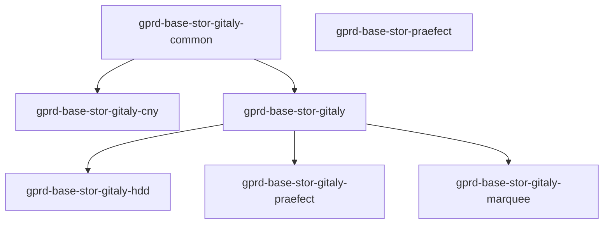
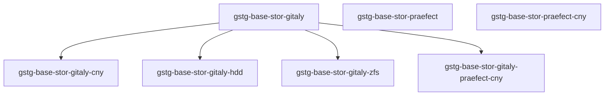

<!-- MARKER: do not edit this section directly. Edit services/service-catalog.yml then run scripts/generate-docs -->

**Table of Contents**

[[_TOC_]]

# Gitaly Service

* [Service Overview](https://dashboards.gitlab.net/d/gitaly-main/gitaly-overview)
* **Alerts**: <https://alerts.gitlab.net/#/alerts?filter=%7Btype%3D%22gitaly%22%2C%20tier%3D%22stor%22%7D>
* **Label**: gitlab-com/gl-infra/production~"Service::Gitaly"

## Logging

* [Gitaly](https://log.gprd.gitlab.net/goto/4f0bd7f08b264e7de970bb0cc9530f9d)
* [gitlab-shell](https://log.gprd.gitlab.net/goto/ba97a9597863f0df1c3b894b44eb1db6)
* [system](https://log.gprd.gitlab.net/goto/7cfb513706cffc0789ad0842674e108a)

## Troubleshooting Pointers

* [Cloudflare: Managing Traffic](../cloudflare/managing-traffic.md)
* [Google Cloud Snapshots](../disaster-recovery/gcp-snapshots.md)
* [Elastic Nodes Disk Space Saturation](../elastic/disk_space_saturation.md)
* [../elastic/elasticsearch-integration-in-gitlab.md](../elastic/elasticsearch-integration-in-gitlab.md)
* [Deploying a change to gitlab.rb](../git/deploy-gitlab-rb-change.md)
* [Workhorse Session Alerts](../git/workhorse-git-session-alerts.md)
* [Find a project from its hashed storage path](find-project-from-hashed-storage.md)
* [Copying or moving a Git repository by hand](git-copy-by-hand.md)
* [git-high-cpu-and-memory-usage.md](git-high-cpu-and-memory-usage.md)
* [Debugging gitaly with gitaly-debug](gitaly-debugging-tool.md)
* [Gitaly is down](gitaly-down.md)
* [Gitaly error rate is too high](gitaly-error-rate.md)
* [Gitaly latency is too high](gitaly-latency.md)
* [Upgrading the OS of Gitaly VMs](gitaly-os-upgrade.md)
* [Gitaly profiling](gitaly-profiling.md)
* [Gitaly Queuing](gitaly-rate-limiting.md)
* [Gitaly repository cgroups](gitaly-repos-cgroup.md)
* [Restoring gitaly data corruption on a project after an unclean shutdown](gitaly-repository-corruption.md)
* [Gitaly Repository Export](gitaly-repositry-export.md)
* [Gitaly token rotation](gitaly-token-rotation.md)
* [Gitaly unusual activity alert](gitaly-unusual-activity.md)
* [Gracefully restart gitaly-ruby](gracefully-restart-gitaly-ruby.md)
* [Moving repositories from one Gitaly node to another](move-repositories.md)
* [GitLab Storage Re-balancing](storage-rebalancing.md)
* [Git Storage Servers](storage-servers.md)
* [Managing GitLab Storage Shards (Gitaly)](storage-sharding.md)
* [Kubernetes-Agent Disable Integrations](../kas/kubernetes-agent-disable-integrations.md)
* [Service-Level Monitoring](../metrics-catalog/service-level-monitoring.md)
* [Tuning and Modifying Alerts](../monitoring/alert_tuning.md)
* [../monitoring/apdex-alerts-guide.md](../monitoring/apdex-alerts-guide.md)
* [Service Apdex](../monitoring/definition-service-apdex.md)
* [An impatient SRE's guide to deleting alerts](../monitoring/deleting-alerts.md)
* [Session: Application architecture](../onboarding/architecture.md)
* [Gitlab.com on Kubernetes](../onboarding/gitlab.com_on_k8s.md)
* [Diagnosis with Kibana](../onboarding/kibana-diagnosis.md)
* [Bypass Praefect](../praefect/praefect-bypass.md)
* [Praefect error rate is too high](../praefect/praefect-error-rate.md)
* [Add and remove file storages to praefect](../praefect/praefect-file-storages.md)
* [A survival guide for SREs to working with Redis at GitLab](../redis/redis-survival-guide-for-sres.md)
* [Life of a Git Request](../tutorials/overview_life_of_a_git_request.md)
* [Life of a Web Request](../tutorials/overview_life_of_a_web_request.md)
* [Deleted Project Restoration](../uncategorized/deleted-project-restore.md)
* [../uncategorized/namespace-restore.md](../uncategorized/namespace-restore.md)
* [Pingdom](../uncategorized/pingdom.md)
* [Project exports](../uncategorized/project-export.md)
* [Ruby profiling](../uncategorized/ruby-profiling.md)
* [How to upload a file to Google Cloud Storage from any system without a credentials configuration](../uncategorized/upload-file-to-gcs-using-signed-url.md)
* [Gitaly version mismatch](../version/gitaly-version-mismatch.md)
<!-- END_MARKER -->

<!-- ## Summary -->

## Architecture

### Chef

#### `gprd`

* `gprd-base-stor-gitaly-common`: The base configuration which is common for all Gitaly shards and stages.
* `gprd-base-stor-gitaly-cny`: Any extra configuration we might want to add for Gitaly `shard=default, stage=cny`.
* `gprd-base-stor-gitaly`: Any extra configuration we might want to add for Gitaly `shard=default, stage=main`.
* `gprd-base-stor-gitaly-hdd`: Any extra configuration we might want to add for Gitaly `shard=hdd, stage=main`.
* `gprd-base-stor-gitaly-marquee`: Any extra configuration we might want to add for Gitaly `shard=marquee, stage=main`.
* `gprd-base-stor-gitaly-praefect`: Any extra configuration we might want to add for Gitaly `shard=praefect, stage=main`.
* `gprd-base-stor-praefect`: Configuration for the praefect servers.

#### `gstg`

* `gstg-base-stor-gitaly`: The base configuration which is common for all Gitaly shards and stages.
* `gstg-base-stor-gitaly-cny`: Any extra configuration we might want to add for Gitaly `shard=default, stage=cny`.
* `gstg-base-stor-gitaly-hdd`: Any extra configuration we might want to add for Gitaly `shard=main, stage=main`.
* `gstg-base-stor-gitaly-zfs`: Any extra configuration for `file-zfs-01-stor-gstg.c.gitlab-staging-1.internal`.
* `gstg-base-stor-gitaly-praefect-cny`: Any extra configuration we might want to add for Gitaly `shard=praefect, stage=cny`.
* `gstg-base-stor-praefect`: Configuration for the praefect server for `stage=main`.
* `gstg-base-stor-praefect-cny`: Any extra configuration we might want to add for Gitaly `shard=default, stage=cny`.

<!-- ## Performance -->

<!-- ## Scalability -->

<!-- ## Availability -->

<!-- ## Durability -->

<!-- ## Security/Compliance -->

<!-- ## Monitoring/Alerting -->

<!-- ## Links to further Documentation -->
