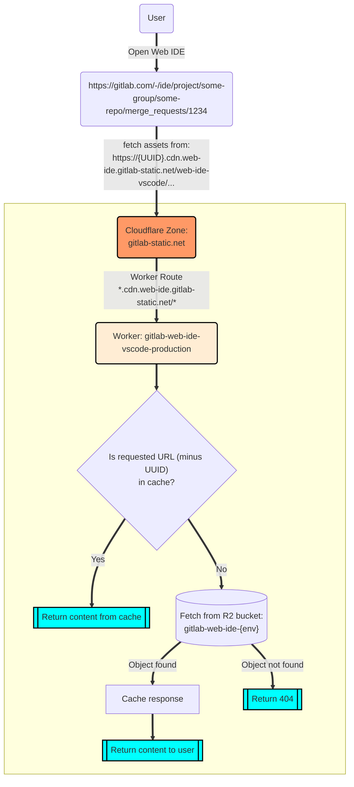

# Web IDE Assets

The [Web IDE](https://docs.gitlab.com/ee/user/project/web_ide/) requires external assets that would previously be
fetched from `*.vscode-cdn.net`, however in order to prevent our customers from having to fetch resources from a 3rd party, we self-host those assets.

## Traffic routing

The diagram below applies to the following:

- `{UUID}.cdn.web-ide.gitlab-static.net`
- `{UUID}.staging.cdn.web-ide.gitlab-static.net`

The only difference between the two is the name of the R2 bucket that hosts the assets and the cache expiration time (we
cache production assets for up to a year).

## CI Jobs

### Deploying assets

Cloudflare R2 buckets are S3 API compatible and we use `rclone` to recursively copy assets from CI jobs into the
buckets.

Take a look at the `.gitlab-ci.yml` file:
<https://gitlab.com/gitlab-org/gitlab-web-ide-vscode-fork/-/blob/main/.gitlab-ci.yml>

Look for the `deploy-assets-*` jobs. You'll notice that production & staging assets are only deployed when it's a
tagged commit on the default branch, however staging assets can also be deployed on demand from an MR by triggering the
job manually.

### Cloudflare Worker changes

All the Cloudflare Worker configuration and logic lives here:
<https://gitlab.com/gitlab-org/gitlab-web-ide-vscode-fork/-/tree/main/cloudflare>

Any changes made to this directory will trigger one of the `deploy-cloudflare-worker-*` jobs.

Refer to the [`README.md`](https://gitlab.com/gitlab-org/gitlab-web-ide-vscode-fork/-/blob/main/cloudflare/README.md)
for more info on the Cloudflare Wrangler CLI tool and how to inspect logs, test changes locally, etc.
