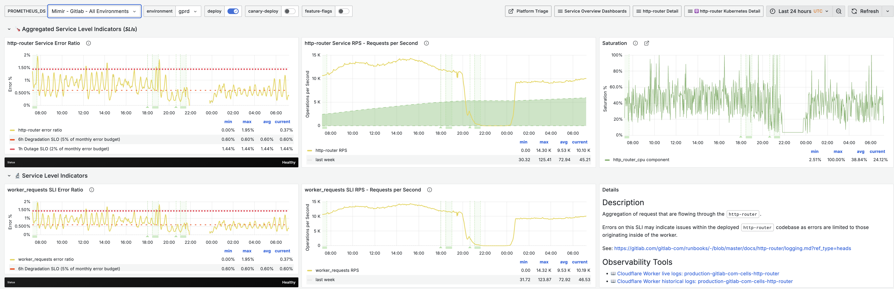

# Missing Metrics in HTTP Router Dashboard

Occasionally, we experience a lack of metrics for Cloudflare workers, resulting in an empty [HTTP Router dashboard](https://dashboards.gitlab.net/d/http-router-main/http-router3a-overview?from=now-24h&orgId=1&timezone=utc&to=now&var-PROMETHEUS_DS=e58c2f51-20f8-4f4b-ad48-2968782ca7d6&var-environment=gprd). A previous occurrence was noted from 2024-11-21 20:02 to 2024-11-22 00:50.



## Verifying Metric Existence

If this issue recurs, first verify whether the metrics exist for the affected time frame using the following GraphQL query:

```bash
echo '{ "query":
  "query GetWorkersAnalytics($accountTag: string, $datetimeStart: string, $datetimeEnd: string, $scriptName: string) {
    viewer {
      accounts(filter: {accountTag: $accountTag}) {
        workersInvocationsAdaptive(limit: 100, filter: {
          scriptName: $scriptName,
          datetime_geq: $datetimeStart,
          datetime_leq: $datetimeEnd
        }) {
          sum {
            subrequests
            requests
            errors
          }
          quantiles {
            cpuTimeP50
            cpuTimeP99
          }
          dimensions{
            datetime
            scriptName
            status
          }
        }
      }
    }
  }",
  "variables": {
    "accountTag": "852e9d53d0f8adbd9205389356f2303d",
    "datetimeStart": "<START_TIME>",
    "datetimeEnd": "<END_TIME>",
    "scriptName": "production-gitlab-com-cells-http-router"
  }
}' | tr -d '\n' | curl --silent \
https://api.cloudflare.com/client/v4/graphql \
--header "Authorization: Bearer <CLOUDFLARE_API_TOKEN>" \
--header "Accept: application/json" \
--header "Content-Type: application/json" \
--data @-
```

[`source docs`](https://developers.cloudflare.com/analytics/graphql-api/tutorials/querying-workers-metrics/)

Replace the following placeholders:

- `<CLOUDFLARE_API_TOKEN>`: [Cloudflare API token](https://developers.cloudflare.com/fundamentals/api/get-started/create-token/).
  - Use the `Read analytics and logs` template when creating the token.
  - Set a short expiry date for this account-bound token for security purposes.
- `<START_TIME>`: Beginning of the affected time period, e.g. `2024-11-25T00:00:00.000Z`
- `<END_TIME>`: End of the affected time period, e.g. `2024-11-25T01:00:00.000Z`

## Interpreting Results

If data is present in the query results, it likely indicates a delay in worker log processing, as mentioned in this [Cloudflare support ticket](https://billing.support.cloudflare.com/support/s/case/500Nv00000GKlj7IAD/slack-escalation-gitlabcloudflaresupport-tkhandelwal-hi-team-waves-we-noticed-something-strange-with).

## Next Steps

1. While not ideal, this situation is not cause for immediate concern.
2. Metrics remain accessible through the [Cloudflare Dashboard](https://dash.cloudflare.com/852e9d53d0f8adbd9205389356f2303d/workers/services/view/production-gitlab-com-cells-http-router/production?time-window=1440&versionFilter=all).
3. Contact Cloudflare support to report the processing delay and request updates on their efforts to mitigate such issues.
