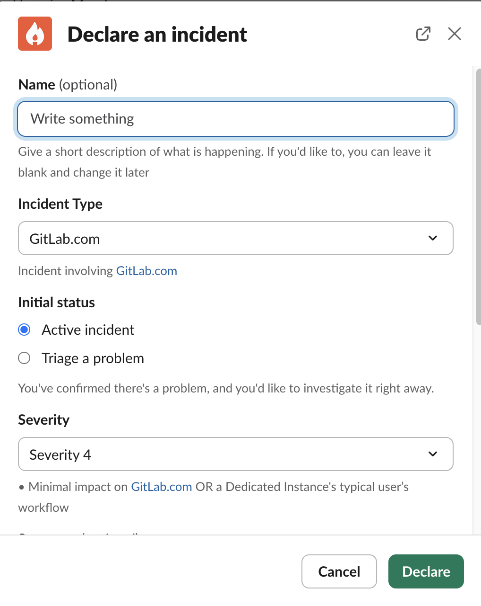
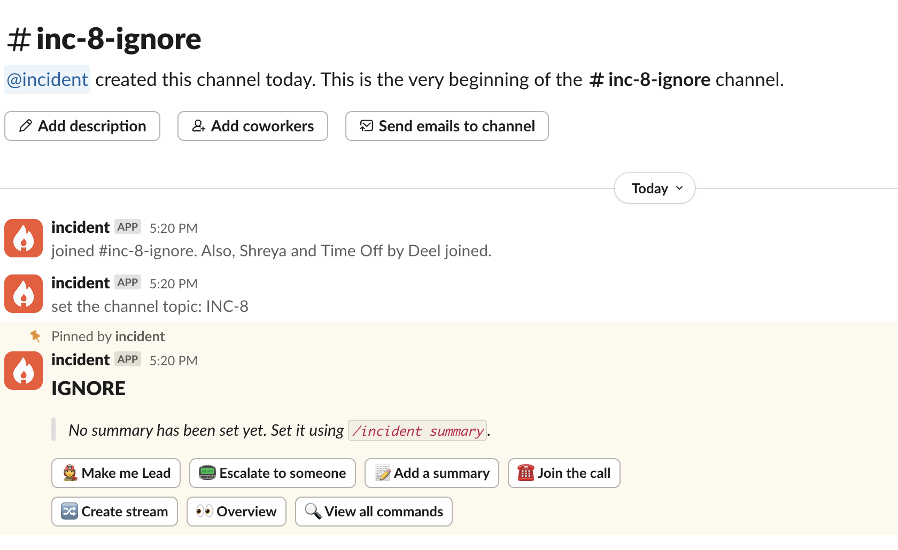
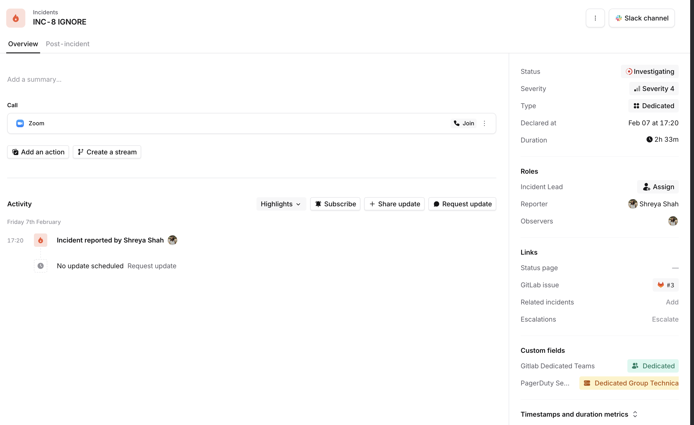
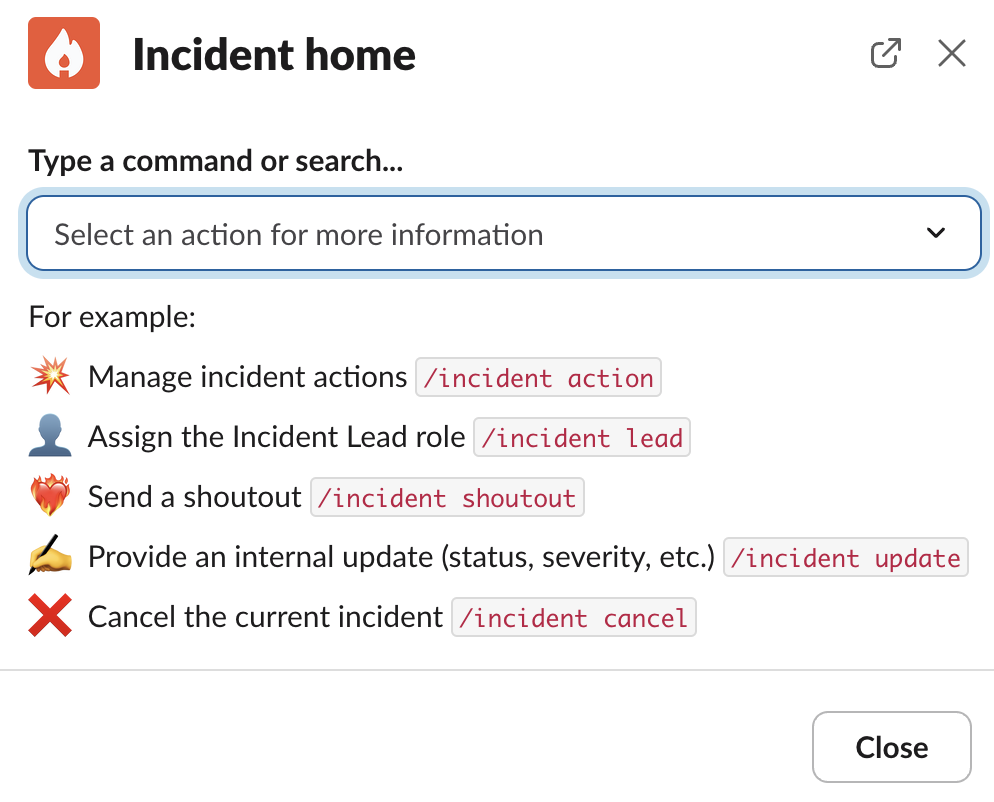

# GitLab Production Onboarding for Incident.io

This document highlights the basic onboarding steps to incident.io.

**Watch @ahanselka's walkthrough of incident.io [here](https://youtu.be/JeQu1UAxJE4).**

## How to raise an incident

- Go to the `#incident-dotcom` Slack channel.
- Type the command `/inc create`.
- This opens a popup to declare an incident.
- Give your incident a name and choose the incident type to be `Gitlab.com`.
- You can choose if you wish to block deployments/feature flags by selecting `yes` from the respective dropdown menu
- You can also choose to keep the issue confidential by selecting `Yes` from the dropdown menu

  
Click to expand image

  

## Navigating through an incident

- Once you create an incident, you will be redirected to the incident Slack channel.

  
Click to expand image

  

- Whenever you create an incident, a GitLab issue will be created [here](), as well as a Zoom incident call.
- You can update the incident from Slack using the `/inc` command or via the incident dashboard. To go to the incident dashboard, click on `overview` and then `incident homepage`.

  
Click to expand image

- The dashboard provides a nice overview of the incident. To view the dashboard, you need to [log in](#login-to-the-incidentio-dashboard) to incident.io first.
- Incident.io provides a variety of commands to update the incident from Slack.

  
Click to expand image

- You can move to the incident Slack channel and start debugging.
- Periodically provide updates to folks following along on the incident by reacting to your slack message with a :mega: emoji. This will also update the public GitLab incident issue. Data that would be useful capturing for later analysis can be captured with a :pushpin: emoji. That information will not be reflected in the public GitLab issue, but will remain in incident.io. This is useful when trying to keep track of timestamps, as each pin activity is timestamped on the dashboard. You will need to view the Post-Incident tab or choose "All Activity" in the Overview tab to see pinned messages.
- Zoom calls started by incident.io will be automatically be summarized using [Scribe](https://incident.io/changelog/scribe). If you do not want Scribe on the call, you can remove it from the meeting or start a different zoom call. To remove scribe from the meeting, you will need to assume host controls. The host pin is listed both in 1password under incidentio-svc@gitlab.com, as well as at the top of the slack channel when an incident is active.
- Once the incident is mitigated or resolved, you can choose to have a Post-Incident workflow or attach follow-up items to be worked on related to the incident.

## Login to the incident.io dashboard

- Make sure you are logged into the [incident.io](https://incident.io/) dashboard.
- Navigate to [incident.io](https://incident.io/).
- Click on Log in -> Sign-in with SAML SSO
- Congratulations, you are successfully logged in to the incident.io dashboard.

If you have issues logging in, please contact #it_help

## Future improvements

- Custom workflows to automatically invite the concerned team members to the incident.
- On-call integration that allows you to directly page the required teams while declaring an incident.
- Custom incident tickets.
- Follow our epic [Implement incident.io - Improvements](https://gitlab.com/groups/gitlab-com/gl-infra/-/epics/1489)
