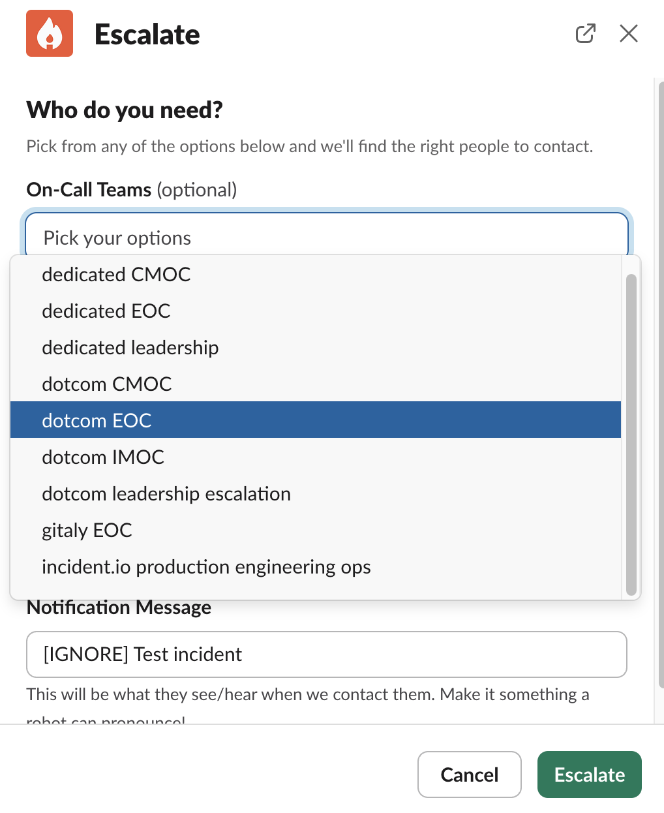

# Overview

This document highlights the steps for responders on how to acknowledge incidents escalated via incident.io and for on-call engineers on how to escalate to teams via incident.io.

# Responder Quick Start guide

- The steps assumes you are on an incident.io oncall rotation
- Please install the [incident.io app](https://help.incident.io/articles/3472064049-get-started-as-an-on-call-responder) on your mobile device for ease
- Once you are paged , you can acknowledge an incident either via the incident.io app , or through Slack , from there you can easily navigate to the incident slack channel

- This is how it would look like on the incident.io mobile app , to view the `Alerts` attatched to the incident , you can switch to the Alerts tab

    
    
    

- Once in the incident slack channel you can start troubleshooting the incident , join the incident zoom call and use the available commands for several actions.

## On-call alert handling process

This is something we are iterating on. The process is:

1. [Acknowledge](#production) the alert in PagerDuty within the response time.
2. Check if it's related to an active incident. While we transition to incident.io , be sure to check for recent incidents in both:
   - [incident.io](https://app.incident.io/gitlab/incidents?incident_type%5Bone_of%5D=01JK9KV07AV2WZKHYZD1GTK5KB) (new)
   - [production engineering]() (old)
1. If it is, respond according to the existing protocol for that incident
2. You can declare an incident by using the command `/inc create` to create one , all incidents of type `Gitlab.com` will be announced in `#incident-dotcom`

1. An [incident management project](https://gitlab.com/gitlab-com/gl-infra/incident-io-staging-secondary/-/issues) issue will be automatically created and linked to the incident.
   - See [How to raise an incident](incident-management.md#how-to-raise-an-incident) for detailed steps.
1. Begin [working on the alert](#working-on-the-alert)

### Working on the Alert

When working on an alert, you'll collaborate in the incident-specific Slack channel created by [incident.io](incident-management.md#navigating-through-an-incident). Use the incident's Slack channel for all investigation notes and updates. Key information can be pinned using the :pushpin: emoji, which will automatically be reflected in the incident.io dashboard and GitLab issue.

* In Grafana, click `Share` > `Copy` for the link; this will ensure the link is locked to the chosen time. **Note**: `Shorten URL` does not work.
* In OpenSearch, click `Share`, enable `Short URL` > `Copy link`; this ensure the link works correctly and retains filters.

Important investigation details to document:

1. Screenshots and evidence: If any information is provided via screenshots, make sure to add a `Source` link to each screenshot. Make sure to use absolute time - and not `Last x hours` or `now-x hours`.
   1. In Grafana, click `Share` > `Copy` for the link; this will ensure the link is locked to the chosen time. **Note**: `Shorten URL` does not work.
   1. In OpenSearch, click `Share`, enable `Short URL` > `Copy link`; this ensure the link works correctly and retains filters.
1. Use Zoom calls when needed for real-time collaboration, and utilize incident.io's Scribe feature to summarize call discussions directly in the incident channel.
1. Regular status updates can be posted using incident.io's update feature via the `/inc` command.

As you work through an investigation, it is important to keep track of any ~"corrective actions"s (label: `~corrective action`) that need to be followed up on. Some strategies are to note these in the `Investigation Thread` or create a separate `Corrective Actions` thread to keep as reference. Once the Incident is over, the EOC should create Issues for the ~"corrective actions"s, as detailed in [Post-Incident Responsibilities](#post-incident-responsibilities).

# Manual Escalation

- These steps highlights the way to manually escalate to a team or individual during an incident

- From the incident channel once you wish to manually escalate to a team / individual , use the command `/inc escalate` , this should trigger an escalation form pop-up

- Choose the team you wish to escalate to from the drop-down menu / the individual you wish to escalate to , you can enter an optional notification message you would wish for the responder to see

**_Note- When escalating from a woodhouse generated Slack channel please mention the incident slack channel in the Notification Message_**

## Incident Lifecycle

We manage incidents using [incident.io](incident-management.md). When an incident is created using `/inc create` in Slack, it automatically creates both a dedicated Slack channel and a GitLab issue. Lifecycles are defined [here](https://app.incident.io/gitlab/settings/lifecycle?tab=lifecycles). The incident has a few especially notable stages:

#### Active

Active incidents are managed through:
- The incident-specific Slack channel created by incident.io
- The automatically created GitLab issue in the [incident management project](https://gitlab.com/gitlab-com/gl-infra/gitlab-dedicated/incident-management/-/issues)
- The incident.io dashboard - see [Navigating through an incident](incident-management.md#navigating-through-an-incident)

[View currently active incidents](https://app.incident.io/gitlab/incidents?incident_type%5Bone_of%5D=01JK9KV07AV2WZKHYZD1GTK5KB).

#### Monitoring

An incident is considered in a `monitoring` status in the following scenarios :

1. The problem has been alleviated or addressed (at least temporarily) but may reoccur.
1. The problem is no longer active but we are still waiting for alerts to clear.

Update the incident status using the `/inc` command in the incident's Slack channel to reflect mitigation. This will update the status of the incident in incident.io. When the incident is resolved, you will separately need to close the incident issue.

[View currently mitigated incidents](https://app.incident.io/gitlab/incidents?incident_type%5Bone_of%5D=01JK9KV07AV2WZKHYZD1GTK5KB&status%5Bone_of%5D=01JH40E0GPQQZNK1DJHH2TCTEG)

#### Closed

The incident is resolved when it is fully addressed. Use incident.io's [Post-Incident workflow](https://help.incident.io/collections/7841117054-learning-from-incidents) to properly close out the incident, which may include [creating a post-incident review](https://help.incident.io/articles/8600719118-creating-postmortems-in-3-clicks). Incident reviews are typically performed for all S1 and S2 incidents or if an incident review is requested as per [GitLab's incident review process](https://handbook.gitlab.com/handbook/engineering/infrastructure/incident-review/#the-criteria-which-triggers-a-review).

[View currently resolved incidents](https://app.incident.io/gitlab/incidents?incident_type%5Bone_of%5D=01JK9KV07AV2WZKHYZD1GTK5KB&status%5Bone_of%5D=01JH40E0GPYDJ8B3AERA6RZSY8).

## Post-Incident Responsibilities

## Prioritization
