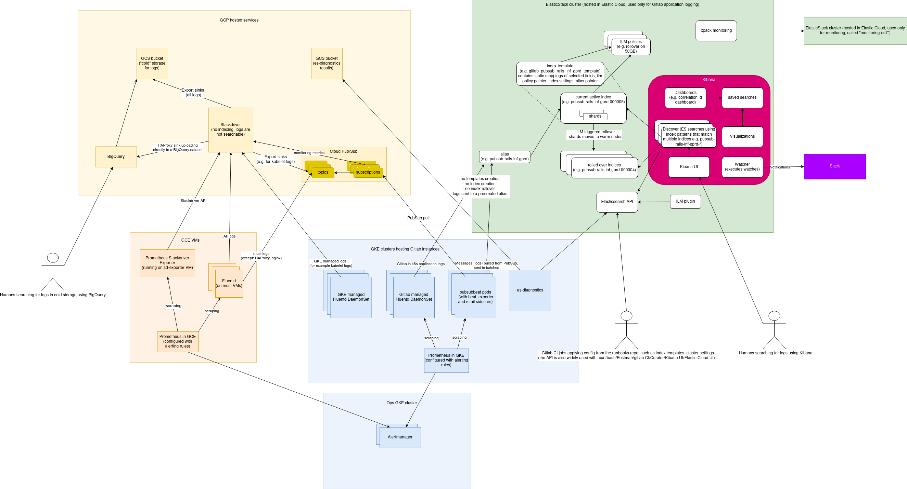

<!-- MARKER: do not edit this section directly. Edit services/service-catalog.yml then run scripts/generate-docs -->

**Table of Contents**

[[_TOC_]]

#  Logging Service
* **Alerts**: https://alerts.gitlab.net/#/alerts?filter=%7Btype%3D%22logging%22%2C%20tier%3D%22inf%22%7D
* **Label**: gitlab-com/gl-infra/production~"Service:Logging"

## Logging

* [Kibana](https://log.gprd.gitlab.net/app/kibana)
* [Stackdriver](https://console.cloud.google.com/logs/viewer?project=gitlab-production)
* [elastic stack monitoring](https://00a4ef3362214c44a044feaa539b4686.us-central1.gcp.cloud.es.io:9243/app/monitoring#/home?_g=(cluster_uuid:RM2uqM76TnWT3JL5n5NzCw))

## Troubleshooting Pointers

* [../Teleport/Connect_to_Rails_Console_via_Teleport.md](../Teleport/Connect_to_Rails_Console_via_Teleport.md)
* [../ci-runners/ci_pending_builds.md](../ci-runners/ci_pending_builds.md)
* [../cloudflare/logging.md](../cloudflare/logging.md)
* [../cloudflare/managing-traffic.md](../cloudflare/managing-traffic.md)
* [../elastic/elastic-cloud.md](../elastic/elastic-cloud.md)
* [../elastic/elasticsearch-integration-in-gitlab.md](../elastic/elasticsearch-integration-in-gitlab.md)
* [../elastic/kibana.md](../elastic/kibana.md)
* [../frontend/ssh-maxstartups-breach.md](../frontend/ssh-maxstartups-breach.md)
* [../git/purge-git-data.md](../git/purge-git-data.md)
* [../kas/kubernetes-agent-basic-troubleshooting.md](../kas/kubernetes-agent-basic-troubleshooting.md)
* [../kube/k8s-oncall-setup.md](../kube/k8s-oncall-setup.md)
* [../kube/kubernetes.md](../kube/kubernetes.md)
* [../license/license-gitlab-com.md](../license/license-gitlab-com.md)
* [logging_gcs_archive_bigquery.md](logging_gcs_archive_bigquery.md)
* [../onboarding/kibana-diagnosis.md](../onboarding/kibana-diagnosis.md)
* [../pages/gitlab-pages.md](../pages/gitlab-pages.md)
* [../pages/pages-letsencrypt.md](../pages/pages-letsencrypt.md)
* [../patroni/log_analysis.md](../patroni/log_analysis.md)
* [../patroni/postgres-checkup.md](../patroni/postgres-checkup.md)
* [../patroni/postgres.md](../patroni/postgres.md)
* [../patroni/postgresql-backups-wale-walg.md](../patroni/postgresql-backups-wale-walg.md)
* [../pgbouncer/pgbouncer-saturation.md](../pgbouncer/pgbouncer-saturation.md)
* [../pgbouncer/service-pgbouncer.md](../pgbouncer/service-pgbouncer.md)
* [../pubsub/pubsub-queing.md](../pubsub/pubsub-queing.md)
* [../tutorials/example_tutorial_template.md](../tutorials/example_tutorial_template.md)
* [../tutorials/overview_life_of_a_git_request.md](../tutorials/overview_life_of_a_git_request.md)
* [../tutorials/overview_life_of_a_web_request.md](../tutorials/overview_life_of_a_web_request.md)
* [../uncategorized/access-azure-test-subscription.md](../uncategorized/access-azure-test-subscription.md)
* [../uncategorized/access-gcp-hosts.md](../uncategorized/access-gcp-hosts.md)
* [../uncategorized/camoproxy.md](../uncategorized/camoproxy.md)
* [../version/version-gitlab-com.md](../version/version-gitlab-com.md)
* [../web/static-repository-objects-caching.md](../web/static-repository-objects-caching.md)
<!-- END_MARKER -->


<!-- ## Summary -->

## Quick start

### URLs

Logging clusters:
- **https://log.gprd.gitlab.net**
- **https://nonprod-log.gitlab.net**

Operations (formerly Stackdriver, we are currently not indexing any logs, it's used only for cold storage):
- https://console.cloud.google.com/logs/query

BigQuery:
- **[BigQuery](./logging_gcs_archive_bigquery.md)**

### Retention

#### ES

For up to date retention period see details of the ILM policy assigned to the index. See also:
- https://gitlab.com/gitlab-com/runbooks/-/tree/master/elastic/managed-objects/log_gprd/ILM
- https://gitlab.com/gitlab-com/runbooks/-/blob/master/elastic/managed-objects/log_gprd/ILM/gitlab-infra-high-ilm-policy.jsonnet


| Index                   | Production (gprd) | Staging (gstg) |
|-------------------------|-------------------|----------------|
| pubsub-application-inf  | 7 days            | 6 days         |
| pubsub-gitaly-inf       | 7 days            | 6 days         |
| pubsub-haproxy-inf      | 7 days            | 6 days         |
| pubsub-pages-inf        | 7 days            | 6 days         |
| pubsub-postgres-inf     | 7 days            | 6 days         |
| pubsub-rails-inf        | 7 days            | 6 days         |
| pubsub-shell-inf        | 7 days            | 6 days         |
| pubsub-sidekiq-inf      | 7 days            | 6 days         |
| pubsub-system-inf       | 7 days            | 6 days         |
| pubsub-puma-inf         | 7 days            | 6 days         |
| pubsub-unstructured-inf | 7 days            | 6 days         |
| pubsub-workhorse-inf    | 7 days            | 6 days         |
| pubsub-consul-inf       | 7 days            | 6 days         |

#### Operations (StackDriver)

We are not indexing any application logs. We are only using Operations for the sinks that are saving logs to cold storage.

#### GCS

All logs received by Stackdriver (even if excluded from indexing) are archived to object storage (GCS). Retention in GCS is currently configured for 365 days. For more details see [gcs section below](#gcs-long-term-storage).

### What are we logging?

For up to date config see:
- https://gitlab.com/gitlab-cookbooks/gitlab_fluentd/
- https://gitlab.com/gitlab-com/gl-infra/k8s-workloads/gitlab-helmfiles/-/tree/master/releases/fluentd-elasticsearch

There are many entries missing from this list:

| name                          | logfile                                          | type             | index                   |
| -----                         | --------                                         | ------           | -----                   |
| gitaly                        | gitaly/current                                   | JSON             | pubsub-gitaly-inf       |
| pages                         | gitlab-pages/current                             | JSON             | pubsub-pages-inf        |
| db.postgres                   | postgresql/current                               | line regex       | pubsub-postgres-inf     |
| db.pgbouncer                  | gitlab/pgbouncer/current                         | line regex       | pubsub-postgres-inf     |
| workhorse                     | gitlab/gitlab-workhorse/current                  | JSON             | pubsub-workhorse-inf    |
| rails.api                     | gitlab-rails/api\_json.log                       | JSON             | pubsub-rails-inf        |
| rails.application             | gitlab-rails/application.log                     | JSON             | pubsub-application-inf  |
| rails.audit                   | gitlab-rails/audit_json.log                      | JSON             | pubsub-rails-inf        |
| rails.auth                    | gitlab-rails/auth.log                            | JSON             | pubsub-rails-inf        |
| rails.database_load_balancing | gitlab-rails/database_load_balancing.log         | JSON             | pubsub-rails-inf        |
| rails.geo                     | gitlab-rails/geo.log                             | JSON             | pubsub-rails-inf        |
| rails.git                     | gitlab-rails/git_json.log                        | JSON             | pubsub-rails-inf        |
| rails.importer                | gitlab-rails/importer.log                        | JSON             | pubsub-rails-inf        |
| rails.exporter                | gitlab-rails/exporter.log                        | JSON             | pubsub-rails-inf        |
| rails.service_measurement     | gitlab-rails/service_measurement.log             | JSON             | pubsub-rails-inf        |
| rails.integrations            | gitlab-rails/integrations\_json.log              | JSON             | pubsub-rails-inf        |
| rails.kubernetes              | gitlab-rails/kubernetes.log                      | JSON             | pubsub-rails-inf        |
| rails.exceptions              | /var/log/gitlab/gitlab-rails/exceptions_json.log | JSON             | pubsub-rails-inf        |
| rails.features                | /var/log/gitlab/gitlab-rails/features_json.log   | JSON             | pubsub-rails-inf        |
| rails.production              | gitlab-rails/production\_json.log                | JSON             | pubsub-rails-inf        |
| shell                         | gitlab-shell/gitlab-shell.log                    | JSON             | pubsub-shell-inf        |
| puma.current                  | /var/log/gitlab/puma/current                     | line regex       | pubsub-puma-inf         |
| puma.stderr                   | /var/log/gitlab/puma/puma_stderr.log             | line regex       | pubsub-puma-inf         |
| puma.stdout                   | /var/log/gitlab/puma/puma_stdout.log             | line regex       | pubsub-puma-inf         |
| unstructured.production       | gitlab-rails/production.log                      | lines            | pubsub-unstructured-inf |
| sidekiq                       | n/a                                              | JSON             | pubsub-sidekiq-inf      |
| haproxy                       | /var/log/haproxy.log                             | syslog           | pubsub-haproxy-inf      |
| nginx.access                  | /var/log/gitlab/nginx/gitlab\_access.log         | nginx            | pubsub-nginx-inf        |
| registry                      | n/a                                              | mix (lines/json) | pubsub-gke-inf          |
| system.auth                   | /var/log/auth.log                                | syslog           | pubsub-system-inf       |
| system.syslog                 | /var/log/syslog                                  | syslog           | pubsub-system-inf       |
| rails.graphql                 | /var/log/gitlab/gitlab-rails/graphql_json.log    | JSON             | pubsub-rails-inf        |
| rails.mail_room               | /var/log/gitlab/mailroom/mail_room_json.log      | JSON             | pubsub-rails-inf        |
| history.psql                  | /home/*-db/.psql_history                         |                  |                         |
| history.irb                   | /var/log/irb_history/*.log                       |                  |                         |


## How-to guides

### Searching logs

#### Searching in Elastic

##### production (gitlab.com) ####

1. Go to https://log.gprd.gitlab.net/
1. in Kibana, in Discover application, select the relevant index pattern, e.g. `pubsub-rails-inf-gprd-*`

##### dev (dev.gitlab.org), staging (staging.gitlab.com), ops (ops.gitlab.com), preprod (pre.gitlab.com)

1. Go to https://nonprod-log.gitlab.net/
1. select the relevant index pattern, e.g. `pubsub-rails-inf-gstg-*`
1. (optional) filter on the environment, e.g. `json.environment=gstg` or `json.environment=dev`

Note:
- logs from dev are sent to staging indices
- almost no logs are forwarded from preprod

#### Searching in Operations (Stackdriver)

It is not possible to search for application logs using Operations (Stackdriver). You can still search for other logs, for example GCP authentication logs.

#### Searching in object storage (GCS)

[using BigQuery tutorial](./logging_gcs_archive_bigquery.md)

### Adding a new logfile

* Decide whether you want to use an existing ES index or create a new one (which will also require making some changes using Terraform). Some hints about how to decide:
    * You won't need a dedicated index if the amount of logs is small
    * It makes sense to use an existing index if the log file "conceptually" belongs to an existing log stream (for example it used be part of rails logs and it's simply going to be separated into a dedicate file)
    * If the log structure is significantly different (log entries contain completely different fields from already existing logs), you'll want to use a dedicated index. Otherwise the ES cluster might refuse to process your logs due to mapping conflicts or too many field mappings set in an index.

#### Adding a logfile and using an existing ES index

Adding a logfile and using an existing ES index

##### Chef-managed VMs

* GCE VMs infrastructure:
  * Update one of the [fluentd templates](https://gitlab.com/gitlab-cookbooks/gitlab_fluentd/tree/master/templates/default) and add a section for the new log file. Remember to bump the cookbook version in `metadata.rb`
  * follow the chef roll out process

##### Kubernetes infrastructure

* Update config of the Gitlab managed Fluentd DaemonSet here: https://gitlab.com/gitlab-com/gl-infra/k8s-workloads/gitlab-helmfiles/-/tree/master/releases/fluentd

#### Adding a logfile and creating a dedicated index for it

* Adding a logfile and creating a dedicated index for it
    * Configure Elastic
        * Add and modify the following and once merged, wait for the CI job to update ES config. An example of these changes is in this commit https://gitlab.com/gitlab-com/runbooks/-/commit/2b1c86471cfb3c792137c746613838d34d223e59
	  * Add the index name to the [indices array file](elastic/managed-objects/indices/indices-array.sh)
	  * Add a new file with your index name with empty index mapping (such as `{}`) in the [index mapping directory](http://gitlab.com/gitlab-com/runbooks/elastic/managed-objects/lib/index_mappings). This will need to be modified later with the log mappings.
	  * Add the index to prod and non-prod index template files
        * Initialize the alias and create the first index using an api call. You can do it in Kibana UI with:
        ```
        PUT /pubsub-<index_name>-inf-<env_name>-000001
        {
            "aliases":
                {
                    "pubsub-<index_name>-inf-<env_name>":
                        {
                            "is_write_index": true
                        }
                }

        }
        ```
        or using a script documented here: https://gitlab.com/gitlab-com/runbooks/blob/master/elastic/api_calls/single/initialize-alias-create-index.sh
        * Make sure that all three exist in the relevant cluster: alias, index template, first index and that the index has an ILM policy assigned to it.
        * Index patterns in Kibana can only be created once there are documents in indices.
    * Create a PubSub topic
        * Add your topic to the list of pubsubbeat topics in `variables.tf` file of the environment where you want to make the change, e.g. for gstg: https://ops.gitlab.net/gitlab-com/gitlab-com-infrastructure/-/blob/master/environments/gstg/variables.tf .
    * Create a beat that will forward logs from PubSub to ES (this step should only be performed after the topic was created)
        * Add a beat for your topic to the list of beats in the relevant environment: https://gitlab.com/gitlab-com/gl-infra/k8s-workloads/gitlab-helmfiles/-/tree/master/releases/pubsubbeat
    * For log files on the GCE VMs infrastructure
        * Add a new recipe in the `gitlab_fluentd` cookbook for your log file, for example: https://gitlab.com/gitlab-cookbooks/gitlab_fluentd/merge_requests/99/diffs
        * Edit the relevant roles in the chef repo to apply the new recipe to VMs managed with that role, for example: https://ops.gitlab.net/gitlab-cookbooks/chef-repo/merge_requests/2367/diffs
        * follow the chef roll out process
    * For log files in GKE
        * Update config of the Gitlab managed Fluentd DaemonSet here: https://gitlab.com/gitlab-com/gl-infra/k8s-workloads/gitlab-helmfiles/-/tree/master/releases/fluentd
	* To view the logs in kibana you'll need to create an index pattern. You can do this by going to Management > Stack Management > Kibana > Index Patterns and click on the "Create index pattern" button.


<!-- ## Architecture -->

## Concepts

### Roadmap

Roadmap:
  - https://gitlab.com/gitlab-com/gl-infra/infrastructure/-/issues/10095
  - https://docs.google.com/document/d/1EK3QUuC0JrN5ndXdz1McEwKirD_jfA7bk0siTgHXwI4/edit#

### Logging infrastructure overview ##



<!-- generated from ./img/logging.drawio -->

### Fluentd

We are using Fluentd (td-agent) for parsing log files and forwarding log messages to different destinations. There are at least three (3) different types of Fluentd processes involved: Gitlab managed Fluentd on GCE VMs, Gitlab managed Fluentd DaemonSet in GKE, GCP managed Fluentd DaemonSet in GKE.

Fluentd running on VMs is configured to send logs to two destinations: [Operations](https://cloud.google.com/stackdriver/docs/)(formerly Stackdriver) and [Cloud Pub/Sub](https://cloud.google.com/pubsub/docs/). Here's the [fluentd config](https://gitlab.com/gitlab-cookbooks/gitlab_fluentd/) for running on GCE VMs.

Gitlab managed Fluentd in kubernetes (running as a daemonset) sends logs only to ElasticStack (this will likely change in the future, see: https://gitlab.com/gitlab-com/gl-infra/infrastructure/-/issues/11655 and: https://gitlab.com/gitlab-com/gl-infra/infrastructure/-/issues/10095). Its config can be found [here](https://gitlab.com/gitlab-com/gl-infra/k8s-workloads/gitlab-helmfiles/-/tree/master/releases/fluentd-elasticsearch). For the helm chart, we are actually using [a Gitlab fork](https://gitlab.com/gitlab-org/charts/fluentd-elasticsearch/) of a [project on github](https://github.com/kiwigrid/helm-charts/tree/master/charts/fluentd-elasticsearch)

GCP managed Fluentd running as a daemonset in GKE, sends logs only to Operations. At the moment of writing, its config was not altered.

### Operations (Stackdriver)

All logs reaching Operations are saved to GCS using an export sink where they are stored long-term (e.g. 6 months) for compliance reasons and can be read using BigQuery.

We are using log exclusions to prevent application logs from being indexed: https://cloud.google.com/logging/docs/exclusions At the moment of writing, we are not indexing any of the application logs. The current exclusions for Operations (Stackdriver) can be found in [terraform variables.tf](https://ops.gitlab.net/gitlab-com/gitlab-com-infrastructure/blob/master/environments/gprd/variables.tf),
search for `sd_log_filters`.

### Cloud Pub/Sub

Logs from different components have designated topics in Pub/Sub and each topic has corresponding subscriptions. There is a subscriber for each subscription. At the moment of writing we are using pubsubbeat to subscribe to Pub/Sub subscriptions and forward logs to an ElasticStack cluster.

Cloud PubSub [quotas and limits](https://cloud.google.com/pubsub/quotas). Note: there's a 10MB/s per StreamingPull limit

PubSub topics are managed using Terraform (search for pubsub [here](https://ops.gitlab.net/gitlab-com/gitlab-com-infrastructure/-/blob/master/environments/gprd/main.tf))

Examples of alternatives to Cloud Pub/Sub include: Kafka

### Pubsubbeat

Pubsubbeat is a tool that uses the ES Beat framework: https://www.elastic.co/beats/ and Google PubSub client library: https://pkg.go.dev/cloud.google.com/go/pubsub . The project is maintained by Gitlab and can be found here: https://gitlab.com/gitlab-org/pubsubbeat/ . The binary pulls logs from a subscription in Pub/Sub and uploads them to Elastic using the [bulk API](https://www.elastic.co/guide/en/elasticsearch/reference/current/docs-bulk.html). The default configuration of Pubsubbeat is to create templates and field mappings in indices. We are not utilizing this feature and instead are precreating index templates to match our needs. A lot of the ES config is version controlled in our runbooks repo: https://gitlab.com/gitlab-com/runbooks/-/tree/master/elastic and applied using CI jobs. Many, but not all mappings are set statically [here](https://gitlab.com/gitlab-com/runbooks/-/tree/master/elastic/managed-objects/lib/index_mappings).

We deploy pubsubbeat to GKE using helm. For more details see config [here](https://gitlab.com/gitlab-com/gl-infra/k8s-workloads/gitlab-helmfiles/-/tree/master/releases/pubsubbeat). Permissions are given to k8s service accounts using [Workload Identity](https://cloud.google.com/kubernetes-engine/docs/how-to/workload-identity) using terraform (search for pusbubbeat [here](https://ops.gitlab.net/gitlab-com/gitlab-com-infrastructure/-/blob/master/environments/gprd/main.tf))

Examples of alternatives to Pubsubbeat include: Filebeat, Fluentd, Logstash.

### Elastic

Aliases are referenced by Pubsubbeat when uploading logs to Elastic. When logs reach the Elastic cluster, they are indexed into documents by a worker, the alias name is resolved to an index name and the documents are saved in the index. There should only ever be one active index per alias and the alias should be pointing to that index.

Logs (documents) can be viewed in Kibana using index patterns, i.e. when you open the Discover application in Kibana, you can select the index pattern from a drop-down list and all searches you will submit will be performed against all indices matching the index pattern. There are also a number of other features in Kibana we're using: dashboards, saved searches, visualizations, watchers.

More documentation on Elastic can be found here: [elastic/doc/](./elastic/doc/)

### Index Lifecycle Management (ILM)

Indices can be managed in different ways e.g. custom scripts, Curator, Index Lifecycle Management (ILM) plugin. ILM meets a lot of our requirements so that's what we're using for logs sent to ES7 clusters.

[The ILM plugin](https://www.elastic.co/guide/en/elasticsearch/reference/current/getting-started-index-lifecycle-management.html) has proved to be particularly useful and has become very popular in the Elastic community in recent years. For this reason, it was integrated into Elastic.

ILM behavior is configured via policies assigned to indices. The plugin runs at a scheduled interval (like a cronjob). When triggered, ILM goes through each index that has a policy assigned to it and performs a step defined in the policy (assigned to that particular index). If the conditions are not met, ILM will do nothing. Notice that the conditions are evaluated on a scheduled basis (rather than being event driven).

Policies can define a number of steps which in simple words translate to: warm -> hot -> cold -> delete. Behavior of ILM at each of those steps is defined in the ILM policy.

Here's an example policy:
```
{
    "policy": {
        "phases": {
            "hot": {
                "actions": {
                    "rollover": {
                        "max_age": "3d",
                        "max_size": "50gb"
                    },
                    "set_priority": {
                        "priority": 100
                    }
                }
            },
            "warm": {
                "min_age": "1m",
                "actions": {
                    "forcemerge": {
                        "max_num_segments": 1
                    },
                    "allocate": {
                        "require": {
                            "data": "warm"
                        }
					          },
					          "set_priority": {
						            "priority": 50
                    }
                }
            },
            "delete": {
                "min_age": "7d",
                "actions": {
                    "delete": {}
                }
            }
        }
    }
}
```
Let's say ILM is configured to run every 10 mins and the above policy is assigned to a newly created index. What will happen, is after 10 mins, ILM will trigger the hot phase, which will check the size and age of the index. If the size exceeds 50GB or the age exceeds 3 days, the configured [action](https://www.elastic.co/guide/en/elasticsearch/reference/current/_actions.html) is triggered, which in this case would send a call to the [rollover api](https://www.elastic.co/guide/en/elasticsearch/reference/master/indices-rollover-index.html). The rollover API will mark the current index as non-writable, mark it for the warm phase and create a new index from an index template. This way, we can control for example the size of shards within indices or logs retention period.

See also:
- https://www.elastic.co/blog/implementing-hot-warm-cold-in-elasticsearch-with-index-lifecycle-management
- https://www.elastic.co/guide/en/elasticsearch/reference/current/index-lifecycle-management.html

### Monitoring

Our Elastic clusters have xpack monitoring enabled in Elastic Cloud and the monitoring metrics are forwarded to a separate monitoring cluster (called `monitoring-es7`).

There is a VM in each environment called `sd-exporter-*`. This VM is created using a generic terraform module https://ops.gitlab.net/gitlab-com/gl-infra/terraform-modules/google/generic-sv-with-group . The VM has a chef role assigned to it which downloads and runs the stackdriver exporter https://gitlab.com/gitlab-cookbooks/gitlab-exporters/ . The exporter service runs on a tcp port number 9255. Prometheus is configured through a role in chef-repo to scrape port 9255 on `sd-exporter-*` VMs. Metrics scraped this way are the basis for Prometheus pubsub alerts.

For the monitoring of pubsubbeats in GKE, we use a ServiceMonitor object to tell Prometheus to scrape the endpoints exposed by the pubsubbeat pod. The pod exposes two endpoints: `beat-metrics` and `mtail-metrics`. These are exposed by sidecars, a [beat-exporter](https://github.com/trustpilot/beat-exporter) process and an [mtail](https://github.com/google/mtail) process.

### BigQuery

BigQuery can be used to search logs that are in cold storage (GCS).

The `haproxy` logs are also configured to be forwarded to a BigQuery dataset using
a StackDriver sink: [gitlab-production:haproxy_logs](https://console.cloud.google.com/bigquery?organizationId=769164969568&project=gitlab-production&p=gitlab-production&d=haproxy_logs&page=dataset)

### GCS (long-term storage)

Logs from the export sink are saved to a GCS bucket which we manage with Terraform: https://ops.gitlab.net/gitlab-com/gl-infra/terraform-modules/google/storage-buckets/blob/master/main.tf#L1

We configure this bucket with GCP lifecycle rules: https://ops.gitlab.net/gitlab-com/gl-infra/terraform-modules/google/storage-buckets/blob/master/main.tf#L14

These rules are parameterized and are configured with defaults which are set in the module: https://ops.gitlab.net/gitlab-com/gl-infra/terraform-modules/google/storage-buckets/blob/master/variables.tf#L150

### es-diagnostics

We created cronjobs that dump diagnostic information from ES clusters.

Script repo: https://gitlab.com/gitlab-com/gl-infra/es-diagnostics/

Deployment: https://gitlab.com/gitlab-com/gl-infra/k8s-workloads/gitlab-helmfiles/-/tree/master/releases/es-diagnostics

### Historical notes

haproxy logs and nginx logs are not sent to ElasticStack because it was overwhelming our cluster. Currently, these logs are only available through BigQuery.

Design document for migration to ES7: https://about.gitlab.com/handbook/engineering/infrastructure/design/logging-upgrade/

<!-- ## Performance -->

<!-- ## Scalability -->

<!-- ## Availability -->

<!-- ## Durability -->

<!-- ## Security/Compliance -->

<!-- ## Monitoring/Alerting -->

<!-- ## Links to further Documentation -->

## Configuration

### Chef

#### Cookbooks

There are three cookbooks that configure logging on gitlab.com

* gitlab-proxy - Sets up the nginx proxy so that users can access elastic cloud via log.gprd.gitlab.net, to be deprecated: https://gitlab.com/gitlab-com/gl-infra/infrastructure/-/issues/9145 and https://gitlab.com/groups/gitlab-com/gl-infra/-/epics/331
* gitlab_fluentd - Sets up td-agent on all nodes, forwards logs to pubsub topics.
* gitlab-elk (deprecated) - Sets up the pubsub beat which reads from the topics and forwards to elastic cloud.

#### Role configuration

* Add `recipe[gitlab_fluentd::<type>]` to the corresponding role to enable td-agent for the template
* The [ops proxy role](https://ops.gitlab.net/gitlab-cookbooks/chef-repo/blob/master/roles/ops-infra-proxy.json) configures the proxy vm that is the reverse proxy for elastic cloud.

### Terraform

- (deprecated) pubsubbeat module: https://gitlab.com/gitlab-com/gl-infra/terraform-modules/google/pubsubbeat
- pubsub topics are managed using a pubsub module: https://ops.gitlab.net/gitlab-com/gitlab-com-infrastructure/-/tree/master/modules/pubsub
- Workload Identity config: search for pubsubbeats in https://ops.gitlab.net/gitlab-com/gitlab-com-infrastructure/-/blob/master/environments/gstg/main.tf
- Stackdriver log exclusions: https://ops.gitlab.net/gitlab-com/gl-infra/terraform-modules/google/stackdriver
- es-diagnostics storage bucket and permissions

Pub/Sub Subscriptions should be automatically created by the pubsubbeat service
on each pubsub host. If subscriptions get misconfigured (e.g. topics appear
as `_deleted-topic_`) you can delete them and restart the pubsubbeat services to
re-create them. This will be deprecated soon: https://gitlab.com/gitlab-com/gl-infra/infrastructure/-/issues/8339

### runbooks repo

There's a number of things configured using CI jobs in the runbooks repo, in `runbooks/elastic/`, for example:
- index templates
- static mappings for indices

## FAQ

### Why are we using Operations and GCS in addition to ElasticSearch?

We are sending logs to Operations and GCS in addition to elasticsearch for
longer retention and to preserve logs in object storage for 365 days.

### Why are we using pubsub queues instead of sending logs from fluentd directly to Elastic?

We use it for two reasons. Firstly, to handle situations when our log sources emit more logs than Elasticsearch can ingest at real time. In this scenario, pubsub serves the role of a buffer.

Secondly, we were overloading Elastic Cloud with the number of connections. Having only a few pubsubbeats helps to reduce the overhead of a separate connection for each fluentd instance.

See also: [message queueing discussion in roadmap](https://docs.google.com/document/d/1EK3QUuC0JrN5ndXdz1McEwKirD_jfA7bk0siTgHXwI4/edit#heading=h.ymuyhym25zqn)

### How do I find the right logs for my service?

See [Quick start](./README.md#what-are-we-logging)

### A user sees an error on GitLab.com, how do I find logs for that user?

* Select the `pubsub-rails-inf-gprd-*` index pattern in Kibana
* Search for `+json.username: <user>`

If the request has `json.correlation_id` field set, you can use that id for checking logs from all gitlab.com components using the Correlation dashboard.

see also: [searching logs](./README.md#searching-logs)

### Why do we have these annoying json. prefixes?

They are created by https://github.com/GoogleCloudPlatform/pubsubbeat , I don't see a way we can remove them without forking the project.

### What if I need to query logs older than the ones present in Elastic?

At the moment, the only other way to access logs is using BigQuery.

See [logging_gcs_archive_bigquery.md](logging_gcs_archive_bigquery.md) for
instructions on loading logs into `BigQuery` from their GCS archive files.
