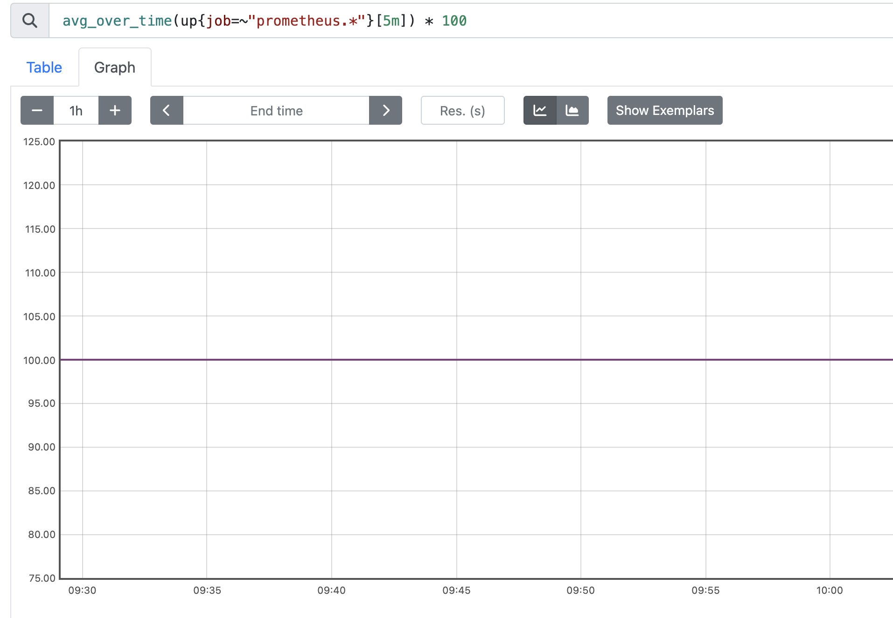
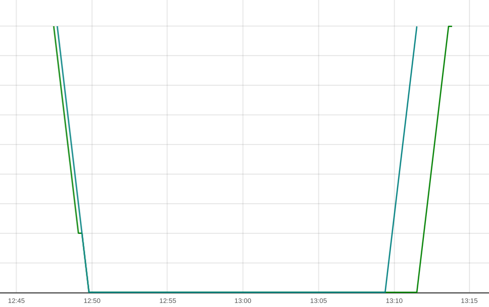
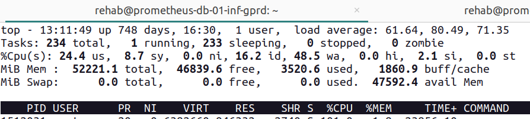

# (Title: Name of alert)

**Table of Contents**

[TOC]

## Overview

### What does this alert mean?

The alert named `PrometheusUnreachable` is set up to detect when Prometheus instances cannot be scraped (i.e., they are unreachable) for more than 10 minutes.

###  What factors can contribute?

CPU and Memory saturation results in unresponsive prometheus instances

###  What parts of the service are effected?

###  What action is the recipient of this alert expected to take when it fires?

Refer [here](https://gitlab.com/gitlab-com/runbooks/-/blob/2cd0f564d4d4d2483e7ee413945726d975e39c90/troubleshooting/prometheus-is-down.md)

#### Steps to check

- Login to server - prometheus.gitlab.com or prometheus-2.gitlab.com.
- Check service with sv status prometheus. If it is run for more than 0s. Then it is ok.
- If it is down state, then check logs in /var/log/prometheus/prometheus/current. Actions can be taken after logs investigating. Usually it is configuration error or IO/space problems.

#### How to work with Prometheus

- Check configuration - /opt/prometheus/prometheus/promtool check config /opt/prometheus/prometheus/prometheus.yml.
- It should check prometheus configuration file and alerts being used. Please always run this check before restarting prometheus      service.
- Reload configuration - sudo sv reload prometheus.
- Restart service - sudo sv restart prometheus after checking configuration.

## Services

- > All alerts require one or more Service Overview links
- > Owner: [Scalability:Observability](https://handbook.gitlab.com/handbook/engineering/infrastructure/team/scalability/observability/)

## Metrics

- #### Briefly explain the metric this alert is based on and link to the metrics catalogue. What unit is it measured in? (e.g., CPU usage in percentage, request latency in milliseconds)

The alert is based on the metric up, which is used in Prometheus to determine whether a target is reachable or not.
`up` metric has a value of 1 if the target is reachable and 0 if it is not reachable.

The unit of measurement for this alert is the percentage of reachable Prometheus targets

link to metrics catalogue [here](https://gitlab.com/gitlab-com/runbooks/-/blob/master/legacy-prometheus-rules/default/prometheus-metamons.yml#L4)

- #### Explain the reasoning behind the chosen threshold value for triggering the alert. Is it based on historical data, best practices, or capacity planning?

- #### Describe the expected behavior of the metric under normal conditions. This helps identify situations where the alert might be falsely firing.

  - On firing the below query under normal conditions in the prometheus dashboard [here](https://prometheus.ops.gitlab.net/graph?g0.expr=avg_over_time(up%7Bjob%3D~%22prometheus.*%22%7D%5B5m%5D)%20*%20100%20&g0.tab=0&g0.stacked=0&g0.show_exemplars=0&g0.range_input=1h)

    `avg_over_time(up{job=~"prometheus.*"}[5m]) * 100 `

    It should ideally come out to be a flat line ( at 100 ) like below , the above query calculates the average availability percentage of Prometheus jobs over the last 5 minutes

    

- #### Add screenshots of what a dashboard will look like when this alert is firing and when it recovers

  - In case the alert is firing you will most probably see a dip in the availability percentage , a good example of how it might
    look like is  below , this has been generated in the prometheus dashboard using the below query

    `avg_over_time(up{job=~"prometheus.*"}[5m]) * 100 < 50`

    

    The above screenshot depicts how the availability fell below 100 but then after sometime how it recovered by itself.

- > Are there any specific visuals or messages one should look for in the screenshots?

## Alert Behavior

- > Information on silencing the alert (if applicable). When and how can silencing be used? Are there automated silencing rules?
- > Expected frequency of the alert. Is it a high-volume alert or expected to be rare?
- > Show historical trends of the alert firing e.g  Kibana dashboard

## Severities

- > Guidance for assigning incident severity to this alert
- > Who is likely to be impacted by this cause of this alert?
  - Internal impact mostly
- > Things to check to determine severity

## Verification

- > Prometheus link to query that triggered the alert
    https://prometheus.ops.gitlab.net/graph?g0.expr=avg_over_time(up%7Bjob%3D~%22prometheus.*%22%7D%5B5m%5D)%20*%20100%20%3C%2050&g0.tab=1&g0.stacked=0&g0.show_exemplars=0.g0.range_input=1h.
- > Additional monitoring dashboards
- > Link to log queries if applicable

## Recent changes

- > Links to queries for recent related production change requests
- > Links to queries for recent cookbook or helm MR's
- > How to properly roll back changes

## Troubleshooting

- > Basic troubleshooting order
- > Additional dashboards to check
- > Useful scripts or commands

It might be useful to check resource usage in DB hosts because saturation of that might cause these alerts in the first place
Logging into the hosts and using the `top` command to check resource usage might be helpful

## Possible Resolutions

- > Links to past incidents where this alert helped identify an issue with clear resolutions

- https://gitlab.com/gitlab-com/gl-infra/production/-/issues/17962

## Dependencies

- > Internal and external dependencies which could potentially cause this alert

# Escalation

- > How and when to escalate
- > Slack channels where help is likely to be found:

# Definitions

- > Link to the definition of this alert for review and tuning
- > Advice or limitations on how we should or shouldn't tune the alert
- > Link to edit this playbook
- [Update the template used to format this playbook](https://gitlab.com/gitlab-com/runbooks/-/edit/master/docs/template-alert-playbook.md?ref_type=heads)

# Related Links

- [Related alerts](./)
- > Related documentation
