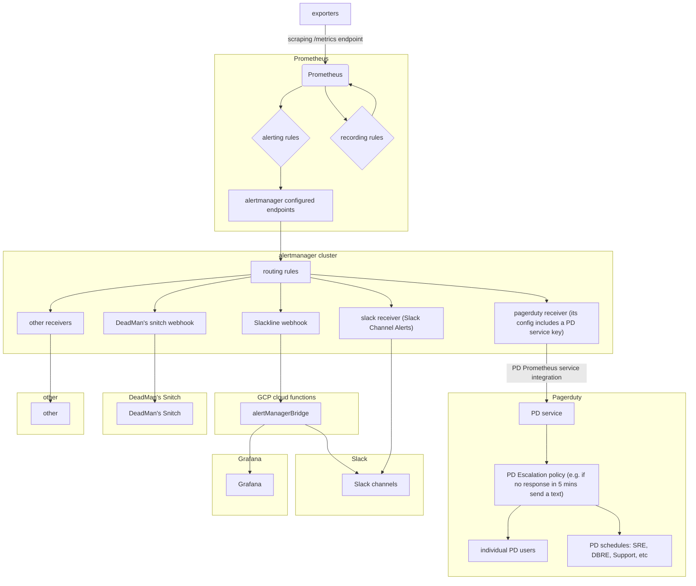

# Alerting

**Table of Contents**

[TOC]

## Overview

videos and materials in `./runbooks/docs/monitoring/README.md`

[part V (chapters 18 and 19) of O'Reilly's "Prometheus up and running" book](https://learning.oreilly.com/library/view/prometheus-up/9781492034131/part05.html#part5)

[sre workbook, chapter 5](https://landing.google.com/sre/workbook/chapters/alerting-on-slos/#ch05fn5)



## Prometheus

Generally speaking alerts are triggered by Prometheus, and then grouped by label, prioritized and deduped by the Alertmanager.

Currently most alerts are being grouped by environment and alert name. These alerts are then shipped to the alert manager which applies a template to them to ship them to slack or pagerduty, depending on the `pager` label.

## Alert rule sample

Alert rules, alongside other config such as alertmanager's URL endpoint, are part of Prometheus config. This sample alert rule would trigger pretty much all the time,

```yaml
groups:
- name: testing.rules
  rules:
  - alert: HawaiianHugs
    expr: node_load1{environment="gprd",job="node",type="git"} > 1
    for: 1m
    labels:
      severity: s1
    annotations:
      title: "Emergency Alert"
      description: >
        "BALLISTIC MISSILE THREAT INBOUND TO GITLAB. SEEK IMMEDIATE SHELTER.
        THIS IS NOT A DRILL."
      node_load: '{{ $value }}'
```

### Fields

* alert: the alert name, this will be used as a grouping mechanism.
* expr: the expression to evaluate, has to evaluate to boolean.
* for: how long to wait until this alert starts firing.
* labels: any alert that triggers will include all the labels that come from the prometheus metric, here we can add more labels to manage the alert behavior. We could, for example add more labels like this:
  * `team`: which team the alert should go to. Teams are defined in [teams.yml](../../services/teams.yml)
  * `severity`: `s1`, `s2`, `s3`, and `s4`
  * `pager`: if `pagerduty` then the alert will be also sent to pagerduty to the production on-call
  * `environment`: this one generally comes with the metric, we can override it to send to different channels (stg, pre, or geo)
* annotations: there are 2 annotations that will be always used: title and descriptions. These should be static (they can't have any variable in them) more on this later on. Additionally we can define as many other annotations as we want, more on this later.

### Annotations

As previously said, there are 2 static annotations that should be used always:

* title: this will be the first line of an alert, should be simple a direct saying what the problem is.
* description: a longer text providing data and context on what this alert is, best if they provide information on how to deal with the alert or which steps to take. Since we are using yaml now it's quite easy to write a really long text, so we should be migrating the runbooks into the alerting.

Besides this, we can add any other annotation that we want, the way this will
work is that for each alert that is grouped the `fqdn` or `instance` will be
printed under the description, one per line, and then any additional annotation
will be printed next to it, this means that we can define as many as we want,
for example, in the previous alert, there will be one line for each node that
matches the expression and it will include the text `node_load = X` once per
each host.

## Alertmanager

Alerts raised by Prometheus, as defined by alert rules, are sent to alertmanager. Alertmanager is configured with routing rules and receivers. Incoming alerts from Prometheus are routed to receivers based on routing rules.

## How to add new alerts

### Manual alerts

1. Create a new file in [`/rules`](../../rules) or add to an existing one.
1. Add the appropriate [fields](#fields)
    1. Add `team` label if you want it routed to a specific Slack channel for a product team.
    1. Add [severity](https://about.gitlab.com/handbook/engineering/infrastructure/incident-management/#severities) (`severity: s2`/`severity: s1`) & `pager: pagerduty` if you want it to page the on-call.

Example: [registry queue](../../rules/registry-gc-queues.yml)

### Templating alerts

Sometimes you need to template alerts, and tie them with our [metric
catalog](../../metrics-catalog/README.md). Writing them
[manually](#manual-alerts) might not be ideal.

1. Create a new jsonnet file in [`/rules-jsonnet`](../../rules-jsonnet)
1. Add a new alert
1. Run `make generate`

Example: [patroni alerts](../../rules-jsonnet/patroni-cause-alerts.jsonnet)

## Where to find things

### Prometheus

~~We have 3 of those, 1 and 2 are internal to GitLab.com, 3 is used for the public monitor.gitlab.net site.~~ this is outdated, see monitoring overview for more info

### Alertmanager

We have one alermanager cluster. It is operated via [helmfiles](https://gitlab.com/gitlab-com/gl-infra/k8s-workloads/gitlab-helmfiles/) and runs in the `ops` GKE cluster.

It is accessed via Google IAP on [https://alerts.gitlab.net](https://alerts.gitlab.net)

The alertmanager-specific configuration where routing and recievers are defined can be found in [the runbooks](https://gitlab.com/gitlab-com/runbooks/tree/master/alertmanager).

The alerting templates (which are built using go's text/template engine) can be found in [the helmfiles](https://gitlab.com/gitlab-com/gl-infra/k8s-workloads/gitlab-helmfiles/-/tree/master/releases/gitlab-monitoring).

## Silencing

In some cases you need to silence an alert for an expected condition. This should be done when
there is something alarming that is understood and will eventually be fixed.

Silencing alerts is helpful to reduce the broken window effect, critical alarms should always
be actionable and if they aren't we should ideally change the alert or if it something temporary
silence them.

* Go to <https://alerts.gitlab.net/#/silences> and select "New Silence"
* Add matchers for the conditions to target the specific alert, for example:

```
Name                    Value
-----                   ------

alertname               LowDiskSpace
fqdn                    sync.geo.gitlab.com
mountpoint              /var/opt/gitlab
```

* Set a duration, an owner and a comment.
* In the comment field, link to a change request, an infradev issue, or a related investigation issue with a DRI that was created from an incident. For the latter, create these issues using the "Related Issue" section of the incident template.
  * Once a silence is created, the associated incident issue(s) should be closed.

*Note*: During a site-wide outage it may be desired to globally silence alerts while we investigate issues.
To create one, navigate to <https://alerts.gitlab.net/#/silences> and add a silence for `env=gprd` with a duration of <= 1hour.

## Tips and tricks

* Trigger alerts to see how they work by writing a condition that will always be true.
* Print the whole alerting data and model using go template printf, with a text such as: `text: '{{ printf "%#v" . }}'` in the alert receiver configuration on the alert manager.
* Verify alertmanager config using <https://prometheus.io/webtools/alerting/routing-tree-editor/> . It will also visualize the routing tree for you. When pasting config, remove any ruby templated strings and do not paste any secrets!
* Test changes to routing rules in alertmanager's config using routing tree editor and alerts which can be [easily found in Thanos](https://thanos.gitlab.net/graph?g0.range_input=1h&g0.expr=ALERTS&g0.tab=1)

## References

* [Alertmanager configuration](../../rules/README.md)
* [Prometheus template source code](https://github.com/prometheus/prometheus/blob/master/template/template.go#L115)
* [Prometheus default alert manager expansion template](https://github.com/prometheus/alertmanager/blob/master/template/default.tmpl)
* [Go text/template documentation](https://golang.org/pkg/text/template/)
* [part V (chapters 18 and 19) of O'Reilly's "Prometheus up and running" book](https://learning.oreilly.com/library/view/prometheus-up/9781492034131/part05.html#part5)
* [sre workbook, chapter 5](https://landing.google.com/sre/workbook/chapters/alerting-on-slos/#ch05fn5)
* [Slackline git repo](https://gitlab.com/gitlab-com/gl-infra/slackline/)
