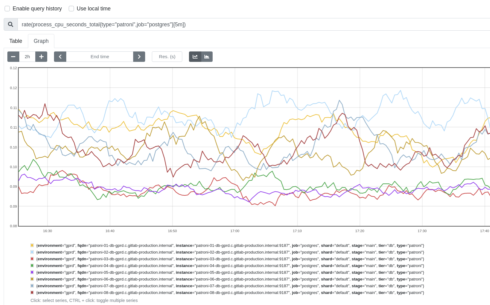

## Troubleshooting database (postgres/pgbouncer) degradation

Database performance degradation may be due to several reasons. This is an asorted compilation of checks you can try to point too the degradation origin.


### Check CPU utilization
You can use [this metric](https://prometheus-db.gprd.gitlab.net/new/graph?g0.expr=rate(process_cpu_seconds_total%7Btype%3D%22patroni%22%2Cjob%3D%22postgres%22%7D%5B5m%5D)&g0.tab=0&g0.stacked=0&g0.range_input=2h) to check CPU utilization over the patroni hosts:


Check if values are getting close to `1`

You can also take a look on [this graph](https://dashboards.gitlab.com/d/000000144/postgresql-overview?orgId=1&from=1594050133725&to=1594060933725&var-prometheus=Global&var-environment=gprd&var-type=patroni&viewPanel=9) - part of the [Patroni Overview](https://dashboards.gitlab.com/d/000000144/postgresql-overview?orgId=1) panel - to check the host load too.


### Check for memory utilization
Check [this graph](https://dashboards.gitlab.com/d/000000144/postgresql-overview?orgId=1&from=now-3h&to=now&var-prometheus=Global&var-environment=gprd&var-type=patroni&viewPanel=12) for an overview of memory utilization:


### Check for Buffer cache utilization
Specially after a failover, a DB repair (indexing, repacking), the cache access pattern can change. With a "cold" cache, query performance may suffer. Check [this graph](https://prometheus-db.gprd.gitlab.net/new/graph?g0.expr=(pg_stat_database_blks_hit%7Benvironment%3D%22gprd%22%2Cdatname%3D%22gitlabhq_production%22%2C%20%7D%20%2F%20(%20pg_stat_database_blks_hit%7Benvironment%3D%22gprd%22%2Cdatname%3D%22gitlabhq_production%22%2C%20%7D%20%2B%20pg_stat_database_blks_read%7Benvironment%3D%22gprd%22%2Cdatname%3D%22gitlabhq_production%22%7D))%20*%20100&g0.tab=0&g0.stacked=0&g0.range_input=2h) to verify the cache hit/read percentaje. Under normal conditions, it should be close to 99%.


### Check for IO saturation
Disk saturation can cause severe service degradation. Check the [PostgreSQL Overview](https://dashboards.gitlab.com/d/000000144/postgresql-overview?orgId=1) dashboard, specially at the following graphs:
- disk IO wait `sdb`
- Disk IO utilization `sdb`
- Retransmit rate (outbound only), resending possibly lost packets

If you need to go deeper, you can log in into the desired instance and use the `iotop` to find out wich process is using most IO:
```sudo iotop -P -a ```

```
Total DISK READ :       0.00 B/s | Total DISK WRITE :       0.00 B/s
Actual DISK READ:       0.00 B/s | Actual DISK WRITE:       0.00 B/s
  PID  PRIO  USER     DISK READ  DISK WRITE  SWAPIN     IO>    COMMAND                                                                                                               
    1 be/4 root          0.00 B      0.00 B  0.00 %  0.00 % systemd --system --deserialize 28
    2 be/4 root          0.00 B      0.00 B  0.00 %  0.00 % [kthreadd]
    4 be/0 root          0.00 B      0.00 B  0.00 %  0.00 % [kworker/0:0H]
24581 be/4 nelsnels      0.00 B      0.00 B  0.00 %  0.00 % [bash]
    6 be/0 root          0.00 B      0.00 B  0.00 %  0.00 % [mm_percpu_wq]
    7 be/4 root          0.00 B      0.00 B  0.00 %  0.00 % [ksoftirqd/0]
    8 be/4 root          0.00 B      0.00 B  0.00 %  0.00 % [rcu_sched]
    9 be/4 root          0.00 B      0.00 B  0.00 %  0.00 % [rcu_bh]
   10 rt/4 root          0.00 B      0.00 B  0.00 %  0.00 % [migration/0]
   11 rt/4 root          0.00 B      0.00 B  0.00 %  0.00 % [watchdog/0]
   12 be/4 root          0.00 B      0.00 B  0.00 %  0.00 % [cpuhp/0]
   13 be/4 root          0.00 B      0.00 B  0.00 %  0.00 % [cpuhp/1]
   14 rt/4 root          0.00 B      0.00 B  0.00 %  0.00 % [watchdog/1]
   15 rt/4 root          0.00 B      0.00 B  0.00 %  0.00 % [migration/1]
   16 be/4 root          0.00 B      0.00 B  0.00 %  0.00 % [ksoftirqd/1]
   18 be/0 root          0.00 B      0.00 B  0.00 %  0.00 % [kworker/1:0H]
   19 be/4 root          0.00 B      0.00 B  0.00 %  0.00 % [cpuhp/2]
   20 rt/4 root          0.00 B      0.00 B  0.00 %  0.00 % [watchdog/2]
```

And if you found an specific `pid` that is using many IO%, you can execute `sudo gitlab-psql` and check what is that pid executing with:

```sql
 SELECT * from pg_stat_activity where pid=<pid from iotop> 
 
```


### Check for differences in the graphs (same metric, different host)
Load among RO patroni hosts is evenly distributed, so in average, you might expect every metric be similar for every patroni node in the RO ring. When that is not the case, it ussually means that there is some unknown problem with that particular instance, like:
- one patroni instance with much higher replication lag than the rest
- much higher IO usage / io wait than the rest

In general, when those differences are not easy to explain, its because on some issue with GCP, and in most cases that instance/disk must be replaced.


