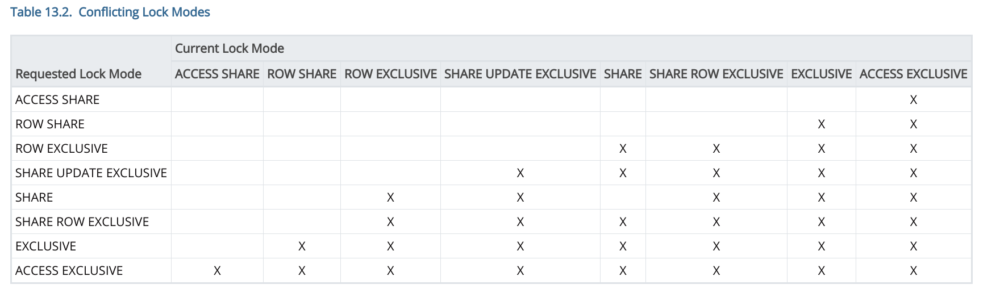

## About Locking
Locks are the way PostgreSQL ensure transactional data consistency, specially when concurrent transactions aims to write the same data.
PostgreSQL implements several kinds of locks, and even SELECT statements implements a kind of lock. Some locks conflicts with others, as can be seen in this table (taked from https://www.postgresql.org/docs/11/explicit-locking.html):



### How to see locking and locked activity

For demostration porpouses, we will create an artificial lock using the [LOCK](https://www.postgresql.org/docs/11/sql-lock.html) command:

Session :one: will issue a LOCK statement (wich implement a ACCESS EXCLUSIVE lock, wich conflicts even with SELECT operations:

```SQL
locktest=# begin;
BEGIN
locktest=# lock TABLE mytable ;
LOCK TABLE

```

Then session :two: try to access the same data:
```sql

locktest=# select count(*) from mytable;

```

That SELECT will wait until LOCK is released.  OK, how can we tell what is blocking what? We can use this snippet posted by Nikolay Samokhvalov:

```sql
with recursive l as (
  select
    pid, locktype, granted,
    array_position(array['AccessShare','RowShare','RowExclusive','ShareUpdateExclusive','Share','ShareRowExclusive','Exclusive','AccessExclusive'], left(mode, -4)) m,
    row(locktype, database, relation, page, tuple, virtualxid, transactionid, classid, objid, objsubid) obj
  from pg_locks
), pairs as (
  select w.pid waiter, l.pid locker, l.obj, l.m
  from l w join l on l.obj is not distinct from w.obj and l.locktype = w.locktype and not l.pid = w.pid and l.granted
  where not w.granted
  and not exists (select from l i where i.pid=l.pid and i.locktype = l.locktype and i.obj is not distinct from l.obj and i.m > l.m)
), leads as (
  select o.locker, 1::int lvl, count(*) q, array[locker] track, false as cycle
  from pairs o
  group by o.locker
  union all
  select i.locker, leads.lvl + 1, (select count(*) from pairs q where q.locker = i.locker), leads.track || i.locker, i.locker = any(leads.track)
  from pairs i, leads
  where i.waiter=leads.locker and not cycle
), tree as (
  select locker pid,locker dad,locker root,case when cycle then track end dl, null::record obj,0 lvl, locker::text path, array_agg(locker) over () all_pids
  from leads o
  where
    (cycle and not exists (select from leads i where i.locker=any(o.track) and (i.lvl>o.lvl or i.q<o.q)))
    or (not cycle and not exists (select from pairs where waiter=o.locker) and not exists (select from leads i where i.locker=o.locker and i.lvl>o.lvl))
  union all
  select w.waiter pid,tree.pid,tree.root,case when w.waiter=any(tree.dl) then tree.dl end,w.obj,tree.lvl+1,tree.path||'.'||w.waiter,all_pids || array_agg(w.waiter) over ()
  from tree
  join pairs w on tree.pid=w.locker and not w.waiter = any (all_pids)
)
select (clock_timestamp() - a.xact_start)::interval(0) as transaction_age,
  (clock_timestamp() - a.state_change)::interval(0) as change_age,
  a.datname,
  a.usename,
  a.client_addr,
  tree.pid,
  a.wait_event_type,
  a.wait_event,
  pg_blocking_pids(tree.pid) blocked_by_pids,
  replace(a.state, 'idle in transaction', 'idletx') state,
  lvl,
  (select count(*) from tree p where p.path ~ ('^'||tree.path) and not p.path=tree.path) blocking_others,
  case when tree.pid=any(tree.dl) then '!>' else repeat(' .', lvl) end||' '||trim(left(regexp_replace(a.query, e'\\s+', ' ', 'g'),300)) latest_query_in_tx
from tree
left join pairs w on w.waiter = tree.pid and w.locker = tree.dad
join pg_stat_activity a using (pid)
join pg_stat_activity r on r.pid=tree.root
order by (now() - r.xact_start), path

```

This will show a complete _tree_ of blocking and blocked queries:
```
 transaction_age | change_age | datname  | usename  | client_addr |  pid  | wait_event_type | wait_event | blocked_by_pids | state  | lvl | blocking_others |        latest_query_in_tx        
-----------------+------------+----------+----------+-------------+-------+-----------------+------------+-----------------+--------+-----+-----------------+----------------------------------
 00:10:25        | 00:10:18   | locktest | postgres | 127.0.0.1   | 20252 | Client          | ClientRead | {}              | idletx |   0 |               1 |  lock TABLE mytable ;
 00:09:14        | 00:09:14   | locktest | postgres | 127.0.0.1   | 20594 | Lock            | relation   | {20252}         | active |   1 |               0 |  . select count(*) from mytable;
(2 rows)


```

Here, the _root_ of the blocking chain can be identified with a 0 (zero) in the ```lvl``` column.

In practice, you will probably add a `\watch 2` in _gitlab-psql_ session, for automatically repeat and refresh the screen.

If you decided to cancel the blocking query, you only need to take that from the `pid` column and execute a 
```
select pg_cancel_backend(pid);
```


### How to see current activity 

The main source of information is the [pg_stat_activity](https://www.postgresql.org/docs/11/monitoring-stats.html#PG-STAT-ACTIVITY-VIEW) system view. It contains a lot of information about what is going on the database. The most commonly used columns are:
- application_name: It helps to identify wich application is executing the current query
- query_start: shows the start of query execution. Used with now() can provide the "age" of this query.
- state: Probably the most common column for filtering and grouping. Most common values are "active" and "idle .*"
- wait_event_type and wait_event: Work together to provide information about the event this backed is waiting to happen (if any). `Lock` event type refers to _heavyweight_ locks, and have to put attention on that.
- query: It contains the query being executed (or the last query executed, depending on the `state` column
- client_addr: Contains the client ip address (in the leader, this points to the corresponding pgBouncer node)

When troubleshouting, is usually used with grouping:

### See total amount of connections
```sql
select count(*) from pg_stat_activity;
```

### Summary of states:
```
select state, count(*) from pg_stat_activity group by 1;
```

### Top 5 oldest *active* queries
```sql
select application_name, query, now() - query_start as query_age from pg_stat_activity where state='active' order by 3 desc limit 5
```

### pgBouncer workload (leader only)

Shows the distribution of incoming connections (mostly corresponding to the pgBouncer instances)
```sql
select client_addr, count(*) from pg_stat_activity where state='active' group by 1 order by 2 desc;
```

### Database load distribution (by query)
This query is an attempt to "generalize" the contents of `pg_stat_activity.query`, when you want to see how often a query is being executed, without taking care of query parameters:
```sql
select regexp_replace(regexp_replace( regexp_replace(query,'\m[0-9]+\M','?','g')  , E'''[^'']+''', '?', 'g'), '\/\*.*\*\/', '') query, count(*) from pg_stat_activity 
group by 1 
order by 2 desc 
limit 5;
```

```
                                  query                                    | count 
----------------------------------------------------------------------------+-------
                                                                            |     9
 SELECT username, password FROM public.pg_shadow_lookup($?)                 |     6
 SELECT "projects".* FROM "projects" WHERE "projects"."id" = ? LIMIT ?      |     4
 SELECT "licenses".* FROM "licenses" ORDER BY "licenses"."id" DESC LIMIT ?  |     4
 SELECT ?                                                                   |     4
(5 rows)
```

### Using `pg_stat_statements` as source of information

Watching the outputs of `pg_stat_statements` can be helpful. Query body is shown in their "generalized" form (without providing information about query parameters). Depending on how you want to focus your investigation, the following pg_stat_statements columns can be used for sorting (usually in reverse order):
- calls
- total_time
- mean_time
- rows

For example:
```
  userid  | dbid  |       queryid        |                                                   query                                                   | calls  |    total_time    | min_time |  max_time  |    mean_time     |   stddev_time    |   rows    | shared_blks_hit | shared_blks_read | shared_blks_dirtied | shared_blks_written | local_blks_hit | local_blks_read | local_blks_dirtied | local_blks_written | temp_blks_read | temp_blks_written | blk_read_time | blk_write_time 
----------+-------+----------------------+-----------------------------------------------------------------------------------------------------------+--------+------------------+----------+------------+------------------+------------------+-----------+-----------------+------------------+---------------------+---------------------+----------------+-----------------+--------------------+--------------------+----------------+-------------------+---------------+----------------
 10128445 | 16401 | -4640720344831838877 | SELECT                                                                                                   +| 378232 |  8340272.0189682 | 0.791101 | 238.126078 | 22.0506779409677 | 4.05893322336724 | 921635401 |          378312 |                2 |                   0 |                   0 |              0 |               0 |                  0 |                  0 |              0 |                 0 |      0.927883 |              0
          |       |                      |   pg_get_userbyid(userid) as user,                                                                       +|        |                  |          |            |                  |                  |           |                 |                  |                     |                     |                |                 |                    |                    |                |                   |               | 
          |       |                      |   pg_database.datname,                                                                                   +|        |                  |          |            |                  |                  |           |                 |                  |                     |                     |                |                 |                    |                    |                |                   |               | 
          |       |                      |   pg_stat_statements.queryid,                                                                            +|        |                  |          |            |                  |                  |           |                 |                  |                     |                     |                |                 |                    |                    |                |                   |               | 
          |       |                      |   pg_stat_statements.calls,                                                                              +|        |                  |          |            |                  |                  |           |                 |                  |                     |                     |                |                 |                    |                    |                |                   |               | 
          |       |                      |   pg_stat_statements.total_time / $1 as seconds_total,                                                   +|        |                  |          |            |                  |                  |           |                 |                  |                     |                     |                |                 |                    |                    |                |                   |               | 
          |       |                      |   pg_stat_statements.rows,                                                                               +|        |                  |          |            |                  |                  |           |                 |                  |                     |                     |                |                 |                    |                    |                |                   |               | 
          |       |                      |   pg_stat_statements.blk_read_time / $2 as block_read_seconds_total,                                     +|        |                  |          |            |                  |                  |           |                 |                  |                     |                     |                |                 |                    |                    |                |                   |               | 
          |       |                      |   pg_stat_statements.blk_write_time / $3 as block_write_seconds_total                                    +|        |                  |          |            |                  |                  |           |                 |                  |                     |                     |                |                 |                    |                    |                |                   |               | 
          |       |                      |   FROM pg_stat_statements                                                                                +|        |                  |          |            |                  |                  |           |                 |                  |                     |                     |                |                 |                    |                    |                |                   |               | 
          |       |                      |   JOIN pg_database                                                                                       +|        |                  |          |            |                  |                  |           |                 |                  |                     |                     |                |                 |                    |                    |                |                   |               | 
          |       |                      |     ON pg_database.oid = pg_stat_statements.dbid                                                         +|        |                  |          |            |                  |                  |           |                 |                  |                     |                     |                |                 |                    |                    |                |                   |               | 
          |       |                      |   WHERE                                                                                                  +|        |                  |          |            |                  |                  |           |                 |                  |                     |                     |                |                 |                    |                    |                |                   |               | 
          |       |                      |     total_time > (                                                                                       +|        |                  |          |            |                  |                  |           |                 |                  |                     |                     |                |                 |                    |                    |                |                   |               | 
          |       |                      |       SELECT percentile_cont($4)                                                                         +|        |                  |          |            |                  |                  |           |                 |                  |                     |                     |                |                 |                    |                    |                |                   |               | 
          |       |                      |         WITHIN GROUP (ORDER BY total_time)                                                               +|        |                  |          |            |                  |                  |           |                 |                  |                     |                     |                |                 |                    |                    |                |                   |               | 
          |       |                      |         FROM pg_stat_statements                                                                          +|        |                  |          |            |                  |                  |           |                 |                  |                     |                     |                |                 |                    |                    |                |                   |               | 
          |       |                      |     )                                                                                                     |        |                  |          |            |                  |                  |           |                 |                  |                     |                     |                |                 |                    |                    |                |                   |               | 
 10128445 | 16401 | -1004725917023005319 | SELECT schemaname, relname, indexrelname, idx_blks_read, idx_blks_hit FROM pg_statio_user_indexes         | 378232 | 2832661.87916903 | 4.741719 | 103.380503 | 7.48921793811456 |  3.3779636580883 | 526069140 |      1629724978 |                0 |                   0 |                   0 |              0 |               0 |                  0 |                  0 |              0 |                 0 |             0 |              0
 10128445 | 16401 | -4108283070886158626 | SELECT schemaname, relname, indexrelname, idx_scan, idx_tup_read, idx_tup_fetch FROM pg_stat_user_indexes | 378232 | 3436938.81703791 | 4.647864 |  81.757696 |  9.0868536163995 | 4.81649904068585 | 526069140 |      1629724877 |              104 |                   0 |                   0 |              0 |               0 |                  0 |                  0 |              0 |                 0 |     10.335521 |              0
(3 rows)

```

__Note: pg_stat_statements information is most useful for troubleshooting when the age of his content is fresh enough. As there is not easy way to say when this statistics have been reset, you may want to use the `pg_stat_statements_reset()` function to do so (you have to reset every hosts separately!)__