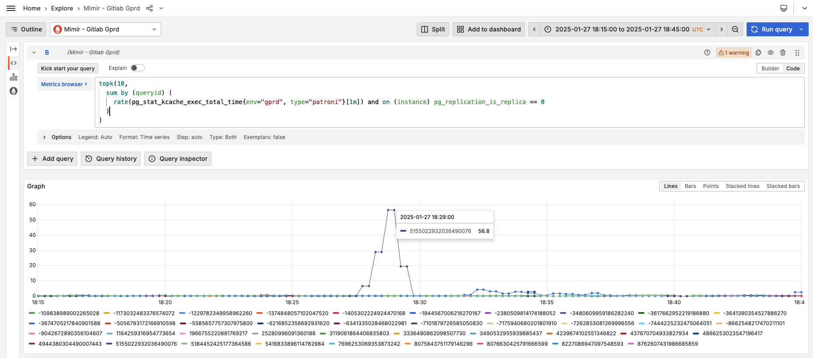

# Primary Database Node CPU Saturation Analysis

**Table of Contents**

[TOC]

## Why do we need this alert?

The goal of the PrimaryDatabaseCPUSaturation alert is to let us know that there was spike in CPU pressure on the primary database node,
so we can investigate while we still have logs available and before the situation gets worse. The alert triggers when CPU pressure
is over three standard deviations above average. More information on the PromQL query that is used can be found
[here](https://gitlab.com/gitlab-org/gitlab/-/issues/502505#note_2225172399). For unfiltered visualization of this query click
[here](https://dashboards.gitlab.net/goto/M32Uu_OHg?orgId=1).

Such spikes are usually short-lived and by the time we look into it the alert may have self-resolved, though we still need to investigate.

To confirm the spike:

- Go to the _"Host Stats"_ [dashboard](https://dashboards.gitlab.net/goto/jgydaSFHg?orgId=1).
- Filter by the current primary node for the database. The primary can change regularly.
To see which server is the current primary view the
[PostgreSQL Replication Overview](https://dashboards.gitlab.net/goto/fu0fQrdNR?orgId=1) dashboard.

## Create an issue

Capture all findings in an issue:

- Click [here](https://gitlab.com/gitlab-com/gl-infra/production/-/issues/new?issue[title]=YYYY-MM-DD%20HH:MM:%20CPU%20pressure%20spike%20on%20the%20primary%20node%20for%20(main|ci)%20database)
- Title: _YYYY-MM-DD HH:MM: CPU pressure spike on the primary node for (main|ci) database_
- Labels: TBD
- Assignees: TBD
- Description: Include any relevant information that is available. When referencing to sources like Mimir and Kibana,
please include both screenshot and sharable link to the source ([example](https://gitlab.com/gitlab-com/gl-infra/production/-/issues/19181)).

## How to identify the root cause?

Spikes in CPU pressure are often caused by queries that consume too much CPU time to execute or plan. The query itself may be fast,
but called many times per second.

### Total execution time

To find the top 10 statements by execution time use the following PromQL query:

```
topk(10,
  sum by (queryid) (
    rate(pg_stat_kcache_exec_total_time{env="gprd", type="patroni"}[1m]) and on (instance) pg_replication_is_replica == 0
  )
)
```

- Go to [Mimir](https://dashboards.gitlab.net/goto/NGQZUrdNg?orgId=1).
- For the `ci` database change the `type` label to `patroni-ci`.
- Adjust time range to 15 minutes before and after the alert.
- On the graph, click _"Show all"_ so that all series are rendered.
- Look for any statement(s) that stand out. In the example bellow we can see that the statement with queryid `5155022932036490076` spiked at around 18:28:00.
    

### Total plan time

To find the top 10 statements by plan time use the following PromQL query:

```
topk(10,
  sum by (queryid) (
    rate(pg_stat_statements_plan_seconds_total{env="gprd", type="patroni"}[1m]) and on (instance) pg_replication_is_replica == 0
  )
)
```

- Go to [Mimir](https://dashboards.gitlab.net/goto/-rLPU9ONg?orgId=1).
- For the `ci` database change the `type` label to `patroni-ci`.
- Adjust time range to 15 minutes before and after the alert.
- On the graph, click _"Show all"_ so that all series are rendered.
- Look for any statement(s) that stand out.

### Total number of calls

To find the top 10 statements by number of calls use the following PromQL query:

```
topk(10,
  sum by (queryid) (
    rate(pg_stat_statements_calls{env="gprd", type="patroni"}[1m]) and on (instance) pg_replication_is_replica == 0
  )
)
```

- Go to [Mimir](https://dashboards.gitlab.net/goto/3TZu89ONg?orgId=1).
- For the `ci` database change the `type` label to `patroni-ci`.
- Adjust time range to 15 minutes before and after the alert.
- On the graph, click _"Show all"_ so that all series are rendered.
- Look for any statement(s) that stand out.

### Other sources

The following dashboards may be also useful:

- [Postgres aggregated query performance analysis](https://dashboards.gitlab.net/goto/EhpSQ9dNR?orgId=1)
- [Postgres single query performance analysis](https://dashboards.gitlab.net/goto/3o2pw9ONg?orgId=1)

To use these dashboards filter by:

- environment: `gprd`.
- type: `patroni` for the `main` database, `patroni-ci` for the `ci` database.
- fqdn: the current primary node for the database. The primary can change regularly.
To see which server is the current primary view the
[PostgreSQL Replication Overview](https://dashboards.gitlab.net/goto/fu0fQrdNR?orgId=1) dashboard.
- queryid: for single qury analysis use the respective value.'

### Other possible causes

- TODO: Add other relevant PromQL queries, e.g. LWLocks, etc.

### Map queryid to SQL

To find the normalized SQL for given queryid, follow the [mapping docs](mapping_statements.md). Usually searching the logs is enough:

- Go to [Kibana](https://log.gprd.gitlab.net/app/r/s/tYFB8).
- Update the filter and set the queryid.
- If needed increase the time range.

## References

- This documents is based on [Database Peak Analysis Report](database_peak_analysis.md)
