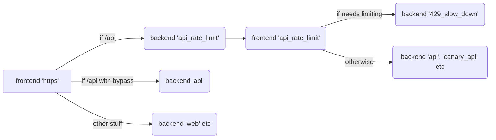

# Overview of rate limits for GitLab.com

To keep gitlab.com stable in the face of both malicious and unintentional traffic levels, we have rate-limiting (or
similar) controls at several layers, that can interact in interesting and sometimes surprising ways.  There are also a
small selection of knobs we can use  to adjust the customer experience and allow valid traffic.  This document is
intended as a holistic view of the rate-limiting to assist on-call SREs (and others) reasoning about what may be
happening, and as a place to start when looking for possible actions in response to problems. It starts with an
discussion and context; if you are looking for some more formulaic options for responding to specific sorts of
incidents, these are at the end, but deliberately so because very little about making changes has an automatic simple
answer.  Please consider strongly reading the relevant context before using those simpler sections.

## What are the current rate-limits?

Not the actual numbers, but links to where to find the current active values:
1. CloudFlare: https://dash.cloudflare.com/852e9d53d0f8adbd9205389356f2303d/gitlab.com/firewall/tools
   * Source at https://ops.gitlab.net/gitlab-com/gitlab-com-infrastructure/-/blob/master/environments/gprd/cloudflare-waf.tf
1. HAProxy: Basic per-IP API rate-limit: `knife node show fe-01-lb-gprd.c.gitlab-production.internal -a gitlab-haproxy.frontend.api.rate_limit_http_rate_per_minute`
   * There are exceptions, but this is the key one.
1. RackAttack: https://gitlab.com/admin/application_settings/network (admin access only)
   * In `User and IP Rate Limits`, and also `Protected Paths`
   * Published (manually) at https://docs.gitlab.com/ee/user/gitlab_com/#gitlabcom-specific-rate-limits

## 4 layers of Rate Limiting:

### CloudFlare

Cloudflare serves as our "outer-most" layer of protection.   We use Cloudflare's standard DDOS protection plus
[Spectrum](https://www.cloudflare.com/products/cloudflare-spectrum/) to protect git over ssh.

Our [CloudFlare documentation](https://gitlab.com/gitlab-com/runbooks/-/blob/master/docs/cloudflare/) contains a lot of
information about this layer, and is the canonical reference.  In short though, the configurable areas related
to rate-limiting are:

* Page Rules - URL pattern matches, controlling CloudFlare's DDoS interventions and caching (e.g. bypasses, security
levels etc).  These may kick in various CloudFlare level rate-limits, in response to traffic, based on the chosen
settings per rule.
* Rate Limiting - Specific rate-limits mostly on specific URLs, configured by terraform at
https://ops.gitlab.net/gitlab-com/gitlab-com-infrastructure/-/blob/master/environments/gprd/cloudflare-waf.tf.  These
are per-IP address and have no knowledge of whether the requests are authenticated or not.  Occasionally used to provide
very specific limits (e.g. on a specific project/group/URL rather than a pattern)

While CloudFlare terminates the client's TLS connection and inspects the URLs and content, it is *not* application aware
and does not know how to map to our users and groups.

Changes to either of these (additions, deletions, or modifications) must be very carefully considered indeed, and should
be discussed with the wider SRE team before implementing.

### HAProxy

We have rate limiting in HAProxy, using stick tables, per IP address per minute.  These rate-limits are only applied to
/api endpoints, for historical reasons (those were the endpoints that were problematic).  The haproxy peer configuration
is used so that all the front-end haproxy nodes share the state (only one count per IP across the fleet). As with
CloudFlare, haproxy has no concept of who the users are, it can only look at the IP addresses.

The limit is 2000/minute for consistency with RackAttack settings.  The matching/consistency of the values is *very*
important for a consistent user experience and being able to concisely express in words what will happen for any given
pattern of traffic.  Before adjusting this value, please read the two background issues [1](https://gitlab.com/gitlab-com/gl-infra/scalability/-/issues/732)
and [2](https://gitlab.com/gitlab-com/gl-infra/scalability/-/issues/707#note_464565358).  However as a TL;DR, we
want this value to be *no lower* than the highest limit in RackAttack.  It can be higher, but those numbers are already quite
high, so we'd only really want to look to drop it, in conjunction with dropping the RackAttack limits.

The rate-limiting period is per-minute, and we use the same period in RackAttack.  This should almost never be changed;
some clients actually assume this period, but it is also a reasonable one, and it makes the math easier.  Shorter would
disallow reasonable bursts, and longer would mean a prolonged impact on a given user/IP when big bursts breach the
limit.

#### Implementation

To sketch out the relevant flows through haproxy (omitting a lot of other bits), it looks something like this:

The call from the 'api_rate_limit' backend to the 'api_rate_limit' frontend is over TCP on localhost (port 4444, as currently configured).

#### Logs/metrics

These are not entirely straightforward at first glance because of the interaction of the frontends and backends diagrammed above:
1. The api_rate_limit frontend has no explicit logging config, so it uses the default format, which looks like:
    > Jan 21 01:22:37 fe-01-lb-gstg haproxy[8763]: Connect from 35.229.49.100:17532 to 35.227.123.228:443 (api_rate_limit/HTTP)
    * This is logged at the *start* of the connection, and doesn't log the backend or the HTTP response code.
1. The corresponding log from the https frontend is:
    > Jan 21 01:23:27 fe-01-lb-gstg haproxy[8763]: 35.229.49.100:17532 [21/Jan/2021:01:22:37.076] https~ TLSv1.3 api_rate_limit/localhost 22/0/1/50005/50028 204 378 1194 - - ---- 93/49/44/44/0 0/0 {gitlab-runner 13.8.0-rc1 (13-8-stable; go1.13.8; linux/amd64)} "POST /api/v4/jobs/request HTTP/1.1"
    * This is logged when the request *completes* (in this case, 50s later because it's the gitlab-runner polling)

The logs from a 429 rate-limiting example look more like this:
> Jan 21 02:08:02 fe-01-lb-gstg haproxy[8763]: Connect from 34.73.113.231:60630 to 35.227.123.228:443 (api_rate_limit/HTTP)

> Jan 21 02:08:04 fe-01-lb-gstg haproxy[8763]: 34.73.113.231:60630 [21/Jan/2021:02:08:02.812] https~ TLSv1.3 api_rate_limit/localhost 19/0/2/2000/2021 429 2362 408 - - ---- 82/43/39/39/0 0/0 {fasthttp} "GET /api/v4/todos HTTP/1.1"

The `https` frontend logs (and records in stats) the 429 it got from the backend as a true 429, but we cannot see, in the logs, the HTTP 429 generated by the 429_slow_down backend.  However it does show up in the metrics as `haproxy_backend_http_responses_total{backend="429_slow_down", code="4xx"}` where we can be sure that any 4xx code must be a 429, from haproxy itself.

#### Bypasses and special cases Sometimes we have big customers doing specific high volume API work but also sometimes

We need special handling for various partners and other scenarios.  To permit this we have lists of IP addresses (still
termed `whitelist` in the config, but we will change that one day) that are permitted to bypass the haproxy rate limit.

There are two types:
1. Internal: Full bypass, including some other protections.  Basically only the likes of CI runners.  Managed in
[chef](https://ops.gitlab.net/gitlab-cookbooks/chef-repo/-/blob/3572d94fc666cc05ca7fea00dc9a619095aa5938/roles/gprd-base-lb-fe-config.json#L257).
1. Other API: Two lists which are functionally equivalent (believed to be a refactoring that never got completed),
managed in chef at
[gitlab-haproxy.frontend.https.rate_limit_whitelist](https://ops.gitlab.net/gitlab-cookbooks/chef-repo/-/blob/3572d94fc666cc05ca7fea00dc9a619095aa5938/roles/gprd-base-lb-fe-config.json#L127)
and
[gitlab-haproxy.frontend.whitelist.api](https://ops.gitlab.net/gitlab-cookbooks/chef-repo/-/blob/3572d94fc666cc05ca7fea00dc9a619095aa5938/roles/gprd-base-lb-fe-config.json#L127).
These will [hopefully be merged](https://gitlab.com/gitlab-com/gl-infra/scalability/-/issues/632) in the near future.
Requests from these IP address are still subject to some additional checks, before bypassing the rest of the
rate-limiting.  The former is legacy, the latter the correct place for any additions.

Trusted IPs from customers/partners can be added to the second list, in `gitlab-haproxy.frontend.whitelist.api` which allows
for comments/attribution.  However, we would prefer to whittle this list *down*, not add to it, so before doing so
engage with the customer (via their TAM, probably) and endeavour to find a way to achieve their goals more efficiently.
This may require development work to enhance the API, or often webhooks (to add more information so that it can be
pushed to the customer, rather than polled), but this is likely well worth it (in some cases simply adding a couple of
fields to a webhook has eliminated the need for many API calls).

If adding a customers IPs to this list becomes unavoidable, create a (usually confidential) issue using the
[request-rate-limiting](https://gitlab.com/gitlab-com/gl-infra/infrastructure/-/issues/new?issuable_template=request-rate-limiting)
issue template discussing the justification and what steps have been taken to avoid doing so (or what could be done).
Customers who already have IPs in the list can be assumed to have a legacy grant and may have IPs added as necessary, as
long as it looks reasonable (e.g. adding a few more where there are already many; questions should be asked if they ask
to add 100 when they currently have 2).  Note also (see the RackAttack section below) that we somewhat prefer
user-specific bypasses rather than IP address bypasses, where practical.

Only CI runner managers (or similar) should ever be added to the `internal` list

It is also worth noting that requests from IPs given this bypass treatment also have the X-GitLab-RateLimit-Bypass
header set to 1, which RackAttack (see below) interprets to mean they get a bypass there as well.  This is a
sort-of-temporary measure, to allow us to enable the RackAttack rate-limiting without having to solve every high-usage
use-case before doing so.  Ideally we will remove this eventually, once the bypass list is smaller (or gone), or we've
ensured that our known users are below the new limits.

There are a few other special cases that also set X-GitLab-RateLimit-Bypass; this may change over time, but at this time
includes git-over-https, `/jwt/auth`, various package registries (e.g. maven, nuget, composer compatibility APIs), and
requests with ?go_get=1.  The full list, which should include links to the justification issue for each exception, is in
https://gitlab.com/gitlab-cookbooks/gitlab-haproxy/blob/master/templates/default/haproxy-frontend.cfg.erb.

Speaking of the package registries in particular, these have a much higher limit.  See
https://gitlab.com/gitlab-com/gl-infra/infrastructure/-/issues/11748 for a full discussion of this, but in short, the
endpoints are fairly cheap to process *and* are often hit fairly hard by deployment/build processes, and we have to
support that.  It's not out of the question that the architecture of this may change in future. The others are a bit
more special-case (and a bit less interesting) and the justifications won't be repeated here.

For the avoidance of doubt: we set X-GitLab-RateLimit-Bypass to 0 by default; any value for this in the client request
is overwritten.

See also related docs in [../frontend](../frontend/) for other information on blocking and haproxy config.

Graphs for HAProxy can be found at the [HAProxy
page](https://dashboards.gitlab.net/d/ZOOh_aNik/haproxy?orgId=1&refresh=5m) and you can look for 429 rates to get an
idea on what is being rate limited at this level, though note that some may also be coming from the application.

In the long run, these may be replaced by either rate limits in GitLab (below) or
[Cloudflare](https://gitlab.com/gitlab-com/gl-infra/infrastructure/-/issues/9709), or a combination of both.

### Application (RackAttack)

[GitLab has settings](https://docs.gitlab.com/ee/security/rate_limits.html) to manage rate limits in the application.
Most importantly, any changes to these rate limits require change issues per our change control policies -
https://about.gitlab.com/handbook/engineering/infrastructure/change-management/#change-request-workflows.

These are implemented using RackAttack, which allows us to write code matching blocks to identify classes of traffic
with specific rate-limits for each.  However this code must be quick and cheap to execute, as it might be called upon at
high rates when under attack, so there is a tension/balance to be maintained.  As such, right now we have only a few
categories:

1. Unauthenticated - the IP address is the key/identifier
1. Authenticated API - the user is the key/identifier, for /api endpoints
1. Authenticated Web - the user is the key/identifier for anything that isn't /api
1. Protected Paths - a configurable list of paths which, when POST'ed to have a low limit.  Used to protect e.g.
   /user/sign_in, although we also do similar in CloudFlare so this might be redundant in some cases.  The identifier is
   the IP address for unauthenticated, or the user if authenticated.

This list may grow a bit over time, but is unlikely to become huge while RackAttack is the implementation.  One of the
key facts is that Rails knows much more than haproxy or Cloudflare can about user identities (the actual user,
authentication methods, and so on) and is thus able to make more informed calculations about allowed levels of traffic.
Basically, an IP address is a poor proxy for identity; we use it where we have to, but Rails can do better (at a higher
execution cost)

Individual rules in RackAttack can be put into a "Dry Run" mode by naming them in the environment variable
`GITLAB_THROTTLE_DRY_RUN` supplied to the running Rails process.  This is a comma separated list of the throttle names,
which can be found in https://gitlab.com/gitlab-org/gitlab/blob/master/lib/gitlab/rack_attack.rb (look for the second
argument for calls to `throttle_or_track`).  We used this primarily while preparing to turn RackAttack on, but it might
be useful if we have to iterate in future, perhaps adding new special rate-limits.

When RackAttack identifies an actor breaching the limit, it returns an HTTP 429 response, including RateLimit headers
(as normally provided by haproxy) and a `Retry-After` header which gives a number of seconds before the current block
expires, so that well-behaved clients can back off and try again only when they'll actually be allowed.  The blocked
request is logged in the usual rails logs as a 429, but an additional log is emitted that ends up in ElasticSearch with
`json.message=Rack_Attack` (note the underscore) including the throttle that caused the block in `json.matched`, and
whether it was a dry-run (track) or active block (throttle) in `json.env`.  Note that `json.env=blocklist` comes from
an internal use of RackAttack for [rate-limiting git auth failures](https://docs.gitlab.com/ee/security/rack_attack.html#git-and-container-registry-failed-authentication-ban)
and can generally be ignored.  As for all Rails logs, the `json.meta.user` field is set if the request was authenticated
and is missing if it was anonymous.  The
[Rack Attack](https://log.gprd.gitlab.net/app/discover#/view/78d62060-560b-11eb-ad2c-31b27cd4579b?_g=%28filters%3A!%28%29%2CrefreshInterval%3A%28pause%3A!t%2Cvalue%3A0%29%2Ctime%3A%28from%3Anow-1d%2Cto%3Anow%29%29)
saved search in Kibana may be a useful starting point for analysis.

The 'period' of these rate limits is 1 minute (60 seconds), and this should almost never be changed (as for haproxy).
Some clients assume 60 seconds, and again it keeps things fairly easy to reason about.  This number should *never* be
different from the period in haproxy, because that would be entirely too complex to reason about with any confidence,
and it's already challenging enough.  The values must be considered in conjunction with the values in haproxy; as a
guide-stick, the haproxy /api per-minute rate-limit should never be lower than the largest value in RackAttack for
either unauthenticated, or authenticated API, again to maintain our ability to reason about the entire system.

As noted in the haproxy section above, a header in the request (name configured by the `GITLAB_THROTTLE_BYPASS_HEADER`
environment variable), if set to 1, allows a complete bypass of the rate-limiting in RackAttack.  The Rails logs for any
such requests have the `json.throttle_safelist` value set to `throttle_bypass_header`.

Additionally, we have some highly active users that breach the basic limits.  While we would *like* to have more
fine-grained tiers of limits, right now we simply have a trusted users bypass.  This is configured into the application
with the environment variable `GITLAB_THROTTLE_USER_ALLOWLIST`, which is a list of user ids.  This is, however, a truly
exceptional list and intended primarily for the initial enabling of rate-limiting.  We have, at this writing, only 2
entries in it and we're working to eliminate those.  Adding a user to this list requires significant discussion, with a
heavy preference to working with them and their TAM first to discover the API usage and what we can do to solve their
problem in a more efficient way.  If it becomes unavoidable, we require a (usually confidential) issue using the
[request-rate-limiting](https://gitlab.com/gitlab-com/gl-infra/infrastructure/-/issues/new?issuable_template=request-rate-limiting)
issue template, that discusses why we're doing it, what we've talked about, and what the plan is for removing it, AND
WHICH REMAINS OPEN until the bypass is removed permanently.  Link it to
https://gitlab.com/groups/gitlab-com/gl-infra/-/epics/374 so that we can track it to completion.  These are *never*
permanent, they are only stepping stones to making the API better or otherwise enhancing the product to eliminate the
excessive traffic.  In practice what we have found so far is issues like webhooks payloads lacking trivial details that
must then be scraped/polled from the API instead, and so on.

The Rails logs for any user bypass HTTP requests have the `json.throttle_safelist` value set to `throttle_user_allowlist`.

The chef configuration of the user bypass is in flux at this writing, but will soon move to a data format that requires
some commentary against the user id; include their actual name (which may change, because that's allowed), and the link
to the justification issue.  This will be updated with details at that time (although you can probably figure it out by
yourself if necessary)

Finally, and importantly, there is a moderate preference for a user-based bypass over an IP-address based one, because
as noted above, an IP address is a poor proxy for actual identity.  Not only could there be more than one person behind
a single IP address (including some we may not trust as much), but IP addresses aren't anywhere near as static as people
often assume, and they can move/change sometimes without notice (or awareness), can 'rot' where they are no longer in
use by the original user but we're not informed, and so on.  User ids are much less fungible, and carry implications of
paid groups/users and permanent identities of customers.

### Application (ApplicationRateLimiter)

The application has simple rate limit logic that can be used to throttle certain actions which is used when we need more
flexibility than what Rack Attack can provide, since it can throttle at the controller or API level.  The scope is up to the individual limit 
implementation and can be any ActiveRecord object or combination of multiple.  It is commonly per-user or per-project (or both), but it can be anything, e.g. the [RawController](https://gitlab.com/gitlab-org/gitlab/-/blob/1b86edced6397495fd2a61f2a312573dbc044aa6/app/controllers/projects/raw_controller.rb#L37) limits by project and *path*.

These rate limits are set configured in [application_rate_limiter.rb](https://gitlab.com/gitlab-org/gitlab/-/blob/master/lib/gitlab/application_rate_limiter.rb)

At this time there is no way to bypass these rate limits (e.g. for select users/groups/projects); when the rate limit is reached a plain response with a 429 status code is issued without rate limiting headers.

[Example of a rate limit response.](https://gitlab.com/gitlab-org/gitlab/-/blob/7a99c1e7b4435fa230735b9046f7a0eacfa5b5a5/app/controllers/projects_controller.rb#L525-529)

## Headers

Both haproxy and RackAttack return a set of semi-standard headers:

* RateLimit-Observed: how many requests are currently accounted against the requesting entity, for the current period
* RateLimit-Remaining: how many more requests are allowed within the current period before the rate-limit will kick in
* RateLimit-Reset: Unix epoch when the current rate-limiting period ends (basically, end of the current minute for us)
* RateLimit-ResetTime: As for RateLimit-Reset, but as a formatted date
* RateLimit-Limit: The limit per period

NB: Observed + Remaining = Limit; they're all included for convenience (I assume).

Potentially confusingly, haproxy returns these on any request to `/api` endpoints, but RackAttack only returns them
when the request has been actively rate-limited, along with the Retry-After header (number of seconds until we should
retry).  The headers from RackAttack override those from haproxy, if set.  This means:
1. Before hitting a RackAttack rate-limit, you'll only get a rough idea of the per-IP address rate-limit from haproxy
   which could be entirely wrong if RackAttack is counting, say, authenticated traffic across multiple IPs
   * This can sometimes result in sudden changes in the value of the Observed, Remaining, and Limit headers, when
     RackAttack kicks in before haproxy would have.  There's no simple solution to this, when multiple layers can
     enforce their own rate-limits.
1. Non-API endpoints will only get these headers once they hit the limit, as only RackAttack is providing them.

Finally, remember that RackAttack also returns a Retry-After header, which some client libraries use as their source of
truth for how long to back off.

NB: at this writing, RackAttack returns the wrong value for RateLimit-Reset, but this will be [fixed](https://gitlab.com/gitlab-com/gl-infra/scalability/-/issues/795)

## How-tos

So you're faced with some sort of urgent issue related to rate-limiting.  What are your basic options?

1. If you've got a small number of URLs (perhaps just one) that need severe rate-limiting (e.g. a specific repo, MR,
issue etc), use CloudFlare rate-limiting:
https://ops.gitlab.net/gitlab-com/gitlab-com-infrastructure/-/blob/master/environments/gprd/cloudflare-waf.tf
    * This would usually be a response to an incident, probably performance/apdex related where we just need breathing
      room while we clean things up, or while a code fix is prepared, and we're keeping the site alive.
    * Work with an IMOC or a peer to validate the change is reasonable and correct
    * These will typically be temporary; anything permanent needs more careful discussion
1. A user/bot is having serious difficulties because they're being rate-limited.  After ensuring that
   there's no better way to solve their problem,
    * Decide if it needs to be a user-based bypass (preferred) implemented in Rails via the environment variable, or an
      IP-address based bypass (less preferred) configured in haproxy.
    * Raise a [rate-limiting issue](https://gitlab.com/gitlab-com/gl-infra/infrastructure/-/issues/new?issuable_template=request-rate-limiting)
    * Get consensus/approval from some peers or managers that there's no other option (on the rate-limiting issue) and
      then implement it
    * Leave the issue open, linked to https://gitlab.com/groups/gitlab-com/gl-infra/-/epics/374 for tracking and so we
      can try to make things better
1. One endpoint (or related collection of endpoints) is being unduly rate-limited and we can safely increase the limit for them.  This is the same situation as the Package Registry exceptions, and there are two options:
    1. If time is of the essence, implement the increased rate-limit and set the bypass header in haproxy, as is done for the Package Registry.  This allows haproxy to be the arbiter of the rate-limit, but by IP address only.
    1. If time allows, prefer a custom RackAttack limit, particularly if it should take into account user-identity, not just IP address.  This is more flexible long term and is then usable by self-managed deployments, but may take a bit longer to be fully implemented and deployed as it requires work on the main GitLab codebase.
1. The values of the rate-limits are all wrong, and need to be raised
    * Take a deep breath.  This is a serious choice, and you need to be really certain.  The values have been chosen
      carefully, and perhaps adjusted carefully over time.  Do Not Rush.
    * Consider other options, such as special-case rate-limits in RackAttack, or setting the X-GitLab-RateLimit-Bypass
      header to 1 in haproxy for *specific* requests (URL patterns or other identifiers) to solve the immediate problem
      without causing wider damage.
    * Gather evidence (logs usually) of what is going on and why the limits are wrong, in a discussion issue in the
      infrastructure tracker, and get eyes on it.  Include at least the Infrastructure PM (Andrew Thomas), Director of
      Infrastructure (Brent Newton) and Marin Jankovski.  The Scalability team may also be able to help, although they're
      not the arbiters just interested onlookers with some experience in this area.
    * Read the other context in this document, including any constraints on values like the period, or matching values
      between haproxy and RackAttack.
    * Verify that the proposed increase is able to be absorbed by our existing infrastructure, or that we can scale the
      infrastructure up sufficiently to support it.  Consider database, gitaly, and redis, as well as front-end compute.
    * If it is agreed to proceed, raise a production change issue, linked to the earlier discussion issue, to execute the
      change.
    * Ensure https://gitlab.com/gitlab-org/gitlab/-/tree/master/doc/user/gitlab_com/#gitlabcom-specific-rate-limits is
      updated to match the new values
