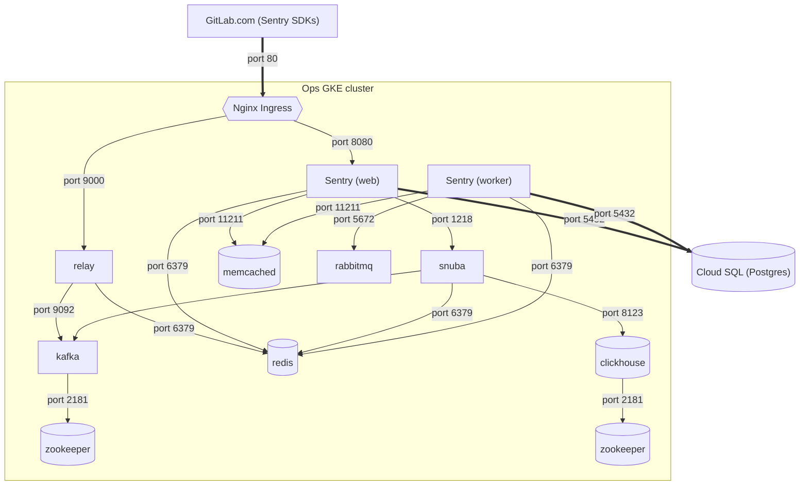

# Managing Sentry in Kubernetes

The following runbooks only applies to the instance of Sentry running in the `ops-gitlab-gke` cluster (running Sentry 22.9.0+). They are **not applicable** to the old instance of Sentry running on a single VM (version 9.1.2).

## Architecture

The figure below is overly simplified and likely woefully incomplete, but should give you a good idea of how many moving parts are involved in this Sentry installation.



The Cloud SQL Postgres database can be accessed in the GCP console [here](https://console.cloud.google.com/sql/instances/sentry/overview?project=gitlab-ops).

## Charts

The Helm chart we are using to manage the Sentry deployment is located [here](https://github.com/sentry-kubernetes/charts/tree/develop/sentry). The maintainers are very open to contributions!

The Helm release for our deployment can be found [here](https://gitlab.com/gitlab-com/gl-infra/k8s-workloads/gitlab-helmfiles/-/tree/master/releases/sentry). Note the various extras needed:

* [External secrets](https://gitlab.com/gitlab-com/gl-infra/k8s-workloads/gitlab-helmfiles/-/blob/master/releases/sentry/secrets-values.yaml.gotmpl)
* [Nginx ingress](https://gitlab.com/gitlab-com/gl-infra/k8s-workloads/gitlab-helmfiles/-/blob/master/releases/sentry/ops-ingress.yaml.gotmpl)
* [Cloud SQL proxy](https://gitlab.com/gitlab-com/gl-infra/k8s-workloads/gitlab-helmfiles/-/blob/master/releases/sentry/ops-sql-proxy.yaml.gotmpl) (which uses [this chart](https://github.com/rimusz/charts/tree/master/stable/gcloud-sqlproxy))
* [Clickhouse](https://gitlab.com/gitlab-com/gl-infra/k8s-workloads/gitlab-helmfiles/-/blob/master/releases/sentry/charts/sentry-extras/templates/clickhouse.yaml) (managed via an [operator](https://github.com/Altinity/clickhouse-operator), which uses [this chart](https://github.com/Altinity/clickhouse-operator/tree/master/deploy/helm))

## Administration

### Access to Sentry

Access to Sentry is granted through Okta assignment - i.e. if the user is in a group that is assigned Sentry in Okta, they can access it (see [this comment](https://gitlab.com/gitlab-com/team-member-epics/access-requests/-/issues/23666#note_1534063888) as an example). If they don't have access, they'll see a message like _User is not assigned to this application_ after attempting to login.

For teams that are requesting access, it is *highly recommended* that their team Okta group is assigned to Sentry, so that any changes in membership (e.g. people leaving/joining) are automatically synced over. This means creating an [access request](https://about.gitlab.com/handbook/business-technology/end-user-services/onboarding-access-requests/access-requests/) for IT to action as we do not have admin access to Okta.

For individuals who are in teams that don't need day-to-day access to Sentry, the [`okta-sentry-member-users` Google group](https://groups.google.com/a/gitlab.com/g/okta-sentry-member-users/about) can be used to grant access. This is especially useful when we want to unblock people ASAP without having to wait on IT to action an AR. Simply add the person requesting access to the group and they should be able to access Sentry within an hour.

### User roles

Sentry's various roles are documented [here](https://docs.sentry.io/product/accounts/membership/).

All users are provisioned as `Members` of the GitLab org in Sentry by default. This allows them to view and act on issues, as well as join or leave Sentry teams.

Confusingly, Sentry's org-level `Admin` role is not the one with the most permissions (that's `Owner`, and only the `ops-contact` user has this role).

There is a [`okta-sentry-admin-users`](https://groups.google.com/a/gitlab.com/g/okta-sentry-admin-users/about) Google group, intended to grant the `Admin` role to its members. However, due to some strangeness with either Sentry or Okta, the updates aren't pushed to Sentry.

For the purposes of supporting Sentry (e.g. adding new projects, configuring existing ones, etc.), the `Manager` role should be enough. Since we don't have a Google group for that role, you may need to use the following workaround to assign the role to someone who needs it, e.g. a new member of the Observability team.

1. Go to [this page](https://new-sentry.gitlab.net/manage/). You _should_ be prompted to re-authenticate as superuser, do so.
1. Go to the user you want to give the new role to via the [list of members](https://new-sentry.gitlab.net/settings/gitlab/members/).
1. If the options under `Organization Role` are greyed out, force refresh the page.
1. Select the new role and click **Save Member**.

### Projects and teams

The `Member` role does not allow people to create new projects or teams in Sentry, so they have to be provisioned by us manually. This gives us the opportunity to gatekeep a little. Ensure that:

* There isn't already an existing project for what the user is requesting
* Only one project is created for an application, even if it has different environments (i.e. `my-awesome-app` in `pre`, `gstg` and `gprd` does **not** need 3 different projects like `my-awesome-app-pre`, `my-awesome-app-gstg`, `my-awesome-app-gprd`...)
* The project is assigned to the appropriate team, if the user is also requesting a new Sentry team to be created
  * Otherwise it can go into the `gitlab` Sentry team

## Integrations

The [Slack](https://docs.sentry.io/product/integrations/notification-incidents/slack/) and [GitLab](https://docs.sentry.io/product/integrations/source-code-mgmt/gitlab/) integrations have been set up. For more details see [this issue](https://gitlab.com/gitlab-com/gl-infra/reliability/-/issues/17483).

### Slack

The Slack integration allows alerts to be sent to channels and interacted with from within Slack. No special permissions are required to set up a new alert - a user simply needs to go to the [Alerts](https://new-sentry.gitlab.net/organizations/gitlab/alerts/rules/) page in Sentry to set up a new alerting rule and configure it to fire into a Slack channel.

### GitLab

The GitLab integration allows, amongst other things, for GitLab issues to be linked to Sentry events. Currently the integration is configured to use the `gitlab-com`[https://gitlab.com/gitlab-com] and [`gitlab-org`](https://gitlab.com/gitlab-org) groups which should hopefully cover 99% of use cases. Unfortunately the downside is that when creating an issue link, the integration will need to call the GitLab.com API to list _all_ subgroups and projects under those groups, and this call times out more often than not. This is a known issue with the endpoint: see [this issue](https://gitlab.com/gitlab-org/gitlab/-/issues/427965) and [this issue](https://gitlab.com/gitlab-org/gitlab/-/issues/427966). One possible workaround would be to reconfigure the integration so it only uses specific subgroups, but the downside is users will need to get in touch with us every time they want to link events to a GitLab project that isn't already covered by the integration. (This wasn't a problem in the old Sentry instance because it used the legacy GitLab integration that only did 1:1 links between Sentry and GitLab projects.)

## Upgrading Sentry

**You should only attempt upgrades when the [Sentry chart](https://github.com/sentry-kubernetes/charts) gets bumped. Some upgrades bring architectural changes which the chart should handle for us.**

### Minor upgrade

Minor upgrades should not require database migrations, and incur little to no downtime.

1. Open an MR bumping the chart version [here](https://gitlab.com/gitlab-com/gl-infra/k8s-workloads/gitlab-helmfiles/-/blob/master/bases/environments.yaml#L165-168).
1. Check if there have been any new stanzas added to the base [values file](https://github.com/sentry-kubernetes/charts/blob/develop/sentry/values.yaml) and add them to [values file for the release](https://gitlab.com/gitlab-com/gl-infra/k8s-workloads/gitlab-helmfiles/-/blob/master/releases/sentry/values.yaml.gotmpl) if necessary.
1. Review the release diff to look out for any potential breaking changes/downtime.
1. Merge the MR and get it applied in `ops`.
1. Helm will update the manifests and wait for pods to rotate.
    * If the pods fail to rotate, look into the deployment pods and check the pod events for any errors, errors could come from the application itself, so check pod logs too.
    Application errors will usually crop up in the `sentry-web` or `sentry-worker` pods.
    * You can also restart the pods yourself by running `kubectl rollout restart deployment/sentry-web` or `kubectl rollout restart deployment/sentry-worker`.
1. Double check that:
    * The Sentry UI shows the new version number (in the footer)
    * Running `sentry --version` in a shell on the web/worker pods should also return the new version number

### Major upgrade

Major upgrades usually involve database migrations.

1. Before opening any MRs, we need to ensure that the Postgres user Sentry uses for database access is granted superuser access.
    1. Forward port 5432 on the Cloud SQL proxy pod in the Sentry namespace to your local machine port 5432. The pod will usually be called something like `sentry-sql-proxy-gcloud-sqlproxy-...`
    1. Access the database via `psql` as the `postgres` user: `psql -U postgres -d sentry` (password can be found in 1Password under _Ops Sentry Cloud SQL instance_)
    1. Grant `cloudsqlsuperuser` role access to the service account used by Sentry for DB access: `grant cloudsqlsuperuser to "sentry-k8s-sa@gitlab-ops.iam";`
    1. Exit.
1. Open an MR bumping the chart version [here](https://gitlab.com/gitlab-com/gl-infra/k8s-workloads/gitlab-helmfiles/-/blob/master/bases/environments.yaml#L165-168).
1. Merge the MR and get it applied in `ops`.
1. Helm will update the manifests and wait for pods to rotate.
    * If the pods fail to rotate, look into the deployment pods and check the pod events for any errors, errors could come from the application itself, so check pod logs too.
    Application errors will usually crop up in the `sentry-web` or `sentry-worker` pods.
    * You can also restart the pods yourself by running `kubectl rollout restart deployment/sentry-web` or `kubectl rollout restart deployment/sentry-worker`
    * If the hooks aren't run (or don't finish), you'll need to run the migrations yourself:
      1. On one of the worker pods (which should already be running the new version of Sentry), bring up a shell and run `sentry upgrade`.
      1. On one of the `snuba-api` pods, run `snuba migrations migrate`.
    * You'll know if migrations failed to run if you see errors in the Sentry UI complaining about version mismatches.
1. Revoke superuser access in the DB from the service account. Follow the same instructions above to login and access the DB as the `postgres` user, then run `revoke cloudsqlsuperuser from "sentry-k8s-sa@gitlab-ops.iam";`
1. Double check that:
    * The Sentry UI shows the new version number (in the footer)
    * Running `sentry --version` in a shell on the web/worker pods should also return the new version number

## Troubleshooting

### Event ingestion

If the [stats page](https://new-sentry.gitlab.net/organizations/gitlab/stats/) shows unexplained drops in event ingestion like this:


1. Check CPU and memory utilisation on the [Cloud SQL database](https://console.cloud.google.com/sql/instances/sentry/overview?project=gitlab-ops). If CPU is pinned at 99%-100% at peak times then it will need more cores.
1. Check if there are errors in Kafka. Refer to the section on [Kafka](#kafka) for common errors and remediation steps.
    * Also check that there is enough free space on the [Kafka PVs](https://dashboards.gitlab.net/d/kubernetes-persistentvolumesusage/kubernetes-persistent-volumes?orgId=1&refresh=5m&var-datasource=default&var-cluster=ops-gitlab-gke&var-namespace=sentry&var-volume=data-sentry-kafka-0).
1. Check if there are errors in the Redis master pod.

### UI

#### Stats not reflecting new errors

If the [stats page](https://new-sentry.gitlab.net/organizations/gitlab/stats/) looks like this:


Check if the Snuba outcomes consumers are stuck on something - tail their logs using `k9s` or by running `kubectl logs deployment/sentry-snuba-outcomes-consumer --namespace=sentry`. If you don't see any logs (because they're too old), try restarting the deployment: `kubectl rollout restart deployment/sentry-snuba-outcomes-consumer --namespace=sentry`.

### Kafka

#### `OFFSET_OUT_OF_RANGE` Broker: Offset out of range

Surfaced as log messages like these in the affected consumer pods, which will also be crashlooping:

```
arroyo.errors.OffsetOutOfRange: KafkaError{code=_AUTO_OFFSET_RESET,val=-140,str="fetch failed due to requested offset not available on the broker: Broker: Offset out of range (broker 2)"}
```

This means Kafka has gone out of sync with the consumers. According to the [official docs](https://develop.sentry.dev/self-hosted/troubleshooting/#kafka), there are a number of reasons for this, but we've only previously run into this due to memory pressure.

**The resolution _does_ result in data loss!** However it can't be helped if the cluster isn't processing anything due to this error.

1. Take note of what's failing. For example, if the pods in deployment `sentry-ingest-consumer-events` are crashlooping with the above log message, we know the relevant queue in Kafka would have something to do with the `events` `ingest-consumer`.
    1. You can also run `JMX_PORT="" /opt/bitnami/kafka/bin/kafka-consumer-groups.sh --bootstrap-server localhost:9092 --all-groups -describe` to list all consumers and topics. Under normal circumstances, lag should ideally be well under 1000. A lag value in the tens of thousands or above is a sure sign something is wrong!
1. Scale down the problem deployment to 0.
1. Bring up a shell on one of the Kafka pods - doesn't matter which, in this example we'll just use `kafka-0`.
1. Check the status of the problematic consumer group (in this example, `ingest-consumer` is our consumer group).

    ```
    I have no name!@sentry-kafka-0:/$ JMX_PORT="" /opt/bitnami/kafka/bin/kafka-consumer-groups.sh --bootstrap-server localhost:9092 --group ingest-consumer -describe

    GROUP           TOPIC               PARTITION  CURRENT-OFFSET  LOG-END-OFFSET  LAG             CONSUMER-ID                                  HOST            CLIENT-ID
    ingest-consumer ingest-attachments  0          -               0               -               rdkafka-18ac30b0-09db-40e5-b3f9-cf9e77bece92 /10.252.36.95   rdkafka
    ingest-consumer ingest-transactions 0          32204576        32204580        4               rdkafka-9020993b-f5f7-4b9e-8cd5-f7047f7a0672 /10.252.33.200  rdkafka
    ingest-consumer ingest-events       0          144444096       150079891       5635795         -                                            -               -

    ```

    The output above means that the `ingest-events` topic currently has no consumers (since we scaled down the deployment to 0) and it's very behind (large lag value).
1. In order to properly recover, we also need to ensure there are no consumers active for the other topics in the consumer group. In this example we need to scale down the deployments for `sentry-ingest-consumer-attachments` and `sentry-ingest-consumer-transactions` to 0. Check that you've done this properly by rerunning the command to describe the consumer group above - `CONSUMER-ID` and `HOST` should be empty for the `ingest-attachments` and `ingest-transactions` topics afterward.
    * Failing to do this will result in a log message like `Error: Assignments can only be reset if the group 'ingest-consumer' is inactive, but the current state is Stable.` when you try and do the reset.
1. Now we have to reset the offset of the problematic topic.
    1. Do a dry run to check what the new offset will be: `JMX_PORT="" /opt/bitnami/kafka/bin/kafka-consumer-groups.sh --bootstrap-server localhost:9092 --group ingest-consumer --topic ingest-events --reset-offsets --to-latest --dry-run`
    1. If the new offset looks acceptable, execute the reset: `JMX_PORT="" /opt/bitnami/kafka/bin/kafka-consumer-groups.sh --bootstrap-server localhost:9092 --group ingest-consumer --topic ingest-events --reset-offsets --to-latest --execute`. The output should look something like:

    ```
    GROUP                          TOPIC                          PARTITION  NEW-OFFSET
    ingest-consumer                ingest-events                  0          150082383
    ```

1. Scale the deployments you scaled down before back up. They should no longer be stuck printing errors.

#### Consumer lag increasing

There are a few different reasons for this. Check the following:

1. Try restarting the deployment of consumers responsible for the group.

1. Is there enough free space on the Kafka data PVCs?

1. If Sentry was upgraded recently and everything else is working (i.e. Sentry appears to be processing events promptly and stats look fine), it may simply be deprecated queues that need to be cleaned up. For example:

    ```
    Consumer group 'snuba-post-processor' has no active members.

    GROUP                TOPIC           PARTITION  CURRENT-OFFSET  LOG-END-OFFSET  LAG             CONSUMER-ID     HOST            CLIENT-ID
    snuba-post-processor events          6          64784           64784           0               -               -               -
    snuba-post-processor transactions    0          4210372         4275501         65129           -               -               -
    snuba-post-processor events          2          25461           26568           1107            -               -               -
    snuba-post-processor transactions    4          4196411         4261798         65387           -               -               -
    snuba-post-processor events          8          151041068       154115234       3074166         -               -               -
    ...
    ```

    As per [this comment](https://github.com/getsentry/self-hosted/issues/2019#issuecomment-1470769713), the `snuba-post-processor` group was actually removed, so we shouldn't have this anymore. The ultimate fix here was to run `JMX_PORT="" /opt/bitnami/kafka/bin/kafka-consumer-groups.sh --bootstrap-server localhost:9092 --group snuba-post-processor --delete`

1. We may not be processing messages fast enough on a particular topic. In that case, we will need to add partitions and consumers to that topic.
    1. Decide how many consumers you want on the topic, then modify `values.yaml` so that the `replicaCount` of the consumer group and `TOPIC_PARTITION_COUNTS` (under `config.snubaSettingsPy`) match the new number of consumers.
        1. You cannot decrease the number of consumers (without a lot of work), only increase!
        1. Note that merging and deploying your changes at this stage doesn't actually affect the number of partitions yet, only the replica count of the consumer group.
        1. If the consumers and partition counts don't match, we'll either have inactive consumers or one consumer processing messages from multiple partitions.
    1. Bring up a shell on one of the Kafka pods (doesn't matter which).
    1. Run `JMX_PORT="" /opt/bitnami/kafka/bin/kafka-topics.sh --bootstrap-server localhost:9092 --topic <topic> --partitions <num-partitions>`
    1. Run `JMX_PORT="" /opt/bitnami/kafka/bin/kafka-consumer-groups.sh --bootstrap-server localhost:9092 --all-groups -describe`. If the repartitioning was successful, you should see a message like `Warning: Consumer group 'snuba-consumers' is rebalancing.`

#### Pods crashlooping with `KafkaError: UNKNOWN_PARTITION`

This occurs when a group/topic that a consumer is listening to disappears during a Helm upgrade for unknown reasons. You should be able to rectify this by:

1. Bringing up a shell on one of the Snuba API pods
1. Running `snuba migrations migrate --force`

### RabbitMQ

RabbitMQ problems manifest themselves as AMQP error logs in the worker pods. For example, these errors started showing up after a borked update:

```
amqp.exceptions.PreconditionFailed: Queue.declare: (406) PRECONDITION_FAILED - inequivalent arg 'durable' for queue 'counters-0' in vhost '/': received 'false' but current is 'true'
00:54:37 [CRITICAL] celery.worker: Unrecoverable error: PreconditionFailed(406, "PRECONDITION_FAILED - inequivalent arg 'durable' for queue 'counters-0' in vhost '/': received 'false' but current is 'true'", (50, 10), 'Queue.declare')
```

Unfortunately the only way I could resolve this was to forcibly reset the RabbitMQ nodes, wiping the existing queues, so this should only be done as a **last resort!**

1. Bring up a shell on any RabbitMQ pod. [RabbitMQ clusters don't have leaders](https://www.rabbitmq.com/clustering.html#peer-equality) like in other systems so you can theoretically run the following commmands on any pod you like, as long as it's part of the RabbitMQ cluster.
1. Stop the RabbitMQ app running on all pods in the cluster.
    * If I'm on the 3rd pod in a 3-pod cluster, the commands I need to run will look like this:

      ```
      rabbitmqctl -n rabbit@sentry-rabbitmq-1.sentry-rabbitmq-headless.sentry.svc.cluster.local stop_app

      rabbitmqctl -n rabbit@sentry-rabbitmq-2.sentry-rabbitmq-headless.sentry.svc.cluster.local stop_app

      rabbitmqctl stop_app
      ```

1. [Force reset](https://www.rabbitmq.com/rabbitmqctl.8.html#force_reset) all pods in the cluster.
    * In a similar 3-pod setup to above, I'd run:

      ```
      rabbitmqctl -n rabbit@sentry-rabbitmq-1.sentry-rabbitmq-headless.sentry.svc.cluster.local force_reset

      rabbitmqctl -n rabbit@sentry-rabbitmq-2.sentry-rabbitmq-headless.sentry.svc.cluster.local force_reset

      rabbitmqctl force_reset
      ```

1. Restart all the pods in the cluster. They should discover each other automatically.
    * In a similar 3-pod setup to the above, I'd run:

      ```
      rabbitmqctl start_app

      rabbitmqctl -n rabbit@sentry-rabbitmq-1.sentry-rabbitmq-headless.sentry.svc.cluster.local start_app

      rabbitmqctl -n rabbit@sentry-rabbitmq-2.sentry-rabbitmq-headless.sentry.svc.cluster.local start_app
      ```

1. Check that the cluster is back to normal by running `rabbitmqctl cluster_status`
