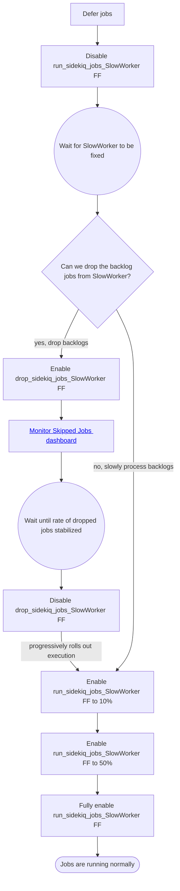

# Deferring Sidekiq jobs

## Details

During an incident, some runaway worker instances could saturate infrastructure resources (database and database connection pool).
If we let these workers to keep running, the entire system performance can be significantly impacted. Workers can be deferred to prevent such extreme cases, more development details can be found [here](https://docs.gitlab.com/ee/development/sidekiq/#deferring-sidekiq-workers).

Sidekiq workers can be deferred in two ways.

### 1. Based on database health check

Batched background migrations framework has a [throttling mechanism](https://docs.gitlab.com/ee/development/database/batched_background_migrations.html#throttling-batched-migrations) based on certain database health indicators, the same is extended for Sidekiq workers too.

On getting a stop signal from any of those health indicators, the sidekiq worker will be deferred (by default for 5 seconds). To enable this automatic deferring each worker should explicitly opt-in by calling `defer_on_database_health_signal` with appropriate parameters.

Example: [MR!127732](https://gitlab.com/gitlab-org/gitlab/-/merge_requests/127732)

#### Possible downside

With increased number of workers opting in for this, there can be an overload on database health check indicators. Current [indicators](https://gitlab.com/gitlab-org/gitlab/-/tree/master/lib/gitlab/database/health_status/indicators) query database and the prometheus to determine the overall health, there is an [issue!413961](https://gitlab.com/gitlab-org/gitlab/-/issues/413961) opened to cache the indicator results to make the process more performant.

#### Controlling indicator checks using feature flags

Each indicator has it's own feature flag (eg: [db_health_check_wal_rate](https://gitlab.com/gitlab-org/gitlab/-/blob/master/lib/gitlab/database/health_status/indicators/wal_rate.rb#L11)). They can be disabled to allow the sidekiq worker to ignore that particular indicator, but please be aware that those FFs are not worker specific (i.e: it applies to all opted in workers and batched background migrations).

### 2. Using feature flags via ChatOps

We have a mechanism to defer jobs from a Worker class by disabling a feature flag `run_sidekiq_jobs_{WorkerName}` via ChatOps.
This feature flag is enabled for all workers by default.

By default, jobs are **delayed for 5 minutes** indefinitely until the feature flag is enabled. The delay can be set via
setting environment variable `SIDEKIQ_DEFER_JOBS_DELAY` in seconds.

Be aware that having massive backlog of deferred jobs to be run all at once may cause thunderring herd which blocks other workers in the queue.
We've seen this happened during [incident 14758](https://gitlab.com/gitlab-com/gl-infra/production/-/issues/14758#note_1426042281) on 2023-06-07.

If we could get away with not processing the backlog jobs at all, we can [drop the jobs](#dropping-jobs-using-feature-flags-via-chatops) entirely instead of deferring them.

Refer to the flowchart below to better understand the scenarios between dropping and deferring jobs:



The implementation can be found at [SkipJobs Sidekiq server middleware](https://gitlab.com/gitlab-org/gitlab/-/blob/master/lib/gitlab/sidekiq_middleware/skip_jobs.rb).

More details can be found [here](https://docs.gitlab.com/ee/development/feature_flags/#deferring-sidekiq-jobs)

#### Example

When the feature flag is set to true, 100% of the jobs will be deferred. Then, we can also use **percentage of time** rollout
to progressively let the jobs processed. For example:

```shell
# not running any jobs, deferring all 100% of the jobs
/chatops run feature set run_sidekiq_jobs_SlowRunningWorker false --ignore-feature-flag-consistency-check

# only running 10% of the jobs, deferring 90% of the jobs
/chatops run feature set run_sidekiq_jobs_SlowRunningWorker --random 10 --ignore-feature-flag-consistency-check

# running 50% of the jobs, deferring 50% of the jobs
/chatops run feature set run_sidekiq_jobs_SlowRunningWorker --random 50 --ignore-feature-flag-consistency-check

# back to running all jobs normally
/chatops run feature delete run_sidekiq_jobs_SlowRunningWorker --ignore-feature-flag-consistency-check
```

Note that `--ignore-feature-flag-consistency-check` is necessary as it bypasses the consistency check between staging and production.
It is totally safe to pass this flag as we don't need to turn on the feature flag in staging during an incident.

To ensure we are not leaving any worker being deferred forever, check all feature flags matching `run_sidekiq_jobs`:

```shell
/chatops run feature list --match run_sidekiq_jobs
````

#### Production check in ChatOps

Setting a feature flag in production triggers a production check by default (noted by the ChatOps response `Production check initiated, this may take up to 300 seconds ...`).
This production check might fail in case of:

- Incidents with ~"blocks feature-flags"
- CRs with ~"blocks feature-flags"
- The health of different services using the following [thanos query](https://thanos-query.ops.gitlab.net/graph?g0.expr=gitlab_deployment_health%3Aservice%7Benv%3D%22gprd%22%7D&g0.tab=0&g0.range_input=6h)
- If production canary is up

In this case, we can use `--ignore-production-check` in case the ongoing incident itself has ~"blocks feature-flags":

```
/chatops run feature set run_sidekiq_jobs_SlowRunningWorker false --ignore-feature-flag-consistency-check --ignore-production-check
```

## Dropping jobs using feature flags via ChatOps

Similar to deferring the jobs, we could enable `drop_sidekiq_jobs_{WorkerName}` FF (disabled by default) to drop the jobs entirely (removed from the queue).

Example:

```shell
# drop all jobs
/chatops run feature set drop_sidekiq_jobs_SlowRunningWorker true --ignore-feature-flag-consistency-check

# back to running all jobs normally
/chatops run feature delete drop_sidekiq_jobs_SlowRunningWorker --ignore-feature-flag-consistency-check
```

Note that `drop_sidekiq_jobs` FF has precedence over the `run_sidekiq_jobs` FF. This means when `drop_sidekiq_jobs` FF is enabled and `run_sidekiq_jobs` FF is disabled,
`drop_sidekiq_jobs` FF takes priority, thus the job is dropped. Once `drop_sidekiq_jobs` FF is back to disabled, jobs are then deferred due to `run_sidekiq_jobs` still disabled.

## Disabling the SkipJobs middleware

The [SkipJobs Sidekiq server middleware](https://gitlab.com/gitlab-org/gitlab/-/blob/master/lib/gitlab/sidekiq_middleware/skip_jobs.rb)
introduces overhead for checking feature flag first (`Feature.enabled?`) before running every job.

The overhead includes:

- 1 DB call per worker per hour ([since Redis cache TTL is 1 hour](https://gitlab.com/gitlab-org/gitlab/-/blob/47c8eca764c926ecdf0897f7b992353bb231b7c1/lib/feature.rb#L303))
- 1 Redis call per pod per worker per minute ([since thread local cache TTL is 1 minute](https://gitlab.com/gitlab-org/gitlab/-/blob/47c8eca764c926ecdf0897f7b992353bb231b7c1/lib/feature.rb#L310-310))

If the overhead turns out significantly impacting all workers performance, we can disable the middleware
by setting the environment variable `SIDEKIQ_SKIP_JOBS` to `false` or `1` and restart the Sidekiq pods.

## Observability

### Logging

- Instead of `done` or `fail`, jobs deferred will have 'job_status' as `deferred` and jobs dropped will have `dropped`.
- `job_deferred_by` will have `feature_flag` or `database_health_check` as its value based on which mechanism deferred the job.
- `deferred_count` field increases whenever a job is deferred.

### Alert

Whenever a job is skipped (deferred or dropped), a counter `sidekiq_jobs_skipped_total` is incremented. An alert will fire
if jobs are being deferred consecutively for a long period of time (currently 3 hours). This alert helps to
prevent when jobs are unintentionally being skipped for a long time (i.e. when someone forgets to remove
the feature flag).

The dashboard for this alert can be found at [sidekiq: Worker Detail](https://dashboards.gitlab.net/d/sidekiq-worker-detail/sidekiq-worker-detail?orgId=1&viewPanel=2019205131).
Note that skipped jobs are still counted in the [Execution Rate (RPS)](https://dashboards.gitlab.net/d/sidekiq-worker-detail/sidekiq-worker-detail?orgId=1&viewPanel=3168042924)
panel.
