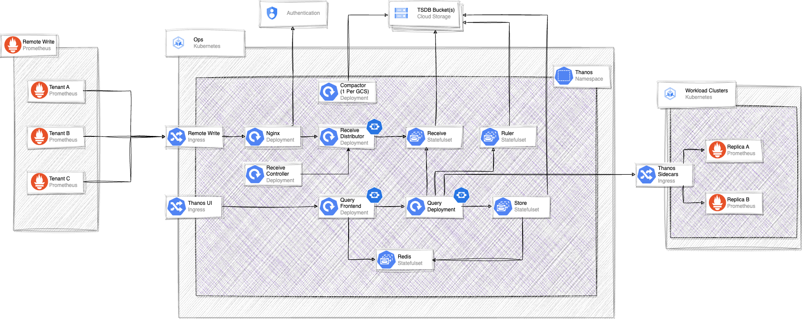

# Thanos Architecture Overview

**Table of Contents**

[TOC]

## Overview

### Metric Ingestion (Write Path)

We have two main ways of ingesting metrics in Thanos.

- `Remote Write` which follows a push based model.
  - Illustrated by the Prometheus instances on the left side of the diagram.
- `Thanos Sidecar` which follows a pull based model.
  - Illustrated by the Prometheus instances on the right side of the diagram.

Remote Write:

This leverages the [prometheus remote write](https://prometheus.io/docs/prometheus/latest/configuration/configuration/#remote_write) functionality, and enables prometheus clients to ship metrics to thanos via a push operation to the remote write endpoint.
We implement this in thanos via the `thanos-receiver` component.

Basics of a remote-write request:

- The remote write request is sent from the prometheus instance to the remote write ingress public IP.
- Apon entering the cluster we first pass this request to `nginx` which authenticates the request and injects a `THANOS_TENANT` header, which is used to associate ownership to metrics within the TSDB.
- Once authenticated the request is passed to the `thanos-receive-distributor` pods. This is effectively a router for the `thanos-receive` statefulsets. It discovers `thanos-receive` pods and decideds which tenant write quests should go where. This enables us to split tenants across multiple receivers and dsitrubte load accordingly.
- After the `thanos-receive-distributor` has routed the request it is sent to a `thanos-receive` statefulset where the data is then persisted. As per other thanos components, this data is persisted to a local persistent disk, and flushed to the GCS bucket on interval for long term storage.

Sidecar:

The sidecar method is a pull based approach. It uses a [thanos sidecar process](https://thanos.io/tip/components/sidecar.md/) which sites next to Prometheus, either on the same VM or Pod, and is responsible for uploading metrics to GCS on interval.
We call this a pull based approach as tha sidecar syncs blocks to long term storage (GCS in our case) on a 2 hour interval. This means that for any metric queries, we have to send requests to the sidecar process to get the most recent 2 hours of data. As aposed to remote-write where the data is avaialble in thanos strait away.

Basics of a sidecar metric process:

- Prometheus time series data is scraped from its targets and saved to its own local TSDB.
- The thanos sidecar process periodically uploads this local prometheus TSDB to the object storage of choice. In our case this is GCS.
- Any queries that require the most recent 2 hours of data are forwarded from thanos to the sidecar process which handles the promql and returns the data from the local prometheus TSDB.

### Querying Metrics (Read Path)

Querying of metrics in Thanos is done either through the Thanos UI/API or leveraging another interface like Grafana.
When a request comes in to thanos, by default it operates a fan out request to all of the downstream components and returning any time series data that matches the query.

Basics of a Thanos Query request:

- User initates a promql request through either [Thanos UI](https://thanos.gitlab.net) or [Grafana](https://dashboards.gitlab.net)
- The reuqest is first handled by the `thanos-query-frontend`. This is primarily a caching layer and will return any cached datapoints if available. For any uncached data, the request is then passed down to the `thanos-query` component.
- Once the request is passed on to the `thanos-query` component, it then starts to fan out the request to any downstream `store api` with matching labels. This includes the thanos ruler, receivers, storegateways, sidecars.
- The rulers, receivers and sidecars will return any data they have persisted locally on disk (usually the first 2 hours), that matches the promql query labels.
- The stores (AKA storegateways), will also receive the query and acts as a translator between the native promql query language, and a bucket fetch operations. This is where all of the long term metric data will be fetched from.
- Once all data is returned matching the query from all of the store apis, the `thanos-query` component will handle decuplication of any duplicate series and return this data to the user.

## Components

### Nginx

Handles incoming remote-write requests, authenticates these and matches the authenticated user to a thanos tenant.

### Receive Distributor

Deployment that routes remote write requests to other recievers that handle the replication and perisstence of data.
It leverages a hashring configuration file to know which receivers it can forward requests to - managed by the [receive controller](#receive-controller).

### Receive

Statefulset that handles remote write request persistence to disk. It also takes care of replication, to ensure multiple copies of each write exist.
We have the ability to spin these up for dedicated tenants to help distribute write requests, improve performance, and provide multiple failure domains.

### Receive Controller

The receive controller watches the receive statefulsets for changes, updates the hashring and notifies the receive distribotrs on any changes to reread its hashring config.
This is allows us to horizontally scale our receiver statefulsets as load demands, and spin up new ones for dedicated tenants as desired.

### Query Frontend

A caching frontend for Thanos Query. It helps to cache common requests, allowing us to speed up repeative queries. E.g Grafana Dashboards.

### Query

Handles the PromQL queries and fans out the requests to downstream store APIs. This includes receivers,ruler,storegateway,sidecar.
It can also forward requests onto other thanos query instances.
Once requests are returned it then handles the deduplication of data before returning the results to the user.

### Store

The store, also known as the storegateway, is responsible for handling promql queries and converting them in to bucket fetch requests.
This enables thanos to provide long term metrics retnetion via cheaper storage means in object storage.

### Sidecar

Enables the upload of prometheus TSDB data to object storage. This is an alternative to using prometheus remote-write.
As the block upload process only runs periodically (default 2hours), it's also responsidble for handling thanos-query requests for the most recent datasets.

### Redis/Memcached

Redis and Memcached both provide caching for various components in thanos.

### Rule

Processes prometheus recording and alerting rules. This acts in the same way as native prometheus rules, but enables us to process these over the global view of all environments that thanos provides.
