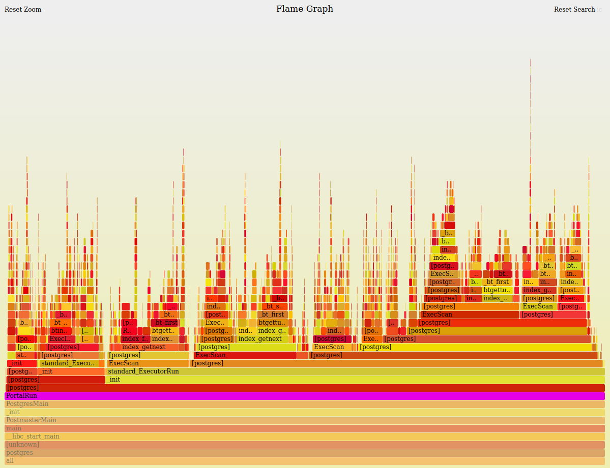

# How to use flamegraphs for performance profiling

Work in progress:
* Issue: https://gitlab.com/gitlab-com/gl-infra/infrastructure/-/issues/10399
* [Style guide](/handbook/engineering/infrastructure/tutorials/tips_for_tutorial_writing.html)


## Learning objectives

Profiling lets you observe a live system to see where the code is spending its time.
This in turn implies which application behaviors are relatively expensive (whether slow or frequently called).

Where the time is spent can shift as a result of changes to code or configuration or how users are interacting with the system.
So comparing profiles under different workloads can reveal different bottlenecks.
And comparing profiles of the same workload under different configurations or application versions can precisely identify performance regressions.

Understanding what parts of the code are expensive can help guide optimization and tuning efforts, and sometimes it uncovers unexpected inefficiencies.

In this tutorial, you will learn:

* How to generate flamegraphs using sampling profilers such as `perf` and `rbspy`.
* How to interpret the shape and structure of flamegraphs to find which code paths are hot.
* Understand what important behaviors are implicitly omitted by profilers that only sample processes while they are actively running on a CPU.

For troubleshooting defective profiling results, it is helpful but not required to have a basic understanding of how compilers and linkers work.
The essentials will be covered in this tutorial.


## Quick tour of a flamegraph

As a quick preview of what we will be learning, here is an example flamegraph with doodles highlighting some noteworthy parts.

It may look complex at first, but don't be intimidated.
By the end of this tutorial, you will know how to read the shape and structure of the graph to identify which code paths consume relatively large amounts of CPU time.


[Interactive SVG image](how_to_use_flamegraphs_for_perf_profiling/postgres_primary_db.svg)
Open this link in its own browser tab to zoom in and see full function names.


### What am I looking at?

The above flamegraph shows where CPU time is being spent by our primary production Postgres database.
For now, don't worry about the details of this particular graph; just get familiar with its appearance and layout.

We will go through this in more detail later, but as a preview, here are some key points for interpreting a flamegraph:
* Each colored cell in the graph represents a *function* that was called by one of the processes being profiled.
* As a whole, the graph represents a large collection of *stack traces*.
* Each of those stack traces records the *chain of function calls* that lead up to whatever function was actively running on the CPU at that moment in time.
* The function call chain is read from the bottom up.
  * For example, `main` calls `PostmasterMain`, which calls `_init`, which calls `PostgresMain`.
  * The tips at the top of each tower show the function that was running on the CPU during one or more of the stack traces, and all the functions directly below it are its ancestors in its call chain.
* Collectively, the graph shows which call chains were seen the most often: the wider the function's colored cell, the more often the call chain up to that point was seen by the profiler.

**Tip:** You *do not* have to know what every function does.  A little context goes a long way.

For example:
* We know that Postgres is a SQL database.
* Like most databases, when a client sends it a query, before it can run that query, it must make a plan (e.g. choose which indexes would be most efficient, what order to join tables, etc.).
* Without even looking at the source code, when we notice that the graph is showing us function `pg_plan_query` calling `standard_planner` calling `subquery_planner`,
  we can reasonably infer that this is part of Postgres' query planner code path.

Similarly:
* We know that Postgres must also run those queries after it chooses an execution plan.
* When we notice the graph showing us a wide cell for function `PortalRun` that spends most of its time calling `standard_ExecutorRun`,
  we can reasonably infer that this is a common code path for executing a query.

Conversely, if you did not already know that relational databases like Postgres have query planners, exploring that call chain in the graph would lead you
to discover that query planning is a significant activity of the database.

Exploring the call chains in a flamegraph can be way to learn interesting internal behaviors of even programs that you know very little about.


### What is this telling me?

Perhaps surprisingly, one of the stories this graph tells is that the way we currently use Postgres, it spends a larger proportion of its CPU time
parsing and planning queries than it does actually running them.

This relatively high overhead is not obvious from looking at just query latency statistics, and it is not typical of many other Postgres workloads.
CPU profiling has given us a novel perspective on the essential performance question "Where was the time spent?" -- a perspective that is specific
to our workload, configuration, and environment.


### What is causing that?

*Note:* Skip this section unless you are curious about why the overhead shown above is occurring.
This tangent is not about flamegraphs; it is about how we use Postgres at GitLab.

Why is our workload forcing Postgres to spend so much time in query planning?

The high proportion of time spent planning queries versus running them may be a side effect of the database clients not using *prepared statements*.
They connect to Postgres through a connection pooler (PgBouncer) that is configured to lease a physical db session to the client for the shortest possible duration (1 transaction).
This prevents clients from using prepared statements across transaction boundaries.

Consequently, clients must frequently resend the same query text, and Postgres must parse and plan it each time as though it was new.

Each individual query still completes quickly -- when the queries are simple, planning is quick.
But proportionally the CPU overhead is large, so at a high query rate, it adds up to a lot of CPU time.

It could save perhaps as much as 30% CPU time if clients were able to use long-lived prepared statements to parse and plan each query once and then skip the overhead during subsequent runs.
A future release of Postgres may make that possible, but currently each db session has its own private pool of prepared statements and cached query plans.


## How to make flamegraphs from `perf` profiles

Linux's `perf` tool supports several different profiling techniques.
Here we will focus on just one use case:

*Capture a timer-based series of stack traces from processes actively running on a CPU.*

Timer-based profiling is arguably the most common use-case, and mastering it gives you a good foundation for more advanced cases (e.g. profiling which code paths make calls to a specific function).


### The easy way: Helper scripts

*Note:* This is a preview of a set of convenience scripts that will soon be available on all of GitLab.com's Chef-managed hosts.
See [this issue](https://gitlab.com/gitlab-com/gl-infra/infrastructure/-/issues/10592) for current status.

These helper scripts make it easy to quickly capture a `perf` profile and generate a flamegraph with a minimum of arguments.
* They run for 60 seconds capturing stack traces at a sampling rate of 99 times per second.
* When finished, they generate a flamegraph (which you can download and open in your browser), along with the raw stack traces as a text file.
* Depending on which script you use, it will capture one, some, or all running processes on the host.

Here are the scripts:
* `perf_flamegraph_for_all_running_processes.sh` takes no arguments.
  * This is the most general-purpose script.
  * It captures the whole host's activity.  It essentially runs with no filters, so whatever processes are running on the CPU will be sampled by the profiler.
  * Use it when you do not have time to be more specific about what to capture or when you need to capture multiple processes.
  * When you view the flamegraph, you can interactively zoom in to see only the processes you care about.
* `perf_flamegraph_for_pid.sh [pid_to_capture]` takes 1 argument: the PID of the process to capture.
  * This is convenient when you want to profile a single-process application like Redis or HAProxy.
  * If you want to capture multiple PIDs, you can give it a comma-delimited PID list, but it may be simpler to instead just capture all running processes.
* `perf_flamegraph_for_user.sh [username_to_capture]` takes 1 argument: the username or UID of a Unix account whose processes you want to capture.
  * This is convenient when a multi-process application runs as a specific user, such as `gitlab-psql` on our `patroni-XX` hosts or `git` on our `web-XX` hosts.

Example: Profile the `redis-server` process on the primary redis host.

```shell
$ ssh redis-03-db-gprd.c.gitlab-production.internal

$ pgrep -a 'redis-server'
2997 /opt/gitlab/embedded/bin/redis-server 0.0.0.0:6379

$ perf_flamegraph_for_pid.sh 2997
Starting capture.
[ perf record: Woken up 1 times to write data ]
[ perf record: Captured and wrote 0.335 MB perf.data (1823 samples) ]
Flamegraph:       /tmp/perf-record-results.VIZtuZzA/redis-03-db-gprd.20200618_153650_UTC.pid_2997.flamegraph.svg
Raw stack traces: /tmp/perf-record-results.VIZtuZzA/redis-03-db-gprd.20200618_153650_UTC.pid_2997.perf-script.txt
```

You can then download the flamegraph to your workstation and open it in your (javascript-enabled) web browser to explore the results.

```shell
$ scp -p redis-03-db-gprd.c.gitlab-production.internal:/tmp/perf-record-results.VIZtuZzA/redis-03-db-gprd.20200618_153650_UTC.pid_2997.flamegraph.svg /tmp/

$ firefox /tmp/redis-03-db-gprd.20200618_153650_UTC.pid_2997.flamegraph.svg
```


[Interactive SVG image](how_to_use_flamegraphs_for_perf_profiling/redis-03-db-gprd.20200618_153650_UTC.pid_2997.flamegraph.svg)

If you wish, you can also review the individual stack traces in the `*.perf-script.txt` output file:
[perf-script.txt.gz](how_to_use_flamegraphs_for_perf_profiling/redis-03-db-gprd.20200618_153650_UTC.pid_2997.perf-script.txt.gz)

We will talk more about stack traces shortly.  For now just be aware that this is available if you need it.

Once you are comfortable using these helper scripts, you may later be interested in customizing what gets captured or how it gets rendered.
A brief introduction to such tricks is included at the end of this tutorial:
[Bonus: Custom capture using `perf record`](/handbook/engineering/infrastructure/tutorials/how_to_use_flamegraphs_for_perf_profiling.html#bonus-custom-capture-using-perf-record)


## How to capture just ruby stack traces with `rbspy`


## How to interpret flamegraphs for profiling where CPU time is spent


### Background: What is a stack trace?

When a program is run, it begins at a well-defined entry point.  (For example, in C programs, the entry point is a function named "main".)
That function typically calls other functions which perform specific tasks and then return control to the caller.
At any point in time, a thread will be executing one particular function whose called-by ancestry can be traced all the way back to the program's entry point.

Tracing the ancestry of the currently executing function is called generating a "stack trace".

Each function call in that ancestry is called a "stack frame".

Generating a stack trace effectively means figuring out the name of the function associated with each stack frame.

Recovering the names of the functions for compiled software can be surprisingly hard.
In pursuit of other efficiencies, compilers often make tracing difficult.  Usually this shows up as missing stack frames or unknown function names.
Later we will review a few examples, but for now, just be aware that these deficiencies can occur and the remedy (adding debug symbols) may or may not
be straightforward depending on how the software was built.


#### Example stack trace

Here is an example stack trace, showing a Redis thread doing a key lookup.
For now, ignore the 1st and 3rd columns; just look at the middle column which shows the function name for each stack frame.

```
           2c63d  dictFind                (/opt/gitlab/embedded/bin/redis-server)
           47c1d  getExpire               (/opt/gitlab/embedded/bin/redis-server)
           47d4e  keyIsExpired            (/opt/gitlab/embedded/bin/redis-server)
           48a92  expireIfNeeded          (/opt/gitlab/embedded/bin/redis-server)
           48b2b  lookupKeyReadWithFlags  (/opt/gitlab/embedded/bin/redis-server)
           48bdc  lookupKeyReadOrReply    (/opt/gitlab/embedded/bin/redis-server)
           56510  getGenericCommand       (/opt/gitlab/embedded/bin/redis-server)
           306ee  call                    (/opt/gitlab/embedded/bin/redis-server)
           30dd0  processCommand          (/opt/gitlab/embedded/bin/redis-server)
           41b65  processInputBuffer      (/opt/gitlab/embedded/bin/redis-server)
           29f24  aeProcessEvents         (/opt/gitlab/embedded/bin/redis-server)
           2a253  aeMain                  (/opt/gitlab/embedded/bin/redis-server)
           26bc9  main                    (/opt/gitlab/embedded/bin/redis-server)
           20830  __libc_start_main       (/lib/x86_64-linux-gnu/libc-2.23.so)
6c3e258d4c544155  [unknown]               ([unknown])
```

The top stack frame shows the currently executing function, and the bottom few stack frames show the generic entry point for the program.
As mentioned earlier, all C programs start with a function named `main`.  The bottom 2 frames in this stack trace are generic, and the `main`
frame is the earliest part of the stack that is specific to the program we are tracing (redis-server).

Reading up from the bottom, we see Redis's `main` function makes a call to `aeMain`, which calls `aeProcessEvents`, which calls `processInputBuffer`, etc.
Even without reviewing the redis source code, we can infer that `aeProcessEvents` is part of an event handler loop, and `processInputBuffer` is part of an event it is handling.

Looking further up the stack, we see `processCommand` -> `call` -> `getGenericComand`.
Again, without looking at the redis source code, we can already infer what this means, with just a little bit of background on what Redis is:
Redis is a key-value store that expects clients to send commands like `GET`, `SET`, `DEL` that operate on the keys it stores.
So this part of the stack tells us that this redis thread was performing a [GET command](https://redis.io/commands/get).
We cannot see from the stack trace what specific key it was operating on, but we can see what part of the GET command was running at the time we captured this stack trace.

Looking further up at the remaining stack frames, we can infer that redis was checking to see if the requested key is expired before responding to the client's GET command.
Redis supports tagging any key with a finite time-to-live.  The `expireIfNeeded` function checks whether or not this key has exceeded its time-to-live.

So this one stack trace shows us what this redis thread was doing at a single moment in time.  How is this useful?

A single stack trace by itself can be useful if it was associated with a special event (e.g. a crash).
But for performance analysis, we usually want to capture a bunch of stack traces and aggregate them together.
This aggregation shows us which call chains occur most often, which in turn implies that is where the most time is spent.
There are some caveats that we will review later, but for now let's look at an example of how sampling stack traces
roughly every 10 milliseconds for 30 seconds can give us a picture of how our process threads are spending their CPU time.


### How are stack traces aggregated into a flamegraph?

The example stack trace we examined above was a random pick from the 637 stack traces sampled by this command:

```shell
# Find the PID of the redis-server process.

$ pgrep -a -f 'redis-server'
2997 /opt/gitlab/embedded/bin/redis-server 0.0.0.0:6379

# For 30 seconds, periodically capture stack traces from the redis-server PID at a rate of 99 times per second.

$ sudo perf record --freq 99 -g --pid 2997 -- sleep 30
[ perf record: Woken up 1 times to write data ]
[ perf record: Captured and wrote 0.125 MB perf.data (637 samples) ]

# Transcribe the raw perf.data file into text format, resolving as many function names as possible using the available debug symbols.

$ sudo perf script --header | gzip > redis_stack_traces.out.gz
```

To aggregate those 637 stack traces into a flamegraph, we can run:

```shell
$ git clone --quiet https://github.com/brendangregg/FlameGraph.git

$ zcat redis_stack_traces.out.gz | ./FlameGraph/stackcollapse-perf.pl | ./FlameGraph/flamegraph.pl > redis-server.svg
```

The `stackcollapse-perf.pl` script folds the perf-script output into 1 line per stack, with a count of the number of times each stack was seen.
Then `flamegraph.pl` renders this into an SVG image.


[View as an interactive SVG image](how_to_use_flamegraphs_for_perf_profiling/redis-server.svg)


### Flamegraphs in SVG format are interactive

When viewed in a Javascript-capable browser, the SVG image supports interactive exploration:
* Mouseover any frame to see: the full function name, the number of times that function was called in this call chain,
  and the percentage out of all sampled stacks that this function and its ancestors were seen.
  * *Example:* The `all` virtual frame is included in 100% of the 637 stack traces.  The `beforeSleep` frame is included in 38.5% (245 out of 637 stack traces).
* Zoom into any portion of the graph by clicking any frame to make it fit the full width of the display.
  This lets you more easily see the names and shape of a portion of the call graph.
  * *Example:* Click the frame for `vfs_write` in the wide righthand portion of the flamegraph.  Then to zoom back out, click either "Reset Zoom" or the bottom frame labeled `all`.
* Search for function names, to highlight all occurrences of that string.
  * *Example:* Search for `expireIfNeeded`.  Several different call chains include this function, and they are now all highlighted in magenta.
    The bottom righthand corner of the flamegraph shows that a total of 6.8% of stack traces include that frame somewhere.


### In flamegraphs, plateaus are relevant, spikes are not

When interpreting flamegraphs, the main thing to remember is: width matters, height does not.

The width of any stack frame in the flamegraph represents the number of sampled events that included the series of function calls leading up to that point.

If the event sampling strategy was timer-based sampling (e.g. capture stack traces 99 times per second if the process is currently running on CPU),
then the more often you see a common series of function calls, the more CPU time was spent there.  Consequently, any function appearing in a wide frame was part of
a frequently active call chain.

For example, in the above flamegraph, redis-server spent 47% of its CPU time in `aeProcessEvents` (where client commands get processed),
but because that frame was almost never at the top of the stack, we know that very little CPU time was spent in that function itself.  Mostly `aeProcessEvents`
calls other helper functions to perform work, such as `processInputBuffer`, `readQueryFromClient`, and the `read` syscall to read bytes from TCP sockets.

Overall, we can see from this flamegraph that redis-server spends a significant amount of its CPU time doing network I/O.

Also, ignore the colors.  By default, they are randomized from a red/orange color pallette, just to show at a glance which cells are wide.
Optionally, it is possible to choose other more meaningful color schemes, such as:
* Choose the color by function name, to more easily see multiple occurrences of functions that appear in multiple call chains.
* Use a different hue for kernel functions than userspace functions, so syscalls are easier to see.


## Common profiling gotchas

Off-CPU time, incomplete/incorrect stack traces, missing function names, catching or excluding rare outlier events


## Bonus: Custom capture using `perf record`

Without using the convenience scripts described above, the steps to make a flamegraph of all on-CPU activity for a host typically looks like this:

```shell
# Capture the profile, sampling all on-CPU processes at a rate of 99 times per second
# for a duration of 60 seconds.  Writes output to file ./perf.data.
$ sudo perf record --freq 99 -g --all-cpus -- sleep 60

# Make a transcript of stack traces, using debug symbols to try to resolve addresses
# into function names where possible.  Reads input from file ./perf.data.
$ sudo perf script --header > perf-script.txt

# Download the scripts for generating a flamegraph from the captured stack traces.
$ git clone --quiet https://github.com/brendangregg/FlameGraph.git

# Fold each stack trace into the single-line format: "[process_name];[frame1;...;frameN] [count]"
$ ./FlameGraph/stackcollapse-perf.pl < perf-script.txt > perf-script.folded.txt

# Generate a flamegraph.
$ ./FlameGraph/flamegraph.pl < perf-script.folded.txt > flamegraph.svg
```

Or more concisely:

```shell
$ git clone --quiet https://github.com/brendangregg/FlameGraph.git && export PATH=./FlameGraph:$PATH
$ sudo perf record --freq 99 -g --all-cpus -- sleep 60
$ sudo perf script --header | tee perf-script.txt | stackcollapse-perf.pl | flamegraph.pl > flamegraph.svg
```

You may still wish to use a variation of the above procedure if you need to customize some aspect of the capture or post-processing.

The next sections walk through a few examples.


### Show only stacks that match a regexp

As an optional post-processing step, before feeding the folded stack traces into `flamegraph.pl`, you can `grep` it to include
only the stack traces from a particular process name or that include a call to a particular function name.
For example, if you only want to see call chains that include a `write` syscall (i.e. writes to a file or a network socket), you can do this:

```shell
$ cat perf-script.folded.txt | grep 'vfs_write' | ./FlameGraph/flamegraph.pl > flamegraph.svg
```

### Capture a larger sample

Sometimes you may need more profiling data.  Maybe there are relatively rare call paths don't reliably get caught by the default sampling rate and duration.
To capture more data (i.e. sample more stack traces), you can either:
* Increase the duration of the capture.
* Increase the sampling rate per second.

When practical, prefer a longer duration rather than a higher sampling frequency.
A higher sampling rate is more likely to affect the performance of the processes being traced, because those processes must be paused each time their stack is captured.

To profile PID 1234 for a longer duration than 60 seconds:

```shell
# Profile all on-CPU processes for 300 seconds (5 minutes).
$ sudo perf record --freq 99 -g --pid 1234 -- sleep 300
```

To profile PID 1234 at a higher sampling frequency for a shorter duration:

```shell
# Profile PID 1234 at a sampling rate of stack traces 497 per second.
# Pausing the process every 2 ms is high overhead, so keep the duration short.
$ sudo perf record --freq 497 -g --pid 1234 -- sleep 30
```

After running `perf record`, you can generate a flamegraph using the same post-processing steps shown above (starting with the `perf script` command).

```shell
$ sudo perf script --header | tee perf-script.txt | stackcollapse-perf.pl | flamegraph.pl > flamegraph.svg
```


#### Tips for choosing a sampling rate

*TLDR:* Pick one of these safe sampling rates: 49 Hz, 99 Hz, or 497 Hz

Here's why:
* A slightly off-center rate reduces the risk of accidentally synchronizing the capture interval with some periodic behavior of the process being observed -- which would
  bias your samples and produce misleading profiling results.
* Keeping it close to a round number makes it easy to mentally estimate the expected event count: 99 HZ * 8 CPUs * 10 seconds =~ 8000 events
* These rates all have low overhead, and hence a low risk of noticeably affect the behavior or performance of the processes being traced.

Profiling costs some CPU time per event.
In our case, the per event overhead of capturing the kernel and userspace stack costs roughly 1.1 microseconds (as benchmarked on a staging host while tracing a CPU-bound process).

With the timer-based stack profiling discussed above, the sampling rate is the biggest factor affecting the cumulative overhead.
For example:

```
99 HZ (events/CPU) * 32 CPUs * 60 seconds duration * 1 microsecond/event overhead
  = 192000 microseconds of CPU time
  = 0.2 seconds of CPU time overhead spread evenly across 60 seconds and 32 CPUs
```

Even a single-threaded CPU-bound application can tolerate a 497 Hz sampling rate.
That rate would cost the application 0.05% of its CPU time:
Sampling 1 CPU at a rate of 497 times per second with an overhead of 1 microsecond per sampling event costs a total of 0.5 CPU milliseconds per wallclock second (0.05% overhead for a CPU-bound process).


### Capturing events without a timer

Capturing a profile by using a periodic timer to collect samples at a regular interval usually gives a good overview of the traced processes' behavior.

Sometimes, to dig deeper into a specific behavior, you may instead want to capture a stack trace any time the process calls a specific function or tracepoint.

Be cautious of the overhead!
With timer-based profiling, the event rate is directly controlled by you, but when profiling events like a function call, the application's behavior and workload controls the event rate.

As shown below, you can preview the event rate with a cheap counter before running the somewhat more expensive stack profiling.
If the event rate is high (e.g. over 10K events/CPU/second), then to reduce overhead you may want to only capture 1 out of every N events (`--count N`).

```shell
# Suppose we want to trace any process that asks /dev/urandom for some randomly
# generated bytes.

# First search the existing tracepoints for a good match.
$ sudo perf list | grep 'random'
  ...
  random:urandom_read                                [Tracepoint event]
  ...
  syscalls:sys_enter_getrandom                       [Tracepoint event]
  ...

# Preview the count of how often these tracepoints get called.
$ sudo perf stat --event random:urandom_read --event syscalls:sys_enter_getrandom --all-cpus -- sleep 10

# Capture a stack trace when any process triggers the chosen tracepoint.
# To reduce overhead, only capture every 1 out of 5 events instead of all events.
$ sudo perf record --event random:urandom_read --count 5 --all-cpus -g -- sleep 10
```


## Bonus: Exploring subsets of a timeline with Flamescope

The `perf-script` output can be downloaded to your laptop and loaded into Flamescope, where you can more interactively explore the data you captured:
* visualize what points in the timeline had more on-CPU activity (i.e. more stack traces collected per second)
* select any portion of the timeline and generate a flamegraph for just that timespan
* directly compare two flamegraphs, somewhat like a `diff` for visualizing which functions were more or less prominently on-CPU during timespan A versus timespan B


## Learn more


### Continuous profiling

**(TODO):**  Write and link to a tutorial on continuous profiling for golang apps on GitLab.com

In addition to the ad hoc profiling covered here, some of the GitLab components support continuous profiling.


### More about `perf` tool

The `perf` tool does much more than just stack profiling.
It is a versatile Linux-specific performance analysis tool, primarily used for counting or sampling events from the kernel or hardware.
It can also instrument events from userspace if certain dependencies are satisfied.

Many of its use-cases overlap with BPF-based instrumentation.
BPF programs typically use the kernel's `perf_events` infrastructure, and `perf` itself can attach a BPF program to a `perf_event`.

[Brendan Gregg's Perf Tutorial](http://www.brendangregg.com/perf.html) provides a rich collection of reference material, including:
* a long annotated list of `perf` one-liners
* essential background why it is sometimes challenging to reassociate function names with stack frames
* summary of the different types of events that can be instrumented
* examples of using `perf` to answer several very different kinds of questions about system performance

[kernel.org's wiki on `perf`](https://perf.wiki.kernel.org/index.php/Main_Page) provides many more details and explained examples than `perf`'s already detailed manpages.
In particular, it's [Tutorial](https://perf.wiki.kernel.org/index.php/Tutorial) includes a wealth of advice on how to use `perf`, interpret its sometimes opaque output, and troubleshoot errors.


---

# DISCARD PILE

Tips:
  * Look for wide plateaus.
    * The wider a function's cell is in the graph, the more often it was part of the call chain for the actively running function.
    * If the top of the call tree is relatively wide, then that function itself spent a lot of time running on the CPU.
  * Ignore the colors.
    * By default the colors are randomly chosen.  They just make it easier for your eyes to find the wide cells in the graph.
    * There are alternate color schemes that use different color pallettes to visually distinguish different contexts (e.g. kernel functions versus userspace functions).
      If those are in use, it will be obvious.
  * Ignore tall thin towers in the graph.
    * Tall towers just indicate a long call chain, which is just an implementation detail of the code organization and has nothing to do with performance.
    * If a tower is thin (regardless of its height), it did not spend much time on the CPU.

* For example, `PostgresMain` is the main event processing loop, so it calls a variety of other functions depending on what task it is doing at the time:
  * It calls `GetCachedPlan` to find or create an execution plan for an SQL query.
  * It calls `PortalRun` to actually execute an SQL query using whichever execution plan `GetCachedPlan` chose for that query.
* You do not have to know what every function does.

Surprisingly, this graph shows Postgres is spending a third of its CPU time in the query optimizer just choosing an execution plan for the SQL its clients send it.
It spends roughly the same amount of time planning how to run queries as it does actually running them.
Knowing this, we could potentially look for ways to reduce that overhead (e.g. caching query plans, tuning the optimizer, dropping unused indexes).

A lot of data is represented by this one graph.

It aggregates of 136399 stack traces collected from multiple postgres processes over a 60-second timespan.
Each of these stack traces represents an instant in time -- what function was running on CPU, and what chain of function calls lead up to it?
By aggregating many such point-in-time snapshots, we can see a pattern of which functions appear often.
This gives us clues about what behaviors the process is spending CPU time doing.

To interpret this graph, you *do not* have to know what every function in the graph does.
Think of it as a map to understand which code paths are prominent in whatever workload you are observing.
Context will often give you clues about behavior without even looking at the source code.

---



---

A stack profiler collects a bunch of stack traces, each of which represents what a single thread is doing at that moment in time.
These can be aggregated to show what areas of a program's source code we spend the most time executing.

Which parts of a program are most time-consuming can change depending on many factors, some of which are controlled (machine resources, configuration, etc.)
and some of which may not be (incoming workload, software's algorithm and implementation choices, etc.).
Profiling a live system can give vital clues as to where the time is spent, so that tuning and optimization efforts can focus where they will have the greatest impact.

There are several ways to represent this kind of aggregation.  Flamegraphs are one such way, popular because they provide an intuitive visual map of the performance data.
