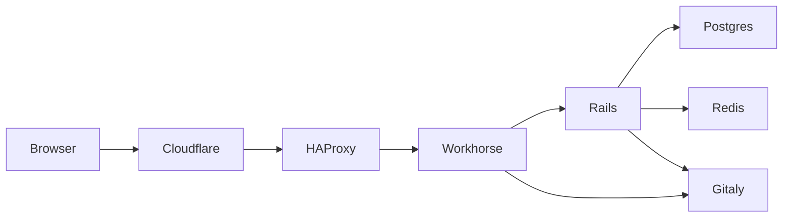

# Life of a Web Request

Work in progress:
* Issue: https://gitlab.com/gitlab-com/gl-infra/infrastructure/-/issues/10388
* [Style guide](/handbook/engineering/infrastructure/tutorials/tips_for_tutorial_writing.html)

## Introduction

GitLab is a complex application with numerous features and use cases, and the gitlab.com operating environment introduces additional dimensions
of complexity to meet requirements such as scalability and availability goals.

This tutorial tours the server-side infrastructure.  It begins with a high-level overview of the major application and infrastructure components
and then progressively introduces more details by following the life of an example request as it progresses through each major layer of the technology stack.

The application and infrastructure components are individually documented in more detail elsewhere.  This walk-through aims to give a
quick orientation and a big-picture context as a backdrop for more detailed and narrowly focused learning activities.

## Learning objectives

* Introduce the major architectural components involved in handling common types of HTTP request to gitlab.com.
* Use event logs to trace an example request through some service layers.
* Use service dashboards to observe typical throughput, latency, and error rate for the service as a whole and its individual components and workers.

## What does the service do?

GitLab.com is a large scale deployment of the GitLab product.

The [sales website](https://about.gitlab.com) describes GitLab as "a complete DevOps platform", providing a "complete CI/CD toolchain in a single application".
It includes numerous features for every stage of the software development lifecycle, from planning and roadmaps to testing and deployment automation.

At its heart, the GitLab product provides a rich suite of software development tools wrapped around git repository management, supporting a wide variety of use cases.
To get a sense of the breadth of the product, take a moment to browse the [brilliantly concise and illustrative feature matrix](https://about.gitlab.com/).

## Components of the application and infrastructure

GitLab is primarily a Ruby on Rails application, but it is supported by many other components.

This tutorial will introduce many of those components gradually, starting with a few core pieces.
We will then visit additional components as we trace some common requests on their paths through the system, giving context to the role played by each component.

If you prefer to preview the full list of components:
* The [application architecture components](https://docs.gitlab.com/ee/development/architecture.html#components) are listed in the GitLab product documentation.
* The [GitLab.com infrastructure components](https://about.gitlab.com/handbook/engineering/infrastructure/production/architecture/) are diagrammed in the Infrastructure section of the GitLab Handbook.

### Short list of core components

The main application components involved in handling a typical HTTP request are:

* Gitlab-rails: The most central component of GitLab.  Most of the application logic lives here.  Often referred to as "Puma" or "Unicorn", named after two widely-used Ruby webservers that can wrap the application (like Jetty and Tomcat do for many Java applications).
* Workhorse: A reverse-proxy service to which gitlab-rails delegates certain large HTTP requests that would be inefficient to handle natively within the Rails app due to Ruby's concurrency model.
* Gitaly: The Git storage backend which hosts the data for Git repositories and serves fetches, pushes, as well as objects displayed through gitlab-rails.
* Postgres: Relational database supporting the gitlab-rails application.
* Redis: Key-value datastore used for application metadata storage, job delivery, and caching

In addition to the above application components, some major supporting infrastructure components include:
* Cloudflare: Denial-of-service protection, web-application firewall, and caching tier for some static content.
* HAProxy: Load balancer, security control point, and first layer of request routing.
* GCP load balancers: Handles TCP connection routing from external or internal clients to backend instances of the targeted service.

## Clients and entry points

In this tutorial, we focus on clients that interact with GitLab via HTTP.

Mostly this traffic consists of:
* Web browsers using the web UI
* REST API calls from external and internal user-agents

But it also includes:
* GraphQL API calls
* Websockets

Apart from HTTP-based interactions, clients can also use git-over-SSH to interact with their repositories, but that is a topic for another tutorial.

The entry point for all of these interactions is the HAProxy fleet, which implements routing rules to delegate traffic from the main frontend (`https`)
to workload-specific backends like `api`, `web`, and `https_git`.

### What does this service do?

Gitlab-rails is the core user-facing application for GitLab. Almost all web requests targeting GitLab.com will be served by it.

For example, when you visit the GitLab source code at [gitlab-org/gitlab](https://gitlab.com/gitlab-org/gitlab), that page is rendered by a rails process.

The rails infrastructure is partitioned into distinct "webservice" fleets, serving different endpoints.

* `api`: This fleet serves API endpoints.
* `git`: This fleet serves git interactions over HTTP.
* `web`: This fleet serves user interactions. Web is what you see when you visit GitLab.com in a browser.

This partitioning can be seen in [the production architecture diagram](https://about.gitlab.com/handbook/engineering/infrastructure/production/architecture/#gitlab-com-architecture).

## Walk-through: Life of a request

For quick reference, the following diagram shows at a high level which major pieces of the service stack directly interact while handling a web request:

In practice, each service in the above diagram has multiple nodes and supporting infrastructure, but for now we will focus on high level interactions.

1. `Browser --> Cloudflare`
  * The user's web browser (or other user-agent) resolves the domain name `gitlab.com` to a Cloudflare IP address and connects to Cloudflare's nearest point-of-presence (POP or data center).
  * The browser and Cloudflare establish an SSL session, and the browser sends an HTTP request.
  * Cloudflare evaluates traffic scrubbing rules to block abuse and then forwards the HTTP request to "origin" (i.e. the HAProxy pool in our GCP infrastructure).
2. `Cloudflare -> HAProxy`
  * For tracking purposes, Cloudflare injects some extra HTTP headers into the request: the original client's IP address and a unique id for finding this request in Cloudflare's logs.
  * Cloudflare establishes an SSL session with HAProxy and forwards the HTTP request.
3. `HAProxy --> Workhorse`
  * HAProxy parses the HTTP request URI and headers, and routes the request to one of its backends.
  * As part of our release-testing process, HAProxy sends a small random percentage of requests to the `canary` stage, and the majority of requests are sent to the `main` stage.
  * If you are curious about the details of how HAProxy chooses which backend to handle a request, these rules are defined in the HAProxy configuration file (`/etc/haproxy/haproxy.cfg`) on the `fe-XX` nodes.
  * For some backends, an Nginx instance sits between HAProxy and Workhorse, but this approach is being phased out, so it is elided in this diagram.
4. `Workhorse --> Rails` and `Workhorse --> Gitaly`
  * Workhorse and Rails (Puma) are tightly coupled, typically running together on the same VM or kubernetes pod.
  * Workhorse handles certain kinds of requests that would be too expensive (harder to scale) in Rails itself.
  * For example, Git Fetch operations are often much slower than most HTTP requests (e.g. due to large response payloads and limited client network bandwidth).  It is much cheaper to delegate that IO-bound work to a goroutine in Workhorse than a Puma thread.

## Demo: Observing a single example request

TODO: This section is incomplete and still needs to be finished.

Possible methods for observing a request:

* Browser debug toolbar, fetch correlation ID from response headers
* Performance bar on gitlab.com
* Anonymous API request via curl
* Authenticated API request via curl

## Demo: How to interpret the dashboards representing service health, capacity, errors, and other key properties

TODO: This section is incomplete and still needs to be finished.

List the key behaviors again, and map them to elements on the service dashboard.

### What does normal look like?

Record a video or screenshots showing the contemporary dashboard sections.
Showing concrete examples to accompany the narrative helps tie observable traits to the abstract behaviors described in earlier sections.

### What does abnormal look like?

Pick one or two examples of abnormal behavior that can be explained in terms of the behaviors and properties described in earlier sections.
For example, show how a surge of requests jointly affects the throughput and latency graphs and may lead to queuing on upstream callers and pressure on downstream dependencies.

Use this example to briefly describe the immediate effects (e.g. client timeouts and retries, SLO alerting, auto-scaling).
If practical, offer suggestions about how to decide whether or not a case like this warrants further investigation and what some potential remedies might be.

If we have a decent runbook for this service, cite it for additional failure modes.

## Demo: How to explore patterns and changes in the nature of requests and responses

TODO: This section is incomplete and still needs to be finished.

How do we answer ad hoc questions about the service's workload and behaviors?
For some services this is easier than others, but this is always a critical topic to address.

Most services export performance metrics to efficiently answer generic questions about workload.  For this demo, focus on the next steps of investigating an anomaly, such as:
* For services that emit structured event logs (e.g. JSON formatted request logs), recent log entries are often available via Kibana, which provides convenient ad hoc filtering and aggregation.
* For long-term analysis and for unstructured event logs, raw logs are typically archived to Stackdriver and may be available for ad hoc query via BigQuery.
* When event logs do not suffice, stack profiling, dynamic tracing, or traffic sampling may lead to novel insights and inspire future enhancements to logging and instrumentation.

List what options are available for analyzing this service, and then walk through a common use-case including screenshots or recording.
Explicitly state the example questions you are showing how to answer.
Ideally make it a short progression of exploratory questions, showing how iterative analysis and assumption-testing is a crucial part of reverse engineering.
For example, suppose the service dashboard shows an increase in HTTP 500 responses.
* How do we find the associated request paths?
* Are the most common request paths for failed requests distinct from the most common request paths overall?
* Are the failures coming from a single service node?  Or a specific set of client IPs?  Do they have a distinctive user-agent string?
* Are these errors all associated with high latency, such that timeouts in this or other services may play a role?  If so, is the time spent in this service or in a dependency it calls?

## Exercises

* *Performance:*
  * What do you think would happen to this service's throughput, response latency, and error rate if...
    * One of its dependencies became 10x slower for all requests.
    * The rate of incoming requests increased by 10x.
    * 1% of incoming requests became 10x slower.
    * 50% of clients disappeared, causing the same overall request rate to be concentrated into the surviving 50% of clients.
* *Observability:*
  * What is the most common request path (or rails route) handled by this service?
  * How many nodes does this service currently run in the production environment?
  * Query the service's metrics endpoint and review the list of raw metrics.  Find an example of a gauge, counter, and histogram.  Repeat the query and see how they change over time.
  * Choose a graph on the service dashboard and review its PromQL query.  What metric is being graphed?  What labels (dimensions) does this metric provide?  How does it relate to the raw metrics exported by the service itself? (*Note:* Answering this last part may require a separate tutorial on Prometheus recording rules.)
* *Dependencies exploration:*
  * Review the service's main configuration file.  What other services is it explicitly configured to directly interact with?  Are there additional services it uses either implicitly or via dynamic configuration?
  * List or trace new and existing outgoing connections from a service node via TCP, UDP, or Unix socket.  Does this match the expected list of dependencies?
  * List or trace new and existing incoming connections to a service node via TCP, UDP, or Unix socket.  Does this match the expected list of clients?

## Summary

TODO: This section is incomplete and still needs to be finished.

Conclude with a summary of key points that ties the presented content back to the learning objectives.
How does the presented content satisfy each of the learning objectives?
Here we can use the more concrete terms and concepts covered in the material.

The goal here is to give the reader a moment to reflect on the distance traveled and enjoy a milestone on their journey.

For the tutorial author, this is an opportunity to reflect on whether the content aligns well with the learning objectives and to refine scope if needed.
