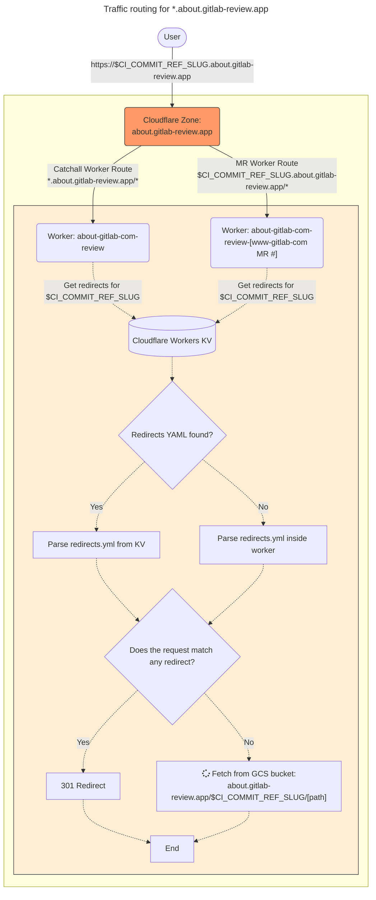
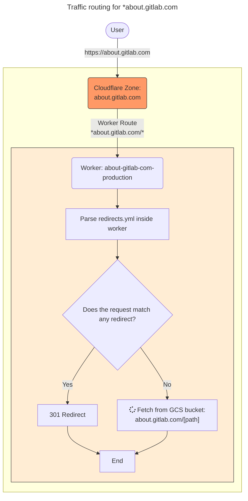

# about.gitlab.com

<!-- markdown-toc start - Don't edit this section. Run M-x markdown-toc-refresh-toc -->

**Table of Contents**

1. [Repository](#repository)
2. [Content](#content)
3. [Traffic Routing](#traffic-routing)
    * [Review Apps](#review-apps)
    * [Production](#production)
4. [www-gitlab-com CI config](#www-gitlab-com-ci-config)
5. [Q&A](#qa)
6. [Availability Issues](#availability-issues)
    * [about.gitlab.com is down](#aboutgitlabcom-is-down)
7. [Escalation](#escalation)

<!-- markdown-toc end -->

# about.gitlab.com

The [about.gitlab.com](https://gitlab.com/gitlab-com/www-gitlab-com) website is the go-to place to learn pretty much everything about GitLab: the product, pricing, various resources, blogs, support and a large part of our handbook. There is a project [underway](https://about.gitlab.com/handbook/content-websites-responsibility/migration-plan/) to migrate the handbook to <https://handbook.gitlab.com>.

## Repository

The project repository behind about.gitlab.com and its subsites (e.g., handbook) is <https://gitlab.com/gitlab-com/www-gitlab-com>.

## Content

Cloudflare serves the content via workers (more on that later), but the actual content is stored in GCS buckets:

* Production: [about.gitlab.com](https://console.cloud.google.com/storage/browser/about.gitlab.com?forceOnBucketsSortingFiltering=false&authuser=1&folder=&organizationId=&project=gitlab-production) - <https://about.gitlab.com>
* Staging: [about.staging.gitlab.com](https://console.cloud.google.com/storage/browser/about.staging.gitlab.com?forceOnBucketsSortingFiltering=false&authuser=1&folder=&organizationId=&project=gitlab-staging-1) - <https://about.staging.gitlab.com> (not currently used)
* Review Apps: [about.gitlab-review.app](https://console.cloud.google.com/storage/browser/about.gitlab-review.app?forceOnBucketsSortingFiltering=false&authuser=1&folder=&organizationId=&project=group-marketing-49659d) - <https://${CI_COMMIT_REF_SLUG}.about.gitlab-review.app>

## Traffic Routing

### Review Apps

Diagram explained:

1. User hits <https://branch-name.about.gitlab-review.app>
1. Proxied DNS record for `*.about.gitlab-review.app` means Cloudflare will process the request
1. Worker routes are configured such that:
    * If there is a separate route for `branch-name.about.gitlab-review.app`, then this means the MR contains changes to [`redirects/cloudflare-wrangler/*`](https://gitlab.com/gitlab-com/www-gitlab-com/-/tree/master/redirects/cloudflare-wrangler) so a worker for that MR was deployed and will be used for this route. This allows you to test the changes in isolation of other review apps.

    * If there is no separate route for the branch, then the request will be handled by the `*.about.gitlab-review.app` worker route, which will use the `about-gitlab-com-review` worker. This worker only gets deployed from `master` and a deployment takes place whenever there are changes to either the [`data/redirects.yml` file](https://gitlab.com/gitlab-com/www-gitlab-com/-/tree/master/data/redirects.yml) or any file under [`redirects/cloudflare-wrangler/`](https://gitlab.com/gitlab-com/www-gitlab-com/-/tree/master/redirects/cloudflare-wrangler).

**So what does the worker actually do?**

A Cloudflare Worker is fired up for every request, and the job of the worker is to process the request. Currently this means deciding if the request should be redirected or content fetched & returned from the origin (GCS), but it's just code so the possibilities are endless.

**But if the `redirects.yml` file is part of the worker, and the worker is used by multiple MRs, how do you test changes to the `redirects.yml` file in isolation?**

Previously, when we used Fastly, we were not able to test redirects in isolation. If you were to make a change to the `data/redirects.yml` file in an MR, it would affect all other review apps. For most changes, this is _not_ an issue, but the point of review apps is that you can test **your** changes in isolation, so now that we're using workers, we have a way to do that with redirects too!

We make use of a product called [Cloudflare Workers KV](https://www.cloudflare.com/products/workers-kv/), which is a serverless key/value store. Whenever there are changes to the `data/redirects.yml` file, we push the entire `data/redirects.yml` file into the KV store and use the `$CI_COMMIT_REF_SLUG` as the key (i.e., the first part of the URL). The worker logic **specifically for review environments** is to perform a KV lookup using the first part of the URL as the key (e.g., in <https://foo-bar.about.gitlab-review.app> it would be `foo-bar`):

* If the lookup fails, it means that there were no changes to the `redirects.yml` for the MR in question so we just use the `redirects.yml` that lives inside the worker.
* If the lookup succeeds, we get the YAML back so we use that.

We then parse the redirects YAML and see if we match the incoming request against the various different match styles (exact match, regex, etc). If there's no match, then we fetch the content from the origin (GCS).

### Production

The production worker uses the same logic as review apps, however for redirects we do not query the KV store. We always use the `redirects.yml` file that lives inside the worker:

## www-gitlab-com CI config

The CI config that manages Cloudflare Workers and the KV store is in <https://gitlab.com/gitlab-com/www-gitlab-com/blob/master/.gitlab-ci.yml>.

Within that file, you'll find a few jobs of interest:

* `validate-redirects`: this job runs in `master` and all MRs. It is a Ruby script that validates the `data/redirects.yml` file to ensure it is valid. Workers and/or KV changes will not happen unless validation passes.
* `deploy-site-router*`: these jobs are in charge of deploying worker changes using the [wrangler CLI tool](https://developers.cloudflare.com/workers/wrangler/). You can also use the wrangler CLI tool to rollback a deployment, livestream worker logs, manage KVs within a Workers KV namespace, perform [local debugging & testing](https://gitlab.com/gitlab-com/www-gitlab-com/blob/master/redirects/cloudflare-wrangler/README.md), and more.

## Q&A

> The boring solution seems to be to just use single/bulk redirects. Why workers?

We did look into [single](https://developers.cloudflare.com/rules/url-forwarding/single-redirects/) & [bulk redirects](https://developers.cloudflare.com/rules/url-forwarding/bulk-redirects/). You can create up to 125 single redirects per zone, and we currently have over 400 redirects so we would have had to figure out which ones can be converted to bulk redirects to keep the single redirects number down to a maximum of 125. Bulk redirects support a large number of redirects, but they are only full URL match so you can't do pattern matching. This means that you'd need a bulk redirects list per MR.

There is also a defined [execution order](https://developers.cloudflare.com/rules/url-forwarding/#execution-order) that you have no control over, and during testing it did pose a challenge as we wanted redirects to kick in before origin rules.

Additionally, it is _much_ easier to troubleshoot a broken redirect in a Worker vs a single/bulk redirect.
Using Workers also means that all logic is contained within the Worker and not spread out over multiple places (single redirects, bulk redirects, configuration rules, etc).

Finally, using Workers gives us a level of flexibility that we just don't get with single/bulk redirects.

> Why didn't you use the Workers KV store for storing redirects instead of
> embedding a `redirects.yml` file in the worker?

It mainly came down to latency & cost. There is latency when talking to KV, but you also have to keep in mind that according to Fastly, we process around 450/500 million requests per month to about.gitlab.com.

Currently, with Cloudflare you get 10 million read requests per month then it's $0.50 per million. This isn't terribly expensive, but this would only work for exact match redirects. For regex expressions, we need to process each one to see if they match the incoming URL. This means we need to perform a list request for every web request, and we get 1 million list requests per month then it's $5 per million. At 450/500 million requests per month, this is over $2000/month just on list requests.

For latency & cost reasons, it made more sense to embed the `redirects.yml` file inside the Worker and use KV only for testing changes to the `redirects.yml` within MRs.

> Why did you code it in TypeScript instead of X?

Workers fully supports JavaScript standards, and they [recommend writing Workers using JavaScript or TypeScript](https://developers.cloudflare.com/workers/platform/languages/#javascript--typescript). You could use any language that compiles to JavaScript, but most of the documentation and examples are either in plain JavaScript or TypeScript.

> Why didn't you...

"There's more than one way to skin a cat" -- this was the boring solution at the time to migrate from Fastly mimicking the behavior that was configured in the VCL.

## Availability Issues

### about.gitlab.com is down

If an issue such as: <https://gitlab.com/gitlab-com/gl-infra/production/-/issues/2087> occurs:

1. Check the [www-gitlab-com pipeline](https://gitlab.com/gitlab-com/www-gitlab-com/-/pipelines) to see if there has been a recent deployment to which you can co-relate the issue you are seeing
2. Check if there have been any recent changes to the [Cloudflare worker code](https://gitlab.com/gitlab-com/www-gitlab-com/-/tree/master/redirects/cloudflare-wrangler)
3. Check the [GCS bucket](https://console.cloud.google.com/storage/browser/about.gitlab.com?forceOnBucketsSortingFiltering=false&authuser=1&folder=&organizationId=&project=gitlab-production) to see if there is anything abnormal
4. Debug using `npx wrangler dev` ([link](https://gitlab.com/gitlab-com/www-gitlab-com/blob/master/redirects/cloudflare-wrangler/README.md)).

## Escalation

about.gitlab.com has a section dedicated to on-call support for the handbook. It is located at: <https://about.gitlab.com/handbook/content-websites-responsibility/#support-process-for-content-websites>.
