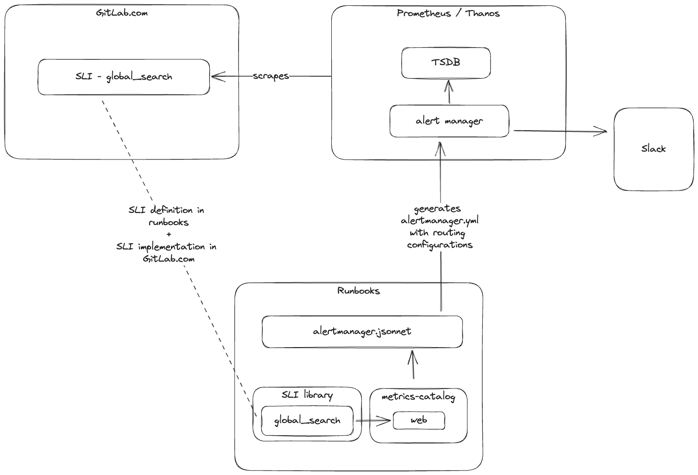

# Alert Routing Howto

How to setup alert routing for your team.

## My stage group would like to receive Slack alerts when our components violate their SLOs

You must be in an elite stage group team! 😉🙂 Thank you for shifting right and focusing on GitLab.com.

Here is a high level overview of how the pieces (SLI metric(s), SLI definition(s), and Prometheus alert manager) are tied together (using the `global_search` SLI as an example):



[Diagram source](img/alert-routing.excalidraw)

### From features to slack notifications (associating SLIs with your stage group)

In order to get a slack notifications sent to a specific channel, the steps below are required:

1. The SLOs should be defined for a specific service (from the [metrics-catalog](https://gitlab.com/gitlab-com/runbooks/-/tree/master/metrics-catalog/services)), under the monitoring thresholds field. See the service definition sample: <https://gitlab.com/gitlab-com/runbooks/-/tree/master/metrics-catalog#defining-service-monitoring>. Example: <https://gitlab.com/gitlab-com/runbooks/-/blob/e9ae5f09a1df3892aacf709a8657c186e99e054d/metrics-catalog/services/web.jsonnet#L24>

1. After the monitoring thresholds are in place, we need SLIs to measure whether we are meeting the SLO. The SLI(s) can be specified directly inside the `serviceLevelIndicators` field, or from our [SLI library](https://gitlab.com/gitlab-com/runbooks/-/blob/master/metrics-catalog/gitlab-slis/library.libsonnet)--SLIs are metrics that should be instrumented in the application, normally by the usage of a [custom SLI](https://docs.gitlab.com/ee/development/application_slis/) that's associated to a feature category. SLIs from the library should be appended to the `serviceLevelIndicators`, for example: <https://gitlab.com/gitlab-com/runbooks/-/blob/e9ae5f09a1df3892aacf709a8657c186e99e054d/metrics-catalog/services/web.jsonnet#L187>

1. With SLI(s) in place, the only missing piece is an entry in the teams section in the [teams.yml](https://gitlab.com/gitlab-com/runbooks/-/blob/e9ae5f09a1df3892aacf709a8657c186e99e054d/services/teams.yml) file, where the team information should be added along with the flag  `send_slo_alerts_to_team_slack_channel` set to true and the `slack_alerts_channel` with the channel name. For example: <https://gitlab.com/gitlab-com/runbooks/-/blob/e9ae5f09a1df3892aacf709a8657c186e99e054d/services/teams.yml#L94>.

    ```yaml
    teams:
    - name: runner
      product_stage_group: runner
      slack_alerts_channel: alerts-ci-cd
      send_slo_alerts_to_team_slack_channel: true
    ```

    1. `name` is the team's name, using alphanumeric characters only
    1. `product_stage_group` should match the `group` key in <https://gitlab.com/gitlab-com/www-gitlab-com/blob/master/data/stages.yml>
    1. The `slack_alerts_channel` is the channel in Slack that the team would like to use for alerts (without the initial '#')
    1. `send_slo_alerts_to_team_slack_channel` is a boolean flag to send regular SLO alerts to the slack channel.

The steps above will allow Prometheus alert manager to route the SLO breaches from the service(s) to the teams' slack channel. The routing rules are generated from the [alertmanager.jsonnet](https://gitlab.com/gitlab-com/runbooks/-/blob/61e96ff6d0548700f1f4832aaf17d1bfae5b6d8f/alertmanager/alertmanager.jsonnet) file.

**Notes**

A piece of code--an endpoint, background job, a controller, etc--is attributed to a feature category, used to group a feature or multiple features under the same category. This feature category belongs to a stage group, a stage group can have an associated team in [teams.yml](https://gitlab.com/gitlab-com/runbooks/-/blob/e9ae5f09a1df3892aacf709a8657c186e99e054d/services/teams.yml).

Valid feature categories can be found in <https://gitlab.com/gitlab-com/www-gitlab-com/blob/master/data/stages.yml> under the `categories` field.

These alerts are currently only supported for Service Level Indicators with a fixed feature category.
Support for SLIs with a feature category available in the source
metrics will be added in [this project](https://gitlab.com/groups/gitlab-com/gl-infra/-/epics/615)

If the metrics for the SLI are shared across multiple features, for
example requests from the Rails app, please configure the feature
category using
[`serviceLevelIndicatorDefinition.featureCategoryFromSourceMetrics`](https://gitlab.com/gitlab-com/runbooks/blob/e45223016a4b6d169198e9773c001ae476e7947e/libsonnet/servicemetrics/service_level_indicator_definition.libsonnet#L244).

## My non-stage-group group would like to receive Slack alerts

Step 1: Update the [`teams.yml`](https://gitlab.com/gitlab-com/runbooks/blob/master/services/teams.yml) file, with a new `team` entry, as follows:

```yaml
teams:
- name: data-analytics
  slack_alerts_channel: data-prom-alerts
```

Step 2: Ensure that the alert has a `team` label to match the team name from the previous step. Note that YAML configuration
files prefixed with `autogenerated-` are generated from Jsonnet. Do not edit these YAML files directly: locate the source
Jsonnet file and include the label there instead.

```yaml
    - alert: AirflowDown
      expr: >
        count(avg_over_time(up{job='airflow'}[5m]) * 100 < 50)
      for: 10m
      labels:
        alert_type: cause
        severity: s4
        team: data-analytics
```
