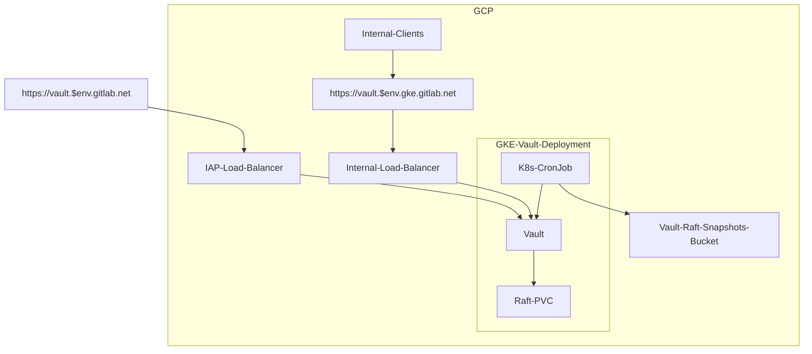
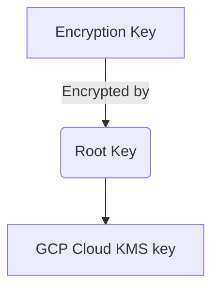

# Vault Secrets Management

[[_TOC_]]

## Summary

Vault is an identity-based secret and encryption management system. It can be used as a central store to manage access and secrets across applications, systems, and infrastructure.

## Vault Environments

We currently have two specific Vault instances setup to provide secrets to our infrastructure.

* <https://vault.gitlab.net> for all environments using secrets
* <https://vault.pre.gitlab.net> for testing configuration/deployments

## Architecture

### High Level Overview



The application is deployed in Kubernetes using the official [Vault Helm chart](https://github.com/hashicorp/vault-helm) from Hashicorp.

* [Helm chart deployment](https://gitlab.com/gitlab-com/gl-infra/k8s-workloads/gitlab-helmfiles/-/tree/master/releases/vault)
* Internal and external ingress (see [ingress section below](#ingress))

#### Availability

We run Vault in [High Availability mode](https://www.vaultproject.io/docs/concepts/ha). This consists of one active Vault server and several standby servers. Since we're using the community version, standby instances are not unsealed and are only replicating the data but are not able to read it, and they will forward all requests to the leader instance. The standby instances only unseal when being promoted to leader.

We have enabled [automatic unseal with GKMS](https://learn.hashicorp.com/tutorials/vault/autounseal-gcp-kms?in=vault/auto-unseal). The unsealing process is delegated to Google KMS in the event of a failure. The Vault cluster will coordinate leader elections and failovers internally.

We have configured 5 replicas with spread constraints for pods to be in [different hosts and be distributed in different zones](https://gitlab.com/gitlab-com/gl-infra/k8s-workloads/gitlab-helmfiles/-/blob/3477f7a2e0cce14039f577caac19fef5c522168d/releases/vault/values.yaml.gotmpl#L46-52), which gives us multi-zone failure tolerance across 3 different zones.

Raft storage is configured with regional SSD persistent disks which provide durable storage and replication of data between three zones in the same region.

Additionally, we have multi-region backups we can restore as disaster recovery (in case of full region failure) (see [storage section below](#storage)).

#### Ingress

We have one internal and one external endpoint, keeping the service from being directly exposed to the internet.

* External ingress for web user access is accessible through a GCP HTTPS load balancer that uses Google Identity-Aware Proxy
(IAP). It can be accessed through `https://vault.gitlab.net` (production) and `https://vault.pre.gitlab.net` (preprod).
  * Note: Vault CLI does not work through this load balancer at the time of this writing, see [this feature request](https://github.com/hashicorp/vault/issues/4982).
* Internal ingress for CI/Kubernetes/Terraform/Chef/Ansible/etc (API) is exposed through a Kubernetes service with a zonal network endpoint group (NEG) as a backend. The Vault service uses the default port `8200` which is then exposed on port `443` by the ingress. It can be access through `https://vault.ops.gke.gitlab.net` (production) and `https://vault.pre.gke.gitlab.net` (preprod).
  * Prometheus metrics are gathered from the endpoint `/v1/sys/metrics` on that same port.

#### Storage

Vault's Integrated Storage engine [Raft](https://www.vaultproject.io/docs/concepts/integrated-storage) is used for storage. This allows all the nodes in a Vault cluster to have a replicated copy of Vault's data locally. It is also used as the HA backend.


[Source](https://learn.hashicorp.com/tutorials/vault/raft-storage?in=vault/raft)

We are not using the enterprise version for Vault which come with automatic backups. Instead we are running a [Kubernetes CronJob](https://gitlab.com/gitlab-com/gl-infra/k8s-workloads/gitlab-helmfiles/-/blob/master/releases/vault/charts/vault-extras/templates/job.yaml) to create and save raft snapshots to a GCS bucket every hour. Manual testing was done in the `pre` environment for validation, snapshot backup, and restoration.

Snapshot backups are saved [across multiple regions in the United States](https://ops.gitlab.net/gitlab-com/gl-infra/config-mgmt/-/blob/c4c39e32b8142490dc580d930eb015cc73349f3b/modules/vault-project/variables.tf#L30) and can be used for region failure disaster recovery.

#### Resources and Configuration

* Infrastructure resources (IAM, KMS, etc) are managed through Terraform via 2 modules [vault](https://ops.gitlab.net/gitlab-com/gl-infra/config-mgmt/-/blob/master/modules/vault) (resources deployed in the projects `gitlab-pre` and `gitlab-ops`) and [vault-config](https://ops.gitlab.net/gitlab-com/gl-infra/config-mgmt/-/blob/master/modules/vault-config) (more sensitive resources deployed in a separate dedicated project) located in the `config-mgmt` repository.
  * `pre` environment Vault configuration:
    * <https://ops.gitlab.net/gitlab-com/gl-infra/config-mgmt/-/blob/master/environments/pre/vault.tf>
    * <https://ops.gitlab.net/gitlab-com/gl-infra/config-mgmt/-/blob/master/environments/vault-staging/gcp.tf>
  * `ops` environment Vault configuration:
    * <https://ops.gitlab.net/gitlab-com/gl-infra/config-mgmt/-/blob/master/environments/ops/vault.tf>
    * <https://ops.gitlab.net/gitlab-com/gl-infra/config-mgmt/-/blob/master/environments/vault-production/gcp.tf>
* To maintain consistency across deployments Vault configurations are maintained through the [Terraform provider](https://registry.terraform.io/providers/hashicorp/vault/latest/docs) and located in the `config-mgmt` repository:
  * [staging configuration](https://ops.gitlab.net/gitlab-com/gl-infra/config-mgmt/-/blob/master/environments/vault-staging)
  * [production configuration](https://ops.gitlab.net/gitlab-com/gl-infra/config-mgmt/-/blob/master/environments/vault-production)

### Authentication

#### User authentication

We're using [Google Identity-Aware Proxy](https://cloud.google.com/iap/) for the external load balancer and [Google OIDC](https://www.vaultproject.io/docs/auth/jwt/oidc_providers#google) is required to log into the Vault web interface.

#### API authentication

* CI runners can be authenticated with [JWT](https://www.vaultproject.io/docs/auth/jwt) using [JWKS](https://docs.gitlab.com/ee/ci/secrets/#configure-your-vault-server)
* GCP servers (chef client, ansible, etc) can be authenticated with [Google Cloud auth](https://www.vaultproject.io/docs/auth/gcp) (service accounts or instance service accounts)
* Kubernetes can be authenticated with [Kubernetes Service Account Tokens](https://www.vaultproject.io/docs/auth/kubernetes)

[Identities/Roles](https://www.vaultproject.io/docs/concepts/identity) and [Policies](https://www.vaultproject.io/docs/concepts/policies) are used to enforce RBAC and limit scope of access to necessary secrets. See the [Secret Access](#secret-access) section for more information.

## Security Considerations

### Data Encryption and Unsealing

Vault data is encrypted at all times. When Vault is started, it is always started in a sealed state and will not be able to decrypt data until it is unsealed.

To [unseal](https://www.vaultproject.io/docs/concepts/seal) Vault, a root key is needed to decrypt the Vault data encryption key.

To ensure that the root key is never known or leaked, we have configured auto-unseal using [`GCP KMS`](https://www.vaultproject.io/docs/configuration/seal/gcpckms) which lets us leverage GCP KMS to encrypt and decrypt the root key. Only the KMS key is able to decrypt the root key in our configuration. There is no other method possible to decrypt the root key. You can [view the configuration in terraform](https://ops.gitlab.net/gitlab-com/gl-infra/config-mgmt/-/blob/master/modules/vault-project/kms.tf).



For better security access control, the KMS key is hosted in a separated GCP project:

* Production: [`gitlab-vault-production`](https://console.cloud.google.com/security/kms/keyring/manage/global/gitlab-vault-vault-production/key?project=gitlab-vault-production)
* Staging: [`gitlab-vault-staging`](https://console.cloud.google.com/security/kms/keyring/manage/global/gitlab-vault-vault-staging/key?project=gitlab-vault-staging)

### Recovery keys

Vault uses an algorithm known as [Shamir's Secret Sharing](https://en.wikipedia.org/wiki/Shamir%27s_Secret_Sharing) to split the recovery key into shards. It is important to know that the recovery key can **only** used to generate a root token but cannot be used to unseal Vault or decrypt any data.

Additionally, we're also using end-to-end TLS encryption for Vault.

### Secret Access

#### Role-based Access Control (RBAC) Policies

Vault uses policies to govern the behavior of clients and instrument Role-Based Access Control (RBAC). A policy defines a list of paths. Each path declares the capabilities (e.g. "create", "read", "update", "delete", "list", etc) that are allowed. Vault's denies capabilities by default unless explicitly stated other wise.

There are some [built in policies](https://www.vaultproject.io/docs/concepts/policies#built-in-policies) generated by Vault and we've currently configured the following policies:

* [General usage policies](https://ops.gitlab.net/gitlab-com/gl-infra/terraform-modules/vault-configuration/-/blob/master/policies.tf)
* [GitLab CI policies](https://ops.gitlab.net/gitlab-com/gl-infra/terraform-modules/vault-configuration/-/blob/master/policies_gitlab.tf)
* [Infrastructure project GitLab CI policies](https://ops.gitlab.net/gitlab-com/gl-infra/terraform-modules/vault-configuration/-/blob/master/policies_gitlab_ci.tf)
* [Kubernetes policies](https://ops.gitlab.net/gitlab-com/gl-infra/terraform-modules/vault-configuration/-/blob/master/policies_kubernetes.tf)

#### JWT Authentication and Bound Claims

The JSON Web Token (JWT) method can be used to authenticate with Vault by a JWT authentication method or an OIDC. These JWTs can contain claims or a key/value pair. These can be used by Vault to validate that any configured "bound" parameters match which provide more granularity to authentication permissions.

For an example, see the [the bounds claims](https://ops.gitlab.net/gitlab-com/gl-infra/config-mgmt/-/blob/f3a02f1df3901361b2031bf04b110b82af1d3eee/environments/vault-staging/roles_oidc.tf#L45-47) configured for OIDC users based on Google group memberships.

More details and specifications can be found in [the Vault documentation](https://www.vaultproject.io/docs/auth/jwt#bound-claims).

## Observability

### Prometheus and Thanos

Vault is monitored via Prometheus in GKE. Configuration is done through a [`PodMonitor`](https://gitlab.com/gitlab-com/gl-infra/k8s-workloads/gitlab-helmfiles/-/blob/master/releases/vault/charts/vault-extras/templates/pod-monitor.yaml) which scrapes the `/v1/sys/metrics` endpoint. Our GKE prometheus metrics are also accessible in our Thanos cluster ([example metric](https://thanos.gitlab.net/graph?g0.expr=vault_core_unsealed&g0.tab=1&g0.stacked=0&g0.range_input=1h&g0.max_source_resolution=0s&g0.deduplicate=1&g0.partial_response=0&g0.store_matches=%5B%5D)).

A [service overview dashboard](https://dashboards.gitlab.net/d/vault-main/vault-overview) can be found in Grafana.

### Logs

We've configured audit logging to output to STDOUT which forwards logs to Kibana. You can [view Vault logs here](https://nonprod-log.gitlab.net/goto/bf582b40-097a-11ed-af31-918941b0065a).

## Usage

### Web UI

* Go to <https://vault.gitlab.net/>
* Select `oidc`, leave `Role` empty and click `Sign in with Google`
* Your session is valid for 24 hours, renewable for up to 7 days (for every consecutive day it is used)

Members of the Reliability team can also login with admin privileges by entering `admin` in the `Role` input. The admin session is valid for a maximum of 1 hour, as its usage should be limited to troubleshooting.

### CLI

*Access via Teleport is not implemented yet at the time of this writing (see <https://gitlab.com/gitlab-com/gl-infra/reliability/-/issues/15898>) but will eventually be the prefered method for accessing Vault from CLI.*

You will need to forward Vault's port 8200 locally by one of 2 ways:

* SOCKS5 proxy via SSH:

  ```shell
  # In a separate shell session
  ssh -D 9000 bastion-01-inf-ops.c.gitlab-ops.internal
  # In your first session
  export VAULT_ADDR=https://vault.ops.gke.gitlab.net
  export VAULT_PROXY_ADDR=socks5://localhost:9000
  ```

* Port-forwarding via `kubectl`:

  ```shell
  # In a separate shell session
  kubectl -n vault port-forward svc/vault-active 8200
  # In your first session
  export VAULT_ADDR=https://localhost:8200
  export VAULT_TLS_SERVER_NAME=vault.ops.gke.gitlab.net
  ```

Then you can login via the OIDC method:

```shell
vault login -method oidc
```

Members of the Reliability team can also login with admin privileges (session TTL max of 1 hour) with the following:

```shell
vault login -method oidc role=admin
```

After logging in, your Vault token is stored in `~/.vault-token` by default. Alternatively it can be set with the environment variable `VAULT_TOKEN`.

## Troubleshooting

### Determining Pod status and logs

Connect to the appropriate GKE cluster, then list/look at all pods in the `vault` namespace:

```shell
kubectl -n vault get pods
kubectl -n vault logs vault-0
```

The active node can be found with the label `vault-active=true`:

```shell
kubectl -n vault get pods -l app.kubernetes.io/name=vault -l vault-active=true
```

### Determining status of Vault from Vault itself

Connect to one of the Vault pods and run:

```shell
kubectl -n vault exec -it vault-0 sh
$ vault status
$ export VAULT_SKIP_VERIFY=true
# Ensure `Initialized` is `true` and `Sealed` is `false`
$ vault login
# enter root token
$ vault operator peers
$ vault operator raft list-peers
# Ensure all Vault pods are listed and their `State` is either `leader` or `follower`
```

Alternatively you can use a SOCKS5 proxy or forward the port `8200` and run Vault locally (see [CLI](#cli) above):

```shell
# In a separate shell session
ssh -D 9000 bastion-01-inf-ops.c.gitlab-ops.internal
# In your first session
export VAULT_ADDR=https://vault.ops.gke.gitlab.net
export VAULT_PROXY_ADDR=socks5://localhost:9000
vault login -method oidc role=admin
vault operator peers
vault operator raft list-peers
# Ensure all Vault pods are listed and their `State` is either `leader` or `follower`
```

```shell
# In a separate shell session
kubectl -n vault port-forward svc/vault-active 8200
# In your first session
export VAULT_ADDR=https://localhost:8200
export VAULT_TLS_SERVER_NAME=vault.ops.gke.gitlab.net
vault login -method oidc role=admin
vault operator peers
vault operator raft list-peers
# Ensure all Vault pods are listed and their `State` is either `leader` or `follower`
```

## Generating a root token

Official documentation: <https://learn.hashicorp.com/tutorials/vault/generate-root>

When `admin` access is not sufficient or broken, a root token can be generated using the recovery keys. For this you will need access to the entry `Vault Production` in the `Production` vault in 1password.

**:warning: Root tokens are dangerous as they allow to do anything in the cluster and don't expire. For this reason, please remember to revoke it using `vault token revoke -self` once you are done using it! :warning:**

* First, setup CLI access by following the steps in the [CLI section](#cli) above
* Verify that Vault is unsealed:

  ```shell
  vault status
  ```

  If not, [troubleshoot the issue](#determining-status-of-vault-from-vault-itself)
* Grab 3 recovery keys of the 5, and run the following:

  ```shell
  vault operator generate-root -init
  # Note the OTP in the output
  vault operator generate-root
  # Enter recovery key #1
  vault operator generate-root
  # Enter recovery key #2
  vault operator generate-root
  # Enter recovery key #3
  # The output should now show "Complete true"
  # Grab the Encoded Token from the output and the OTP from the first step and run:
  vault operator generate-root -decode $ENCODED_TOKEN -otp $OTP
  # The output is your root token, now you can export it:
  export VAULT_TOKEN=hvs.thetokenfromabove
  vault token lookup
  # This should show something like this:
  # Key                 Value
  # ---                 -----
  # accessor            XYZ
  # creation_time       1658469449
  # creation_ttl        0s
  # display_name        root
  # entity_id           n/a
  # expire_time         <nil>
  # explicit_max_ttl    0s
  # id                  hvs.thetokenfromabove
  # meta                <nil>
  # num_uses            0
  # orphan              true
  # path                auth/token/root
  # policies            [root]
  # ttl                 0s
  # type                service
  ```

* When you are done troubleshooting, please revoke the token:

  ```shell
  vault token revoke -self
  ```

## Backing up and restoring Vault

Vault Raft snapshots are taken hourly. They are created by a Kubernetes [CronJob](https://kubernetes.io/docs/concepts/workloads/controllers/cron-jobs/) that runs inside the GKE cluster that runs Vault. It uses [vault operator raft snapshot save](https://www.vaultproject.io/docs/commands/operator/raft#snapshot-save) to create an encrypted copy of all Vault data, and then uploads to it to a GCS bucket inside a separate GCP project:

* Production: [`gitlab-vault-production-vault-raft-snapshots`](https://console.cloud.google.com/storage/browser/gitlab-vault-production-vault-raft-snapshots?project=gitlab-vault-production) in `gitlab-vault-production`
* Staging: [`gitlab-vault-staging-vault-raft-snapshots`](https://console.cloud.google.com/storage/browser/gitlab-vault-staging-vault-raft-snapshots?project=gitlab-vault-staging) in `gitlab-vault-staging`

### Restoring Vault from a snapshot into an existing functional installation

Note that doing this restores everything entirely back to the state it was at the snapshot, removing all new data since the snapshot was taken.

* First identify the Vault snapshot you wish to restore and download it locally:

  ```shell
  gsutil ls gs://gitlab-vault-production-vault-raft-snapshots/
  gsutil cp gs://gitlab-vault-production-vault-raft-snapshots/2022/07/22/raft-20220722-120000+0000.snap .
  ```

* First, setup CLI access by following the steps in the [CLI section](#cli) above.
* Then [generate a root token](#generating-a-root-token)
* Restore the snapshot:

  ```shell
  vault operator raft snapshot restore raft-20220722-120000+0000.snap
  ```

* :warning: Finally, don't forget to revoke your root token!

  ```shell
  vault token revoke -self
  ```

### Restoring Vault from a snapshot into an empty installation

:warning: As we use GKMS auto-unseal for our Vault, you need to make sure the
GKMS key that was originally used with the Vault snapshot is still available. As
this is controlled by Google, they are responsible for maintaining its snapshot
and availability. :warning:

* First identify the Vault snapshot you wish to restore and download it locally:

  ```shell
  gsutil ls gs://gitlab-vault-production-vault-raft-snapshots/
  gsutil cp gs://gitlab-vault-production-vault-raft-snapshots/2022/07/22/raft-20220722-120000+0000.snap .
  ```

* Make sure the [Helm chart deployment](https://gitlab.com/gitlab-com/gl-infra/k8s-workloads/gitlab-helmfiles/-/tree/master/releases/vault) is successful
* You should see the Vault pods running and crashing in a loop (because they are uninitialized and don't have a cluster to join):

  ```shell
  kubectl -n vault get pods
  ```

* Scale down the cluster to a single pod so that replication doesn't start until the snapshot has been restored:

  ```shell
  kubectl -n vault scale sts/vault --replicas=1
  ```

* To make the following steps easier, edit `failureThreshold` of the healthchecks to some high number in the StatefulSet to prevent the unhealthy pod from restarting before you initialize it:

  ```shell
  kubectl -n vault edit sts vault
  # livenessProbe:
  #   failureThreshold: 1000
  # readinessProbe:
  #   failureThreshold: 1000
  ```

* In a separate shell session, establish port-forwarding to the pod:

  ```shell
  # In a separate shell session
  kubectl -n vault port-forward pod/vault-0 8200
  ```

* Then initialize Vault, take note of the root token and export it (no need to save it elsewhere, it will be gone after the snapshot restoration):

  ```shell
  # In your first session
  export VAULT_ADDR=https://localhost:8200
  export VAULT_TLS_SERVER_NAME=vault.ops.gke.gitlab.net
  vault operator init
  export VAULT_TOKEN=hvs.something
  ```

* Now you can force-restore the snapshot:

  ```shell
  vault operator raft snapshot restore -force raft-20220722-120000+0000.snap
  ```

* Check in the pod logs that Vault was able to restore and unseal:

  ```shell
  kubectl -n vault logs vault-0
  ```

* You can now restore `failureThreshold` to its original value in the StatefulSet:

  ```shell
  kubectl -n vault edit sts vault
  # livenessProbe:
  #   failureThreshold: 2
  # readinessProbe:
  #   failureThreshold: 2
  ```

* And scale back to 5 replicas:

  ```shell
  kubectl -n vault scale sts/vault --replicas=5
  ```

* You should now see the other pods spin up and become healthy, as they will join the Vault cluster and start replicating automatically:

  ```shell
  kubectl -n vault get pods
  ```

* To verify that the cluster is healthy, login as `admin` (or [generate a root token](#generating-a-root-token)) and then:

  ```shell
  vault login -method=oidc role=admin
  vault operator peers
  vault operator raft list-peers
  vault operator raft autopilot state
  ```
