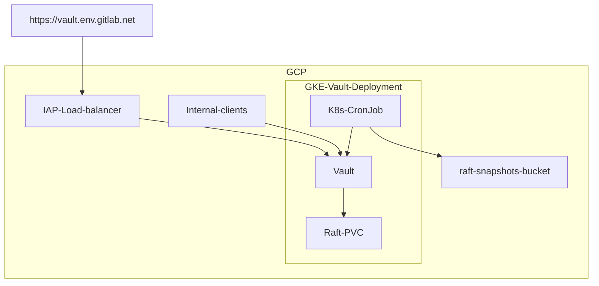
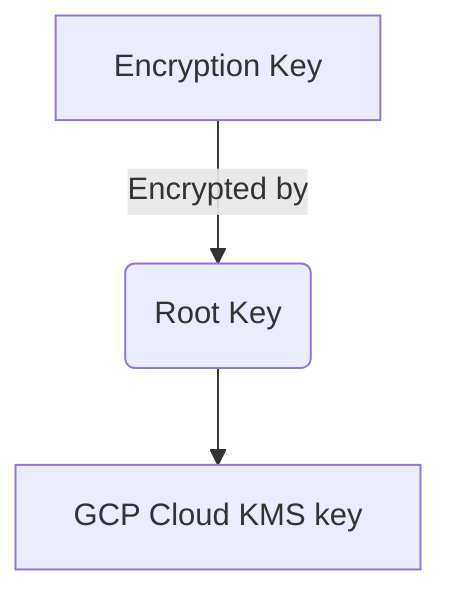

# Vault Secrets Management

[[_TOC_]]

## Summary

Vault is an identity-based secret and encryption management system. It can be used as a central store to manage access and secrets across applications, systems, and infrastructure.

## Vault Environments

We currently have two specific Vault instances setup to provide secrets to our infrastructure.

- <https://vault.gitlab.net> For all environments using secrets
- <https://vault.pre.gitlab.net> For testing configuration/deployments

## Architecture

### High level overview



The application is deployed in Kubernetes using the official [Vault Helm chart](https://github.com/hashicorp/vault-helm).

* Helm chart deployment ([example](https://gitlab.com/gitlab-com/gl-infra/k8s-workloads/gitlab-helmfiles/-/tree/master/releases/vault))
* Internal and external ingress (see [ingress section below](#ingress))

#### Availability

We run vault in [High Availability mode](https://www.vaultproject.io/docs/concepts/ha). This consists of one active Vault server and several standby servers. Since we're using the community version, standby instances are not unsealed and are only replicating the data but are not able to read it. The standby instances only unseal when being promoted to leader.

We have enabled [automatic unseal with GKMS](https://learn.hashicorp.com/tutorials/vault/autounseal-gcp-kms?in=vault/auto-unseal). The unsealing process is delegated to Google KMS in the event of a failure. The Vault cluster will coordinate leader elections and failovers internally.

We've configured 5 replicas with spread constraints for pods to be in [different hosts and be distributed in different zones](https://gitlab.com/gitlab-com/gl-infra/k8s-workloads/gitlab-helmfiles/-/blob/3477f7a2e0cce14039f577caac19fef5c522168d/releases/vault/values.yaml.gotmpl#L46-52). Which gives us multi-zone failure tolerance across 3 different zones.

Raft storage is configured with regional SSD persistent disks which provide durable storage and replication of data between three zones in the same region.

Additionally, we have multi-region backups we can restore as disaster recovery (in case of full region failure) (see [storage section below](#storage)).

#### Ingress

We have one internal and one external endpoint, keeping the service not directly exposed to the internet.

- External ingress for web user access is accessible through a GCP HTTPS load balancer that uses Google Identity-Aware Proxy
(IAP). Can be accessed through `https://vault.{env}.gitlab.net`.
  - Vault CLI does not work through this load balancer.
- Internal ingress for CI/Kubernetes/Terraform/Chef/Ansible/etc (API) is exposed through a Kubernetes service with a zonal network endpoint group (NEG) as a backend. The Vault service uses the default port `8200`.
  - Prometheus metrics are gathered from the endpoint `/v1/sys/metrics` on that same port

#### Storage

[Raft](https://www.vaultproject.io/docs/concepts/integrated-storage) is used, Vault's built-in storage engine. This allows all the nodes in a Vault cluster to have a replicated copy of Vault's data.


[Source](https://learn.hashicorp.com/tutorials/vault/raft-storage?in=vault/raft)

We are not using the enterprise version for Vault which come with automatic backups. We are running a [Kubernetes job](https://gitlab.com/gitlab-com/gl-infra/k8s-workloads/gitlab-helmfiles/-/blob/master/releases/vault/charts/vault-extras/templates/job.yaml) to create and save raft snapshots. Manual testing was done in the pre environment for
validation, snapshot backup, and restoration.

Backups are saved [across multiple regions in the United States](https://ops.gitlab.net/gitlab-com/gl-infra/config-mgmt/-/blob/b061f37e606f3f81502bae5a8c68571d5bc0f2f0/modules/vault/variables.tf) and can be used as region failure disaster recovery.

#### Resources and configuration

* Infrastructure resources (IAM, KMS, etc) are managed through Terraform via a [module](https://ops.gitlab.net/gitlab-com/gl-infra/config-mgmt/-/blob/master/modules/vault) located in the `config-mgmt` repository.
  * [Pre environment vault configuration](https://ops.gitlab.net/gitlab-com/gl-infra/config-mgmt/-/blob/f308d4b6754c2377175867dd836c3bc174ec09c2/environments/pre/vault.tf)
* To maintain consistency across deployments Vault configurations are maintained through the [terraform provider](https://registry.terraform.io/providers/hashicorp/vault/latest/docs) and located in the `config-mgmt` repository. For an example view, the [staging configuration](https://ops.gitlab.net/gitlab-com/gl-infra/config-mgmt/-/blob/5c0152cbd4136b198f5b44a61d49fa788e02d441/environments/vault-staging).

### Authentication

#### User authentication
We're using [Google Identity-Aware Proxy](https://cloud.google.com/iap/) for the load balancer and [Google OIDC](https://www.vaultproject.io/docs/auth/jwt/oidc_providers#google) is required to log in to the Vault web interface.

#### API authentication

- CI runners can be authenticated with [JWT/OIDC](https://www.vaultproject.io/docs/auth/jwt) with [JWKS](https://docs.gitlab.com/ee/ci/secrets/#configure-your-vault-server)
- GCP servers (chef client, ansible, etc) can be authenticated with [Google Cloud auth](https://www.vaultproject.io/docs/auth/gcp) (service accounts or instance service accounts)
- Kubernetes can be authenticated with [Kubernetes Service Account Tokens](https://www.vaultproject.io/docs/auth/kubernetes)

[Identities/Roles](https://www.vaultproject.io/docs/concepts/identity) and [Policies](https://www.vaultproject.io/docs/concepts/policies) are used to enforce RBAC and limit scope of access to necessary secrets. See the [secret access](#secrets-access) section for more information.

## Security Considerations

### Data Encryption and Unsealing

Vault data is encrypted at all times. When Vault is started, it is always started in a sealed state and will not be able to decrypt data until it is unsealed.

To [unseal](https://www.vaultproject.io/docs/concepts/seal) vault, a root key is needed to decrypt the Vault data encryption key.

To ensure that the root key is never known or leaked, we have configured auto-unseal using [`GCP KMS`](https://www.vaultproject.io/docs/configuration/seal/gcpckms) which lets us leverage GCP KMS to encrypt and decrypt the root key. Only the KMS key is able to decrypt the root key in our configuration. There is no other method possible to decrypt the root key. You can [view the configuration in terraform](https://ops.gitlab.net/gitlab-com/gl-infra/config-mgmt/-/blob/master/modules/vault-project/kms.tf).



### Recovery keys

Vault uses an algorithm known as [Shamir's Secret Sharing](https://en.wikipedia.org/wiki/Shamir%27s_Secret_Sharing) to split the recovery key into shards. It is important to know that the recovery key can **only** used to generate a root token and not any keys.

Additionally, we're also using end-to-end TLS encryption for vault.

### Secret Access

#### Role-based Access Control (RBAC) Policies

Vault uses policies to govern the behavior of clients and instrument Role-Based Access Control (RBAC). A policy defines a list of paths. Each path declares the capabilities (e.g. "create", "read", "update", "delete", "list", etc) that are allowed. Vault's denies capabilities by default unless explicitly stated other wise.

There are some [built in policies](https://www.vaultproject.io/docs/concepts/policies#built-in-policies) generated by vault and we've currently configured the following policies:

* [Vault policies](https://ops.gitlab.net/gitlab-com/gl-infra/config-mgmt/-/blob/master/environments/vault-production/policies.tf)
* [GitLab CI policies](https://ops.gitlab.net/gitlab-com/gl-infra/config-mgmt/-/blob/master/environments/vault-production/policies_gitlab.tf)
* [Infra project GitLab CI policies](https://ops.gitlab.net/gitlab-com/gl-infra/config-mgmt/-/blob/master/environments/vault-production/policies_gitlab_ci.tf)
* [K8s policies](https://ops.gitlab.net/gitlab-com/gl-infra/config-mgmt/-/blob/master/environments/vault-production/policies_kubernetes.tf)

#### JWT Authentication and Bound Claims

The JSON web token (JWT) method can be used to authenticate with Vault by a JWT authentication method or an OIDC. These JWTs can contain claims or a key/value pair. These can be used by Vault to validate that any configured "bound" parameters match which provide more granularity to authentication permissions.

For an example, see the [the bounds claims](https://ops.gitlab.net/gitlab-com/gl-infra/config-mgmt/-/blob/f3a02f1df3901361b2031bf04b110b82af1d3eee/environments/vault-staging/roles_oidc.tf#L45-47) configured for OIDC users.

More details and specifications can be found in [the vault documentation](https://www.vaultproject.io/docs/auth/jwt#bound-claims).

## Observability

### Prometheus and Thanos

Vault is monitored via Prometheus in GKE. Configuration is done through a [`PodMonitor`](https://gitlab.com/gitlab-com/gl-infra/k8s-workloads/gitlab-helmfiles/-/blob/master/releases/vault/charts/vault-extras/templates/pod-monitor.yaml) which scrapes the `/v1/sys/metrics` endpoint. Our GKE prometheus metrics are also accessible in our thanos cluster ([example metric](https://thanos.gitlab.net/graph?g0.expr=vault_core_unsealed&g0.tab=1&g0.stacked=0&g0.range_input=1h&g0.max_source_resolution=0s&g0.deduplicate=1&g0.partial_response=0&g0.store_matches=%5B%5D)).

### Logs

We've configured audit logging to output to stdout which forwards logs to Kibana. You can [view Vault logs here](https://nonprod-log.gitlab.net/goto/<FIXME>).

## Troubleshooting

### Determining Pod status and logs

Connect to the appropriate GKE cluster, then list/look at all pods in the `vault` namespace:

```shell
kubectl -n gitlab get pods
kubectl -n gitlab logs vault-0
```

### Determining status of Vault from Vault itself

Connect to one of the Vault pods and run:

```
kubectl -n vault exec -it vault-0 sh
$ vault status
# Ensure `Initialized` is `true` and `Sealed` is `false`
$ vault login
# enter root token
$ vault operator raft list-peers
# Ensure all vault pods are listed and their `State` is either `leader` or `follower`
```

## Backing up and restoring Vault

Vault backups are taken once a day at 00:30 Kubernetes Cluster local time (typically UTC). They are created by a Kubernetes
[CronJob](https://kubernetes.io/docs/concepts/workloads/controllers/cron-jobs/) that runs inside the GKE cluster that runs
Vault. It uses [vault operator raft snapshot save](https://www.vaultproject.io/docs/commands/operator/raft#snapshot-save)
to create an encrypted copy of all Vault data, and then uploads to it to a GCS bucket inside the Google project for the
Vault installation. The name of the bucket is as follows

* vault.gitlab.net => gs://gitlab-vault-backups/
* vault-nonprod.gitlab.net => gs://gitlab-vault-nonprod-backups/

### Restoring Vault from a backup into an existing functional installation

The easiest way to restore a Vault installation from a backup, is to run a temporary pod with all the utilities you need
to restore the Vault snapshot back into the installation. Note that doing this restores everything entirely back to the state
it was at the backup, removing all new data since the backup was taken.

* First identify the Vault backup you wish to restore

```
gsutil ls gs://gitlab-vault-nonprod-backups/
```

Take note of the full path to the backup

* Run a Kubernetes pod on the gke cluster in question, this will most likely need to be done on a console node with
access to the GKE cluster in question

```
gcloud --project gitlab-vault-nonprod container clusters get-credentials vault-gitlab-gke --region us-east1
kubectl run --generator=run-pod/v1 --rm -it -n vault --image registry.gitlab.com/gitlab-com/gl-infra/ci-images/vault-ci:latest vault-restore-backup --env VAULT_ADDR=http://vault-active.vault.svc.cluster.local:8200 --serviceaccount=vault-backup
# Once the prompt is available, run the following
gsutil cp $FULL_PATH_TO_BACKUP .
vault login
# Enter in the root token from 1password for the Vault instance
vault operator raft snapshot restore $LOCAL_PATH_TO_BACKUP
# Now we exit so the pod goes away
exit
```

### Restoring Vault from a backup into an empty installation

:warning: As we use GKMS auto-unseal for our Vault, you need to make sure the GKMS key that was originally used with the Vault backup is still available.
As this is controlled by Google, they are responsible for maintaing it's backup and availability. They also make it very difficult for us to delete
completely :warning:

* Spin up the new Vault installation, likely using the same terraform configuration as the lost cluster
* Follow the post install steps at <https://ops.gitlab.net/infrastructure/workloads/vault/-/blob/master/README.md#post-install-steps> in order to make
sure the installation is unsealed. Note down the new root token (even though we won't even use it). You will use it when running `vault login` in the
restoration steps
* Follow the steps above to restore the backup. Remember when using `vault login` to use the new root token generated. Once the backup is restored, you
can switch back to the token from the old backup.
