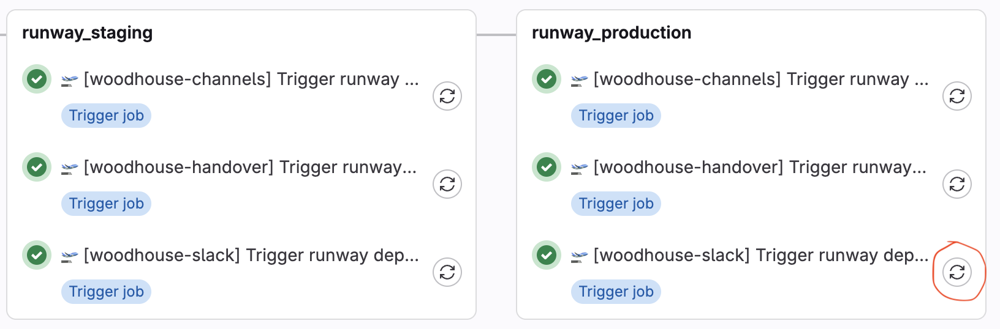

# Woodhouse-Slack Overview

Woodhouse-slack is a service that runs in [Runway](https://handbook.gitlab.com/handbook/engineering/infrastructure/platforms/tools/runway/).
Woodhouse-channels and Woodhouse-handover are also Runway based components that run periodically to perform incident management actions.

## Re-deploying Woodhouse Runway Components

### Re-run Old Pipelines

One option is to find the last [Woodhouse deploy pipeline](https://gitlab.com/gitlab-com/gl-infra/woodhouse/-/pipelines) and re-run the last components deploy jobs.



### No-Op Woodhouse Change

If, for some reason, a job cannot be retried, a non functional change can be pushed to Woodhouse to trigger a deploy.

Example MR: `https://gitlab.com/gitlab-com/gl-infra/woodhouse/-/merge_requests/553`

## Token Expiration

When Woodhouse Runway components are deployed, the tokens for accessing GitLab.com and ops.gitlab.net are provided via build time variables.
There is no current process to automatically deploy Woodhouse with updated tokens.
If you see Woodhouse posting errors like the example below, you may need to simply perform a re-deploy of Woodhouse-Slack to fix the problem as tokens are automatically updated in the variables every 50 days or so.

Example Error:

```
Unable to access gitlab.com API we will try using Ops instead! reason: GET https://gitlab.com/api/v4/user: 401 {message: 401 Unauthorized}
```

## Other Woodhouse Components

- [Woodhouse](https://gitlab.com/gitlab-com/gl-infra/woodhouse)
