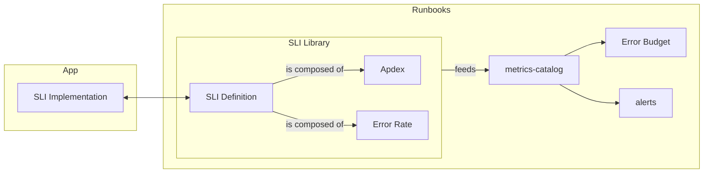
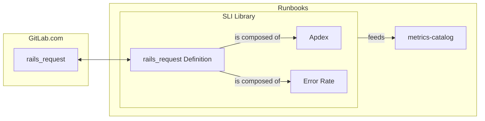
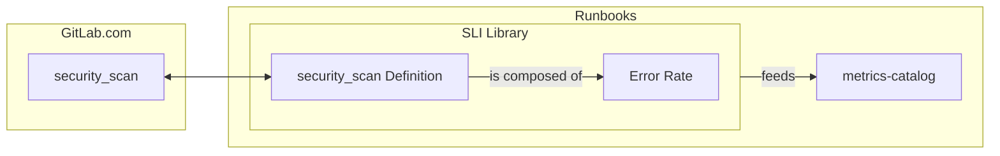

# GitLab Service Level Indicators (SLIs)

## User Journey to SLIs

This is a representation of our SLI abstraction:

### How to

In order to create your own SLIs, first you need to instrument your program. You can either add a new apdex or an error rate counter, or both.

We use [Prometheus](https://prometheus.io/) to implement the SLI metrics. The GitLab Docs covering the GitLab Application SLIs and how to instrument the application using the SLI library can be seen here: https://docs.gitlab.com/ee/development/application_slis.

After your program is instrumented, we need to add a definition to our [SLI library in runbooks](metrics-catalog/gitlab-slis/library.libsonnet). This is will allow the [metrics-catalog](metrics-catalog) to consume the new SLI to generate new alerts and include in the [error budget for stage groups](https://handbook.gitlab.com/handbook/engineering/error-budgets/). The [Application SLI Violations dashboard](https://dashboards.gitlab.net/d/general-application-sli-violations/general3a-application-sli-violations?orgId=1&from=now-7d%2Fm&to=now%2Fm&timezone=utc&var-PROMETHEUS_DS=mimir-gitlab-gprd&var-environment=gprd&var-environment-2=gprd&var-stage=main&var-product_stage=$__all&var-stage_group=$__all&var-component=rails_request) can latter be used to drill down the error budget.

Definition fields:

- The `name` is a string that should match with the name given to the SLI metric instrumented in the program.
- The `significantLabels` is an array are the relevant dimensions for your SLI -- all the other labels from the time series data will be ignored if not specified here.
- The `kinds` is an array where you specify the indicator type(s) implemented by the instrumented metric. The supported values are `sliDefinition.errorRateKind` and `sliDefinition.apdexKind`.
- The `description` is a markdown string that contains a description of what the SLI is tracking, why, and relevant links and details for its users. It will be shown on dashboards and alerts.
- Optionally, it could contain a `featureCategory` to associate the SLI to a specific stage group.

When done, run `make generate` to generate recording rules for the new SLI. This command creates recording rules for all services emitting these metrics aggregated over `significantLabels`.

Check below some concrete examples:

#### rails_request

More details on https://docs.gitlab.com/ee/development/application_slis/rails_request.html.

#### security_scan

Related MRs:
- [Record error rate on security scan reports](https://gitlab.com/gitlab-org/gitlab/-/merge_requests/170983)
- [Adding the security scan SLI to the library](https://gitlab.com/gitlab-com/runbooks/-/merge_requests/8210)
