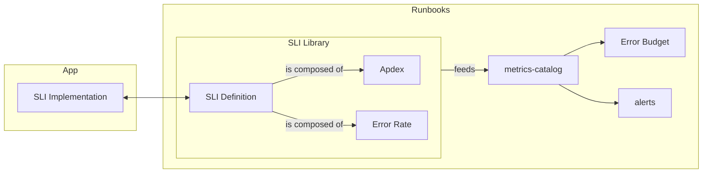
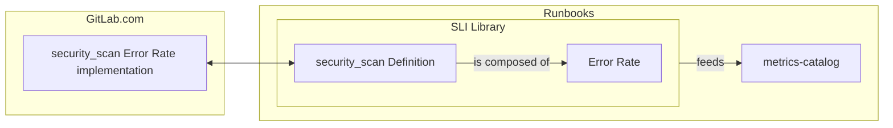
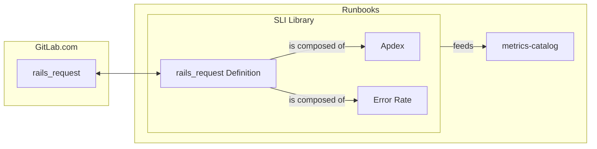

# GitLab Service Level Indicators (SLIs)

This page outlines key user journeys for understanding, implementing, and monitoring Service Level Indicators (SLIs) within our infrastructure. These user journeys will guide the development and maintenance of SLIs to ensure they align with business objectives and user expectations.

SLIs are a fundamental part of our observability and reliability to better reflect the end user experience. They enable teams to measure the performance of applications, services, and features, against defined objectives and prioritize improvements effectively.

A well defined SLI should answer a simple question: how well are we performing (in a certain use case)?

The use case covered by the SLI can be broad, such as: what is latency of HTTP endpoints overall? Or, they can be more specific: what is the error rate of the security scan? Both allow the engineers to assess how well the system is behaving from different points of view. How specific we should implement the SLI will depend on how we want to measure the user experience. A SLI should aim capturing the experience the user is having while interacting with the system. General and specific SLIs aren't excludent, they often can be used in conjunction to help drilling down the overall user experience.

At GitLab, our SLI framework is comprised of Apdex and ErrorRate. Apdex uses a success rate to calculate a success ratio, and ErrorRate uses an error rate to calculate an error ratio.

You should use Apdex to measure the performance of successful operations. You don’t have to measure the performance of a failing request because that performance should be tracked with ErrorRate. For example, you can measure whether a request is performing within a specified latency threshold.

You should use ErrorRate to measure the rate of unsuccessful operations. For example, you can measure whether a failed request returns an HTTP status greater than or equal to 500.

## User Journey to SLIs

This is a representation of our SLI abstraction:

Check below the implementation details of some concrete SLIs at GitLab, or jump to the [implementation steps](#implementation).

### SLI security_scan

**The use case**

Given an end-user pushed code to the repository and opened a merge request, then CI should run and report the results of security scans.

**The implementation**

The `security_scan` SLI captures the use case described by implementing an error rate. It aims to answer the question: are the security scans operating and reporting successfully?

The graphical representation of its implementation:

The following MR ([Record error rate on security scan reports](https://gitlab.com/gitlab-org/gitlab/-/merge_requests/170983)) implements the error rate SLI on the [Rails application](https://gitlab.com/gitlab-org/gitlab).

The following MR ([Adding the security scan SLI to the library](https://gitlab.com/gitlab-com/runbooks/-/merge_requests/8210)) adds the SLI definition to our library, which makes it avaialable in the [metrics catalog in Runbooks](https://gitlab.com/gitlab-com/runbooks/-/tree/master/metrics-catalog?ref_type=heads).

### SLI rails_request

**The use case**

Given an end-user requested a HTTP endpoint, then endpoint should be rendered.

**The implementation**

The `rails_request` SLI captures the use case described by implementing an apdex and error rate. For the apdex, it aims to answer the question: is the endpoint performing at a reasonable latency? For the error rate, it aims to answer the  question: is the endpoint responding successfully?

The graphical representation of its implementation:

More details [here](https://docs.gitlab.com/ee/development/application_slis/rails_request.html).

### <a id="implementation">Implementation</a>

In order to create your own SLIs, first you need to instrument your program. You can either add a new apdex or an error rate counter, or both.

We use [Prometheus](https://prometheus.io/) to implement the SLI metrics. The GitLab Docs covering the GitLab Application SLIs and how to instrument the application using the SLI library can be seen [here](https://docs.gitlab.com/ee/development/application_slis).

After your program is instrumented, we need to add a definition to our [SLI library in runbooks](metrics-catalog/gitlab-slis/library.libsonnet). This is will allow the [metrics-catalog](metrics-catalog) to consume the new SLI to generate new alerts and include in the [error budget for stage groups](https://handbook.gitlab.com/handbook/engineering/error-budgets/). The [Application SLI Violations dashboard](https://dashboards.gitlab.net/d/general-application-sli-violations/general3a-application-sli-violations?orgId=1&from=now-7d%2Fm&to=now%2Fm&timezone=utc&var-PROMETHEUS_DS=mimir-gitlab-gprd&var-environment=gprd&var-environment-2=gprd&var-stage=main&var-product_stage=$__all&var-stage_group=$__all&var-component=rails_request) can later be used to drill down the error budget.

Definition fields:

- The `name` is a string that should match with the name given to the SLI metric instrumented in the program.
- The `significantLabels` is an array are the relevant dimensions for your SLI -- all the other labels from the time series data will be ignored if not specified here.
- The `kinds` is an array where you specify the indicator type(s) implemented by the instrumented metric. The supported values are `sliDefinition.errorRateKind` and `sliDefinition.apdexKind`.
- The `description` is a markdown string that contains a description of what the SLI is tracking, why, and relevant links and details for its users. It will be shown on dashboards and alerts.
- A `featureCategory` to associate the SLI to a specific stage group.

When done, run `make generate` to generate recording rules for the new SLI. This command creates recording rules for all services emitting these metrics aggregated over `significantLabels`.

### Let's implement our own SLI

TBD
