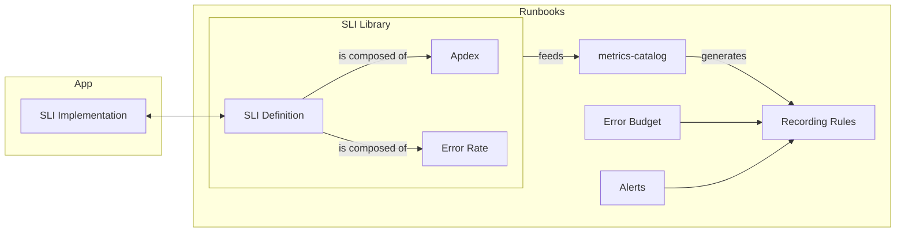
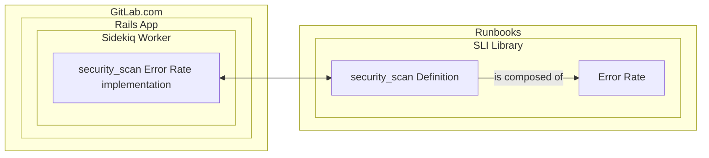
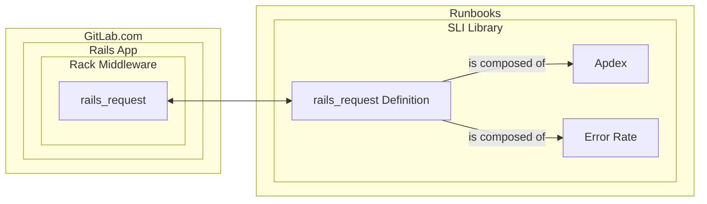
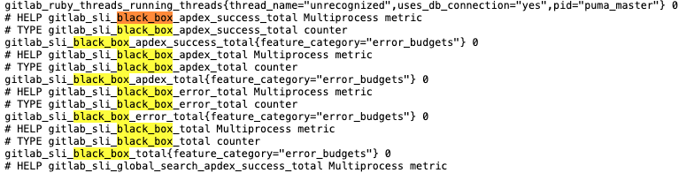
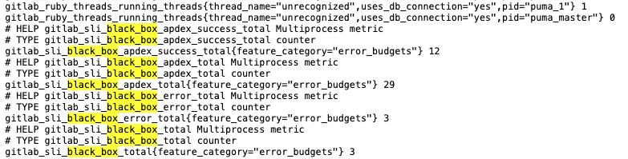

# GitLab Service Level Indicators (SLIs)

This page outlines key user journeys for understanding, implementing, and monitoring Service Level Indicators (SLIs) within our infrastructure. These user journeys will guide the development and maintenance of SLIs to ensure they align with business objectives and user expectations.

SLIs are a fundamental part of our observability and reliability to better reflect the end user experience. They enable teams to measure the performance of applications, services, and features, against defined objectives and prioritize improvements effectively.

A well defined SLI should answer a simple question: how well are we performing (in a certain use case)?

The use case covered by the SLI can be broad, such as: what is latency of HTTP endpoints overall? Or, they can be more specific: what is the error rate of the security scan? Both allow the engineers to assess how well the system is behaving from different points of view. How specific we should implement the SLI will depend on how we want to measure the user experience. A SLI should aim capturing the experience the user is having while interacting with the system. General and specific SLIs aren't excludent, they often can be used in conjunction to help drilling down the overall user experience.

At GitLab, our SLI framework is comprised of [Apdex](https://en.wikipedia.org/wiki/Apdex) and ErrorRate. Apdex uses a success rate to calculate a success ratio, and ErrorRate uses an error rate to calculate an error ratio.

You should use Apdex to measure the performance of successful operations. You don’t have to measure the performance of a failing request because that performance should be tracked with ErrorRate. For example, you can measure whether a request is performing within a specified latency threshold.

You should use ErrorRate to measure the rate of unsuccessful operations. For example, you can measure whether a failed request returns an HTTP status greater than or equal to 500.

## The SLI abstraction

This is a representation of GitLab's SLI abstraction:



Check below the implementation details of some concrete SLIs at GitLab, or jump to the [implementation steps](#implementation).

## From user journeys to SLIs

### The security scanning user journey

Given an end-user pushed code to the repository and opened a merge request, then CI should run and report the results of security scans.

**The implementation**

The `security_scan` SLI captures the use case described by implementing an error rate. It aims to answer the question: are the security scans operating and reporting successfully?

The graphical representation of its implementation:



The merge request ([Record error rate on security scan reports](https://gitlab.com/gitlab-org/gitlab/-/merge_requests/170983)) implements the error rate SLI on the [Rails application](https://gitlab.com/gitlab-org/gitlab).

The merge request ([Adding the security scan SLI to the library](https://gitlab.com/gitlab-com/runbooks/-/merge_requests/8210)) adds the SLI definition to our SLI library, which makes it avaialable in the [metrics catalog in Runbooks](https://gitlab.com/gitlab-com/runbooks/-/tree/master/metrics-catalog?ref_type=heads).


### The web request user journey

Given an end-user requested a HTTP endpoint, then endpoint should be rendered.

**The implementation**

The `rails_request` SLI captures the use case described by implementing an apdex and an error rate. For the apdex, it aims to answer the question: is the endpoint performing at a reasonable latency? For the error rate, it aims to answer the  question: is the endpoint responding successfully?

The graphical representation of its implementation:



More details [here](https://docs.gitlab.com/ee/development/application_slis/rails_request.html).


### <a id="implementation">Implementation</a>

Here's a summary of how an SLI is implemented.

We use [Prometheus](https://prometheus.io/) to implement the SLI metrics. The GitLab Docs covering the GitLab Application SLIs and how to instrument the application using the SLI library can be seen [here](https://docs.gitlab.com/ee/development/application_slis).

In order to create your own SLI, first you need to instrument your program. You can either add a new apdex or an error rate counter, or both.

After your program is instrumented, we need to add a definition to our [SLI library in Runbooks](metrics-catalog/gitlab-slis/library.libsonnet). This is will allow the [metrics-catalog](metrics-catalog) to consume the new SLI to generate new alerts and include the SLI's time series data in the [error budget for stage groups](https://handbook.gitlab.com/handbook/engineering/error-budgets/). The [Application SLI Violations dashboard](https://dashboards.gitlab.net/d/general-application-sli-violations/general3a-application-sli-violations?orgId=1&from=now-7d%2Fm&to=now%2Fm&timezone=utc&var-PROMETHEUS_DS=mimir-gitlab-gprd&var-environment=gprd&var-environment-2=gprd&var-stage=main&var-product_stage=$__all&var-stage_group=$__all&var-component=rails_request) can later be used to drill down the error budget.

Definition fields:

- The `name` is a string that should match with the name given to the SLI metric instrumented in the program.
- The `significantLabels` is an array are the relevant dimensions for your SLI -- all the other labels from the time series data will be ignored if not specified here.
- The `kinds` is an array where you specify the indicator type(s) implemented by the instrumented metric. The supported values are `sliDefinition.errorRateKind` and `sliDefinition.apdexKind`.
- The `description` is a markdown string that contains a description of what the SLI is tracking, why, and relevant links and details for its users. It will be shown on dashboards and alerts.
- A `featureCategory` to associate the SLI to a specific stage group.

When done, run `make generate` to generate recording rules for the new SLI. This command creates recording rules for all services emitting these metrics aggregated over `significantLabels`.

Below we cover the process step-by-step with examples:

### Let's implement our own SLI

Assuming we have an endpoint to fetch data using a black box third-party API.

Our user journey would be: given an end-user requested data from the black box endpoint, then endpoint should be rendered with data retrieved.

We are going to implement a `black_box` apdex and error rate to capture the end-user experience.

Let's create the file `lib/gitlab/metrics/blackbox_slis.rb` in the [Rails app](https://gitlab.com/gitlab-org/gitlab). It will contain the SLI implementation:

```diff
diff --git a/lib/gitlab/metrics/blackbox_slis.rb b/lib/gitlab/metrics/blackbox_slis.rb
new file mode 100644
index 000000000000..2c2e2cb53089
--- /dev/null
+++ b/lib/gitlab/metrics/blackbox_slis.rb
@@ -0,0 +1,39 @@
+# frozen_string_literal: true
+
+module Gitlab
+  module Metrics
+    module BlackboxSlis
+      class << self
+        THRESHOLD_IN_SECONDS = 2
+
+        def initialize_slis!
+          request_labels = possible_request_labels
+          Gitlab::Metrics::Sli::Apdex.initialize_sli(:black_box, request_labels)
+          Gitlab::Metrics::Sli::ErrorRate.initialize_sli(:black_box, request_labels)
+        end
+
+        def apdex
+          Gitlab::Metrics::Sli::Apdex[:black_box]
+        end
+
+        def error_rate
+          Gitlab::Metrics::Sli::ErrorRate[:black_box]
+        end
+
+        def record_apdex(labels, duration)
+          apdex.increment(labels: labels, success: duration < THRESHOLD_IN_SECONDS)
+        end
+
+        def record_error(labels)
+          error_rate.increment(labels: labels, error: true)
+        end
+
+        private
+
+        def possible_request_labels
+          [{ feature_category: :error_budgets }]
+        end
+      end
+    end
+  end
+end
```

Our `BlackboxSlis` library will be built on top of `Gitlab::Metrics::Sli::Apdex` and `Gitlab::Metrics::Sli::ErrorRate`, which provide building blocks for us.

The `initialize_slis!` method will take care of initializing the `Gitlab::Metrics::Sli::Apdex` and `Gitlab::Metrics::Sli::ErrorRate` with its expected set of labels. This initialization is done to avoid gaps in scraped metrics after restarts. It makes sure all counters are available at process start. It's a good practice to always initialize your metrics before putting them to use.

The `record_apdex` method increments in case of success. The `success` parameter receives a boolean and we compare the duration of the request against the `THRESHOLD_IN_SECONDS`. If it is bigger than the threshold specified, then apdex is not being met.

The `record_error` method increments in case of error while trying to access the black box API.

With the `Gitlab::Metrics::BlackboxSlis` implemented. We need to initialize it:

```diff
diff --git a/config/initializers/zz_metrics.rb b/config/initializers/zz_metrics.rb
index e6ae5af28c4f..b9e1bdccad31 100644
--- a/config/initializers/zz_metrics.rb
+++ b/config/initializers/zz_metrics.rb
@@ -33,6 +33,7 @@
     Gitlab::Metrics::RequestsRackMiddleware.initialize_metrics
     Gitlab::Metrics::Middleware::PathTraversalCheck.initialize_slis!
     Gitlab::Metrics::GlobalSearchSlis.initialize_slis!
+    Gitlab::Metrics::BlackboxSlis.initialize_slis!
   elsif Gitlab::Runtime.sidekiq?
     Gitlab::Metrics::GlobalSearchIndexingSlis.initialize_slis! if Gitlab.ee?
     Gitlab::Metrics::LooseForeignKeysSlis.initialize_slis!
```

After that, we should be able to start the Rails app and access the metrics endpoint (`http://127.0.0.1:3000/-/metrics` in development). We are going to see the SLI counters zeroed:



To record the apdex, we need to wrap the `BlackBox.fetch` call to capture the elapsed time and call the `record_apdex` method to increment the apdex:

```diff
diff --git a/app/controllers/fetcher_controller.rb b/app/controllers/fetcher_controller.rb
index 72b7b71e23df..9ebb142cfa48 100644
--- a/app/controllers/fetcher_controller.rb
+++ b/app/controllers/fetcher_controller.rb
@@ -4,7 +4,13 @@ class FetcherController < ApplicationController
   feature_category :error_budgets

   def index
+    labels = { feature_category: feature_category }
+
+    started = ::Gitlab::Metrics::System.monotonic_time
     n = BlackBox.fetch
+    elapsed = ::Gitlab::Metrics::System.monotonic_time - started
+    ::Gitlab::Metrics::BlackboxSlis.record_apdex(labels, elapsed)
+
     render json: { latency: n }
   end
 end
```

To record the error rate, we need to rescue any `BlackBox` specific exception and increment the error rate:

```diff
diff --git a/app/controllers/fetcher_controller.rb b/app/controllers/fetcher_controller.rb
index 9ebb142cfa48..c8fe5f142e13 100644
--- a/app/controllers/fetcher_controller.rb
+++ b/app/controllers/fetcher_controller.rb
@@ -12,5 +12,8 @@ def index
     ::Gitlab::Metrics::BlackboxSlis.record_apdex(labels, elapsed)

     render json: { latency: n }
+  rescue BlackBox::Error => ex
+    ::Gitlab::Metrics::BlackboxSlis.record_error(labels)
+    render json: { error: ex.message }, status: :unprocessable_entity
   end
 end
```

After multiple calls, the metrics will be incremented accordingly:



If you'd like to view the changes above in a merge request, you can do so in [this URL](https://gitlab.com/gitlab-org/gitlab/-/merge_requests/176179).

With the Rails app instrumented, let's jump to [Runbooks](https://gitlab.com/gitlab-com/runbooks) where we are going to add the newly created SLI to the SLI library.

Open the file `metrics-catalog/gitlab-slis/library.libsonnet` and add the new SLI:

```diff
diff --git a/metrics-catalog/gitlab-slis/library.libsonnet b/metrics-catalog/gitlab-slis/library.libsonnet
index 04e59f267..5fce2fbb1 100644
--- a/metrics-catalog/gitlab-slis/library.libsonnet
+++ b/metrics-catalog/gitlab-slis/library.libsonnet
@@ -176,6 +176,18 @@ local list = [
       at least one database transaction within the Sidekiq job has exceeded the threshold duration.
     |||,
   }),
+  sliDefinition.new({
+    name: 'black_box',
+    significantLabels: ['feature_category'],
+    featureCategory: 'error_budgets',
+    kinds: [sliDefinition.apdexKind, sliDefinition.errorRateKind],
+    description: |||
+      These signifies operations that reach out to a black box API. Requests should take no more than 5s.
+
+      A success means that we were able to present the user with a response.
+      An error could be that the black box API is not responding, or is erroring.
+    |||,
+  }),
 ];

 local definitionsByName = std.foldl(
```

It is comprised of an apdex (represented as `sliDefinition.apdexKind`) and error rate (represented as `sliDefinition.errorRateKind`). The only significant label is `feature_category`.

Adding it to the SLI library is not enough. We should associate the SLI with a service. Let's add it to the `web` service:

```diff
diff --git a/metrics-catalog/services/web.jsonnet b/metrics-catalog/services/web.jsonnet
index 0ec4c16f9..71c6b20cf 100644
--- a/metrics-catalog/services/web.jsonnet
+++ b/metrics-catalog/services/web.jsonnet
@@ -294,5 +294,8 @@ metricsCatalog.serviceDefinition({
   }) + sliLibrary.get('global_search').generateServiceLevelIndicator(railsSelector, {
     serviceAggregation: false,  // Don't add this to the request rate of the service
     severity: 's3',  // Don't page SREs for this SLI
+  }) + sliLibrary.get('black_box').generateServiceLevelIndicator(railsSelector, {
+    serviceAggregation: false,  // Don't add this to the request rate of the service
+    severity: 's3',  // Don't page SREs for this SLI
   }),
 })
```

By running `make generate` it will generate multiple files related to the new SLI:

```shell
metrics-catalog/services/web.jsonnet
mimir-rules/gitlab-gprd/web/autogenerated-gitlab-gprd-web-aggregated-application-sli-metrics.yml
mimir-rules/gitlab-gprd/web/autogenerated-gitlab-gprd-web-component-aggregation.yml
mimir-rules/gitlab-gprd/web/autogenerated-gitlab-gprd-web-feature_category-aggregation.yml
mimir-rules/gitlab-gprd/web/autogenerated-gitlab-gprd-web-regional_component-aggregation.yml
mimir-rules/gitlab-gprd/web/autogenerated-gitlab-gprd-web-service-level-alerts.yml
mimir-rules/gitlab-gprd/web/autogenerated-gitlab-gprd-web-sli-aggregations.yml
mimir-rules/gitlab-gprd/web/autogenerated-gitlab-gprd-web-web-service-slos.yml
mimir-rules/gitlab-gstg/web/autogenerated-gitlab-gstg-web-aggregated-application-sli-metrics.yml
mimir-rules/gitlab-gstg/web/autogenerated-gitlab-gstg-web-component-aggregation.yml
mimir-rules/gitlab-gstg/web/autogenerated-gitlab-gstg-web-feature_category-aggregation.yml
mimir-rules/gitlab-gstg/web/autogenerated-gitlab-gstg-web-regional_component-aggregation.yml
mimir-rules/gitlab-gstg/web/autogenerated-gitlab-gstg-web-service-level-alerts.yml
mimir-rules/gitlab-gstg/web/autogenerated-gitlab-gstg-web-sli-aggregations.yml
mimir-rules/gitlab-gstg/web/autogenerated-gitlab-gstg-web-web-service-slos.yml
mimir-rules/gitlab-pre/web/autogenerated-gitlab-pre-web-aggregated-application-sli-metrics.yml
mimir-rules/gitlab-pre/web/autogenerated-gitlab-pre-web-component-aggregation.yml
mimir-rules/gitlab-pre/web/autogenerated-gitlab-pre-web-feature_category-aggregation.yml
mimir-rules/gitlab-pre/web/autogenerated-gitlab-pre-web-regional_component-aggregation.yml
mimir-rules/gitlab-pre/web/autogenerated-gitlab-pre-web-service-level-alerts.yml
mimir-rules/gitlab-pre/web/autogenerated-gitlab-pre-web-sli-aggregations.yml
mimir-rules/gitlab-pre/web/autogenerated-gitlab-pre-web-web-service-slos.yml
```

These files are recording rules. They are part of the [metrics catalog](metrics-catalog/README.md) and are used for recording the error budget over time and alerts based on the SLOs (service level objectives) defined for the service. Each GitLab environment will have its own set of recording rules.

If you'd like to view the changes above in a merge request, you can do so in [this URL](https://gitlab.com/gitlab-com/runbooks/-/merge_requests/8305).

### Need help?

Need help or noticed anything missing? Please reach out to the observability team in [Slack](https://gitlab.enterprise.slack.com/archives/C065RLJB8HK) and let us know.
