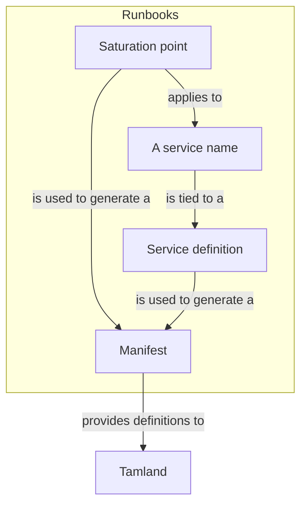
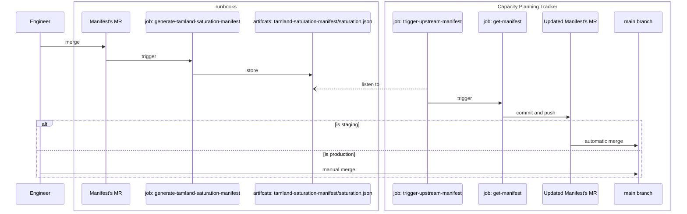

# Tamland

## How Tamland is connected to the metrics catalog

The entrypoint to generate the manifests for Tamland is [metrics-catalog/saturation/tamland.jsonnet](metrics-catalog/saturation/tamland.jsonnet).

## Manifest change journey

## Capacity Planning Tuning Parameters

For details, please refer to [Tamland's manifest documentation](https://gitlab.com/gitlab-com/gl-infra/tamland/-/blob/main/docs/docs/manifest.md).

See below examples of parameters for:

1. [Strategy and forecast days](https://gitlab.com/gitlab-com/runbooks/-/blob/975715477c0f9b71b9c52e5c559bb1f140f80b18/libsonnet/saturation-monitoring/disk_maximum_capacity.libsonnet#L33-L36)
1. [Changepoints and outliers](https://gitlab.com/gitlab-com/runbooks/-/blob/975715477c0f9b71b9c52e5c559bb1f140f80b18/metrics-catalog/services/gitaly.jsonnet#L96-L155)
1. [Excluding from forecast](https://gitlab.com/gitlab-com/runbooks/-/blob/975715477c0f9b71b9c52e5c559bb1f140f80b18/libsonnet/saturation-monitoring/elastic_jvm_heap_memory.libsonnet#L9-L11)
1. [Service's static saturation dimensions](https://gitlab.com/gitlab-com/runbooks/-/blob/54027d8a59f1831a4aa6b8ef33f6e35aa7f93a42/metrics-catalog/services/sidekiq.jsonnet#L193-L198)
1. [Saturation point's static saturation dimensions](https://gitlab.com/gitlab-com/runbooks/-/blob/54027d8a59f1831a4aa6b8ef33f6e35aa7f93a42/libsonnet/saturation-monitoring/gcp_quota_limit.libsonnet#L36-L40)
1. [Dynamic lookup of saturation dimensions](https://gitlab.com/gitlab-com/runbooks/-/blob/975715477c0f9b71b9c52e5c559bb1f140f80b18/libsonnet/saturation-monitoring/kube_container_memory.libsonnet#L35-L40)

## FAQ

TBD
