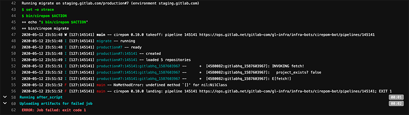

## CIrepoM :: Pipeline Failures

A pipeline failure indicates a fatal condition with CIrepoM. Internally, CIrepoM catches all `StandarError` exceptions so as to gracefully handle them and maintain the state of the migration, but it stays away from other exceptions (such as `NoMethodError`) to ensure bugs are flagged.

CIrepoM pipelines run on `ops.gitlab.net`: https://ops.gitlab.net/gitlab-com/gl-infra/infra-bots/cirepom-bot/pipelines

### `NoMethodError`

While rare, these errors can happen when the tool accesses an unexpectedly non-existing field. This is a bug. There is an [issue](https://gitlab.com/gitlab-com/gl-infra/cirepom/-/issues/21) already opened against this condition.

#### ACTIONS

1. Add a link to the failed pipeline on https://gitlab.com/gitlab-com/gl-infra/cirepom/-/issues/21 and at-mention @glopezfernandez

### `Signet::AuthorizationError`

Also rare, these errors indicate an error while authorizing against Firestore, generally due to clock drift. An [issue](https://gitlab.com/gitlab-com/gl-infra/cirepom/-/issues/22) is already opened to handle this exception gracefully.

#### ACTIONS

1. Add a link to the failed pipeline on https://gitlab.com/gitlab-com/gl-infra/cirepom/-/issues/22 and at-mention @glopezfernandez
2. Open an issue in Infrastructure to validate that runners to investigate why their clocks would have drifted by more than 60 minutes